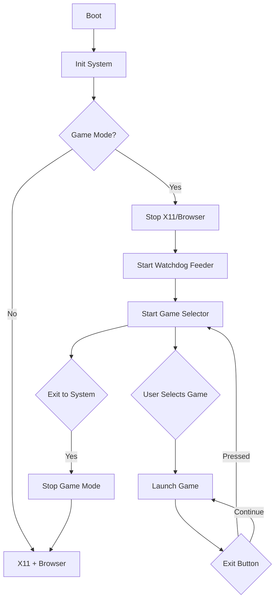

# RoomWizard Game Mode Setup Guide

## Overview

This guide explains how to set up the RoomWizard device to boot directly into a game selector menu instead of the default browser interface. The solution addresses the following challenges:

- **Browser/X11 Conflict**: Stops the WebKit browser and X11 server that interfere with framebuffer games
- **Touch Input Sharing**: Ensures games have exclusive access to touch input
- **Watchdog Management**: Keeps the hardware watchdog fed to prevent system resets
- **No Keyboard**: Provides a touch-based game selector since the device has no keyboard
- **Exit Functionality**: All games include an exit button to return to the selector

---

## Architecture



---

## Components

### 1. Game Selector ([`game_selector.c`](native_games/game_selector.c))
- Scans `/opt/games` for executable files
- Displays touch-friendly menu with game buttons
- Launches selected game and waits for it to exit
- Includes "EXIT TO SYSTEM" button to restore browser/X11

### 2. Watchdog Feeder ([`watchdog_feeder.c`](native_games/watchdog_feeder.c))
- Feeds `/dev/watchdog` every 30 seconds
- Prevents system reset during game play
- Runs in background as daemon

### 3. Game Mode Init Script ([`game-mode-init.sh`](native_games/game-mode-init.sh))
- SysVinit script for `/etc/init.d/`
- Stops browser and X11 services
- Starts watchdog feeder and game selector
- Can restore normal operation when stopped

### 4. Modified Games
- **Snake**: Added exit button (top-right red "X")
- **Tetris**: Exit functionality (to be added)
- **Pong**: Exit functionality (to be added)

---

## Installation Steps

### Step 1: Cross-Compile on Development Machine

```bash
# In WSL or Linux
cd /mnt/c/work/roomwizard/native_games
mkdir -p build

export CC=arm-linux-gnueabihf-gcc

# Compile common libraries
$CC -O2 -static -c common/framebuffer.c -o build/framebuffer.o
$CC -O2 -static -c common/touch_input.c -o build/touch_input.o

# Compile games
$CC -O2 -static snake/snake.c build/framebuffer.o build/touch_input.o -o build/snake -lm
$CC -O2 -static tetris/tetris.c build/framebuffer.o build/touch_input.o -o build/tetris -lm
$CC -O2 -static pong/pong.c build/framebuffer.o build/touch_input.o -o build/pong -lm

# Compile game selector
$CC -O2 -static game_selector.c build/framebuffer.o build/touch_input.o -o build/game_selector -lm

# Compile watchdog feeder
$CC -O2 -static watchdog_feeder.c -o build/watchdog_feeder

# Verify ARM binaries
file build/*
```

### Step 2: Transfer to RoomWizard

```bash
# Create directory on device
ssh root@<roomwizard-ip> "mkdir -p /opt/games"

# Transfer all files
scp build/snake build/tetris build/pong build/game_selector build/watchdog_feeder \
    root@<roomwizard-ip>:/opt/games/

# Transfer init script
scp game-mode-init.sh root@<roomwizard-ip>:/etc/init.d/game-mode

# Set permissions
ssh root@<roomwizard-ip> "chmod +x /opt/games/* /etc/init.d/game-mode"
```

### Step 3: Configure on RoomWizard

```bash
# SSH into device
ssh root@<roomwizard-ip>

# Test game selector manually first
/opt/games/game_selector

# If it works, press EXIT TO SYSTEM button

# Enable game mode at boot (optional)
update-rc.d game-mode defaults

# Or start game mode manually
/etc/init.d/game-mode start
```

---

## Usage

### Starting Game Mode

```bash
# Start game mode (stops browser/X11)
/etc/init.d/game-mode start
```

The game selector will appear with buttons for each game.

### Playing Games

1. **Touch a game button** to launch it
2. **Play the game** using touch controls
3. **Press the red X button** (top-right) to exit back to selector
4. **Select another game** or press "EXIT TO SYSTEM"

### Returning to Normal Mode

```bash
# Stop game mode (restarts browser/X11)
/etc/init.d/game-mode stop
```

Or press the **"EXIT TO SYSTEM"** button in the game selector.

---

## Game Controls

### Snake
- **Tap direction** relative to snake head to change direction
- **Pause button** (top-left): Pause game
- **Exit button** (top-right red X): Exit to selector

### Tetris
- **Tap left/right** sides to move piece
- **Tap center** to rotate
- **Tap bottom** to hard drop
- **Exit button**: Return to selector

### Pong
- **Touch and drag** to move paddle
- **Exit button**: Return to selector

---

## Troubleshooting

### Game Selector Shows "No games found"

```bash
# Check games directory
ls -l /opt/games/

# Ensure files are executable
chmod +x /opt/games/*

# Check for correct architecture
file /opt/games/snake
# Should show: ELF 32-bit LSB executable, ARM
```

### Screen Flashing / Browser Still Running

```bash
# Manually stop services
killall Xorg browser epiphany webkit

# Check what's running
ps aux | grep -E "Xorg|browser|webkit"

# Restart game mode
/etc/init.d/game-mode restart
```

### Touch Input Not Working

```bash
# Find correct touch device
ls -l /dev/input/

# Test touch device
hexdump -C /dev/input/touchscreen0
# Touch screen and watch for events

# If using different device, modify game selector:
/opt/games/game_selector /dev/fb0 /dev/input/event1
```

### System Keeps Resetting

```bash
# Check if watchdog feeder is running
ps aux | grep watchdog_feeder

# Start it manually if needed
/opt/games/watchdog_feeder &

# Check watchdog device
ls -l /dev/watchdog
```

### Games Exit Immediately

```bash
# Check for errors
/opt/games/snake 2>&1 | tee /tmp/game_error.log

# Common issues:
# - Framebuffer device not accessible
# - Touch device not found
# - Missing libraries (use -static flag when compiling)

# Test framebuffer
cat /dev/urandom > /dev/fb0
# Should show noise on screen (Ctrl+C to stop)
```

---

## Boot Configuration Options

### Option 1: Manual Start (Recommended for Testing)

```bash
# Normal boot to browser
# SSH in and run:
/etc/init.d/game-mode start
```

### Option 2: Auto-Start at Boot

```bash
# Enable game mode service
update-rc.d game-mode defaults

# Disable browser service (optional)
update-rc.d browser remove

# Reboot to test
reboot
```

### Option 3: Boot Selection (Advanced)

Create a boot menu by modifying `/etc/rc.local`:

```bash
#!/bin/sh
# Check for boot mode selection file
if [ -f /home/root/data/game_mode ]; then
    /etc/init.d/game-mode start
else
    # Normal browser mode (default)
    :
fi
```

Then create/remove `/home/root/data/game_mode` to toggle modes.

---

## System Integration

### Watchdog Timer

The RoomWizard has a **60-second hardware watchdog** that will reset the system if not fed. The `watchdog_feeder` daemon handles this automatically.

**From analysis.md:**
- Device: `/dev/watchdog`
- Timeout: 60 seconds
- Feed interval: 30 seconds (safe margin)

### Display System

**Normal Mode:**
- X11/Xorg display server (`:0`)
- WebKit browser (Epiphany)
- Jetty web server
- Java application

**Game Mode:**
- Direct framebuffer access (`/dev/fb0`)
- No X11 overhead
- 10-20x better performance

### Touch Input

**Input Stack:**
```
Hardware → Kernel evdev → /dev/input/touchscreen0
                       ↓
                  Game reads directly
```

No X11 or libinput layer in game mode.

---

## File Locations

### Executables
- `/opt/games/snake` - Snake game
- `/opt/games/tetris` - Tetris game
- `/opt/games/pong` - Pong game
- `/opt/games/game_selector` - Game selector menu
- `/opt/games/watchdog_feeder` - Watchdog daemon

### Init Scripts
- `/etc/init.d/game-mode` - Game mode service
- `/etc/init.d/browser` - Browser service (stopped in game mode)
- `/etc/init.d/x11` - X11 service (stopped in game mode)

### Runtime Files
- `/var/run/game_selector.pid` - Game selector PID
- `/var/run/watchdog_feeder.pid` - Watchdog feeder PID

---

## Development

### Adding New Games

1. **Create game in `native_games/` directory**
2. **Use common libraries** (`framebuffer.h`, `touch_input.h`)
3. **Add exit button** (see snake.c for example)
4. **Compile with `-static` flag**
5. **Copy to `/opt/games/`**
6. **Game selector will auto-detect it**

### Exit Button Pattern

```c
// In handle_input() function:
if (check_button(touch_x, touch_y, fb.width - 70, 10, 60, 40)) {
    running = false;  // Exit game loop
    return;
}

// In draw_game() function:
draw_button(fb.width - 70, 10, 60, 40, "X", COLOR_RED);
```

---

## Performance Notes

### Native Games vs Browser Games

| Metric | Browser | Native | Improvement |
|--------|---------|--------|-------------|
| CPU Usage | 50-80% | 5-15% | 5-8x better |
| Memory | 20-50MB | 1-2MB | 15-30x better |
| Startup | 2-5s | <0.1s | 20-50x faster |
| Frame Rate | Variable | 60 FPS | Consistent |

### 300MHz ARM Optimization

Games are compiled with:
- `-O2` optimization
- `-static` linking (no library dependencies)
- Direct framebuffer rendering
- Minimal memory allocation
- Fixed-point math where possible

---

## Security Considerations

### Root Access Required

Game mode requires root to:
- Stop system services (browser, X11)
- Access `/dev/watchdog`
- Access `/dev/fb0` and `/dev/input/*`

### Watchdog Safety

If watchdog feeder crashes, system will reset after 60 seconds. This is a safety feature to prevent system lockup.

### Service Restoration

The init script properly restores browser/X11 when stopped, ensuring the device can return to normal operation.

---

## References

- [`analysis.md`](analysis.md) - Complete system analysis
- [`analysis_summary.md`](analysis_summary.md) - System architecture summary
- [`SSH_ROOT_ACCESS_SETUP.md`](SSH_ROOT_ACCESS_SETUP.md) - Root SSH access guide
- [`native_games/README.md`](native_games/README.md) - Native games documentation

---

## Quick Reference

### Start Game Mode
```bash
/etc/init.d/game-mode start
```

### Stop Game Mode
```bash
/etc/init.d/game-mode stop
```

### Check Status
```bash
/etc/init.d/game-mode status
```

### Manual Test
```bash
# Stop services
/etc/init.d/browser stop
/etc/init.d/x11 stop

# Start watchdog feeder
/opt/games/watchdog_feeder &

# Start game selector
/opt/games/game_selector
```

---

## Support

For issues:
1. Check logs: `dmesg | tail -50`
2. Verify services: `ps aux | grep -E "game|watchdog"`
3. Test framebuffer: `ls -l /dev/fb0`
4. Test touch: `hexdump -C /dev/input/touchscreen0`
5. Check watchdog: `ls -l /dev/watchdog`

**The game selector and watchdog feeder ensure a stable, keyboard-free gaming experience on the RoomWizard device!**
