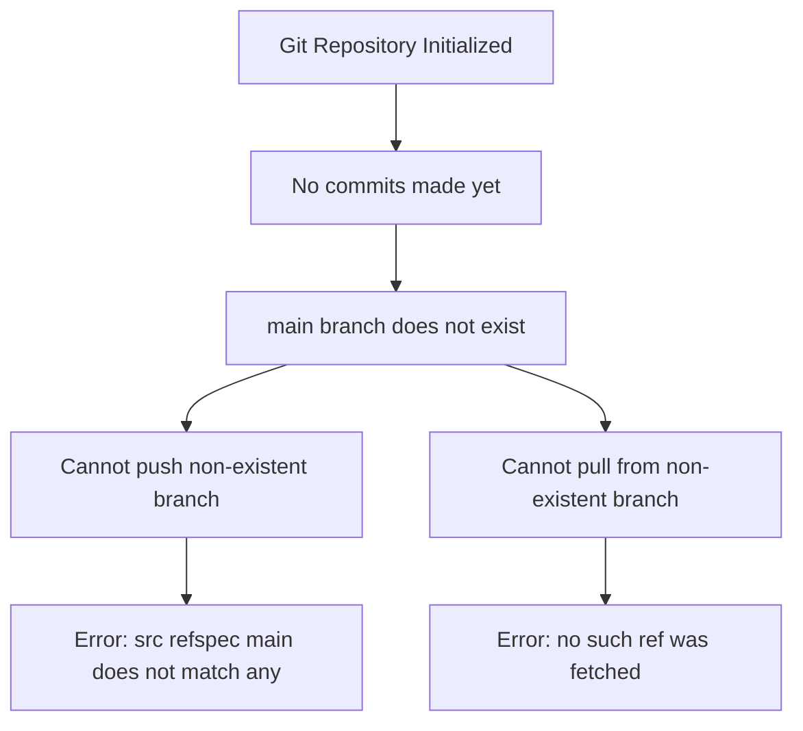
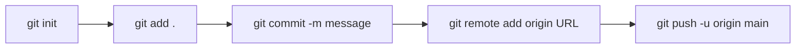

# Git Commit Issue - Root Cause Analysis

## Executive Summary

**Issue**: Unable to commit and push changes to GitHub repository  
**Root Cause**: No initial commit exists on the `main` branch  
**Status**: Repository initialized but empty (no commits yet)

---

## Problem Breakdown

### Key Error Messages

```
[warning] [Git][getBranch] No such branch: main
fatal: bad revision 'refs/heads/main'
error: src refspec main does not match any
```

### What's Happening

1. **Repository State**: Git repository is initialized (`.git` folder exists)
2. **Branch Status**: The `main` branch doesn't exist yet because no commits have been made
3. **Files Status**: All files are untracked (not staged or committed)
4. **Remote Configuration**: Remote origin is correctly configured to GitHub

### Timeline of Events

| Time | Event | Result |
|------|-------|--------|
| 16:30-16:32 | Multiple attempts to find git repository | Failed (not initialized yet) |
| 17:08 | Repository initialized | Success |
| 17:09-17:11 | Git operations attempted | Failed - no branch exists |
| 17:11 | Push attempt: `git push -u origin main` | **Failed** - no commits to push |
| 17:11 | Pull attempt: `git pull --tags` | **Failed** - no upstream branch |

---

## Root Cause Analysis



### Why This Happens

- Git branches are **created when the first commit is made**
- Until you commit, the `main` branch is just a reference that doesn't exist yet
- You cannot push a branch that doesn't exist locally
- The remote repository expects content to be pushed

---

## Configuration Note

Your SSH config file shows:
```
Host github.com-personal
    HostName github.com
    IdentityFile c:\Users\z001x91h\.ssh\priv\id_rsa
```

**Issue Identified**: The file you provided is labeled as "global git config" but it's actually an **SSH config file** (should be at `~/.ssh/config`), not a git config file (which would be at `~/.gitconfig`).

The remote URL `git@github.com-personal:andras-varro/roomwizard.git` correctly uses the SSH alias, so this configuration is working as intended.

---

## Solution Steps

### Step 1: Stage All Files
```bash
git add .
```

### Step 2: Create Initial Commit
```bash
git commit -m "Initial commit: RoomWizard project with native games"
```

### Step 3: Push to GitHub
```bash
git push -u origin main
```

**Alternative**: If the remote repository already has a `main` branch with content:
```bash
git pull origin main --allow-unrelated-histories
git push -u origin main
```

---

## Verification Commands

After making the initial commit, verify with:

```bash
# Check branch exists
git branch

# Check commit history
git log --oneline

# Check remote tracking
git branch -vv

# Verify remote connection
git remote show origin
```

---

## Prevention Recommendations

### For Future Projects

1. **Initialize with commit**: Always make an initial commit immediately after `git init`
   ```bash
   git init
   git add README.md
   git commit -m "Initial commit"
   ```

2. **Use git status frequently**: Check repository state before push/pull operations
   ```bash
   git status
   ```

3. **Verify branch existence**: Before pushing, confirm the branch exists locally
   ```bash
   git branch
   ```

### Workflow Best Practice



---

## Additional Context

### Current Repository State

- **Location**: `c:/work/roomwizard`
- **Remote**: `git@github.com-personal:andras-varro/roomwizard.git`
- **Untracked Files**: 22 files/directories including:
  - Documentation (`.md` files)
  - Native games source code (`native_games/`)
  - HTML game implementations
  - Build scripts and compiled binaries

### Files Ready to Commit

All project files are present and ready for the initial commit:
- Core documentation (PROJECT_STATUS.md, README files)
- Native C game implementations (Pong, Snake, Tetris)
- Web-based games (Brick Breaker, Bouncing Ball)
- Hardware control implementations
- Build and deployment scripts

---

## Quick Fix Command Sequence

Execute these commands in order:

```bash
# 1. Stage all files
git add .

# 2. Create initial commit
git commit -m "Initial commit: RoomWizard embedded gaming platform

- Native C games: Pong, Snake, Tetris, Game Selector
- Web-based games: Brick Breaker, Bouncing Ball
- Hardware control: LED, touch input, framebuffer
- Documentation: Setup guides, deployment instructions
- Build system: Makefiles and compilation scripts"

# 3. Push to GitHub
git push -u origin main
```

---

## Summary

| Aspect | Finding |
|--------|---------|
| **Problem** | Attempting to push before making initial commit |
| **Impact** | Cannot use version control features (push, pull, branch operations) |
| **Severity** | Low - Easy to fix with proper commit workflow |
| **Resolution Time** | < 2 minutes (3 commands) |
| **Risk** | None - No data loss, just workflow issue |

**Next Action**: Execute the three-command sequence above to resolve the issue completely.
