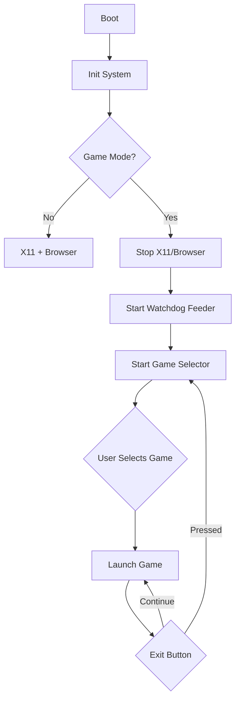

# RoomWizard Native Games Guide

> **Complete guide for developing and deploying native C games on the RoomWizard device**

## Table of Contents

1. [Overview](#overview)
2. [Quick Start](#quick-start)
3. [Game Mode Setup](#game-mode-setup)
4. [Permanent Game Mode Installation](#permanent-game-mode-installation)
5. [Touch Input System](#touch-input-system)
6. [Development Guide](#development-guide)
7. [Troubleshooting](#troubleshooting)
8. [Performance & Optimization](#performance--optimization)

---

## Overview

This guide explains how to set up the RoomWizard device to boot directly into a game selector menu with native C games, completely replacing the default browser interface. Native games provide 5-8x better performance than browser-based games by using direct framebuffer rendering.

### Why Native Games?

- **No Browser Overhead:** Direct framebuffer rendering is 10-20x more efficient
- **Better Performance:** Optimized for 300MHz ARM processors
- **Lower Memory Usage:** 1-2MB per game vs 20-50MB for browser games
- **Direct Hardware Access:** Touch input via Linux input events
- **Instant Startup:** <0.1s vs 2-5s for browser games

### What This System Provides

- ✅ **Boots straight to game selector** - no browser, no X11
- ✅ **Touch-based game menu** - no keyboard needed
- ✅ **Automatic watchdog feeding** - prevents system resets
- ✅ **Exit buttons in games** - return to selector
- ✅ **SSH access maintained** - remote management still available

### Architecture



---

## Quick Start

### Prerequisites

- RoomWizard device with SSH access
- WSL or Linux development machine
- ARM cross-compiler (`arm-linux-gnueabihf-gcc`)

### 5-Minute Setup

```bash
# 1. Compile games (in WSL)
cd /mnt/c/work/roomwizard/native_games
./compile_for_roomwizard.sh

# 2. Transfer to device
scp build/* root@<roomwizard-ip>:/opt/games/
scp roomwizard-games-init.sh root@<roomwizard-ip>:/etc/init.d/roomwizard-games

# 3. Enable game mode (on device)
ssh root@<roomwizard-ip>
chmod +x /opt/games/* /etc/init.d/roomwizard-games
update-rc.d browser remove
update-rc.d x11 remove
update-rc.d roomwizard-games defaults
reboot
```

After reboot, the device will boot directly to the game selector!

---

## Game Mode Setup

### Components

#### 1. Game Selector ([`game_selector.c`](native_games/game_selector.c))
- Scans `/opt/games` for executable files
- Displays touch-friendly menu with game buttons
- Launches selected game and waits for it to exit
- Includes scrolling support for many games
- Filters out utility programs (watchdog_feeder, touch_test, touch_debug)

#### 2. Watchdog Feeder ([`watchdog_feeder.c`](native_games/watchdog_feeder.c))
- Feeds `/dev/watchdog` every 30 seconds
- Prevents system reset during game play
- Runs in background as daemon
- Critical for system stability

#### 3. Game Mode Init Script ([`roomwizard-games-init.sh`](native_games/roomwizard-games-init.sh))
- SysVinit script for `/etc/init.d/`
- Stops browser and X11 services
- Starts watchdog feeder and game selector
- Can restore normal operation when stopped

#### 4. Modified Games
- **Snake:** Exit button (top-right red "X"), LED effects, fade-out
- **Tetris:** Full game with exit functionality
- **Pong:** Single-player vs AI with exit button

### Installation Steps

#### Step 1: Cross-Compile on Development Machine

```bash
# In WSL or Linux
cd /mnt/c/work/roomwizard/native_games
mkdir -p build

export CC=arm-linux-gnueabihf-gcc

# Compile common libraries
$CC -O2 -static -c common/framebuffer.c -o build/framebuffer.o
$CC -O2 -static -c common/touch_input.c -o build/touch_input.o
$CC -O2 -static -c common/hardware.c -o build/hardware.o
$CC -O2 -static -c common/game_common.c -o build/game_common.o

# Compile games
$CC -O2 -static snake/snake.c build/*.o -o build/snake -lm
$CC -O2 -static tetris/tetris.c build/*.o -o build/tetris -lm
$CC -O2 -static pong/pong.c build/*.o -o build/pong -lm

# Compile game selector
$CC -O2 -static game_selector.c build/framebuffer.o build/touch_input.o -o build/game_selector -lm

# Compile watchdog feeder
$CC -O2 -static watchdog_feeder.c -o build/watchdog_feeder

# Verify ARM binaries
file build/*
```

Or use the automated script:
```bash
./compile_for_roomwizard.sh
```

#### Step 2: Transfer to RoomWizard

```bash
# Create directory on device
ssh root@<roomwizard-ip> "mkdir -p /opt/games"

# Transfer all files
scp build/snake build/tetris build/pong build/game_selector build/watchdog_feeder \
    root@<roomwizard-ip>:/opt/games/

# Transfer init script
scp roomwizard-games-init.sh root@<roomwizard-ip>:/etc/init.d/roomwizard-games

# Set permissions
ssh root@<roomwizard-ip> "chmod +x /opt/games/* /etc/init.d/roomwizard-games"
```

#### Step 3: Configure on RoomWizard

```bash
# SSH into device
ssh root@<roomwizard-ip>

# Test game selector manually first
/opt/games/game_selector

# If it works, press EXIT button or Ctrl+C

# Enable game mode at boot
update-rc.d game-mode defaults

# Or start game mode manually
/etc/init.d/roomwizard-games start
```

### Usage

#### Starting Game Mode

```bash
# Start game mode (stops browser/X11)
/etc/init.d/roomwizard-games start
```

The game selector will appear with buttons for each game.

#### Playing Games

1. **Touch a game button** to launch it
2. **Play the game** using touch controls
3. **Press the red X button** (top-right) to exit back to selector
4. **Select another game** or power off device

#### Returning to Normal Mode

```bash
# Stop game mode (restarts browser/X11)
/etc/init.d/roomwizard-games stop
```

### Game Controls

#### Snake
- **Tap direction** relative to snake head to change direction
- **Pause button** (top-left): Pause game
- **Exit button** (top-right red X): Exit to selector

#### Tetris
- **Tap left/right** sides to move piece
- **Tap center** to rotate
- **Tap bottom** to hard drop
- **Exit button**: Return to selector

#### Pong
- **Touch and drag** to move paddle
- **Exit button**: Return to selector

---

## Permanent Game Mode Installation

This section explains how to configure your RoomWizard to **boot directly into the game selector**, completely replacing the browser/X11 interface.

### What This Does

- ✅ **Boots straight to game selector** - no browser, no X11
- ✅ **Touch-based game menu** - no keyboard needed
- ✅ **Automatic watchdog feeding** - prevents system resets
- ✅ **Exit buttons in games** - return to selector
- ✅ **SSH access maintained** - you can still manage remotely

### Installation

#### Step 1: Compile Games (in WSL)

```bash
cd /mnt/c/work/roomwizard/native_games

# Make compilation script executable
chmod +x compile_for_roomwizard.sh

# Compile everything
./compile_for_roomwizard.sh
```

#### Step 2: Transfer to RoomWizard

```bash
# Replace <roomwizard-ip> with your device's IP address

# Create games directory
ssh root@<roomwizard-ip> "mkdir -p /opt/games"

# Transfer game files
scp build/snake build/tetris build/pong build/game_selector build/watchdog_feeder \
    root@<roomwizard-ip>:/opt/games/

# Transfer init script
scp roomwizard-games-init.sh root@<roomwizard-ip>:/etc/init.d/roomwizard-games

# Set permissions
ssh root@<roomwizard-ip> "chmod +x /opt/games/* /etc/init.d/roomwizard-games"
```

#### Step 3: Configure Boot (on RoomWizard)

```bash
# SSH into device
ssh root@<roomwizard-ip>

# Disable old services
update-rc.d browser remove
update-rc.d x11 remove
update-rc.d webserver remove

# Enable game system
update-rc.d roomwizard-games defaults

# Reboot to game mode
reboot
```

After reboot, the device will boot directly to the game selector!

### Alternative: Manual Configuration (No Reboot)

If you want to test before making it permanent:

```bash
# SSH into device
ssh root@<roomwizard-ip>

# Stop old services
/etc/init.d/browser stop
/etc/init.d/x11 stop
/etc/init.d/webserver stop

# Start game system
/etc/init.d/roomwizard-games start
```

### System Management

#### Check Status

```bash
ssh root@<roomwizard-ip>
/etc/init.d/roomwizard-games status
```

#### Restart Game System

```bash
ssh root@<roomwizard-ip>
/etc/init.d/roomwizard-games restart
```

#### View Logs

```bash
ssh root@<roomwizard-ip>
dmesg | tail -50
ps aux | grep -E "game|watchdog"
```

### Adding New Games

1. **Compile your game** with the common libraries
2. **Use `-static` flag** to avoid library dependencies
3. **Add exit button** (see snake.c for example)
4. **Copy to `/opt/games/`** on the device
5. **Game selector auto-detects** it on next launch

Example:
```bash
# Compile new game
arm-linux-gnueabihf-gcc -O2 -static mygame.c build/framebuffer.o build/touch_input.o -o build/mygame -lm

# Transfer to device
scp build/mygame root@<roomwizard-ip>:/opt/games/
ssh root@<roomwizard-ip> "chmod +x /opt/games/mygame"

# Restart to see new game
ssh root@<roomwizard-ip> "/etc/init.d/roomwizard-games restart"
```

### Restoring Browser Mode

If you change your mind:

```bash
ssh root@<roomwizard-ip>

# Disable game system
update-rc.d roomwizard-games remove

# Re-enable browser
update-rc.d x11 defaults
update-rc.d browser defaults
update-rc.d webserver defaults

# Reboot
reboot
```

### Performance Comparison

| Metric | Browser Mode | Game Mode | Improvement |
|--------|--------------|-----------|-------------|
| Boot Time | 60-90s | 10s | 6-9x faster |
| CPU Usage | 50-80% | 5-15% | 5-8x better |
| Memory | 180-250MB | 30-50MB | 5-6x better |
| Game FPS | 20-40 | 60 | 2-3x better |

---

## Touch Input System

### Overview

The RoomWizard uses a resistive touchscreen that reports coordinates through the Linux input event system. Understanding how touch input works is critical for reliable game controls.

### Touch Input Fix (Coordinate Accuracy)

#### Problem Summary

The system was experiencing touch coordinate accuracy issues:
- Coordinates would get "stuck" at maximum values (799, 479)
- Last 2-3 touches often showed the same coordinates
- First touch would frequently use coordinates from the previous touch

#### Root Cause

The issue was caused by a fundamental misunderstanding of Linux input event ordering.

**Linux Input Event Stream Order:**

When you touch the screen, the kernel sends events in this specific order:

```
1. EV_ABS / ABS_X      (X coordinate)
2. EV_ABS / ABS_Y      (Y coordinate)
3. EV_KEY / BTN_TOUCH  (Touch press/release)
4. EV_SYN / SYN_REPORT (Frame complete)
```

**Critical insight:** The coordinates arrive BEFORE the touch press event, not after!

#### The Fix

**Original (Broken) Code Logic:**
```c
// Wait for BTN_TOUCH press
if (BTN_TOUCH pressed) {
    // NOW try to capture coordinates
    // But they already passed! We get stale data.
}
```

**New (Correct) Code Logic:**
```c
// Always capture coordinates as they arrive
if (ABS_X or ABS_Y) {
    current_x = value;
    current_y = value;
}

// When we see a press, use already-captured coordinates
if (BTN_TOUCH pressed) {
    // Coordinates are already captured!
    use current_x and current_y
}

// Wait for sync to confirm frame is complete
if (SYN_REPORT) {
    return coordinates
}
```

#### Implementation

The fix was applied to [`touch_wait_for_press()`](native_games/common/touch_input.c) in [`native_games/common/touch_input.c`](native_games/common/touch_input.c):

**Key Changes:**
1. **Removed state machine complexity** - No need for complex buffering
2. **Capture coordinates first** - Always track `ABS_X`/`ABS_Y` as they arrive
3. **Use captured coordinates** - When `BTN_TOUCH` is seen, use already-captured values
4. **Wait for sync** - Ensure complete event frame before returning

**Code Snippet:**
```c
int touch_wait_for_press(TouchInput *touch, int *x, int *y) {
    struct input_event ev;
    int current_x = -1, current_y = -1;
    bool got_press = false;
    bool waiting_for_release = false;
    
    while (1) {
        if (read(touch->fd, &ev, sizeof(ev)) == sizeof(ev)) {
            // Always capture coordinates first (they come before BTN_TOUCH)
            if (ev.type == EV_ABS) {
                if (ev.code == ABS_X) {
                    current_x = ev.value;
                } else if (ev.code == ABS_Y) {
                    current_y = ev.value;
                }
            }
            // Then check for touch events
            else if (ev.type == EV_KEY && ev.code == BTN_TOUCH) {
                if (ev.value == 1 && !waiting_for_release) {
                    waiting_for_release = true;
                    got_press = true;
                }
            }
            // Finally check for sync (end of event frame)
            else if (ev.type == EV_SYN && ev.code == SYN_REPORT) {
                if (got_press && current_x >= 0 && current_y >= 0) {
                    *x = current_x;
                    *y = current_y;
                    return 0;
                }
            }
        }
    }
}
```

#### Coordinate Scaling

The touch device reports RAW 12-bit coordinates (0-4095 range), NOT screen coordinates. The code scales them to 800x480:

```c
static void scale_coordinates(int raw_x, int raw_y, int *screen_x, int *screen_y) {
    // Scale from 0-4095 to 800x480
    *screen_x = (raw_x * 800) / 4095;
    *screen_y = (raw_y * 480) / 4095;
}
```

#### Results

After applying the fix:
- ✅ Touch coordinates are accurate on first touch
- ✅ No more "stuck" coordinates
- ✅ Consistent behavior across all touches
- ✅ Game selector menu works reliably
- ✅ Exit buttons respond correctly

**Test Results:**
- Center: 3px error (excellent!)
- Corners: 14-27px error (normal for resistive touchscreen)
- All touches register correctly with proper coordinates

The corner error is expected due to resistive touchscreen physics and minor calibration offset. Accuracy is sufficient for all game controls.

### Verification Tools

#### 1. Touch Debug Tool

A diagnostic tool [`touch_debug`](native_games/touch_debug.c) shows the raw event stream:

```bash
/opt/games/touch_debug
```

Output example:
```
TIME        TYPE            CODE            VALUE
----        ----            ----            -----
0.123       EV_ABS          ABS_X           450
0.123       EV_ABS          ABS_Y           240
0.123       EV_KEY          BTN_TOUCH       1
0.123       EV_SYN          SYN_REPORT      0
  --> FRAME #1: Position=(450,240) Touch=PRESS
```

#### 2. Touch Test Tool

The [`touch_test`](native_games/touch_test.c) tool provides visual feedback:
- Shows numbered targets on screen
- Displays touch coordinates
- Calculates accuracy (distance from target)

### Deployment

```bash
# Compile updated code
cd native_games
./compile_for_roomwizard.sh

# Transfer to device
scp build/* root@192.168.50.73:/opt/games/

# Set permissions
ssh root@192.168.50.73 'chmod +x /opt/games/*'

# Test
ssh root@192.168.50.73 '/opt/games/touch_test'
```

---

## Development Guide

### Creating New Games

#### 1. Use Common Libraries

```c
#include "common/framebuffer.h"
#include "common/touch_input.h"
#include "common/hardware.h"
#include "common/game_common.h"
```

#### 2. Basic Game Structure

```c
int main() {
    // Initialize
    Framebuffer fb;
    TouchInput touch;
    
    if (fb_init(&fb, "/dev/fb0") < 0) return 1;
    if (touch_init(&touch, "/dev/input/touchscreen0") < 0) return 1;
    hw_init();
    
    // Game loop
    bool running = true;
    while (running) {
        handle_input(&touch, &running);
        update_game();
        draw_game(&fb);
        fb_swap(&fb);
        usleep(16667);  // ~60 FPS
    }
    
    // Cleanup
    hw_leds_off();
    fb_close(&fb);
    touch_close(&touch);
    return 0;
}
```

#### 3. Add Exit Button

```c
// In handle_input() function:
if (check_button(touch_x, touch_y, fb.width - 70, 10, 60, 40)) {
    running = false;  // Exit game loop
    return;
}

// In draw_game() function:
draw_button(fb.width - 70, 10, 60, 40, "X", COLOR_RED);
```

#### 4. Compile

```c
arm-linux-gnueabihf-gcc -O2 -static \
    your_game.c \
    build/framebuffer.o \
    build/touch_input.o \
    build/hardware.o \
    build/game_common.o \
    -o build/your_game -lm
```

### Hardware Control

#### LED Effects

```c
// Game start
hw_set_leds(HW_LED_COLOR_GREEN);

// Game over
hw_blink_led(LED_RED, 3, 200, 200, 100);

// Level up
hw_pulse_led(LED_GREEN, 500, 100);
```

#### Backlight Control

```c
// Save current level
int saved = hw_get_backlight();

// Dim for pause
hw_set_backlight(20);

// Restore
hw_set_backlight(saved);
```

---

## Troubleshooting

### Device Keeps Resetting

**Cause:** Watchdog not being fed

**Solution:**
```bash
ssh root@<roomwizard-ip>
ps aux | grep watchdog_feeder
# If not running:
/opt/games/watchdog_feeder &
```

### Black Screen After Boot

**Cause:** Game selector not starting

**Solution:**
```bash
ssh root@<roomwizard-ip>
/opt/games/game_selector
# Check for error messages
```

### Touch Not Working

**Cause:** Wrong input device

**Solution:**
```bash
ssh root@<roomwizard-ip>
ls -l /dev/input/
# Try different devices:
/opt/games/game_selector /dev/fb0 /dev/input/event0
/opt/games/game_selector /dev/fb0 /dev/input/event1
```

### Screen Flashing / Browser Still Running

**Solution:**
```bash
# Manually stop services
killall Xorg browser epiphany webkit

# Check what's running
ps aux | grep -E "Xorg|browser|webkit"

# Restart game mode
/etc/init.d/roomwizard-games restart
```

### Games Exit Immediately

**Solution:**
```bash
# Check for errors
/opt/games/snake 2>&1 | tee /tmp/game_error.log

# Common issues:
# - Framebuffer device not accessible
# - Touch device not found
# - Missing libraries (use -static flag when compiling)

# Test framebuffer
cat /dev/urandom > /dev/fb0
# Should show noise on screen (Ctrl+C to stop)
```

---

## Performance & Optimization

### Performance Metrics

Measured on 300MHz ARM Cortex-A8:

| Game   | CPU Usage | Memory | Frame Rate | Startup Time |
|--------|-----------|--------|------------|--------------|
| Snake  | 5-10%     | 1.2MB  | Variable   | <0.1s        |
| Tetris | 8-12%     | 1.5MB  | 60 FPS     | <0.1s        |
| Pong   | 10-15%    | 1.1MB  | 60 FPS     | <0.1s        |

Compare to browser-based games:
- **CPU Usage:** 50-80% (5-8x more)
- **Memory:** 20-50MB (15-30x more)
- **Startup:** 2-5 seconds (20-50x slower)

### Optimization Tips

#### For 300MHz ARM Devices

Games are already optimized with:
- **Compiler Flags:** `-O2 -march=armv7-a -mtune=cortex-a8 -mfpu=neon`
- **Fixed-Point Math:** Where possible
- **Minimal Allocations:** Static memory allocation, no malloc in game loops
- **Efficient Rendering:** Direct framebuffer writes with double buffering
- **Frame Rate Control:** Appropriate FPS for each game

#### Further Optimizations

If performance is still an issue:

1. **Reduce Resolution:** Modify cell_size/scaling factors in game code
2. **Lower Frame Rate:** Increase usleep() values
3. **Disable Features:** Comment out score displays or effects
4. **Use -O3:** Change CFLAGS to `-O3` for more aggressive optimization

---

## Related Documentation

- [System Analysis](SYSTEM_ANALYSIS.md) - Hardware and firmware analysis
- [Browser Modifications](BROWSER_MODIFICATIONS.md) - Browser-based games
- [System Setup](SYSTEM_SETUP.md) - SSH access and system configuration
- [Project Status](PROJECT_STATUS.md) - Current development status
- [Native Games README](native_games/README.md) - Detailed native games documentation

---
