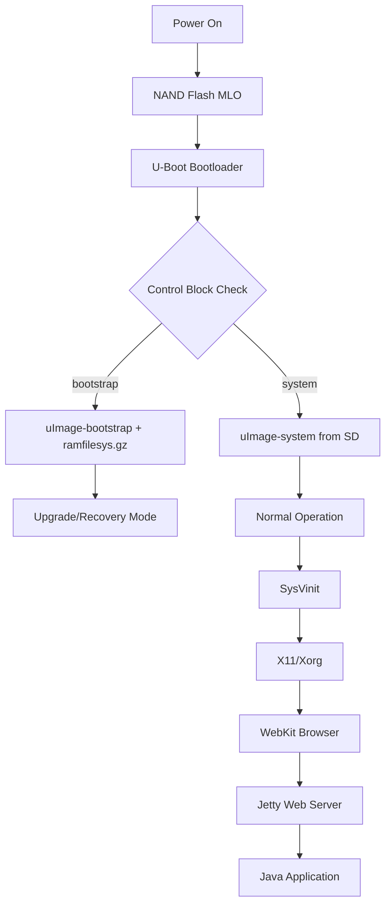
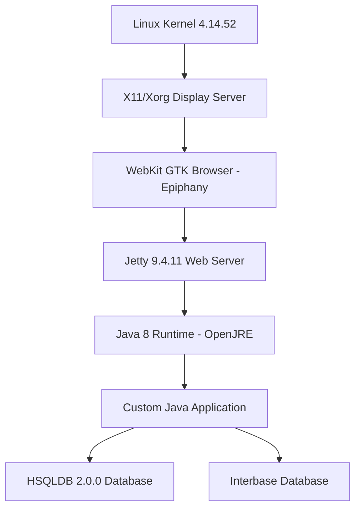

# RoomWizard System Analysis

> **Comprehensive technical analysis of the Steelcase RoomWizard hardware, firmware, and system architecture**

## Table of Contents

1. [Executive Summary](#executive-summary)
2. [System Architecture](#system-architecture)
3. [Hardware Platform](#hardware-platform)
4. [Protection Mechanisms](#protection-mechanisms)
5. [Hardware Control Interfaces](#hardware-control-interfaces)
6. [Application Framework](#application-framework)
7. [USB Subsystem Analysis](#usb-subsystem-analysis)
8. [Safe Modification Strategy](#safe-modification-strategy)
9. [Debugging & Rollback](#debugging--rollback)
10. [Critical Warnings](#critical-warnings)

---

## Executive Summary

The Steelcase RoomWizard is an embedded Linux device based on a Texas Instruments ARM Cortex-A8 SoC (AM335x series). The system uses integrity-based protection mechanisms (MD5 checksums, hardware watchdog, state tracking) rather than cryptographic signing, making modifications possible but requiring careful attention to system requirements.

### Key Findings

- **Hardware:** TI AM335x ARM Cortex-A8 @ 300MHz, 256MB RAM
- **OS:** Embedded Linux (kernel 4.14.52) with SysVinit
- **Protection:** MD5 checksums, 60-second hardware watchdog, boot state tracking
- **Interfaces:** Framebuffer (`/dev/fb0`), touchscreen (`/dev/input/`), LEDs (sysfs)
- **Software Stack:** X11 → WebKit browser → Jetty 9.4.11 → Java 8 → HSQLDB

### Modification Success Requirements

1. Regenerate all MD5 checksums after file changes
2. Feed the hardware watchdog timer (every 30 seconds)
3. Maintain control block state to avoid failure mode
4. Preserve critical services (X11, Jetty, browser, watchdog)
5. Use existing runtimes (Java 8 available, Python requires ARM binaries)

---

## System Architecture

### Boot Sequence



### Boot Process Details

1. **NAND Flash** → MLO (X-Loader) → U-Boot bootloader
2. **Control Block** (`ctrlblock.bin`) determines boot mode:
   - `boot_from=bootstrap`: Loads `uImage-bootstrap` + `ramfilesys.gz` (upgrade/recovery)
   - `boot_from=system`: Loads `uImage-system` from SD root partition (normal operation)
3. **Boot Tracker** (0-2):
   - 0 = Normal operation
   - 1 = Post-upgrade verification
   - 2+ = **FAILURE MODE** - triggers [`fail.sh`](backup_docs/analysis.md)

### Partition Structure

| Partition | Type | Size | Mount Point | Purpose |
|-----------|------|------|-------------|---------|
| p1 | FAT32 | 64MB | `/var/volatile/boot` | Boot files, kernels |
| p2 | ext3 | 256MB | `/home/root/data` | Application data |
| p3 | ext3 | 250MB | `/home/root/log` | System logs |
| p5 | ext3 | 1500MB | `/home/root/backup` | Firmware backup |
| p6 | ext3 | 1024MB | `/` | Root filesystem |

---

## Hardware Platform

### Processor & Memory

- **SoC:** Texas Instruments AM335x (ARM Cortex-A8)
- **CPU:** 300MHz ARM (armv7l architecture)
- **RAM:** 256MB DDR3
- **Storage:** SD card (4-8GB typical)
- **NAND Flash:** Boot loader and recovery

### Display

- **Resolution:** 800x480 pixels
- **Technology:** TFT LCD with LED backlight
- **Interface:** Framebuffer (`/dev/fb0`)
- **Color Depth:** 32-bit RGB
- **Backlight Control:** `/sys/class/leds/backlight/brightness` (0-100)

### Input

- **Touchscreen:** Resistive touch panel
- **Device:** `/dev/input/touchscreen0` or `/dev/input/event0`
- **Protocol:** Linux input events (evdev)
- **Calibration:** `xinput_calibrator` with config at `/etc/pointercal.xinput`
- **Resolution:** 12-bit coordinates (0-4095), scaled to screen resolution

### Indicators

- **Red LED:** Status indicator (`/sys/class/leds/red_led/brightness`)
- **Green LED:** Status indicator (`/sys/class/leds/green_led/brightness`)
- **Range:** 0-100 (percentage brightness)

### Connectivity

- **Ethernet:** 10/100 Mbps RJ45
- **USB:** Micro USB (device/gadget mode only - see [USB Subsystem](#usb-subsystem-analysis))
- **Serial:** UART on ttyO1 (115200 baud) for debugging

---

## Protection Mechanisms

### 1. Hardware Watchdog Timer

**Critical:** The system has a 60-second hardware watchdog that will reset the device if not fed regularly.

- **Device:** `/dev/watchdog`
- **Timeout:** 60 seconds
- **Configuration:** `/etc/watchdog.conf`
- **Feed Interval:** 30 seconds (safe margin)
- **Daemon:** `/usr/sbin/watchdog` or custom feeder

**Feeding the Watchdog:**
```bash
# Simple watchdog feeder
while true; do
    echo 1 > /dev/watchdog
    sleep 30
done &
```

**Consequences of Not Feeding:**
- System automatically resets after 60 seconds
- All unsaved data lost
- Boot tracker may increment (leading to failure mode)

### 2. MD5 Integrity Verification (Triple-Layer)

The system uses three layers of MD5 checksum verification:

#### Layer 1: Upgrade Package Checksum
```bash
# Verifies the entire upgrade package
md5sum -c upgrade.cpio.gz.md5
```

#### Layer 2: Individual Partition Image Checksums
```bash
# Each partition image has its own MD5 file
sd_rootfs_part.img.md5
sd_boot_archive.tar.gz.md5
sd_data_part.img.md5
sd_log_part.img.md5
```

#### Layer 3: Post-Write Verification
- After writing partitions with `dd`, system reads back data
- Compares MD5 of written data with expected checksum
- **Retry Logic:** Up to 3 attempts per partition
- **Failure:** Exits with error code 6 if all retries fail

**Regenerating Checksums After Modifications:**
```bash
cd /path/to/modified/images
for file in *.img *.gz *.bin; do
    md5sum "$file" > "${file}.md5"
done
```

### 3. Control Block State Machine

**Binary:** `/opt/sbin/ctrlblk`  
**Storage:** Boot partition as `ctrlblock.bin`

**Parameters:**
- `boot_from`: `bootstrap` | `system`
- `upgrade_type`: `factory` | `field`
- `boot_tracker`: 0-2 (failure counter)
- `fwversion`: Firmware version string

**Failure Detection Logic:**
```bash
if [ $TRACKER -ge 2 ]; then
    echo "Detected failure mode on boot"
    start_fail_script  # Triggers recovery/factory reset
    exit 1
fi
```

**Boot Tracker Behavior:**
- Incremented on each boot attempt
- Reset to 0 on successful boot
- If ≥ 2, system enters failure mode and triggers recovery

### 4. Boot Verification Chain

- NAND boot redirect written to **4 redundant locations** with OOB data
- Each write verified by reading back and binary comparison (`cmp`)
- No cryptographic signatures detected
- Strict binary matching enforced

---

## Hardware Control Interfaces

### LED Control (Multi-Color Indicator)

**Sysfs GPIO/LED Interface:**
```bash
/sys/class/leds/red_led/brightness      # 0-100
/sys/class/leds/green_led/brightness    # 0-100
/sys/class/leds/backlight/brightness    # 0-100
```

**Control Scripts:**
- `/opt/sbin/backlight/setbacklight.sh`
- `/opt/sbin/brightness.sh`
- `/opt/sbin/conc_leds.sh`

**Example Usage:**
```bash
# Set red LED to 50%
echo 50 > /sys/class/leds/red_led/brightness

# Set green LED to full brightness
echo 100 > /sys/class/leds/green_led/brightness

# Turn off backlight (screen blank)
echo 0 > /sys/class/leds/backlight/brightness
```

**Python LED Control:**
```python
#!/usr/bin/env python3
import time

class LEDController:
    def __init__(self):
        self.red_led = "/sys/class/leds/red_led/brightness"
        self.green_led = "/sys/class/leds/green_led/brightness"
        self.backlight = "/sys/class/leds/backlight/brightness"
    
    def set_led(self, led_path, brightness):
        """Set LED brightness (0-100)"""
        try:
            with open(led_path, 'w') as f:
                f.write(str(max(0, min(100, brightness))))
        except IOError as e:
            print(f"Error: {e}")
    
    def set_red(self, brightness):
        self.set_led(self.red_led, brightness)
    
    def set_green(self, brightness):
        self.set_led(self.green_led, brightness)
    
    def pulse_green(self, duration=2.0):
        """Pulse green LED"""
        for i in range(20):
            self.set_green(int(100 * i / 20))
            time.sleep(duration / 40)
        for i in range(20, 0, -1):
            self.set_green(int(100 * i / 20))
            time.sleep(duration / 40)

# Usage
leds = LEDController()
leds.set_green(50)
leds.pulse_green()
```

**Java LED Control:**
```java
import java.io.FileWriter;
import java.io.IOException;

public class LEDController {
    private static final String RED_LED = "/sys/class/leds/red_led/brightness";
    private static final String GREEN_LED = "/sys/class/leds/green_led/brightness";
    
    public void setLED(String ledPath, int brightness) {
        brightness = Math.max(0, Math.min(100, brightness));
        try (FileWriter writer = new FileWriter(ledPath)) {
            writer.write(String.valueOf(brightness));
        } catch (IOException e) {
            System.err.println("Error: " + e.getMessage());
        }
    }
    
    public void setGreen(int brightness) {
        setLED(GREEN_LED, brightness);
    }
    
    public void pulseGreen(int durationMs) throws InterruptedException {
        for (int i = 0; i <= 100; i += 5) {
            setGreen(i);
            Thread.sleep(durationMs / 40);
        }
        for (int i = 100; i >= 0; i -= 5) {
            setGreen(i);
            Thread.sleep(durationMs / 40);
        }
    }
}
```

### Touchscreen Input

**Device Nodes:**
```bash
/dev/input/touchscreen0    # Primary touchscreen device
/dev/input/event*          # Input event devices
```

**Input Stack:**
```
Hardware → Kernel evdev → libinput → X11/Xorg → WebKit browser
```

**Calibration:**
- Tool: `xinput_calibrator`
- Config: `/etc/pointercal.xinput`
- Auto-calibration: `/usr/bin/xinput_calibrator_once.sh`

**Python Touchscreen Reader:**
```python
#!/usr/bin/env python3
import struct
import os

class TouchscreenReader:
    EVENT_FORMAT = 'llHHi'  # time, time_usec, type, code, value
    EVENT_SIZE = struct.calcsize(EVENT_FORMAT)
    EV_ABS = 0x03
    ABS_X = 0x00
    ABS_Y = 0x01
    
    def __init__(self, device='/dev/input/touchscreen0'):
        self.device = device
        self.fd = None
    
    def open(self):
        try:
            self.fd = os.open(self.device, os.O_RDONLY)
            return True
        except OSError as e:
            print(f"Error: {e}")
            return False
    
    def read_event(self):
        if not self.fd:
            return None
        try:
            data = os.read(self.fd, self.EVENT_SIZE)
            if len(data) < self.EVENT_SIZE:
                return None
            tv_sec, tv_usec, type, code, value = struct.unpack(
                self.EVENT_FORMAT, data)
            return {'type': type, 'code': code, 'value': value}
        except OSError:
            return None
    
    def read_touch(self):
        """Read touch coordinates"""
        x, y = None, None
        while True:
            event = self.read_event()
            if not event:
                break
            if event['type'] == self.EV_ABS:
                if event['code'] == self.ABS_X:
                    x = event['value']
                elif event['code'] == self.ABS_Y:
                    y = event['value']
                    if x is not None:
                        return (x, y)
        return None
    
    def close(self):
        if self.fd:
            os.close(self.fd)

# Usage
touch = TouchscreenReader()
if touch.open():
    while True:
        coords = touch.read_touch()
        if coords:
            print(f"Touch at {coords}")
```

### Display/Framebuffer

**Device:**
```bash
/dev/fb0                   # Framebuffer device
DISPLAY=:0                 # X11 display server
```

**X11 Configuration:**
```bash
# Started by /etc/init.d/x11
Xorg -br -nolisten tcp -nocursor -pn -dpms vt8 :0
```

**Framebuffer Specifications:**
- Resolution: 800x480
- Color depth: 32-bit (RGBA)
- Memory-mapped for direct access
- Double buffering supported

---

## Application Framework

### Software Stack



### Key Components

#### Display Server
- **X11/Xorg:** Started by `/etc/init.d/x11`
- **Display:** `:0`
- **Configuration:** Minimal, optimized for embedded use

#### Browser
- **Type:** WebKit-based (Epiphany/GNOME Web)
- **Binary:** `/usr/bin/browser` (likely symlink to epiphany)
- **Home Page:** `http://localhost/frontpanel/pages/index.html`
- **Logs:** `/var/log/browser.out`, `/var/log/browser.err`

#### Web Server
- **Type:** Jetty 9.4.11
- **Location:** `/opt/jetty-9-4-11/`
- **Purpose:** Serves JSP/Servlet application
- **Init Script:** `/etc/init.d/webserver`

#### Java Runtime
- **Version:** OpenJRE 8
- **Location:** `/opt/openjre-8/`
- **Usage:** Runs Jetty and custom applications

#### Databases
- **HSQLDB 2.0.0:** `/home/root/data/rwdb/` (room booking data)
- **Interbase:** `/opt/interbase/data/websign.gdb` (legacy)

---

## USB Subsystem Analysis

### USB Port Configuration

The micro USB port is configured in **USB Device/Gadget mode only** and is **not capable of hosting standard USB peripherals** like keyboards and mice.

### Hardware Architecture

**SoC:** TI AM335x with MUSB dual-role USB controller

**Built-in Kernel Modules:**
- `kernel/drivers/usb/musb/musb_hdrc.ko` - MUSB dual-role USB controller
- `kernel/drivers/usb/musb/omap2430.ko` - OMAP/AM335x USB platform driver
- `kernel/drivers/usb/phy/phy-am335x-control.ko` - AM335x USB PHY control
- `kernel/drivers/usb/phy/phy-am335x.ko` - AM335x USB PHY driver
- `kernel/drivers/usb/core/usbcore.ko` - USB core subsystem

### USB Gadget/Device Mode

**Configuration:** USB Ethernet Gadget (g_ether/RNDIS)

From `/etc/network/interfaces`:
```bash
# Ethernet/RNDIS gadget (g_ether)
#iface usb0 inet static
#	address 192.168.7.2
#	netmask 255.255.255.0
#	network 192.168.7.0
#	gateway 192.168.7.1
```

**Purpose:**
- Firmware updates via USB
- Debugging/development access
- Configuration management
- Device appears as network adapter when connected to PC

### Why USB Peripherals Don't Work

#### Software Reasons:
1. **USB Controller Mode:** MUSB controller configured in peripheral/device mode, not host mode
2. **No Host Drivers:** USB host controller drivers not loaded at boot
3. **No HID Support Active:** While HID drivers exist in kernel, they're not initialized for host operations
4. **Gadget-Only Configuration:** System configured exclusively for USB gadget/device functionality

#### Hardware Considerations:
- AM335x MUSB controller **is capable** of OTG (On-The-Go) operation
- Hardware may lack **ID pin detection** circuitry for automatic host/device switching
- USB port may be **hard-wired** for device mode only
- **No USB power output** (VBUS) circuitry for powering external devices

### Alternative Input Methods

Since USB peripherals are not supported:
- Use **network-based input** (SSH, web interface)
- Implement **touchscreen-based** control interfaces
- Use **serial console** for debugging (ttyO1, 115200 baud)

---

## Safe Modification Strategy

### Why Modifications Fail

Based on forensic analysis, modifications typically fail due to:

1. **MD5 Checksum Mismatch** - ANY file modification triggers verification failure
2. **Watchdog Timer Reset** - Boot process exceeded 60-second timeout
3. **Control Block Corruption** - Tracker incremented to failure mode (≥2)
4. **Dependency Chain Breakage** - Modified files broke library/service dependencies

### Step-by-Step Modification Process

#### Step 1: Bypass MD5 Verification

**Regenerate ALL checksums after modifications:**
```bash
cd /path/to/modified/images
for file in *.img *.gz *.bin; do
    md5sum "$file" > "${file}.md5"
done
```

**Alternative:** Patch `nandupgrade.sh` to skip MD5 checks (not recommended)

#### Step 2: Maintain Watchdog Feeding

**Critical - Feed watchdog every 30 seconds:**
```bash
while true; do
    echo 1 > /dev/watchdog
    sleep 30
done &
```

Or use the system daemon:
```bash
/usr/sbin/watchdog -c /etc/watchdog.conf
```

#### Step 3: Inject Custom Runtime

**For Python (ARM binaries required):**
```bash
# 1. Add Python to rootfs
mkdir -p /opt/python3
# Copy ARM-compiled Python 3.x

# 2. Create init script
cat > /etc/init.d/custom_app << 'EOF'
#!/bin/sh
export PYTHONPATH=/opt/python3/lib/python3.x
/opt/python3/bin/python3 /opt/custom/app.py &
EOF

# 3. Enable at boot
chmod +x /etc/init.d/custom_app
ln -s /etc/init.d/custom_app /etc/rc5.d/S99custom_app
```

**For Java (already present):**
- Java 8 runtime exists at `/opt/openjre-8/`
- Add custom JAR to Jetty webapps or create standalone service

#### Step 4: Repack Modified Filesystem

```bash
# 1. Mount and modify rootfs
mkdir -p /tmp/rootfs_mount
mount -o loop sd_rootfs_part.img /tmp/rootfs_mount
cp -r /path/to/custom/* /tmp/rootfs_mount/opt/custom/
umount /tmp/rootfs_mount

# 2. Regenerate MD5 (CRITICAL)
md5sum sd_rootfs_part.img > sd_rootfs_part.img.md5

# 3. Repack boot archive if modified
cd boot_files/
tar czf sd_boot_archive.tar.gz *
md5sum sd_boot_archive.tar.gz > sd_boot_archive.tar.gz.md5

# 4. Update upgrade.conf firmware version
# Increment version to trigger upgrade recognition
```

#### Step 5: Preserve Critical Services

**DO NOT DISABLE:**
- `/etc/init.d/watchdog` - System will reset without it
- `/etc/init.d/webserver` - Application depends on Jetty
- `/etc/init.d/x11` - Display system required
- `/etc/init.d/browser` - Main UI component

**Safe to Augment:**
- Add scripts to `/etc/rc5.d/S99*` (runs after all services)
- Create new init scripts in `/etc/init.d/` with proper symlinks

---

## Debugging & Rollback

### Serial Console Access

- **UART:** ttyO1 at 115200 baud
- **Enabled in:** `/etc/inittab`
- **Connection:** 3.3V TTL serial adapter required

### Log Locations

- `/var/log/` - System logs
- `/home/root/log/` - Application logs
- `/var/log/browser.out` - Browser stdout
- `/var/log/browser.err` - Browser stderr
- `/var/log/jettystart` - Jetty startup logs

### Rollback Procedure

**If boot_tracker ≥ 2:**
1. System enters failure mode
2. `/opt/sbin/fail.sh` executes recovery
3. Can trigger factory reset or recovery mode
4. Backup partition at `/home/root/backup` contains previous firmware

**Manual Rollback:**
```bash
# Restore from backup SD card image
dd if=original_backup.img of=/dev/sdX bs=4M status=progress
sync
```

---

## Critical Warnings

### ⚠️ DO NOT:

- Modify `ctrlblock.bin` without understanding binary format
- Skip MD5 regeneration after ANY modification
- Disable watchdog without alternative feeding mechanism
- Modify bootloader (`mlo`, `u-boot-sd.bin`) without JTAG recovery capability
- Change partition sizes without updating `upgrade.conf`

### ⚠️ ALWAYS:

- Keep backup of original SD card image
- Test in emulator/QEMU if possible
- Maintain serial console access for debugging
- Feed watchdog in any long-running custom code
- Regenerate ALL MD5 checksums after modifications

---

## Summary

The Steelcase RoomWizard uses integrity-based protection (MD5 checksums, watchdog timer, state tracking) rather than cryptographic signing. Successful modification requires:

1. **Regenerating all MD5 checksums** after file changes
2. **Feeding the watchdog timer** to prevent resets
3. **Maintaining the control block state** to avoid failure mode
4. **Preserving critical services** (X11, Jetty, browser)
5. **Using existing runtimes** (Java 8 present, Python needs ARM binaries)

The hardware interfaces (LEDs, touchscreen, framebuffer) are accessible via standard Linux sysfs/device nodes, making custom code integration straightforward once the protection mechanisms are properly handled.

---

## Related Documentation

- [Native Games Guide](NATIVE_GAMES_GUIDE.md) - Native C games development
- [Browser Modifications](BROWSER_MODIFICATIONS.md) - Browser-based modifications
- [System Setup](SYSTEM_SETUP.md) - SSH access and system configuration
- [Project Status](PROJECT_STATUS.md) - Current development status

---

