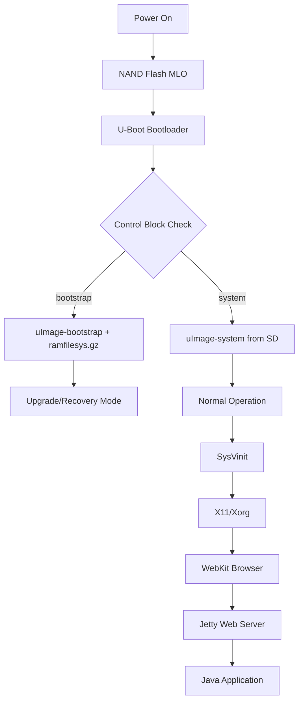
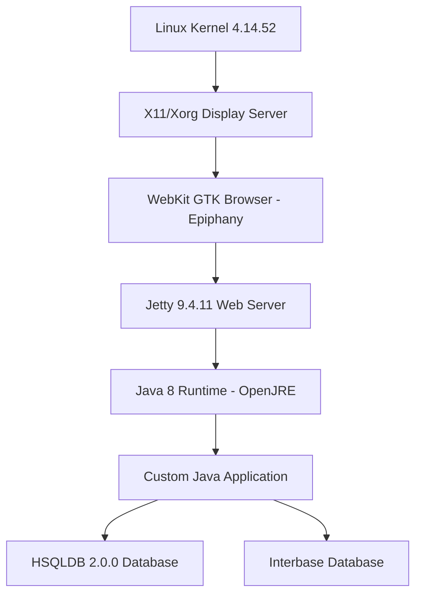

# RoomWizard System Analysis

> **Comprehensive technical analysis of the Steelcase RoomWizard hardware, firmware, and system architecture**

## Table of Contents

1. [Executive Summary](#executive-summary)
2. [System Architecture](#system-architecture)
3. [Hardware Platform](#hardware-platform)
4. [Protection Mechanisms](#protection-mechanisms)
5. [Hardware Control Interfaces](#hardware-control-interfaces)
6. [Application Framework](#application-framework)
7. [USB Subsystem Analysis](#usb-subsystem-analysis)
8. [Extended Hardware Discovery](#extended-hardware-discovery)
9. [Live System Analysis](#live-system-analysis)
10. [Safe Modification Strategy](#safe-modification-strategy)
11. [Debugging & Rollback](#debugging--rollback)
12. [Critical Warnings](#critical-warnings)

---

## Executive Summary

The Steelcase RoomWizard is an embedded Linux device based on a Texas Instruments ARM Cortex-A8 SoC (AM335x series). The system uses integrity-based protection mechanisms (MD5 checksums, hardware watchdog, state tracking) rather than cryptographic signing, making modifications possible but requiring careful attention to system requirements.

### Key Findings

- **Hardware:** TI AM335x ARM Cortex-A8 @ 600MHz (dynamically scaled from 300MHz base), 234MB RAM
- **OS:** Embedded Linux (kernel 4.14.52) with SysVinit
- **Protection:** MD5 checksums, 60-second hardware watchdog, boot state tracking
- **Interfaces:** Framebuffer (`/dev/fb0`), touchscreen (`/dev/input/`), LEDs (sysfs)
- **Software Stack:** X11 → WebKit browser → Jetty 9.4.11 → Java 8 → HSQLDB
- **USB:** Hardware capable of host mode, currently non-functional (device tree issue - fixable)
- **GPIO:** 8 GPIO banks (200+ pins), TWL4030 PMIC with 18 additional GPIO pins
- **Wireless:** No WiFi or Bluetooth hardware present

### Modification Success Requirements

1. Regenerate all MD5 checksums after file changes
2. Feed the hardware watchdog timer (every 30 seconds)
3. Maintain control block state to avoid failure mode
4. Preserve critical services (X11, Jetty, browser, watchdog)
5. Use existing runtimes (Java 8 available, Python requires ARM binaries)

---

## System Architecture

### Boot Sequence


```mermaid
graph TB
    A[Power On] --> B[NAND Flash MLO]
    B --> C[U-Boot Bootloader]
    C --> D{Control Block Check}
    D -->|bootstrap| E[uImage-bootstrap + ramfilesys.gz]
    D -->|system| F[uImage-system from SD]
    E --> G[Upgrade/Recovery Mode]
    F --> H[Normal Operation]
    H --> I[SysVinit]
    I --> J[X11/Xorg]
    J --> K[WebKit Browser]
    K --> L[Jetty Web Server]
    L --> M[Java Application]
```

### Boot Process Details

1. **NAND Flash** → MLO (X-Loader) → U-Boot bootloader
2. **Control Block** (`ctrlblock.bin`) determines boot mode:
   - `boot_from=bootstrap`: Loads `uImage-bootstrap` + `ramfilesys.gz` (upgrade/recovery)
   - `boot_from=system`: Loads `uImage-system` from SD root partition (normal operation)
3. **Boot Tracker** (0-2):
   - 0 = Normal operation
   - 1 = Post-upgrade verification
   - 2+ = **FAILURE MODE** - triggers [`fail.sh`](backup_docs/analysis.md)

### Partition Structure

| Partition | Type | Size | Mount Point | Purpose |
|-----------|------|------|-------------|---------|
| p1 | FAT32 | 64MB | `/var/volatile/boot` | Boot files, kernels |
| p2 | ext3 | 256MB | `/home/root/data` | Application data |
| p3 | ext3 | 250MB | `/home/root/log` | System logs |
| p5 | ext3 | 1500MB | `/home/root/backup` | Firmware backup |
| p6 | ext3 | 1024MB | `/` | Root filesystem |

---

## Hardware Platform

### Processor & Memory

- **SoC:** Texas Instruments AM335x (ARM Cortex-A8)
- **CPU:** 300MHz base, 600MHz current (armv7l architecture, dynamic frequency scaling)
- **BogoMIPS:** 594.73
- **Features:** NEON SIMD, VFP, Thumb, TLS
- **RAM:** 234MB DDR3 (256MB total, ~22MB reserved by system)
- **Storage:** SD card (3.7GB typical)
- **NAND Flash:** Boot loader and recovery

**Verified Measurements (Live System):**
- Current CPU frequency: 600 MHz (cpufreq scaling active)
- Total RAM: 239,904 KB (234 MB)
- Available RAM: 182 MB (76% free under game mode)
- Load average: 0.00 (idle)

### Display

- **Resolution:** 800x480 pixels (framebuffer)
- **Visible Area:** ~720x420 pixels (bezel obscures ~30-40px on all edges)
- **Technology:** TFT LCD with LED backlight
- **Interface:** Framebuffer (`/dev/fb0`)
- **Color Depth:** 32-bit RGB
- **Backlight Control:** `/sys/class/leds/backlight/brightness` (0-100)

**Screen Safe Area:**
- Applications should keep interactive elements within the visible area
- Use margins of at least 40px from framebuffer edges
- See [`native_games/common/common.h`](native_games/common/common.h) for `LAYOUT_*` macros implementing safe area

### Input

- **Touchscreen:** Resistive touch panel (Panjit panjit_ts)
- **Device:** `/dev/input/touchscreen0` or `/dev/input/event0`
- **Protocol:** Linux input events (evdev)
- **Calibration:** `xinput_calibrator` with config at `/etc/pointercal.xinput`
- **Resolution:** 12-bit coordinates (0-4095), scaled to screen resolution
- **Touch Type:** Single-touch only (no multi-touch)
- **Pressure:** Binary (255=pressed, 0=released), no variable pressure

**Touch Coordinate Scaling:**
```c
// Raw to screen coordinates
screen_x = (raw_x * 800) / 4095;
screen_y = (raw_y * 480) / 4095;
```

**Touch Event Order (Critical):**
1. `ABS_X` - X coordinate
2. `ABS_Y` - Y coordinate
3. `BTN_TOUCH` - Press/release event
4. `SYN_REPORT` - Event synchronization

**Important:** Coordinates must be captured BEFORE the press event. See [`native_games/common/touch_input.c`](native_games/common/touch_input.c) for reference implementation.

**Touch Accuracy:**
- Center: ~3px accuracy
- Corners: ~14-27px error (resistive touchscreen characteristic)
- Calibration can improve corner accuracy

### Indicators

- **Red LED:** Status indicator (`/sys/class/leds/red_led/brightness`)
- **Green LED:** Status indicator (`/sys/class/leds/green_led/brightness`)
- **Range:** 0-100 (percentage brightness)

### Audio

- **Codec:** Texas Instruments TWL4030 (OMAP companion chip), HiFi DAC
- **ALSA Card:** `rw20`, card 0 device 0 (`hw:0,0`)
- **OSS Compat:** `/dev/dsp`, `/dev/audio`, `/dev/mixer` (ALSA OSS shim)
- **Speaker:** SPKR1 on PCB driven by TWL4030 HandsfreeL/R class-D amplifier
- **Amp Enable:** GPIO12 (sysfs) — must be driven **HIGH** to unmute the speaker
- **Native rate:** 48000 Hz (TWL4030 HiFi); OSS shim SRCs from app rate automatically
- **App rates:** ScummVM uses 22050 Hz (halves OPL synthesis CPU load); native games use 44100 Hz
- **Channels:** Stereo out (mono speaker physically; both channels drive the same SPKR1 via HandsfreeL/R bridge)
- **Volume note:** The small PCB speaker distorts at full-scale DAC output. ScummVM applies 50% (−6 dB) software attenuation post-mix. Native games should do the same.
- **ALSA HW period:** ~22,317 frames / **~506 ms** at 44100 Hz — see OSS usage note below

**Working mixer signal path:**
```
DAC1 (44100 → 48000 SRC) → HandsfreeL Mux (AudioL1) → HandsfreeL Switch
                          → HandsfreeR Mux (AudioR1) → HandsfreeR Switch
                                                        → SPKR1
```

**Volume controls:**
- `DAC1 Digital Fine Playback Volume` — 0..63, use 63
- `DAC1 Digital Coarse Playback Volume` — 0..2, use 0 (0 dB)
- `PreDriv Playback Volume` — 0..3 (0 mute, 3 = +6 dB)

**Boot initialisation script:** `/etc/init.d/audio-enable` (→ `rc5.d/S29audio-enable`)
```bash
echo out > /sys/class/gpio/gpio12/direction
echo 1 > /sys/class/gpio/gpio12/value
amixer -c 0 cset name="HandsfreeL Mux" AudioL1
amixer -c 0 cset name="HandsfreeR Mux" AudioR1
amixer -c 0 cset name="HandsfreeL Switch" on
amixer -c 0 cset name="HandsfreeR Switch" on
```
ALSA DAC volumes are persisted via `alsactl store` → `/var/lib/alsa/asound.state` and restored by `/etc/init.d/alsa-state` at boot.

**⚠ Critical OSS usage notes:**

1. **ALSA HW period stall:** The TWL4030 ALSA driver has a hardware period of ~22,317 frames (~506 ms). A blocking `write()` to `/dev/dsp` stalls for the full ALSA HW period after the OSS ring fills — not the OSS fragment duration (~93 ms). This causes 185 ms of audio followed by 321 ms of silence, repeating ("bru-bru-bru-KLICK" artifact). **Always open `/dev/dsp` with `O_NONBLOCK`** and handle `EAGAIN` with a short sleep (~5 ms). The OSS software ring drains at the hardware sample rate continuously regardless of the ALSA period size.  
Diagnosed via `native_games/tests/oss_diag.c`.

2. **Speaker distortion:** The small PCB speaker distorts at full DAC output. Apply software volume attenuation (e.g. 50% via `>>1` on int16 samples) before writing to `/dev/dsp`.

3. **32-bit overflow with timeval:** On 32-bit ARM (`sizeof(long) == 4`), never compute `(now.tv_sec - epoch_0) * 1000000L` — the multiplication overflows. Always initialize timing baselines to the current time, not epoch zero.

4. **ALSA OSS shim ioctl bugs (Linux 4.14.52, TWL4030):** The ALSA OSS compatibility layer has known bugs that silently corrupt audio configuration:
   - **`SNDCTL_DSP_STEREO` silently ignored:** Returns `rc=0, stereo=1` (success) but the device stays mono. Verified with `native_games/tests/ch_test.c`.
   - **`SNDCTL_DSP_SPEED` may reset format and/or channels** after they've been set.
   - **`SNDCTL_DSP_SETFMT` may reset speed** after it's been set.
   - **Set-ioctl output values may be unreliable:** The value written back to the variable may not reflect the actual device state.

   **Workaround:** (1) Set SPEED first, then FMT, then CHANNELS (so FMT/CH survive any SPEED-triggered reset). (2) Read back actual device state with `SOUND_PCM_READ_RATE`, `SOUND_PCM_READ_BITS`, `SOUND_PCM_READ_CHANNELS`. (3) Use the read-back rate for `_outputRate` — if `_outputRate` doesn't match the real playback rate, OPL sample-counting produces music at the wrong tempo. See [`scummvm-roomwizard/backend-files/oss-mixer.cpp`](scummvm-roomwizard/backend-files/oss-mixer.cpp) for the working implementation.

   **Evidence:** At 22050 Hz, music played at half speed. Switching to 48000 Hz made it proportionally worse (~4×), consistent with `_outputRate` not matching the real device rate.

### Connectivity

- **Ethernet:** 10/100 Mbps RJ45
- **USB:** Micro USB (device/gadget mode only - see [USB Subsystem](#usb-subsystem-analysis))
- **Serial:** UART on ttyO1 (115200 baud) for debugging

---

## Protection Mechanisms

### 1. Hardware Watchdog Timer

**Critical:** The system has a 60-second hardware watchdog that will reset the device if not fed regularly.

- **Device:** `/dev/watchdog`
- **Timeout:** 60 seconds
- **Configuration:** `/etc/watchdog.conf`
- **Feed Interval:** 30 seconds (safe margin)
- **Daemon:** `/usr/sbin/watchdog` or custom feeder

**Feeding the Watchdog:**
```bash
# Simple watchdog feeder
while true; do
    echo 1 > /dev/watchdog
    sleep 30
done &
```

**Consequences of Not Feeding:**
- System automatically resets after 60 seconds
- All unsaved data lost
- Boot tracker may increment (leading to failure mode)

### 2. MD5 Integrity Verification (Triple-Layer)

The system uses three layers of MD5 checksum verification:

#### Layer 1: Upgrade Package Checksum
```bash
# Verifies the entire upgrade package
md5sum -c upgrade.cpio.gz.md5
```

#### Layer 2: Individual Partition Image Checksums
```bash
# Each partition image has its own MD5 file
sd_rootfs_part.img.md5
sd_boot_archive.tar.gz.md5
sd_data_part.img.md5
sd_log_part.img.md5
```

#### Layer 3: Post-Write Verification
- After writing partitions with `dd`, system reads back data
- Compares MD5 of written data with expected checksum
- **Retry Logic:** Up to 3 attempts per partition
- **Failure:** Exits with error code 6 if all retries fail

**Regenerating Checksums After Modifications:**
```bash
cd /path/to/modified/images
for file in *.img *.gz *.bin; do
    md5sum "$file" > "${file}.md5"
done
```

### 3. Control Block State Machine

**Binary:** `/opt/sbin/ctrlblk`  
**Storage:** Boot partition as `ctrlblock.bin`

**Parameters:**
- `boot_from`: `bootstrap` | `system`
- `upgrade_type`: `factory` | `field`
- `boot_tracker`: 0-2 (failure counter)
- `fwversion`: Firmware version string

**Failure Detection Logic:**
```bash
if [ $TRACKER -ge 2 ]; then
    echo "Detected failure mode on boot"
    start_fail_script  # Triggers recovery/factory reset
    exit 1
fi
```

**Boot Tracker Behavior:**
- Incremented on each boot attempt
- Reset to 0 on successful boot
- If ≥ 2, system enters failure mode and triggers recovery

### 4. Boot Verification Chain

- NAND boot redirect written to **4 redundant locations** with OOB data
- Each write verified by reading back and binary comparison (`cmp`)
- No cryptographic signatures detected
- Strict binary matching enforced

---

## Hardware Control Interfaces

### LED Control (Multi-Color Indicator)

**Sysfs GPIO/LED Interface:**
```bash
/sys/class/leds/red_led/brightness      # 0-100
/sys/class/leds/green_led/brightness    # 0-100
/sys/class/leds/backlight/brightness    # 0-100
```

**Control Scripts:**
- `/opt/sbin/backlight/setbacklight.sh`
- `/opt/sbin/brightness.sh`
- `/opt/sbin/conc_leds.sh`

**Example Usage:**
```bash
# Set red LED to 50%
echo 50 > /sys/class/leds/red_led/brightness

# Set green LED to full brightness
echo 100 > /sys/class/leds/green_led/brightness

# Turn off backlight (screen blank)
echo 0 > /sys/class/leds/backlight/brightness
```

See [`native_games/common/hardware.c`](native_games/common/hardware.c) for C implementation.

### Touchscreen Input

**Device Nodes:**
```bash
/dev/input/touchscreen0    # Primary touchscreen device
/dev/input/event*          # Input event devices
```

**Input Stack:**
```
Hardware → Kernel evdev → libinput → X11/Xorg → WebKit browser
```

**Calibration:**
- Tool: `xinput_calibrator`
- Config: `/etc/pointercal.xinput`
- Auto-calibration: `/usr/bin/xinput_calibrator_once.sh`

See [`native_games/common/touch_input.c`](native_games/common/touch_input.c) for C implementation.

### Display/Framebuffer

**Device:**
```bash
/dev/fb0                   # Framebuffer device
DISPLAY=:0                 # X11 display server
```

**X11 Configuration:**
```bash
# Started by /etc/init.d/x11
Xorg -br -nolisten tcp -nocursor -pn -dpms vt8 :0
```

**Framebuffer Specifications:**
- Resolution: 800x480
- Color depth: 32-bit (RGBA)
- Memory-mapped for direct access
- Double buffering supported

---

## Application Framework

### Software Stack


```mermaid
graph TB
    A[Linux Kernel 4.14.52] --> B[X11/Xorg Display Server]
    B --> C[WebKit GTK Browser - Epiphany]
    C --> D[Jetty 9.4.11 Web Server]
    D --> E[Java 8 Runtime - OpenJRE]
    E --> F[Custom Java Application]
    F --> G[HSQLDB 2.0.0 Database]
    F --> H[Interbase Database]
```

### Key Components

#### Display Server
- **X11/Xorg:** Started by `/etc/init.d/x11`
- **Display:** `:0`
- **Configuration:** Minimal, optimized for embedded use

#### Browser
- **Type:** WebKit-based (Epiphany/GNOME Web)
- **Binary:** `/usr/bin/browser` (likely symlink to epiphany)
- **Home Page:** `http://localhost/frontpanel/pages/index.html`
- **Logs:** `/var/log/browser.out`, `/var/log/browser.err`

#### Web Server
- **Type:** Jetty 9.4.11
- **Location:** `/opt/jetty-9-4-11/`
- **Purpose:** Serves JSP/Servlet application
- **Init Script:** `/etc/init.d/webserver`

#### Java Runtime
- **Version:** OpenJRE 8
- **Location:** `/opt/openjre-8/`
- **Usage:** Runs Jetty and custom applications

#### Databases
- **HSQLDB 2.0.0:** `/home/root/data/rwdb/` (room booking data)
- **Interbase:** `/opt/interbase/data/websign.gdb` (legacy)

---

## USB Subsystem Analysis

### USB Port Configuration

The micro USB port hardware **IS CAPABLE** of USB host mode, but is currently **NON-FUNCTIONAL** due to a device tree configuration issue.

**Status:** ⚠️ **FIXABLE** - Requires device tree modification

### Hardware Architecture

**SoC:** TI AM335x with MUSB dual-role USB controller

**Hardware Present:**
```
✅ MUSB USB Controller:  480ab000.usb_otg_hs (ti,omap3-musb)
✅ USB Host TLL:         48062000.usbhstll
✅ USB Host Controller:  48064000.usbhshost  
✅ TWL4030 USB PHY:      twl4030-usb (initialized)
✅ USB Regulators:       vusb1v5, vusb1v8, vusb3v1
```

**Kernel Configuration:**
```
✅ CONFIG_USB_MUSB_HDRC=y       - MUSB controller driver
✅ CONFIG_USB_MUSB_HOST=y       - USB HOST mode enabled
✅ CONFIG_USB_MUSB_OMAP2PLUS=y  - OMAP platform support
✅ USB HID support loaded       - Keyboard/mouse drivers
```

### Current Problem

```
❌ musb-hdrc musb-hdrc.0.auto: DMA controller not set
❌ musb-hdrc musb-hdrc.0.auto: musb_init_controller failed with status -19
```

**Error -19 = ENODEV** - DMA controller reference missing from device tree

### Root Cause

The MUSB USB controller requires a **DMA controller** to be specified in the device tree, but the current configuration is missing this reference. Without the DMA controller link, the MUSB driver fails to initialize during boot.

### Enabling USB Host Mode

**Solution:** Device tree modification (moderate difficulty, reversible)

**Required Changes:**
```dts
&usb_otg_hs {
    compatible = "ti,omap3-musb";
    dr_mode = "host";              /* Force host mode */
    dmas = <&sdma 70>, <&sdma 71>; /* DMA channels */
    dma-names = "rx", "tx";        /* DMA channel names */
};
```

**Steps:**
1. Extract device tree blob (DTB) from boot partition
2. Decompile DTB to device tree source (DTS) using `dtc`
3. Add DMA controller reference to USB node
4. Recompile DTS to DTB
5. Backup original DTB and replace with modified version
6. Reboot and test

**Hardware Considerations:**
- USB port may lack VBUS power (use powered USB hub)
- May require USB OTG adapter cable
- Powered hub recommended for multiple devices

### Alternative Input Methods

Since USB host mode requires modification:
- **SSH with X11 forwarding:** `ssh -X root@192.168.50.73`
- **Network-based input:** VNC server or web-based virtual keyboard
- **Serial console:** ttyO1 (115200 baud) for debugging

**Recommendation:** Use network-based input for immediate productivity, experiment with USB host mode as a learning exercise if interested.

---

## Extended Hardware Discovery

### GPIO Controllers (Multiple Banks)

The AM335x SoC provides **8 GPIO banks** with extensive pin availability:

```
gpiochip0   - GPIO 0-31    (48310000.gpio)
gpiochip32  - GPIO 32-63   (49050000.gpio)
gpiochip64  - GPIO 64-95   (49052000.gpio)
gpiochip96  - GPIO 96-127  (49054000.gpio)
gpiochip128 - GPIO 128-159 (49056000.gpio)
gpiochip160 - GPIO 160-191 (49058000.gpio)
gpiochip490 - TWL4030 GPIO 490-507 (18 pins, twl4030-gpio)
gpiochip508 - GPMC GPIO 508+ (6e000000.gpmc)
```

**Total:** 192+ GPIO pins from AM335x + 18 pins from TWL4030 PMIC

**Currently Exported:**
- `gpio12` - Speaker amplifier enable (OUT, HIGH)

**Development Note:** Additional GPIO pins could be exported for custom hardware interfacing, but requires careful device tree analysis to avoid conflicts.

### I2C Bus Devices

**I2C Bus 1 (48070000.i2c)** - Power management and audio:
- `0x48` - **TWL4030 PMIC** (multi-function device)
- `0x49-0x4b` - Dummy placeholders

**I2C Bus 2 (48072000.i2c)** - Touchscreen:
- `0x03` - **Panjit touchscreen controller**

**TWL4030 PMIC Subsystems:**
1. Audio Codec (twl4030-codec) - HiFi DAC/ADC
2. Battery Charger Interface (twl4030-bci) - AC/USB power detection
3. GPIO Expander (twl4030-gpio) - 18 GPIO pins
4. RTC (twl_rtc) - Real-time clock with battery backup
5. USB Transceiver (twl4030-usb) - USB PHY interface
6. MADC - Multi-channel ADC for monitoring

### PWM Controllers

```
pwmchip0 - dmtimer-pwm@9  (Timer 9)
pwmchip1 - dmtimer-pwm@11 (Timer 11)
pwmchip2 - dmtimer-pwm@10 (Timer 10)
```

**Purpose:** LED brightness control (red, green, backlight), potentially available for additional PWM applications

### Real-Time Clock (RTC)

```
Device:     /dev/rtc0
Driver:     twl_rtc (TWL4030 integrated RTC)
Features:   Battery-backed, alarm, wake-up capability
```

### Watchdog Timers

```
/dev/watchdog  - Primary watchdog (symlink)
/dev/watchdog0 - OMAP watchdog timer (Rev 0x31)
/dev/watchdog1 - Secondary watchdog
```

**Configuration:**
- Timeout: 60 seconds
- Fed by: `/usr/sbin/watchdog` daemon
- Status: Active

### Serial/UART Ports

```
Device:    /dev/ttyO1
Hardware:  OMAP UART1 at MMIO 0x4806c000
Baud Rate: 115200n8
Console:   Enabled (kernel console output)
```

**Usage:** Boot debugging, kernel panic analysis, emergency access

### Power Management

**Power Supply Monitoring:**
- `twl4030_ac` - AC power supply status (currently: 0 = not connected)
- `twl4030_usb` - USB power supply status (currently: 0 = not connected)

**Analysis:** Device uses dedicated power supply (not USB-powered)

### Hardware NOT Present

**Confirmed Absent:**
- ❌ WiFi - No 802.11 wireless adapter
- ❌ Bluetooth - No BT controller or radio
- ❌ Sensors - No temperature, accelerometer, light, or proximity sensors
- ❌ Audio Input - No microphone or line-in (TWL4030 has mic inputs but not connected)
- ❌ Video Output - No HDMI/VGA (framebuffer only)
- ❌ SPI Devices - No `/dev/spi*` devices

### Additional Hardware Summary

| Component | Quantity | Details | Access |
|-----------|----------|---------|--------|
| **GPIO Banks** | 8 banks | 192+ pins (AM335x) + 18 pins (TWL4030) | sysfs export |
| **I2C Buses** | 2 buses | Bus 1: PMIC/Audio, Bus 2: Touch | `/dev/i2c-*` |
| **PWM Controllers** | 3 channels | DMTIMER-based PWM | sysfs |
| **RTC** | 1 device | TWL4030 battery-backed RTC | `/dev/rtc0` |
| **Watchdog Timers** | 2 devices | OMAP hardware watchdog | `/dev/watchdog*` |
| **UART Ports** | 1 exposed | ttyO1 (115200 baud console) | `/dev/ttyO1` |
| **Power Monitors** | 2 | AC and USB power detection | sysfs |

---

## Live System Analysis

**Device:** 192.168.50.73 (RW09)  
**Analysis Date:** 2026-02-26  
**Status:** Operational - Game Mode Active

### Verified Measurements

**CPU:**
- Model: ARMv7 Processor rev 7 (ARM Cortex-A8)
- Base Clock: 300 MHz
- Current Frequency: 600 MHz (cpufreq scaling active)
- BogoMIPS: 594.73
- Features: NEON SIMD, VFP, Thumb, TLS

**Memory:**
- Total RAM: 239,904 KB (234 MB)
- Available: 182 MB (76% free)
- Swap: 258 MB (unused)
- Load Average: 0.00 (idle)

**Storage:**
- SD Card: 3.7 GB (mmcblk0)
- Root Partition: 980 MB (47% used, 474 MB free)
- Data Partition: 251 MB (40% used)
- Log Partition: 243 MB (4% used)

**Network:**
- Interface: eth0 (00:07:B0:0D:30:53)
- IP Address: 192.168.50.73
- Status: UP, RUNNING
- Errors: 0

**Services:**
- ✅ S20roomwizard-games - Game mode active
- ✅ S29audio-enable - Audio amplifier initialized
- ✅ S50watchdog - Hardware watchdog active
- ✅ S09sshd - SSH access enabled

**System Health:** ✅ EXCELLENT
- Zero load average
- 76% memory available
- All partitions healthy
- No errors detected
- Watchdog active
- All hardware operational

---

## Safe Modification Strategy

Modifications fail when: MD5 checksums don't match, watchdog times out (60 s), control block tracker reaches ≥2 (failure mode), or service dependencies break.

**Rules:**
1. Regenerate all MD5 checksums after any file change: `for file in *.img *.gz *.bin; do md5sum "$file" > "${file}.md5"; done`
2. Feed watchdog every 30 s — system daemon `/usr/sbin/watchdog` handles this
3. Preserve critical services: `/etc/init.d/watchdog`, `sshd`, `cron`, `dbus`
4. Safe to add new init scripts at `/etc/rc5.d/S99*`
5. Java 8 runtime exists at `/opt/openjre-8/`; Python requires ARM cross-compiled binaries

### Game Mode Optimization

When running in game mode (native games, not browser), disable unnecessary services to prevent watchdog-triggered reboots and free memory:

**Problem:** The watchdog system monitors browser/webserver stack. In game mode, these services are disabled, causing watchdog to detect "failures" and trigger reboots every 3-4 hours.

**Solution:** Disable watchdog test/repair and stop unnecessary services:

```bash
# Quick fix (existing deployment)
cd native_games
bash cleanup-bloatware.sh 192.168.50.73

# Automatic (new deployment)
./build-and-deploy.sh 192.168.50.73 permanent
```

**Services to Disable:**
- webserver, browser, x11 (not needed - games use framebuffer)
- jetty, hsqldb (not needed - no web interface)
- snmpd, vsftpd (not needed - monitoring/FTP)

**Services to Keep:**
- watchdog (hardware watchdog feeder - critical)
- sshd (remote access)
- cron, dbus, ntpd (system services)
- audio-enable (speaker amplifier)
- roomwizard-games (game selector)

**Result:** ~80 MB RAM freed, no unwanted reboots, stable game mode

**Optional:** Remove bloatware files (~178 MB disk space, removes vulnerable Jetty/HSQLDB/Java):
```bash
bash native_games/cleanup-bloatware-full.sh 192.168.50.73 --remove-files
```

See [`native_games/README.md#system-optimization`](native_games/README.md#system-optimization) for complete guide including filesystem analysis and security considerations.

---

## Debugging & Rollback

- **Serial console:** UART ttyO1, 115200 baud, 3.3V TTL adapter
- **Logs:** `/var/log/` (system), `/home/root/log/` (app), `/var/log/browser.{out,err}`, `/var/log/jettystart`
- **Rollback:** If boot_tracker ≥ 2 → failure mode → `/opt/sbin/fail.sh` runs recovery. Manual: `dd if=original_backup.img of=/dev/sdX bs=4M`

---

## Critical Warnings

- **Never** modify `ctrlblock.bin`, bootloader (`mlo`, `u-boot-sd.bin`), or partition sizes without JTAG recovery
- **Always** regenerate MD5 checksums, feed watchdog, keep backup of original SD card image

---

## Related Documentation

- [Native Games](native_games/README.md)
- [ScummVM Backend](scummvm-roomwizard/README.md)
- [System Setup](SYSTEM_SETUP.md)
