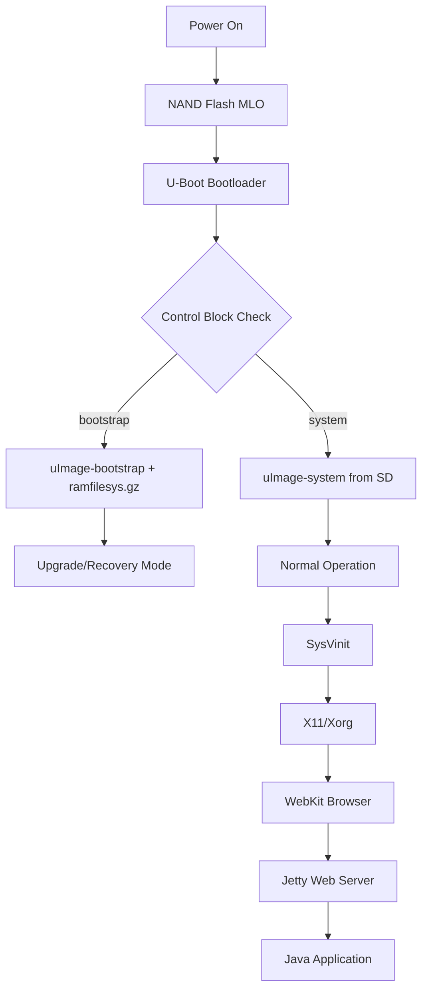
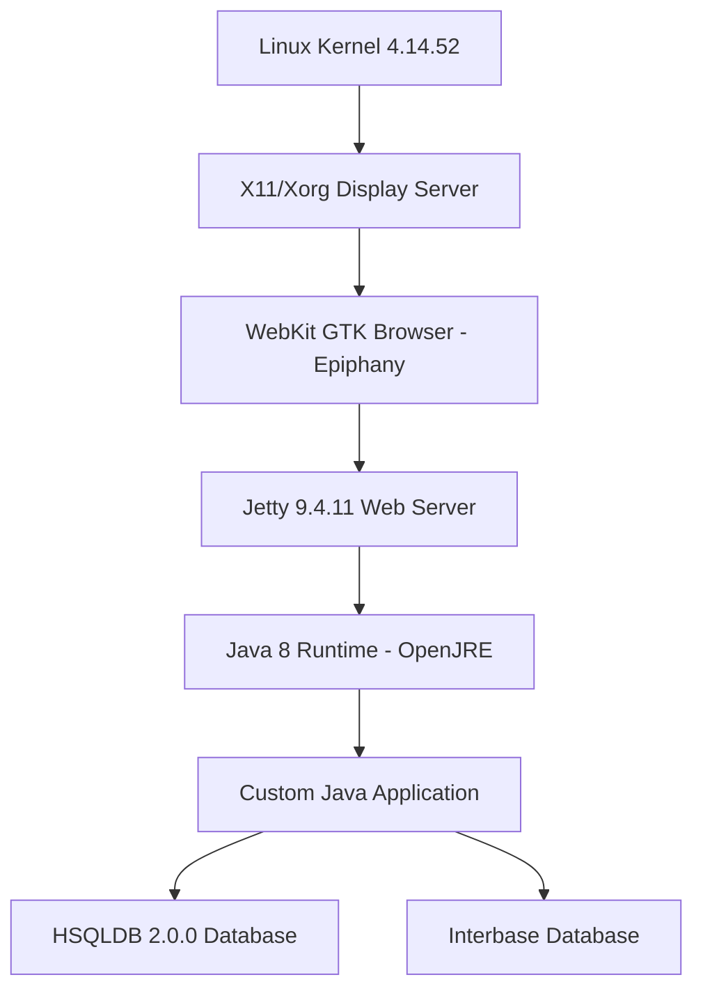

# RoomWizard System Analysis

> **Comprehensive technical analysis of the Steelcase RoomWizard hardware, firmware, and system architecture**

## Table of Contents

1. [Executive Summary](#executive-summary)
2. [System Architecture](#system-architecture)
3. [Hardware Platform](#hardware-platform)
4. [Protection Mechanisms](#protection-mechanisms)
5. [Hardware Control Interfaces](#hardware-control-interfaces)
6. [Application Framework](#application-framework)
7. [USB Subsystem Analysis](#usb-subsystem-analysis)
8. [Safe Modification Strategy](#safe-modification-strategy)
9. [Debugging & Rollback](#debugging--rollback)
10. [Critical Warnings](#critical-warnings)

---

## Executive Summary

The Steelcase RoomWizard is an embedded Linux device based on a Texas Instruments ARM Cortex-A8 SoC (AM335x series). The system uses integrity-based protection mechanisms (MD5 checksums, hardware watchdog, state tracking) rather than cryptographic signing, making modifications possible but requiring careful attention to system requirements.

### Key Findings

- **Hardware:** TI AM335x ARM Cortex-A8 @ 300MHz, 256MB RAM
- **OS:** Embedded Linux (kernel 4.14.52) with SysVinit
- **Protection:** MD5 checksums, 60-second hardware watchdog, boot state tracking
- **Interfaces:** Framebuffer (`/dev/fb0`), touchscreen (`/dev/input/`), LEDs (sysfs)
- **Software Stack:** X11 → WebKit browser → Jetty 9.4.11 → Java 8 → HSQLDB

### Modification Success Requirements

1. Regenerate all MD5 checksums after file changes
2. Feed the hardware watchdog timer (every 30 seconds)
3. Maintain control block state to avoid failure mode
4. Preserve critical services (X11, Jetty, browser, watchdog)
5. Use existing runtimes (Java 8 available, Python requires ARM binaries)

---

## System Architecture

### Boot Sequence


```mermaid
graph TB
    A[Power On] --> B[NAND Flash MLO]
    B --> C[U-Boot Bootloader]
    C --> D{Control Block Check}
    D -->|bootstrap| E[uImage-bootstrap + ramfilesys.gz]
    D -->|system| F[uImage-system from SD]
    E --> G[Upgrade/Recovery Mode]
    F --> H[Normal Operation]
    H --> I[SysVinit]
    I --> J[X11/Xorg]
    J --> K[WebKit Browser]
    K --> L[Jetty Web Server]
    L --> M[Java Application]
```

### Boot Process Details

1. **NAND Flash** → MLO (X-Loader) → U-Boot bootloader
2. **Control Block** (`ctrlblock.bin`) determines boot mode:
   - `boot_from=bootstrap`: Loads `uImage-bootstrap` + `ramfilesys.gz` (upgrade/recovery)
   - `boot_from=system`: Loads `uImage-system` from SD root partition (normal operation)
3. **Boot Tracker** (0-2):
   - 0 = Normal operation
   - 1 = Post-upgrade verification
   - 2+ = **FAILURE MODE** - triggers [`fail.sh`](backup_docs/analysis.md)

### Partition Structure

| Partition | Type | Size | Mount Point | Purpose |
|-----------|------|------|-------------|---------|
| p1 | FAT32 | 64MB | `/var/volatile/boot` | Boot files, kernels |
| p2 | ext3 | 256MB | `/home/root/data` | Application data |
| p3 | ext3 | 250MB | `/home/root/log` | System logs |
| p5 | ext3 | 1500MB | `/home/root/backup` | Firmware backup |
| p6 | ext3 | 1024MB | `/` | Root filesystem |

---

## Hardware Platform

### Processor & Memory

- **SoC:** Texas Instruments AM335x (ARM Cortex-A8)
- **CPU:** 300MHz ARM (armv7l architecture)
- **RAM:** 256MB DDR3
- **Storage:** SD card (4-8GB typical)
- **NAND Flash:** Boot loader and recovery

### Display

- **Resolution:** 800x480 pixels (framebuffer)
- **Visible Area:** ~720x420 pixels (bezel obscures ~30-40px on all edges)
- **Technology:** TFT LCD with LED backlight
- **Interface:** Framebuffer (`/dev/fb0`)
- **Color Depth:** 32-bit RGB
- **Backlight Control:** `/sys/class/leds/backlight/brightness` (0-100)

**Screen Safe Area:**
- Applications should keep interactive elements within the visible area
- Use margins of at least 40px from framebuffer edges
- See [`native_games/common/common.h`](native_games/common/common.h) for `LAYOUT_*` macros implementing safe area

### Input

- **Touchscreen:** Resistive touch panel (Panjit panjit_ts)
- **Device:** `/dev/input/touchscreen0` or `/dev/input/event0`
- **Protocol:** Linux input events (evdev)
- **Calibration:** `xinput_calibrator` with config at `/etc/pointercal.xinput`
- **Resolution:** 12-bit coordinates (0-4095), scaled to screen resolution
- **Touch Type:** Single-touch only (no multi-touch)
- **Pressure:** Binary (255=pressed, 0=released), no variable pressure

**Touch Coordinate Scaling:**
```c
// Raw to screen coordinates
screen_x = (raw_x * 800) / 4095;
screen_y = (raw_y * 480) / 4095;
```

**Touch Event Order (Critical):**
1. `ABS_X` - X coordinate
2. `ABS_Y` - Y coordinate
3. `BTN_TOUCH` - Press/release event
4. `SYN_REPORT` - Event synchronization

**Important:** Coordinates must be captured BEFORE the press event. See [`native_games/common/touch_input.c`](native_games/common/touch_input.c) for reference implementation.

**Touch Accuracy:**
- Center: ~3px accuracy
- Corners: ~14-27px error (resistive touchscreen characteristic)
- Calibration can improve corner accuracy

### Indicators

- **Red LED:** Status indicator (`/sys/class/leds/red_led/brightness`)
- **Green LED:** Status indicator (`/sys/class/leds/green_led/brightness`)
- **Range:** 0-100 (percentage brightness)

### Audio

- **Codec:** Texas Instruments TWL4030 (OMAP companion chip), HiFi DAC
- **ALSA Card:** `rw20`, card 0 device 0 (`hw:0,0`)
- **OSS Compat:** `/dev/dsp`, `/dev/audio`, `/dev/mixer` (ALSA OSS shim)
- **Speaker:** SPKR1 on PCB driven by TWL4030 HandsfreeL/R class-D amplifier
- **Amp Enable:** GPIO12 (sysfs) — must be driven **HIGH** to unmute the speaker
- **Native rate:** 48000 Hz (TWL4030 HiFi); OSS shim SRCs from app rate automatically
- **App rates:** ScummVM uses 22050 Hz (halves OPL synthesis CPU load); native games use 44100 Hz
- **Channels:** Stereo out (mono speaker physically; both channels drive the same SPKR1 via HandsfreeL/R bridge)
- **Volume note:** The small PCB speaker distorts at full-scale DAC output. ScummVM applies 50% (−6 dB) software attenuation post-mix. Native games should do the same.
- **ALSA HW period:** ~22,317 frames / **~506 ms** at 44100 Hz — see OSS usage note below

**Working mixer signal path:**
```
DAC1 (44100 → 48000 SRC) → HandsfreeL Mux (AudioL1) → HandsfreeL Switch
                          → HandsfreeR Mux (AudioR1) → HandsfreeR Switch
                                                        → SPKR1
```

**Volume controls:**
- `DAC1 Digital Fine Playback Volume` — 0..63, use 63
- `DAC1 Digital Coarse Playback Volume` — 0..2, use 0 (0 dB)
- `PreDriv Playback Volume` — 0..3 (0 mute, 3 = +6 dB)

**Boot initialisation script:** `/etc/init.d/audio-enable` (→ `rc5.d/S29audio-enable`)
```bash
echo out > /sys/class/gpio/gpio12/direction
echo 1 > /sys/class/gpio/gpio12/value
amixer -c 0 cset name="HandsfreeL Mux" AudioL1
amixer -c 0 cset name="HandsfreeR Mux" AudioR1
amixer -c 0 cset name="HandsfreeL Switch" on
amixer -c 0 cset name="HandsfreeR Switch" on
```
ALSA DAC volumes are persisted via `alsactl store` → `/var/lib/alsa/asound.state` and restored by `/etc/init.d/alsa-state` at boot.

**⚠ Critical OSS usage notes:**

1. **ALSA HW period stall:** The TWL4030 ALSA driver has a hardware period of ~22,317 frames (~506 ms). A blocking `write()` to `/dev/dsp` stalls for the full ALSA HW period after the OSS ring fills — not the OSS fragment duration (~93 ms). This causes 185 ms of audio followed by 321 ms of silence, repeating ("bru-bru-bru-KLICK" artifact). **Always open `/dev/dsp` with `O_NONBLOCK`** and handle `EAGAIN` with a short sleep (~5 ms). The OSS software ring drains at the hardware sample rate continuously regardless of the ALSA period size.  
Diagnosed via `native_games/tests/oss_diag.c`.

2. **Speaker distortion:** The small PCB speaker distorts at full DAC output. Apply software volume attenuation (e.g. 50% via `>>1` on int16 samples) before writing to `/dev/dsp`.

3. **32-bit overflow with timeval:** On 32-bit ARM (`sizeof(long) == 4`), never compute `(now.tv_sec - epoch_0) * 1000000L` — the multiplication overflows. Always initialize timing baselines to the current time, not epoch zero.

### Connectivity

- **Ethernet:** 10/100 Mbps RJ45
- **USB:** Micro USB (device/gadget mode only - see [USB Subsystem](#usb-subsystem-analysis))
- **Serial:** UART on ttyO1 (115200 baud) for debugging

---

## Protection Mechanisms

### 1. Hardware Watchdog Timer

**Critical:** The system has a 60-second hardware watchdog that will reset the device if not fed regularly.

- **Device:** `/dev/watchdog`
- **Timeout:** 60 seconds
- **Configuration:** `/etc/watchdog.conf`
- **Feed Interval:** 30 seconds (safe margin)
- **Daemon:** `/usr/sbin/watchdog` or custom feeder

**Feeding the Watchdog:**
```bash
# Simple watchdog feeder
while true; do
    echo 1 > /dev/watchdog
    sleep 30
done &
```

**Consequences of Not Feeding:**
- System automatically resets after 60 seconds
- All unsaved data lost
- Boot tracker may increment (leading to failure mode)

### 2. MD5 Integrity Verification (Triple-Layer)

The system uses three layers of MD5 checksum verification:

#### Layer 1: Upgrade Package Checksum
```bash
# Verifies the entire upgrade package
md5sum -c upgrade.cpio.gz.md5
```

#### Layer 2: Individual Partition Image Checksums
```bash
# Each partition image has its own MD5 file
sd_rootfs_part.img.md5
sd_boot_archive.tar.gz.md5
sd_data_part.img.md5
sd_log_part.img.md5
```

#### Layer 3: Post-Write Verification
- After writing partitions with `dd`, system reads back data
- Compares MD5 of written data with expected checksum
- **Retry Logic:** Up to 3 attempts per partition
- **Failure:** Exits with error code 6 if all retries fail

**Regenerating Checksums After Modifications:**
```bash
cd /path/to/modified/images
for file in *.img *.gz *.bin; do
    md5sum "$file" > "${file}.md5"
done
```

### 3. Control Block State Machine

**Binary:** `/opt/sbin/ctrlblk`  
**Storage:** Boot partition as `ctrlblock.bin`

**Parameters:**
- `boot_from`: `bootstrap` | `system`
- `upgrade_type`: `factory` | `field`
- `boot_tracker`: 0-2 (failure counter)
- `fwversion`: Firmware version string

**Failure Detection Logic:**
```bash
if [ $TRACKER -ge 2 ]; then
    echo "Detected failure mode on boot"
    start_fail_script  # Triggers recovery/factory reset
    exit 1
fi
```

**Boot Tracker Behavior:**
- Incremented on each boot attempt
- Reset to 0 on successful boot
- If ≥ 2, system enters failure mode and triggers recovery

### 4. Boot Verification Chain

- NAND boot redirect written to **4 redundant locations** with OOB data
- Each write verified by reading back and binary comparison (`cmp`)
- No cryptographic signatures detected
- Strict binary matching enforced

---

## Hardware Control Interfaces

### LED Control (Multi-Color Indicator)

**Sysfs GPIO/LED Interface:**
```bash
/sys/class/leds/red_led/brightness      # 0-100
/sys/class/leds/green_led/brightness    # 0-100
/sys/class/leds/backlight/brightness    # 0-100
```

**Control Scripts:**
- `/opt/sbin/backlight/setbacklight.sh`
- `/opt/sbin/brightness.sh`
- `/opt/sbin/conc_leds.sh`

**Example Usage:**
```bash
# Set red LED to 50%
echo 50 > /sys/class/leds/red_led/brightness

# Set green LED to full brightness
echo 100 > /sys/class/leds/green_led/brightness

# Turn off backlight (screen blank)
echo 0 > /sys/class/leds/backlight/brightness
```

See [`native_games/common/hardware.c`](native_games/common/hardware.c) for C implementation.

### Touchscreen Input

**Device Nodes:**
```bash
/dev/input/touchscreen0    # Primary touchscreen device
/dev/input/event*          # Input event devices
```

**Input Stack:**
```
Hardware → Kernel evdev → libinput → X11/Xorg → WebKit browser
```

**Calibration:**
- Tool: `xinput_calibrator`
- Config: `/etc/pointercal.xinput`
- Auto-calibration: `/usr/bin/xinput_calibrator_once.sh`

See [`native_games/common/touch_input.c`](native_games/common/touch_input.c) for C implementation.

### Display/Framebuffer

**Device:**
```bash
/dev/fb0                   # Framebuffer device
DISPLAY=:0                 # X11 display server
```

**X11 Configuration:**
```bash
# Started by /etc/init.d/x11
Xorg -br -nolisten tcp -nocursor -pn -dpms vt8 :0
```

**Framebuffer Specifications:**
- Resolution: 800x480
- Color depth: 32-bit (RGBA)
- Memory-mapped for direct access
- Double buffering supported

---

## Application Framework

### Software Stack


```mermaid
graph TB
    A[Linux Kernel 4.14.52] --> B[X11/Xorg Display Server]
    B --> C[WebKit GTK Browser - Epiphany]
    C --> D[Jetty 9.4.11 Web Server]
    D --> E[Java 8 Runtime - OpenJRE]
    E --> F[Custom Java Application]
    F --> G[HSQLDB 2.0.0 Database]
    F --> H[Interbase Database]
```

### Key Components

#### Display Server
- **X11/Xorg:** Started by `/etc/init.d/x11`
- **Display:** `:0`
- **Configuration:** Minimal, optimized for embedded use

#### Browser
- **Type:** WebKit-based (Epiphany/GNOME Web)
- **Binary:** `/usr/bin/browser` (likely symlink to epiphany)
- **Home Page:** `http://localhost/frontpanel/pages/index.html`
- **Logs:** `/var/log/browser.out`, `/var/log/browser.err`

#### Web Server
- **Type:** Jetty 9.4.11
- **Location:** `/opt/jetty-9-4-11/`
- **Purpose:** Serves JSP/Servlet application
- **Init Script:** `/etc/init.d/webserver`

#### Java Runtime
- **Version:** OpenJRE 8
- **Location:** `/opt/openjre-8/`
- **Usage:** Runs Jetty and custom applications

#### Databases
- **HSQLDB 2.0.0:** `/home/root/data/rwdb/` (room booking data)
- **Interbase:** `/opt/interbase/data/websign.gdb` (legacy)

---

## USB Subsystem Analysis

### USB Port Configuration

The micro USB port is configured in **USB Device/Gadget mode only** and is **not capable of hosting standard USB peripherals** like keyboards and mice.

### Hardware Architecture

**SoC:** TI AM335x with MUSB dual-role USB controller

**Built-in Kernel Modules:**
- `kernel/drivers/usb/musb/musb_hdrc.ko` - MUSB dual-role USB controller
- `kernel/drivers/usb/musb/omap2430.ko` - OMAP/AM335x USB platform driver
- `kernel/drivers/usb/phy/phy-am335x-control.ko` - AM335x USB PHY control
- `kernel/drivers/usb/phy/phy-am335x.ko` - AM335x USB PHY driver
- `kernel/drivers/usb/core/usbcore.ko` - USB core subsystem

### USB Gadget/Device Mode

**Configuration:** USB Ethernet Gadget (g_ether/RNDIS)

From `/etc/network/interfaces`:
```bash
# Ethernet/RNDIS gadget (g_ether)
#iface usb0 inet static
#	address 192.168.7.2
#	netmask 255.255.255.0
#	network 192.168.7.0
#	gateway 192.168.7.1
```

**Purpose:**
- Firmware updates via USB
- Debugging/development access
- Configuration management
- Device appears as network adapter when connected to PC

### Why USB Peripherals Don't Work

#### Software Reasons:
1. **USB Controller Mode:** MUSB controller configured in peripheral/device mode, not host mode
2. **No Host Drivers:** USB host controller drivers not loaded at boot
3. **No HID Support Active:** While HID drivers exist in kernel, they're not initialized for host operations
4. **Gadget-Only Configuration:** System configured exclusively for USB gadget/device functionality

#### Hardware Considerations:
- AM335x MUSB controller **is capable** of OTG (On-The-Go) operation
- Hardware may lack **ID pin detection** circuitry for automatic host/device switching
- USB port may be **hard-wired** for device mode only
- **No USB power output** (VBUS) circuitry for powering external devices

### Alternative Input Methods

Since USB peripherals are not supported:
- Use **network-based input** (SSH, web interface)
- Implement **touchscreen-based** control interfaces
- Use **serial console** for debugging (ttyO1, 115200 baud)

---

## Safe Modification Strategy

Modifications fail when: MD5 checksums don't match, watchdog times out (60 s), control block tracker reaches ≥2 (failure mode), or service dependencies break.

**Rules:**
1. Regenerate all MD5 checksums after any file change: `for file in *.img *.gz *.bin; do md5sum "$file" > "${file}.md5"; done`
2. Feed watchdog every 30 s — system daemon `/usr/sbin/watchdog` handles this
3. Preserve critical services: `/etc/init.d/watchdog`, `webserver`, `x11`, `browser`
4. Safe to add new init scripts at `/etc/rc5.d/S99*`
5. Java 8 runtime exists at `/opt/openjre-8/`; Python requires ARM cross-compiled binaries

---

## Debugging & Rollback

- **Serial console:** UART ttyO1, 115200 baud, 3.3V TTL adapter
- **Logs:** `/var/log/` (system), `/home/root/log/` (app), `/var/log/browser.{out,err}`, `/var/log/jettystart`
- **Rollback:** If boot_tracker ≥ 2 → failure mode → `/opt/sbin/fail.sh` runs recovery. Manual: `dd if=original_backup.img of=/dev/sdX bs=4M`

---

## Critical Warnings

- **Never** modify `ctrlblock.bin`, bootloader (`mlo`, `u-boot-sd.bin`), or partition sizes without JTAG recovery
- **Always** regenerate MD5 checksums, feed watchdog, keep backup of original SD card image

---

## Related Documentation

- [Native Games](native_games/README.md)
- [ScummVM Backend](scummvm-roomwizard/README.md)
- [System Setup](SYSTEM_SETUP.md)
