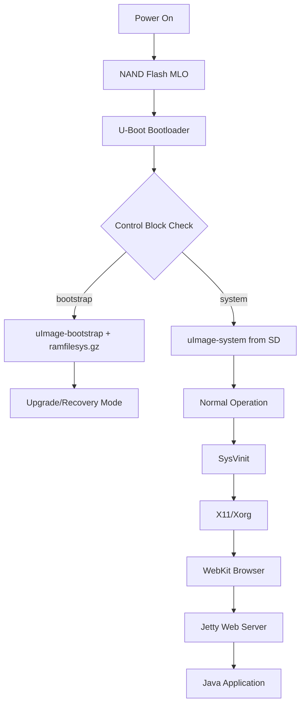
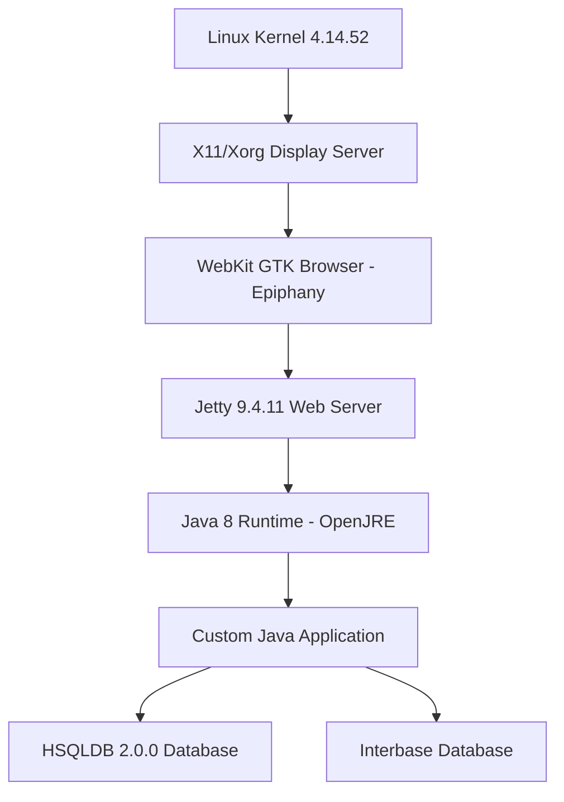

# RoomWizard System Analysis

> **Comprehensive technical analysis of the Steelcase RoomWizard hardware, firmware, and system architecture**

## Table of Contents

1. [Executive Summary](#executive-summary)
2. [System Architecture](#system-architecture)
3. [Hardware Platform](#hardware-platform)
4. [Protection Mechanisms](#protection-mechanisms)
5. [Hardware Control Interfaces](#hardware-control-interfaces)
6. [Application Framework](#application-framework)
7. [USB Subsystem Analysis](#usb-subsystem-analysis)
8. [Extended Hardware Discovery](#extended-hardware-discovery)
9. [Live System Analysis](#live-system-analysis)
10. [Safe Modification Strategy](#safe-modification-strategy)
11. [ARM Cortex-A8 CPU Limitations & Cross-Compilation](#arm-cortex-a8-cpu-limitations--cross-compilation)
12. [Debugging & Rollback](#debugging--rollback)
13. [Critical Warnings](#critical-warnings)
14. [SoC Identification (Verified)](#soc-identification-verified)
15. [Display Stack: omapfb / omapdss](#display-stack-omapfb--omapdss)
16. [Boot Chain & U-Boot Environment (Verified)](#boot-chain--u-boot-environment-verified)
17. [Kernel Upgrade Assessment](#kernel-upgrade-assessment)
18. [Unused Hardware & Untapped Capabilities](#unused-hardware--untapped-capabilities)

---

## Executive Summary

The Steelcase RoomWizard is an embedded Linux device based on a Texas Instruments **OMAP3503** ARM Cortex-A8 SoC. The system uses integrity-based protection mechanisms (MD5 checksums, hardware watchdog, state tracking) rather than cryptographic signing, making modifications possible but requiring careful attention to system requirements.

### Key Findings

- **Hardware:** TI OMAP3503 ARM Cortex-A8 @ 600MHz (dynamically scaled from 300MHz base), 234MB RAM. **No SGX GPU, no IVA DSP** (OMAP3503 is the ARM-only member of the family).
- **OS:** Embedded Linux (kernel 4.14.52) with SysVinit
- **Protection:** MD5 checksums, 60-second hardware watchdog, Steelcase software watchdog (cron-based, must disable), boot state tracking
- **Interfaces:** Framebuffer (`/dev/fb0`), touchscreen (`/dev/input/`), LEDs (sysfs)
- **Software Stack:** X11 → WebKit browser → Jetty 9.4.11 → Java 8 → HSQLDB
- **USB:** Host mode enabled via runtime kernel patching; supports keyboards, mice, and game controllers (Xbox via cross-compiled xpad module). DTB binary-patched to raise USB bus power budget from 100mA to 500mA for direct-connect devices.
- **GPIO:** 6 GPIO banks (192 pins), TWL4030 PMIC with 18 additional GPIO pins
- **Wireless:** No WiFi or Bluetooth. An **802.15.4 / ZigBee radio on UART3** is referenced by vendor factory-test tooling — presence on this board is unconfirmed, see [Unused Hardware](#unused-hardware--untapped-capabilities)
- **Display stack:** legacy **omapfb + omapdss** (no DRM/KMS — `/dev/dri` does not exist). Three DSS overlay planes with a hardware scaler are present and unused.

### Modification Success Requirements

1. Regenerate all MD5 checksums after file changes
2. The hardware watchdog timer is fed by `/usr/sbin/watchdog` daemon (acceptable to keep)
3. **Disable the Steelcase software watchdog** (cron-based `watchdog.sh` that reboots when Jetty/HSQLDB absent)
4. Maintain control block state to avoid failure mode
5. Disable non-essential Steelcase services and cron jobs (see [Game Mode Optimization](#game-mode-optimization))
6. Use existing runtimes (Java 8 available, Python requires ARM binaries)

---

## System Architecture

### Boot Sequence


```mermaid
graph TB
    A[Power On] --> B[NAND Flash MLO]
    B --> C[U-Boot Bootloader]
    C --> D{Control Block Check}
    D -->|bootstrap| E[uImage-bootstrap + ramfilesys.gz]
    D -->|system| F[uImage-system from SD]
    E --> G[Upgrade/Recovery Mode]
    F --> H[Normal Operation]
    H --> I[SysVinit]
    I --> J[X11/Xorg]
    J --> K[WebKit Browser]
    K --> L[Jetty Web Server]
    L --> M[Java Application]
```

### Boot Process Details

1. **NAND** holds only a 12 KB Nuvation boot redirector (`mtd0`) that hands off to SD.
   `mlo` and `u-boot.bin` live on **SD partition 1**, not in NAND.
2. **Control Block** (`ctrlblock.bin`, 28 bytes on FAT32 p1) selects the boot mode:
   - `boot_from=bootstrap`: loads `uImage-bootstrap` + `ramfilesys.gz` (upgrade/recovery)
   - `boot_from=system`: loads `uImage-system` (normal operation)
3. **Boot Tracker** is read by U-Boot's `cb_getinfo` and written only by userspace
   (`/opt/sbin/ctrlblk`), and only on the boot immediately after a firmware upgrade.
   A kernel that fails to boot does **not** increment it and does **not** trigger recovery.

See [Boot Chain & U-Boot Environment (Verified)](#boot-chain--u-boot-environment-verified)
for the device-verified detail.

### Partition Structure

| Partition | Type | Size | Mount Point | Purpose |
|-----------|------|------|-------------|---------|
| p1 | FAT32 | 70.6MB | `/var/volatile/boot` | `mlo`, `u-boot.bin`, `uImage-system`, `ctrlblock.bin`. The DTB is appended **inside** `uImage-system` (`CONFIG_ARM_APPENDED_DTB=y`) — there is no separate `.dtb` file. |
| p2 | ext3 | 256MB | `/home/root/data` | Application data |
| p3 | ext3 | 250MB | `/home/root/log` | System logs |
| p5 | ext3 | 1500MB | `/home/root/backup` | Firmware backup |
| p6 | ext3 | ~981MB | `/` | Root filesystem (U-Boot passes `rootfstype=ext4`; the ext4 driver mounts the ext3 filesystem — do **not** reformat as ext4) |

---

## Hardware Platform

### Processor & Memory

- **SoC:** Texas Instruments **OMAP3503 ES3.1.2**, GP (general-purpose, non-secure) device — OMAP34xx family, ARM Cortex-A8
- **No GPU, no DSP:** OMAP3503 omits both the SGX530 3D core and the IVA2 DSP. All rendering is software; the DSS overlay hardware (below) is the only graphics acceleration available.
- **CPU:** 300MHz base, 600MHz current (armv7l architecture, dynamic frequency scaling)
- **BogoMIPS:** 594.73
- **Features:** NEON SIMD, VFP, Thumb, TLS
- **RAM:** 234MB DDR3 (256MB total, ~22MB reserved by system)
- **Storage:** SD card (3.7GB typical)
- **NAND Flash:** Boot loader and recovery

**Verified Measurements (Live System):**
- Current CPU frequency: 600 MHz (cpufreq scaling active)
- Total RAM: 239,904 KB (234 MB)
- Available RAM: 182 MB (76% free under game mode)
- Load average: 0.00 (idle)

### Display

- **Resolution:** 800x480 pixels (framebuffer)
- **Visible Area:** ~720x420 pixels (bezel obscures ~30-40px on all edges)
- **Technology:** TFT LCD with LED backlight
- **Interface:** Framebuffer (`/dev/fb0`)
- **Color Depth:** 32-bit RGB (XRGB8888) by default. NOTE: bpp is set at runtime by whichever app is running — native menu/games/tools force **32bpp** (`fb_set_bpp(...,32)`), while ScummVM and the VNC remote session switch to **16bpp RGB565** to halve write bandwidth. A `cat /dev/fb0` dump is one frame; decode it at the bpp of the app that was running (`fb565_to_png.py` defaults to 32bpp, `--bpp 16` for ScummVM/VNC).
- **Backlight Control:** `/sys/class/leds/backlight/brightness` (0-100)

**Screen Safe Area:**
- Applications should keep interactive elements within the visible area
- Use margins of at least 40px from framebuffer edges
- See [`native_apps/common/common.h`](native_apps/common/common.h) for `LAYOUT_*` macros implementing safe area

### Input

- **Touchscreen:** **Projected-capacitive** panel, Panjit controller on I2C bus 2 at address `0x03` (driver `panjit_ts`, out-of-tree).
- **Device:** `/dev/input/touchscreen0` or `/dev/input/event0`
- **Protocol:** Linux input events (evdev)
- **Calibration:** native stack uses `/etc/touch_calibration.conf` (see below), **not** the stock `xinput_calibrator`/`/etc/pointercal.xinput` (that is the removed Steelcase X11 stack)
- **Resolution:** 12-bit coordinates (0-4095), scaled to screen resolution
- **Touch Type:** Single-touch **as exposed by the kernel driver**. The `panjit_ts` driver reports only `ABS_X`/`ABS_Y`/`BTN_TOUCH` with no MT slots. The **controller itself is 2-point multi-touch with on-chip gesture recognition** — the vendor factory-test binary (`opt/pv02/pv02_app`) reads `Num_Touch` plus two coordinate pairs and tests pinch-zoom, two-finger pan and multi-touch click. Reaching it requires bypassing the driver and talking to the chip on `/dev/i2c-2`. See [Unused Hardware](#unused-hardware--untapped-capabilities).
- **Pressure:** `ABS_PRESSURE` is declared in the device's input capabilities (`capabilities/abs = 1000003` → bits 0, 1, 24) but is discarded by [`native_apps/common/touch_input.c`](native_apps/common/touch_input.c). Whether the value actually varies is untested — see `native_apps/hardware_test/pressure_test.c` (written for this, never run to a conclusion).

**Touch Coordinate Scaling:**
```c
// Per-axis LINEAR map from the calibrated raw range to the full screen.
// Defaults to the EVIOCGABS hardware range (0..4095 on this panel).
screen_x = (raw_x - raw_min_x) * 799 / (raw_max_x - raw_min_x);
screen_y = (raw_y - raw_min_y) * 479 / (raw_max_y - raw_min_y);
```

The panel is linear (verified: a traced border comes out a straight-edged rectangle,
no keystone/shear), so scale+offset per axis is sufficient. There is no affine, no
bilinear corner correction, and bezel margins are NOT applied to touch coordinates.

**Calibration file** `/etc/touch_calibration.conf` (loaded automatically by `touch_init()`):

- Line 1: `raw min_x max_x min_y max_y` — the calibrated raw range, mapped linearly to the full screen.
- Line 2: `top bottom left right` — UI margins for drawing/centering only (never move a touch).

`unified_calibrate` / Device Tools → CALIBRATION captures this by tapping 9 crosshairs and
least-squares fitting a line per axis (extrapolated to the true edges).

**Touch Event Order (Critical):**
1. `ABS_X` - X coordinate
2. `ABS_Y` - Y coordinate
3. `BTN_TOUCH` - Press/release event
4. `SYN_REPORT` - Event synchronization

**Important:** Coordinates must be captured BEFORE the press event. See [`native_apps/common/touch_input.c`](native_apps/common/touch_input.c) for reference implementation.

**Touch Accuracy:**
- Center: ~3px accuracy
- Corners: ~14-27px error (panel edge non-linearity)
- Calibration can improve corner accuracy

### USB Input Devices

USB keyboards, mice, and game controllers are supported via the USB host mode subsystem. A Micro USB OTG adapter and powered USB hub are required. All input is handled via evdev (`/dev/input/event0`–`event31`). Native apps use [`gamepad.c`](native_apps/common/gamepad.c); ScummVM has an independent evdev implementation with the same fixes.

**Analog stick calibration:** Center is computed as `(axis_min + axis_max) / 2` (not trusting the kernel-reported value). Default dead zone: 25%, configurable via `/etc/input_config.conf`.

**Keyboard Support:**
- Detected automatically by the built-in `usbhid` kernel driver (HID class `03`)
- Appears as `/dev/input/eventX` with `EV_KEY` capabilities
- The [`usb_test`](native_apps/usb_test/usb_test.c) app classifies devices with ≥20 letter keys (A-Z) as keyboards
- Standard HID keyboards work out-of-the-box once USB host mode is enabled

**Mouse/Touchpad Support:**
- Detected automatically by the built-in `usbhid` kernel driver
- Appears as `/dev/input/eventX` with `EV_REL` (relative X/Y) + `BTN_LEFT` capabilities
- Touchpads with integrated keyboards (combo devices) create multiple event nodes — one for keyboard, one for mouse
- The `usb_test` app classifies devices with `REL_X`/`REL_Y` + `BTN_LEFT` as mice

**Game Controller Support:**
- **Xbox 360 controllers** (`045e:028e`) require the `xpad` kernel module (cross-compiled and loaded separately)
- The controller uses vendor-specific USB class (`ff`), NOT standard HID — the built-in `usbhid` driver cannot claim it
- Three kernel modules must be loaded: `ff-memless.ko` → `joydev.ko` → `xpad.ko`
- After loading, the controller appears as `/dev/input/eventX` with `EV_ABS` (sticks/triggers) + `EV_KEY` (buttons) + `EV_FF` (force feedback)
- Also creates `/dev/input/jsX` (joystick interface)
- The `usb_test` app classifies devices with `ABS_X`/`ABS_Y` + `BTN_GAMEPAD`/`BTN_SOUTH` as gamepads
- Standard HID gamepads (non-Xbox) should work with the built-in `usbhid` driver without additional modules

**USB Hub Support:**
- External USB hubs are supported (tested with keyboard/touchpad combo that includes a built-in hub)
- Devices connected through hubs enumerate normally
- Multiple simultaneous USB devices are supported (keyboard + mouse + controller via hub)

**Boot Persistence:**
- USB host mode: `/etc/init.d/usb-host` (S90) — re-applies MUSB DMA patch
- Controller modules: `/etc/init.d/S89xpad-modules` (S89) — loads kernel modules
- Both run automatically on every boot

**See:** [`usb_host/README.md`](usb_host/README.md) for complete technical details on USB host mode and controller support.

### Indicators

- **Red LED:** Status indicator (`/sys/class/leds/red_led/brightness`)
- **Green LED:** Status indicator (`/sys/class/leds/green_led/brightness`)
- **Range:** 0-100 (percentage brightness)

### Audio

- **Codec:** Texas Instruments TWL4030 (OMAP companion chip), HiFi DAC
- **ALSA Card:** `rw20`, card 0 device 0 (`hw:0,0`)
- **OSS Compat:** `/dev/dsp`, `/dev/audio`, `/dev/mixer` (ALSA OSS shim)
- **Speaker:** SPKR1 on PCB driven by TWL4030 HandsfreeL/R class-D amplifier
- **Amp Enable:** GPIO12 (sysfs) — must be driven **HIGH** to unmute the speaker
- **Native rate:** 48000 Hz (TWL4030 HiFi); OSS shim SRCs from app rate automatically
- **App rates:** ScummVM uses 22050 Hz (halves OPL synthesis CPU load); native games use 44100 Hz
- **Channels:** Stereo out (mono speaker physically; both channels drive the same SPKR1 via HandsfreeL/R bridge)
- **Volume note:** The small PCB speaker distorts at full-scale DAC output. ScummVM applies 50% (−6 dB) software attenuation post-mix. Native apps should do the same.
- **ALSA HW period:** ~22,317 frames / **~506 ms** at 44100 Hz — see OSS usage note below

**Working mixer signal path:**
```
DAC1 (44100 → 48000 SRC) → HandsfreeL Mux (AudioL1) → HandsfreeL Switch
                          → HandsfreeR Mux (AudioR1) → HandsfreeR Switch
                                                        → SPKR1
```

**Volume controls:**
- `DAC1 Digital Fine Playback Volume` — 0..63, use 63
- `DAC1 Digital Coarse Playback Volume` — 0..2, use 0 (0 dB)
- `PreDriv Playback Volume` — 0..3 (0 mute, 3 = +6 dB)

**Boot initialisation script:** `/etc/init.d/audio-enable` (→ `rc5.d/S29audio-enable`)
```bash
echo out > /sys/class/gpio/gpio12/direction
echo 1 > /sys/class/gpio/gpio12/value
amixer -c 0 cset name="HandsfreeL Mux" AudioL1
amixer -c 0 cset name="HandsfreeR Mux" AudioR1
amixer -c 0 cset name="HandsfreeL Switch" on
amixer -c 0 cset name="HandsfreeR Switch" on
```
ALSA DAC volumes are persisted via `alsactl store` → `/var/lib/alsa/asound.state` and restored by `/etc/init.d/alsa-state` at boot.

**⚠ Critical OSS usage notes:**

1. **ALSA HW period stall:** The TWL4030 ALSA driver has a hardware period of ~22,317 frames (~506 ms). A blocking `write()` to `/dev/dsp` stalls for the full ALSA HW period after the OSS ring fills — not the OSS fragment duration (~93 ms). This causes 185 ms of audio followed by 321 ms of silence, repeating ("bru-bru-bru-KLICK" artifact). **Always open `/dev/dsp` with `O_NONBLOCK`** and handle `EAGAIN` with a short sleep (~5 ms). The OSS software ring drains at the hardware sample rate continuously regardless of the ALSA period size.  
Diagnosed via `native_apps/tests/oss_diag.c`.

2. **Speaker distortion:** The small PCB speaker distorts at full DAC output. Apply software volume attenuation (e.g. 50% via `>>1` on int16 samples) before writing to `/dev/dsp`.

3. **32-bit overflow with timeval:** On 32-bit ARM (`sizeof(long) == 4`), never compute `(now.tv_sec - epoch_0) * 1000000L` — the multiplication overflows. Always initialize timing baselines to the current time, not epoch zero.

4. **ALSA OSS shim ioctl bugs (Linux 4.14.52, TWL4030):** The ALSA OSS compatibility layer has known bugs that silently corrupt audio configuration:
   - **`SNDCTL_DSP_STEREO` silently ignored:** Returns `rc=0, stereo=1` (success) but the device stays mono. Verified with `native_apps/tests/ch_test.c`.
   - **`SNDCTL_DSP_SPEED` may reset format and/or channels** after they've been set.
   - **`SNDCTL_DSP_SETFMT` may reset speed** after it's been set.
   - **Set-ioctl output values may be unreliable:** The value written back to the variable may not reflect the actual device state.

   **Workaround:** (1) Set SPEED first, then FMT, then CHANNELS (so FMT/CH survive any SPEED-triggered reset). (2) Read back actual device state with `SOUND_PCM_READ_RATE`, `SOUND_PCM_READ_BITS`, `SOUND_PCM_READ_CHANNELS`. (3) Use the read-back rate for `_outputRate` — if `_outputRate` doesn't match the real playback rate, OPL sample-counting produces music at the wrong tempo. See [`scummvm-roomwizard/backend-files/oss-mixer.cpp`](scummvm-roomwizard/backend-files/oss-mixer.cpp) for the working implementation.

   **Evidence:** At 22050 Hz, music played at half speed. Switching to 48000 Hz made it proportionally worse (~4×), consistent with `_outputRate` not matching the real device rate.

### Connectivity

- **Ethernet:** 10/100 Mbps RJ45
- **USB:** Micro USB OTG (host mode enabled — keyboards, mice, game controllers supported; see [USB Subsystem](#usb-subsystem-analysis) and [`usb_host/README.md`](usb_host/README.md))
- **Serial:** UART on ttyO1 (115200 baud) for debugging

---

## Protection Mechanisms

### 1. Watchdog Systems (Hardware + Software)

The RoomWizard has **two independent watchdog systems** that must be understood:

#### 1a. Hardware Watchdog (OMAP WDT)

The OMAP3503 SoC has a 60-second hardware watchdog timer (OMAP WDT2).  Once opened, it **must** be fed continuously or the device hard-resets.

- **Device:** `/dev/watchdog` (`/dev/watchdog0`, `/dev/watchdog1`)
- **Timeout:** 60 seconds
- **Daemon:** `/usr/sbin/watchdog` (standard Linux watchdog daemon)
- **Config:** `/etc/watchdog.conf` — only feeds the timer; `test-binary` and `repair-binary` are commented out
- **Enable flag:** `/etc/default/watchdog` → `run_watchdog=1`
- **Feed interval:** Every ~1 second (daemon default)

The hardware watchdog is acceptable to keep running.  The daemon is low-overhead and prevents hard-resets.

#### 1b. Steelcase Software Watchdog (cron-based) — **MUST DISABLE**

Steelcase added a **separate** application-level watchdog that runs via cron **every 5 minutes**:

```
*/5 * * * * /opt/sbin/watchdog/watchdog.sh
```

**How it works:**
1. `watchdog.sh` calls `watchdog_test.sh`
2. `watchdog_test.sh` checks: HSQLDB running? Jetty running? Browser running? Browser log fresh?
3. If any check fails → exit code 100-112
4. `watchdog.sh` calls `watchdog_repair.sh` with the error code
5. If repair fails → **`/sbin/reboot`**

**Grace period:** After the first failure, `watchdog_repair.sh` enters a grace period (~65 minutes of "repeat failure in grace period" messages).  After the grace period expires, it attempts a database restart.  When that fails, it reboots.

**Bypass mechanism:** `watchdog_test.sh` has a built-in bypass:
```bash
if [ ! -f /var/watchdog_test ] && [ ! -f /var/watchdog_test_checkmem ]; then
    # Only perform application level checks when the state file is there
```
Creating `/var/watchdog_test` causes the test to skip all checks and exit 0.

**Disabling (done by `setup-device.sh <ip>`):**
1. Creates `/var/watchdog_test` bypass file
2. Comments out the cron job in root's crontab
3. Original crontab backed up to `/var/crontab.steelcase.bak`

**Consequences of NOT disabling:**
- Device reboots every ~70 minutes when Steelcase services are absent (game mode)
- Reboot cycle: test fails → grace period (~65 min) → repair fails → reboot

### 2. MD5 Integrity Verification (Triple-Layer)

The system uses three layers of MD5 checksum verification:

#### Layer 1: Upgrade Package Checksum
```bash
# Verifies the entire upgrade package
md5sum -c upgrade.cpio.gz.md5
```

#### Layer 2: Individual Partition Image Checksums
```bash
# Each partition image has its own MD5 file
sd_rootfs_part.img.md5
sd_boot_archive.tar.gz.md5
sd_data_part.img.md5
sd_log_part.img.md5
```

#### Layer 3: Post-Write Verification
- After writing partitions with `dd`, system reads back data
- Compares MD5 of written data with expected checksum
- **Retry Logic:** Up to 3 attempts per partition
- **Failure:** Exits with error code 6 if all retries fail

**Regenerating Checksums After Modifications:**
```bash
cd /path/to/modified/images
for file in *.img *.gz *.bin; do
    md5sum "$file" > "${file}.md5"
done
```

### 3. Control Block State Machine

**Binary:** `/opt/sbin/ctrlblk`  
**Storage:** Boot partition as `ctrlblock.bin`

**Parameters:**
- `boot_from`: `bootstrap` | `system`
- `upgrade_type`: `factory` | `field`
- `boot_tracker`: 0-2 (failure counter)
- `fwversion`: Firmware version string

**Failure Detection Logic:**
```bash
if [ $TRACKER -ge 2 ]; then
    echo "Detected failure mode on boot"
    start_fail_script  # Triggers recovery/factory reset
    exit 1
fi
```

**Boot Tracker Behaviour (verified):**
- Written only by userspace `/opt/sbin/ctrlblk`, driven by `/etc/init.d/ctrlblk`
- That script acts only when `BOOTMODE=system && TRACKER==1` — i.e. the boot after an upgrade
- U-Boot reads it but never writes it
- `/opt/sbin/fail.sh` does **not exist** on this device; the automatic recovery path is already
  dismantled

### 4. Boot Verification Chain

- The NAND boot redirector occupies `mtd0` @0x0 with one mirror @0x20000; `mtd1`–`mtd5` are blank
- No cryptographic signatures anywhere
- There is **no boot-time MD5 verification of the kernel** — the only integrity gate on
  `uImage-system` is the uImage header + data CRC

---

## Hardware Control Interfaces

### LED Control (Multi-Color Indicator)

**Sysfs GPIO/LED Interface:**
```bash
/sys/class/leds/red_led/brightness      # 0-100
/sys/class/leds/green_led/brightness    # 0-100
/sys/class/leds/backlight/brightness    # 0-100
```

**Control Scripts:**
- `/opt/sbin/backlight/setbacklight.sh`
- `/opt/sbin/brightness.sh`
- `/opt/sbin/conc_leds.sh`

**Example Usage:**
```bash
# Set red LED to 50%
echo 50 > /sys/class/leds/red_led/brightness

# Set green LED to full brightness
echo 100 > /sys/class/leds/green_led/brightness

# Turn off backlight (screen blank)
echo 0 > /sys/class/leds/backlight/brightness
```

See [`native_apps/common/hardware.c`](native_apps/common/hardware.c) for C implementation.

### Touchscreen Input

**Device Nodes:**
```bash
/dev/input/touchscreen0    # Primary touchscreen device
/dev/input/event*          # Input event devices
```

**Input Stack:**
```
Hardware → Kernel evdev → application (direct /dev/input/event* reads)
```

**Calibration:** see [Input](#input) — the native stack uses `/etc/touch_calibration.conf`.
The stock `xinput_calibrator` / `/etc/pointercal.xinput` belong to the removed Steelcase X11
stack and are not used.

See [`native_apps/common/touch_input.c`](native_apps/common/touch_input.c) for C implementation.

### Display/Framebuffer

**Device:**
```bash
/dev/fb0                   # Framebuffer device
DISPLAY=:0                 # X11 display server
```

**X11 Configuration:**
```bash
# Started by /etc/init.d/x11
Xorg -br -nolisten tcp -nocursor -pn -dpms vt8 :0
```

**Framebuffer Specifications:**
- Resolution: 800x480
- Color depth: 32-bit (RGBA)
- Memory-mapped for direct access
- Double buffering supported

---

## Application Framework

### Software Stack


```mermaid
graph TB
    A[Linux Kernel 4.14.52] --> B[X11/Xorg Display Server]
    B --> C[WebKit GTK Browser - Epiphany]
    C --> D[Jetty 9.4.11 Web Server]
    D --> E[Java 8 Runtime - OpenJRE]
    E --> F[Custom Java Application]
    F --> G[HSQLDB 2.0.0 Database]
    F --> H[Interbase Database]
```

### Key Components

#### Display Server
- **X11/Xorg:** Started by `/etc/init.d/x11`
- **Display:** `:0`
- **Configuration:** Minimal, optimized for embedded use

#### Browser
- **Type:** WebKit-based (Epiphany/GNOME Web)
- **Binary:** `/usr/bin/browser` (likely symlink to epiphany)
- **Home Page:** `http://localhost/frontpanel/pages/index.html`
- **Logs:** `/var/log/browser.out`, `/var/log/browser.err`

#### Web Server
- **Type:** Jetty 9.4.11
- **Location:** `/opt/jetty-9-4-11/`
- **Purpose:** Serves JSP/Servlet application
- **Init Script:** `/etc/init.d/webserver`

#### Java Runtime
- **Version:** OpenJRE 8
- **Location:** `/opt/openjre-8/`
- **Usage:** Runs Jetty and custom applications

#### Databases
- **HSQLDB 2.0.0:** `/home/root/data/rwdb/` (room booking data)
- **Interbase:** `/opt/interbase/data/websign.gdb` (legacy)

---

## USB Subsystem Analysis

### Status: ✅ ENABLED — USB Host Mode + Game Controller Support

The micro USB port is functional in USB host mode with support for keyboards, mice, touchpads, and game controllers. A Micro USB OTG adapter + powered USB hub are required.

**Deploy:** `cd usb_host && ./build-and-deploy.sh 192.168.50.73`

### Three Problems Solved

#### Problem 1: USB Host Mode Disabled (MUSB DMA Bug)

The OEM kernel 4.14.52 has `CONFIG_USB_INVENTRA_DMA` and `CONFIG_MUSB_PIO_ONLY` both disabled — making MUSB initialization always fail with "DMA controller not set" (-ENODEV). This is a build configuration defect.

**Solution:** Runtime `/dev/mem` patching of the `omap2430_ops` struct in kernel memory. Noop stub function pointers are written into `dma_init`/`dma_exit` fields, forcing PIO (Programmed I/O) mode fallback. After patching, the MUSB driver rebinds successfully.

#### Problem 2: Game Controllers Not Detected (Missing Joystick Subsystem)

Even with USB host mode working, Xbox 360 controllers (`045e:028e`) appeared in `lsusb` but did NOT create `/dev/input/event*` nodes because:
- `CONFIG_INPUT_JOYSTICK` is not set — entire joystick subsystem absent
- `CONFIG_INPUT_JOYDEV` is not set — no `/dev/input/jsX` interface
- `CONFIG_INPUT_FF_MEMLESS` is not set — force-feedback dependency missing
- The Xbox controller uses vendor-specific USB class (`bInterfaceClass=ff`), not HID class `03` — the `usbhid` driver ignores it

**Solution:** Cross-compiled three kernel modules from matching kernel source (4.14.52) and loaded them at boot:

| Module | Size | Purpose |
|--------|------|---------|
| `ff-memless.ko` | 8.4 KB | Force-feedback memless support (xpad dependency) |
| `joydev.ko` | 19.5 KB | Joystick device interface (`/dev/input/jsX`) |
| `xpad.ko` | 36 KB | Xbox gamepad driver (360, One, etc.) |

The kernel supports loadable modules (`CONFIG_MODULES=y`, `CONFIG_MODULE_FORCE_LOAD=y`, `CONFIG_MODULE_SIG` not set).

#### Problem 3: USB Bus Power Budget Too Low (DTB Patch)

The DTB embedded in `uImage-system` set the MUSB controller's `power` property to `0x32` (100mA), causing devices requiring >100mA (e.g., Xbox 360 controller at 500mA) to be rejected with `"rejected 1 configuration due to insufficient available bus power"` when connected directly without a hub.

**Solution:** Binary-patched the DTB inside `uImage-system`, changing `power` from `0x32` (50 = 100mA) to `0xfa` (250 = 500mA), then recalculated uImage CRC checksums and wrote the patched image back to the FAT32 boot partition (`/dev/mmcblk0p1`). This is a persistent, one-time fix per device image — after re-imaging, the patch must be re-applied.

**Tools:** [`find_dtb.py`](usb_host/find_dtb.py) (locate/extract DTB from uImage), [`patch_dtb.py`](usb_host/patch_dtb.py) (binary-patch power property + recalculate CRCs), [`verify_patch.sh`](usb_host/verify_patch.sh) (verify patch on device).

See [`usb_host/README.md`](usb_host/README.md) for complete DTB patching technical details.

### Verified Working

```
# USB host mode
musb-hdrc musb-hdrc.0.auto: MUSB HDRC host driver
musb-hdrc musb-hdrc.0.auto: new USB bus registered, assigned bus number 1
hub 1-0:1.0: USB hub found

# Keyboard + touchpad combo (through hub)
input: HID 04d9:a088 as .../input3  (USB HID v1.11 Keyboard)
input: HID 04d9:a088 as .../input4  (USB HID v1.11 Mouse)

# Xbox 360 controller (through hub, via xpad driver)
input: Microsoft X-Box 360 pad as .../input5
usbcore: registered new interface driver xpad
```

### Supported USB Device Types

| Device Type | Driver | Kernel Config | Works Out-of-Box |
|-------------|--------|--------------|------------------|
| USB Keyboard | `usbhid` (built-in) | `CONFIG_USB_HID=y` | ✅ Yes |
| USB Mouse | `usbhid` (built-in) | `CONFIG_USB_HID=y` | ✅ Yes |
| USB Touchpad | `usbhid` (built-in) | `CONFIG_USB_HID=y` | ✅ Yes |
| USB Hub | `hub` (built-in) | `CONFIG_USB=y` | ✅ Yes |
| Xbox 360 Controller | `xpad` (module) | `CONFIG_JOYSTICK_XPAD=m` | ❌ Needs modules |
| Xbox One Controller | `xpad` (module) | `CONFIG_JOYSTICK_XPAD=m` | ❌ Needs modules |
| HID Gamepad (generic) | `usbhid` (built-in) | `CONFIG_USB_HID=y` | ✅ Yes (if HID compliant) |

### Hardware Required

| Item | Purpose |
|------|---------|
| Micro USB OTG adapter | Micro-B male → USB-A female |
| Powered USB hub | Port may not supply VBUS power |

### Deployed Files (on device)

| File | Purpose |
|------|---------|
| `/usr/local/bin/devmem_write` | mmap-based /dev/mem read/write tool |
| `/usr/local/bin/enable-usb-host.sh` | MUSB memory patch + driver rebind |
| `/etc/init.d/usb-host` | SysV init wrapper (S90) |
| `/etc/rc5.d/S90usb-host` | Boot persistence symlink |
| `/lib/modules/4.14.52/extra/ff-memless.ko` | Force-feedback module |
| `/lib/modules/4.14.52/extra/joydev.ko` | Joystick device module |
| `/lib/modules/4.14.52/extra/xpad.ko` | Xbox controller driver |
| `/etc/init.d/S89xpad-modules` | Module loader init script (S89) |
| `/etc/rc5.d/S89xpad-modules` | Boot persistence symlink |

### Root Cause Details

See [`usb_host/README.md`](usb_host/README.md) for complete technical details including:
- Memory addresses for MUSB DMA patching
- omap2430_ops struct layout
- Why mmap() works but write() doesn't
- Xbox controller USB descriptor analysis
- Kernel module cross-compilation process
- Failed approaches investigated

---

## Extended Hardware Discovery

### GPIO Controllers (Multiple Banks)

The OMAP3503 SoC provides **6 GPIO banks** (32 pins each) with extensive pin availability:

```
gpiochip0   - GPIO 0-31    (48310000.gpio)
gpiochip32  - GPIO 32-63   (49050000.gpio)
gpiochip64  - GPIO 64-95   (49052000.gpio)
gpiochip96  - GPIO 96-127  (49054000.gpio)
gpiochip128 - GPIO 128-159 (49056000.gpio)
gpiochip160 - GPIO 160-191 (49058000.gpio)
gpiochip490 - TWL4030 GPIO 490-507 (18 pins, twl4030-gpio)
gpiochip508 - GPMC GPIO 508+ (6e000000.gpmc)
```

**Total:** 192 GPIO pins from the OMAP3503 (6 banks x 32) + 18 pins from the TWL4030 PMIC + 4 from the GPMC.

Bank base addresses (verified from the live device tree): `48310000`, `49050000`, `49052000`, `49054000`, `49056000`, `49058000`. These are OMAP3 addresses.

**Currently Exported:**
- `gpio12` - Speaker amplifier enable (OUT, HIGH)

**Development Note:** Additional GPIO pins could be exported for custom hardware interfacing, but requires careful device tree analysis to avoid conflicts.

### I2C Bus Devices

**I2C Bus 1 (48070000.i2c)** - Power management and audio:
- `0x48` - **TWL4030 PMIC** (multi-function device)
- `0x49-0x4b` - Dummy placeholders

**I2C Bus 2 (48072000.i2c)** - Touchscreen:
- `0x03` - **Panjit touchscreen controller**

**TWL4030 PMIC Subsystems:**
1. Audio Codec (twl4030-codec) - HiFi DAC/ADC
2. Battery Charger Interface (twl4030-bci) - AC/USB power detection
3. GPIO Expander (twl4030-gpio) - 18 GPIO pins
4. RTC (twl_rtc) - Real-time clock with battery backup
5. USB Transceiver (twl4030-usb) - USB PHY interface
6. MADC - Multi-channel ADC for monitoring

### PWM Controllers

```
pwmchip0 - dmtimer-pwm@9  (Timer 9)
pwmchip1 - dmtimer-pwm@11 (Timer 11)
pwmchip2 - dmtimer-pwm@10 (Timer 10)
```

**Purpose:** LED brightness control (red, green, backlight), potentially available for additional PWM applications

### Real-Time Clock (RTC)

```
Device:     /dev/rtc0
Driver:     twl_rtc (TWL4030 integrated RTC)
Features:   Battery-backed, alarm, wake-up capability
```

### Watchdog Timers

```
/dev/watchdog  - Primary watchdog (symlink)
/dev/watchdog0 - OMAP watchdog timer (Rev 0x31)
/dev/watchdog1 - Secondary watchdog
```

**Hardware watchdog:**
- Timeout: 60 seconds
- Fed by: `/usr/sbin/watchdog` daemon (started via `/etc/init.d/watchdog`)
- Status: Active — acceptable to keep

**Steelcase software watchdog (cron-based):**
- Script: `/opt/sbin/watchdog/watchdog.sh` (runs every 5 min via cron)
- Checks: HSQLDB, Jetty, browser process, browser log freshness
- Action: Reboots device when Steelcase services are absent
- Status: **Must be disabled** for game mode (see [Protection Mechanisms](#1b-steelcase-software-watchdog-cron-based--must-disable))
- Bypass: `touch /var/watchdog_test`

### Serial/UART Ports

```
Device:    /dev/ttyO1
Hardware:  OMAP UART2 at MMIO 0x4806c000
           (OMAP3 UART1 is 0x4806a000 and is status="disabled" - do not probe it)
Baud Rate: 115200n8
Console:   Enabled (kernel console output)
```

**Usage:** Boot debugging, kernel panic analysis, emergency access

### Power Management

**Power Supply Monitoring:**
- `twl4030_ac` - AC power supply status (currently: 0 = not connected)
- `twl4030_usb` - USB power supply status (currently: 0 = not connected)

**Analysis:** Device uses dedicated power supply (not USB-powered)

### Hardware NOT Present

**Confirmed Absent:**
- ❌ WiFi - No 802.11 wireless adapter
- ❌ Bluetooth - No BT controller or radio
- ❌ Occupancy / PIR / proximity sensor - none. A grep of the entire vendor rootfs for `rfid|nfc|badge.?reader|PIR|occupancy|proximity|motion.?sensor` returns nothing. RoomWizard 2.0 detects presence by people tapping the screen.
- ❌ Badge / NFC / RFID reader - not on this model
- ❌ Camera - ISP block enabled in the DT but no sensor declared and no driver module on disk
- ❌ Accelerometer - none
- ❌ Second SD slot - `mmc@480ad000` and `mmc@480b4000` are both `status = "disabled"`
- ❌ Video Output - No HDMI/VGA. (A composite/CVBS encoder exists in the SoC and `manager1: tv` is present in omapdss, but no connector is known to be routed — unverified.)
- ❌ Hardware RNG - `/dev/hwrng` node exists but `rng_current = none` (not bound on GP silicon). Use `/dev/urandom`.

**Present, and unused by this project:**

- ✅ **Temperature sensor — PRESENT AND WORKING.** The TWL4030 MADC exposes a die-temperature
  channel at `/sys/bus/iio/devices/iio:device0/in_temp1_input` (read 56 on a live unit).
  `CONFIG_TWL4030_MADC=y`, driver probes cleanly at boot. Zero references to it anywhere in
  this project's code.
- ✅ **16-channel ADC — PRESENT AND UNUSED.** Same IIO device: `in_voltage0..15_{raw,mean_raw,input}`.
  Channels 2–7 are the TWL4030's general-purpose external inputs (`ADCIN2..ADCIN7`), all reading
  ~0–120 mV, i.e. idle and available. Channel 9 is the RTC backup cell (reads 3184 mV → the coin
  cell is fitted and charged); channel 12 is VBAT. `in_voltage*_mean_raw` gives free hardware averaging.
- ⚠️ **Ambient light sensor — PROBABLY PRESENT, UNVERIFIED.** The vendor factory-test suite has a
  dedicated light-sensor test (`functionaltest.sh` → `pv02_app 5`, strings `Tests the Light sensor`,
  `/dev/i2c-1`, `Brightness: %u`). It is **not** declared in the 4.14 device tree, so nothing binds it.
  **Not probed** — the vendor's own wrapper comments that this test can hang the I2C bus, and bus 1
  carries the PMIC. To confirm safely, cross-compile `i2c-tools` and run `i2cdetect -y -r 1`
  (likely addresses 0x29 / 0x39 / 0x44 / 0x49).
- ⚠️ **Audio input — capture path registered, physical wiring unverified.** `/proc/asound/devices`
  lists `24: [ 0- 0]: digital audio capture`, and `amixer scontrols` exposes 62 controls including
  `Analog Left Main Mic`, `Analog Left Headset Mic`, `AUXL/AUXR`, `TX1`, `TX2` and digital loopback.
  The vendor's `init_amixer.sh` never unmutes any mic, which is weak evidence nothing is connected.
  Cheap to test: unmute `TX1` + `Analog Left Main Mic` and watch capture levels.
- ⚠️ **SPI — four controllers enabled in the device tree, no driver.** `spi@48098000`, `@4809a000`,
  `@480b8000`, `@480ba000` are all `status = "okay"`, but **`CONFIG_SPI` is not set** in the running
  kernel, so `/sys/bus/spi/` does not exist. No children are declared. Unusable without a kernel
  rebuild, which is out of scope (no kernel source — see [Kernel Upgrade](#kernel-upgrade-assessment)).

### Additional Hardware Summary

| Component | Quantity | Details | Access |
|-----------|----------|---------|--------|
| **GPIO Banks** | 6 banks | 192 pins (OMAP3503) + 18 (TWL4030) + 4 (GPMC) | sysfs export |
| **I2C Buses** | 2 buses | Bus 1: PMIC/Audio, Bus 2: Touch | `/dev/i2c-*` |
| **PWM Controllers** | 3 channels | DMTIMER-based PWM | sysfs |
| **RTC** | 1 device | TWL4030 battery-backed RTC | `/dev/rtc0` |
| **Watchdog Timers** | 2 devices | OMAP hardware watchdog | `/dev/watchdog*` |
| **UART Ports** | 1 exposed | ttyO1 (115200 baud console) | `/dev/ttyO1` |
| **Power Monitors** | 2 | AC and USB power detection | sysfs |

---

## Live System Analysis

**Device:** 192.168.50.73 (RW09)  
**Analysis Date:** 2026-02-26  
**Status:** Operational - Game Mode Active

### Verified Measurements

**CPU:**
- Model: ARMv7 Processor rev 7 (ARM Cortex-A8)
- Base Clock: 300 MHz
- Current Frequency: 600 MHz (cpufreq scaling active)
- BogoMIPS: 594.73
- Features: NEON SIMD, VFP, Thumb, TLS

**Memory:**
- Total RAM: 239,904 KB (234 MB)
- Available: 182 MB (76% free)
- Swap: 258 MB (unused)
- Load Average: 0.00 (idle)

**Storage:**
- SD Card: 3.7 GB (mmcblk0)
- Root Partition: 980 MB (47% used, 474 MB free)
- Data Partition: 251 MB (40% used)
- Log Partition: 243 MB (4% used)

**Network:**
- Interface: eth0 (00:07:B0:0D:30:53)
- IP Address: 192.168.50.73
- Status: UP, RUNNING
- Errors: 0

**Services:**
- ✅ S20roomwizard-games - Game mode active
- ✅ S29audio-enable - Audio amplifier initialized
- ✅ S50watchdog - Hardware watchdog active
- ✅ S09sshd - SSH access enabled

**System Health:** ✅ EXCELLENT
- Zero load average
- 76% memory available
- All partitions healthy
- No errors detected
- Watchdog active
- All hardware operational

---

## Safe Modification Strategy

Modifications fail when: MD5 checksums don't match, watchdog times out (60 s), control block tracker reaches ≥2 (failure mode), or service dependencies break.

**Rules:**
1. Regenerate all MD5 checksums after any file change: `for file in *.img *.gz *.bin; do md5sum "$file" > "${file}.md5"; done`
2. Feed watchdog every 30 s — system daemon `/usr/sbin/watchdog` handles this
3. **Disable the Steelcase software watchdog** (cron job) — it reboots the device when Jetty/HSQLDB/browser are absent
4. Preserve critical services: `/etc/init.d/watchdog`, `sshd`, `cron`, `dbus`
5. Safe to add new init scripts at `/etc/rc5.d/S99*`
6. Java 8 runtime exists at `/opt/openjre-8/`; Python requires ARM cross-compiled binaries

### Game Mode Optimization

When running in game mode (native games, not browser), disable unnecessary services to prevent watchdog-triggered reboots and free memory:

**Problem:** Steelcase added a cron-based software watchdog (`/opt/sbin/watchdog/watchdog.sh`) that monitors the HSQLDB/Jetty/browser stack.  In game mode these services are absent, so the watchdog test fails with exit code 100.  After a ~65-minute grace period the repair script reboots the device.

**Solution:** Disable the software watchdog and stop unnecessary services:

```bash
# Quick fix (existing deployment)
cd native_apps
./setup-device.sh 192.168.50.73

# Automatic (new deployment)
./native_apps/build-and-deploy.sh 192.168.50.73 set-default
```

**Init services to disable:**

| Service | Why disable |
|---------|-------------|
| webserver | Jetty init wrapper — not needed |
| browser | Epiphany/WebKit — games use framebuffer |
| x11 | Xorg display server — games use framebuffer |
| jetty | Java servlet container — not needed |
| hsqldb | Room-booking database — not needed |
| snmpd | SNMP monitoring — not needed |
| vsftpd | FTP server — not needed, security risk |
| nullmailer | Mail relay — not needed |
| ntpd | NTP daemon — replaced by `time-sync` init script |
| startautoupgrade | Steelcase OTA upgrades — not needed |

**Cron jobs to disable:**

| Cron job | Why disable |
|----------|-------------|
| `watchdog.sh` | **Root cause of reboots** — monitors absent Steelcase stack |
| `get_time_from_server.sh` | Steelcase NTP — fails repeatedly, spams logs |
| `sync_clocks.sh` | SW/HW clock sync — spams "time difference" log messages |
| `rotatedbtables.sh` | HSQLDB table rotation — database removed |
| `backup.sh` | Steelcase data backup — not needed |
| `scheduledusagereport.sh` | Steelcase telemetry — not needed |
| `gettimestamp.sh` | Steelcase timestamp — not needed |
| `remove_older_sync_meetings.sh` | Meeting data cleanup — not needed |
| `runfsck.sh` | Filesystem check at 03:10 — can stall system |
| `checkformemoryusage.sh` | Java heap monitor — Java removed |

| `adjustbklight.sh` | Backlight on/off schedule — turns screen off at 19:00 |

**Cron jobs kept:**

| Cron job | Purpose |
|----------|--------|
| `rotatelogfiles.sh` | Log rotation (every 4h) — prevents disk fill |
| `cleanupfiles.sh` | Temp file cleanup (every 4h) |

**Services to keep:**

| Service | Purpose |
|---------|--------|
| watchdog | Hardware watchdog feeder (`/usr/sbin/watchdog`) — prevents hard-reset |
| sshd | Remote access |
| cron | Runs log rotation + backlight schedule |
| dbus | System message bus |
| audio-enable | Speaker amplifier GPIO + mixer setup |
| time-sync | Simple rdate-based time sync at boot |
| roomwizard-games | Game selector launcher |

**Result:** ~80 MB RAM freed, no unwanted reboots, stable game mode

**Optional:** Remove bloatware files (~178 MB disk space, removes vulnerable Jetty/HSQLDB/Java):
```bash
./setup-device.sh 192.168.50.73 --remove
```

See [`native_apps/README.md#system-optimization`](native_apps/README.md#system-optimization) for complete guide including filesystem analysis and security considerations.

---

## ARM Cortex-A8 CPU Limitations & Cross-Compilation

> **Key learnings from debugging ScummVM and other statically-linked ARM binaries**

### 1. CPU: ARM Cortex-A8 (ARMv7-A) — No Hardware Integer Divide

The TI OMAP3503 SoC in the RoomWizard uses a Cortex-A8 core (CPU part `0xc08`).

**CPU features:** `half thumb fastmult vfp edsp thumbee neon vfpv3 tls vfpd32`

- **Does NOT support** `sdiv`/`udiv` instructions — these require ARMv7ve (Cortex-A15+)
- Attempting to execute `sdiv`/`udiv` causes **SIGILL** (Illegal Instruction, exit code 132)

### 2. Cross-Compiler Warning

The Ubuntu 20.04 `arm-linux-gnueabihf-gcc-9` cross-compiler targets `armv7-a` by default. However, its `libgcc.a` contains `sdiv`/`udiv` instructions (**93 occurrences**).

- When linking statically (`-static`), these instructions get pulled into the binary
- **Dynamically-linked binaries are NOT affected** because the device's own `libgcc` handles division correctly
- This is **only a problem for static linking**

### 3. Compiler Flags for Static ARM Binaries

The conventional advice is to build with:

```
-mcpu=cortex-a8 -mfpu=neon
```

so GCC emits software division helpers rather than hardware divide. On this toolchain that turns
out to make **no difference to the emitted code** — app-level 32-bit `int` division already
compiles to a call to `__aeabi_idiv`, and the output is byte-identical with and without the
flags. The flags are harmless and worth keeping for explicitness, but they are not the reason
the binaries work.

| Component | Flags Used | Reference |
|-----------|-----------|-----------|
| Native apps | none — bare `$CC -O2 -static` | [`native_apps/build-and-deploy.sh`](native_apps/build-and-deploy.sh) |
| ScummVM | `-mcpu=cortex-a8 -mfpu=neon` added to `config.mk` after configure | [`scummvm-roomwizard/build-and-deploy.sh`](scummvm-roomwizard/build-and-deploy.sh) |
| ARM dependency libraries | zlib, libpng, etc. must also be compiled with these flags | [`scummvm-roomwizard/build-and-deploy.sh`](scummvm-roomwizard/build-and-deploy.sh) |

### 4. Diagnosis Pattern

| Step | Detail |
|------|--------|
| **Symptom** | Binary crashes immediately with no output, no log files created |
| **dmesg** | May not show the trap on this kernel (4.14.52) |
| **SSH test** | Running directly via SSH shows: `Illegal instruction` (exit code 132) |
| **Verification** | See below — the raw count is *not* expected to be 0 |

**Checking a binary.** A raw count is misleading: a `-static` glibc binary always carries
**~45** `sdiv`/`udiv` in *unreachable* libc internals (the `_dl_*` TLS loader,
`hack_digit`/`_i18n_number_rewrite` printf-locale paths, and the `__aeabi_ldivmod` /
`__udivmoddi4` 64-bit divmod helpers). Those are byte-identical across known-good deployed
binaries and never execute.

What must hold is: **no `sdiv`/`udiv` inside the application's own functions.**

```bash
arm-linux-gnueabihf-objdump -d BIN | grep -B300 'sdiv\|udiv' | grep '^[0-9a-f]* <'
# Inspect which functions the hits fall in - all should be libc internals from the list above.
```

App-level 32-bit `int` division compiles to a call to the software `__aeabi_idiv` (no `sdiv`),
so with the toolchain default this is already satisfied. Verified: emitted code is identical
with and without `-march`/`-mcpu`/`-mfpu` flags, so those flags are not what saves you here.
Dynamic linking is unaffected.

### 5. libpng ARM NEON Optimization Issue

When cross-compiling libpng with `-mfpu=neon`, libpng's build system detects NEON support and enables NEON-optimized code paths in the C source. However, the actual NEON assembly implementation files (containing `png_do_expand_palette_rgba8_neon`, `png_riffle_palette_neon`, `png_do_expand_palette_rgb8_neon`, `png_init_filter_functions_neon`) are not compiled in our manual build process. This causes undefined reference linker errors.

**Fix**: Add `-DPNG_ARM_NEON_OPT=0` to CFLAGS when compiling libpng. This disables the NEON optimization paths entirely. The performance impact is negligible for the small PNG icons and UI elements ScummVM uses.

---

## Debugging & Rollback

- **Serial console:** UART ttyO1, 115200 baud, 3.3V TTL adapter
- **Logs:** `/var/log/` (system), `/home/root/log/` (app), `/var/log/browser.{out,err}`, `/var/log/jettystart`
- **Rollback:** If boot_tracker ≥ 2 → failure mode → `/opt/sbin/fail.sh` runs recovery. Manual: `dd if=original_backup.img of=/dev/sdX bs=4M`

---

## Critical Warnings

- **Never** modify `ctrlblock.bin`, bootloader (`mlo`, `u-boot-sd.bin`), or partition sizes without JTAG recovery
- **Always** regenerate MD5 checksums, feed watchdog, keep backup of original SD card image

---

## SoC Identification (Verified)

Every line below was read off a live device (RW09) — nothing here is inferred.

```
$ cat /sys/devices/soc0/{family,machine,revision,type}
OMAP3
OMAP3503
ES3.1.2
GP

$ cat /proc/device-tree/model
Steelcase RoomWizard 20

$ cat /proc/device-tree/compatible
ti,omap3-rw20   ti,omap3

$ dmesg | head
OMAP3503 ES3.1.2 (l2cache neon isp)

$ strings u-boot.bin | grep -E '^(soc|board)='
soc=omap3
board=rw20
```

**Corroborating evidence** (all OMAP3 addresses; an AM335x uses entirely different ones):

| Block | Address / identifier |
|-------|----------------------|
| GPMC | `6e000000` |
| I2C1 / I2C2 / I2C3 | `48070000` / `48072000` / `48060000` (I2C3 disabled) |
| UART2 (console `ttyO1`) | `4806c000` |
| McBSP2 (audio) | `49022000` |
| Companion PMIC | TWL4030 @ i2c1 `0x48` (AM335x uses TPS65217) |
| GPIO banks | 6 (AM335x has 4) |
| MUSB glue | `omap2430` |
| Serial naming | `ttyO*` (OMAP), not `ttyS*` |

**What this changes:** OMAP3503 has **no SGX GPU and no IVA2 DSP**. It has an OMAP DSS
(display subsystem with overlay planes and a scaler), a TWL4030 companion chip (PMIC + audio
codec + RTC + 16-channel MADC + 18 GPIOs), and an ISP — none of which exist on an AM335x.
It also means the display stack is `omapfb`/`omapdss`, which has consequences for any kernel
upgrade (see below).

**What this does NOT change:** the Cortex-A8 core is the same, so all `sdiv`/`udiv`
cross-compilation guidance in this document remains correct and necessary.

---

## Display Stack: omapfb / omapdss

```
$ cat /proc/fb
0 omapfb
1 omapfb

$ cat /sys/class/graphics/fb0/name
omapfb

$ readlink -f /sys/class/graphics/fb0/device/driver
/sys/bus/platform/drivers/omapfb

$ ls /dev/dri /sys/class/drm
(neither exists - there is no DRM/KMS on this device at all)
```

This is the **legacy omapfb + omapdss** stack. Two framebuffers are registered
(`CONFIG_FB_OMAP2_NUM_FBS=2`); the project only ever uses `fb0`.

### Panel timings — recovered, and worth preserving

The board's device tree contains **no timing block**: the timings were compiled into a vendor
panel driver (`sharp,lq070y3lg4a`) whose source is not in any tree we have. omapdss exposes them
at runtime, so they were recovered from the live device before anything could change:

```
$ cat /sys/devices/platform/omapdss/display0/timings
33230770,800/40/88/128,480/9/26/9
```

Decoded (omapdss format: `pixclock,hactive/hfp/hbp/hsw,vactive/vfp/vbp/vsw`):

| Parameter | Value |
|-----------|-------|
| Pixel clock | **33,230,770 Hz** |
| Horizontal | 800 active / 40 front porch / 88 back porch / 128 sync → **htotal 1056** |
| Vertical | 480 active / 9 front porch / 26 back porch / 9 sync → **vtotal 524** |
| Refresh | 33230770 / (1056 × 524) = **60.05 Hz** |
| Bus format | 24-bit RGB888 DPI (`data-lines = <24>`) |
| Panel GPIOs | pwrdn `gpio1[14]`, lvds `gpio1[15]`, backlight `gpio1[19]` — all active-high |

**Why this matters:** with these numbers the panel needs no custom driver on any kernel — it
becomes a stock `panel-dpi` / `panel-simple` node with a `panel-timing {}` block. This was the
single hardest blocker to any future kernel work, and it is now recorded here rather than living
only inside a binary on a 2018 SD card.

### DSS overlay planes — present, unused, and the biggest free win available

```
$ ls /sys/devices/platform/omapdss/
display0  manager0  manager1  overlay0  overlay1  overlay2  ...

overlay0: name=gfx   enabled=1  manager=lcd  input_size=800,480  output_size=800,480  zorder=0  global_alpha=255
overlay1: name=vid1  enabled=0
overlay2: name=vid2  enabled=0
manager0: lcd   trans_key_enabled=0   alpha_blending_enabled=0
manager1: tv    display=<none>
/dev/video0  = omap_vout (V4L2 output)
```

Each overlay exposes `input_size`, `output_size`, `position`, `zorder`, `global_alpha` and
`pre_mult_alpha`; the manager exposes `trans_key_enabled` (colour keying) and
`alpha_blending_enabled`. Because `input_size` and `output_size` are independent, **the DSS
scaler performs arbitrary hardware up/downscaling**.

On a 600 MHz part with no GPU this is the only graphics acceleration that exists, and the project
currently uses none of it — everything is software-rendered into `fb0`.

> ⚠️ **This is a legacy-omapdss sysfs interface.** It does not exist under `omapdrm`. Anything
> built on it is cheap today and would need rewriting as DRM atomic plane programming after a
> kernel jump. See the trade-off in [Kernel Upgrade Assessment](#kernel-upgrade-assessment).

---

## Boot Chain & U-Boot Environment (Verified)

```
OMAP3 ROM
 └─> NAND /dev/mtd0 "boot" @0x0 (+ mirror @0x20000)
       TI GP header, 12,548 B, load addr 0x40200800 (SRAM)
       strings: "Nuvation NAND-Boot Redirector Ver 1.0"
       └─> redirects boot to SD
 └─> SD /dev/mmcblk0p1  (FAT32, bootable, 70.6 MB)   <-- everything lives here
       mlo (50,336 B)  ->  u-boot.bin (467,696 B)
 └─> U-Boot 2015.07 (Dec 13 2021), board=rw20, soc=omap3
       bootcmd: mmc dev 0; mmc rescan;
                cb_getinfo 0x82000000        <-- custom cmd, READS ctrlblock.bin from FAT
                if cb_boot_mode == "system":    run loadsysimage; run sysboot
                if cb_boot_mode == "bootstrap": loadramfs + uimage-bootstrap
 └─> uImage-system (5,225,796 B)
       = 64 B legacy uImage header + zImage (5,158,728 B) + APPENDED DTB (67,004 B @ 0x4eb788)
       CONFIG_ARM_APPENDED_DTB=y  -> there is no separate .dtb file anywhere
 └─> Linux 4.14.52, root=/dev/mmcblk0p6 (ext4)
```

### NAND is effectively unused

There **is** NAND (Micron MT29F2G16ABBEAHC, 256 MiB SLC, 16-bit, BCH8), but only `mtd0` holds
anything. Everything else reads as blank (`ff ff ff ff ...`):

| Partition | Size | Contents |
|-----------|------|----------|
| `mtd0` boot | — | 12 KB Nuvation redirector (the u-boot slot @0x80000 is blank) |
| `mtd1` nandkernel | 11 M | **blank** |
| `mtd2` sdkernel | 11 M | **blank** |
| `mtd3` bootstrap | 92 M | **blank** |
| `mtd4` scratch | 11 M | **blank** — 11 MB of free space that survives an SD reflash |
| `mtd5` controlblock | 4 M | **blank** |

So this is a **pure SD-boot device with a 12 KB NAND shim**. The only irreplaceable non-SD
component is that shim, and there is no reason to ever write to it.

### The U-Boot environment cannot be persisted

`u-boot.bin` contains `setenv`, `printenv`, `editenv` and `showvar` but **no `saveenv`**
(verified: zero occurrences of the string). It is built `CONFIG_ENV_IS_NOWHERE`. Consistent with
the absence of `fw_printenv`/`fw_setenv` on the device, no `/etc/fw_env.config`, and no `environ`
MTD partition.

> **You cannot brick this device through the bootloader environment.** Every reset restores the
> compiled-in defaults verbatim. Anything typed at the `rw20 #` prompt is a one-shot experiment.

Recovered default environment:

```
bootdelay=1                      # 1 second to interrupt into the "rw20 # " prompt
console=ttyO1,115200n8
mmcdev=0
loadaddr=0x82000000
sysroot=/dev/mmcblk0p6 rw
sysrootfstype=ext4 rootwait
sysargs=setenv bootargs console=${console} vram=${vram} initcall_blacklist=fb_logo_late_init \
        consoleblank=0 mpurate=${mpurate} root=${sysroot} rootfstype=${sysrootfstype}
loadsysimage=fatload mmc ${mmcdev} ${loadaddr} uImage-system
sysboot=echo Booting from mmc ...; run sysargs; bootm ${loadaddr}
loadbootscript=fatload mmc ${mmcdev} ${loadaddr} boot.scr
bootscript=echo Running bootscript from mmc ...; source ${loadaddr}
```

Available commands include `ext4load`, `tftpboot`, `usb`, `i2c`, `mmc`, `nboot`, plus the custom
`cb_getinfo`.

> Note: `boot.scr` support is compiled in but **`bootcmd` never calls it**. Dropping a `boot.scr`
> on p1 does *not* override the boot. Overrides require the serial prompt or replacing
> `uImage-system` itself.

### `boot_tracker` / recovery mode

Verified behaviour:

- It lives in **`ctrlblock.bin`, 28 bytes, on FAT32 p1** — not in NAND, not in the U-Boot env.
- U-Boot's `cb_getinfo` **only reads** it, setting `cb_boot_mode`, `cb_upgrade_type`,
  `cb_boot_tracker`. It never writes.
- It is incremented/reset only by **userspace**: `/opt/sbin/ctrlblk`, driven by
  `/etc/init.d/ctrlblk` (`S40ctrlblk`). That script only acts when
  `BOOTMODE=system && TRACKER==1`, i.e. the boot immediately after a firmware upgrade.
- **`/opt/sbin/fail.sh` does not exist on this device** — the automatic recovery path referenced
  elsewhere in this document is already broken//removed.

**Therefore: a kernel that fails to boot does not increment `boot_tracker` and does not trigger
recovery mode.** U-Boot prints `Failure to load system kernel image`, `bootcmd` falls through,
and you land at the `rw20 #` prompt.

### Kernel integrity checking

No `.md5` files exist on p1. The MD5 scheme documented earlier guards the **upgrade package**
(`sd_rootfs_part.img.md5` etc. on p5 `/home/root/backup/factory/`) and is checked by scripts
inside the bootstrap ramdisk. The only integrity gate on `uImage-system` is the uImage header
CRC + data CRC, which `usb_host/patch_dtb.py` already recomputes correctly. Nothing is signed.

### Recovery procedure (JTAG not required)

Three independent layers:

**Layer 1 — the untouched-kernel trick (zero-cost rollback).** `bootcmd` is hardcoded to
`fatload ... uImage-system`. Stage experiments under a *different filename* and leave
`uImage-system` alone; a failed experiment is undone by a power cycle.

**Layer 2 — serial console.** `bootdelay=1` gives a 1-second window to reach `rw20 #`.
Linux `ttyO1` = the SoC's physical **UART2 @ `0x4806c000`**, 115200 8N1, 3.3 V TTL.
(OMAP3 UART1 @ `0x4806a000` is `status="disabled"` — do not probe the wrong pads.)
A root login shell is already available there: `/etc/inittab` has
`O1:12345:respawn:/bin/start_getty 115200 ttyO1 vt102`, and `ttyO1` is in `/etc/securetty`.

```sh
# 1. Host, once: full SD backup
sudo dd if=/dev/sdX of=roomwizard-original-4gb.img bs=4M status=progress
md5sum roomwizard-original-4gb.img | tee roomwizard-original-4gb.img.md5

# 2. Stage the new kernel under a NEW name on p1 (never overwrite uImage-system)
sudo mount /dev/sdX1 /mnt/boot && sudo cp uImage-test /mnt/boot/ && sudo umount /mnt/boot

# 3. Attach serial, power on, press a key within 1 s -> "rw20 # "
mmc dev 0
mmc rescan
fatload mmc 0 0x82000000 uImage-test
run sysargs
bootm 0x82000000

# 4. If it panics or hangs: power-cycle and do NOT interrupt.
#    bootcmd loads the untouched uImage-system. You are back. No state changed.

# 5. Promote only after several clean boots, keeping the old one:
cp uImage-system uImage-system-known-good && cp uImage-test uImage-system
```

**Layer 3 — pull the card.** The whole system is on a removable SD (`mmcblk0`, root
`mmcblk0p6`). `dd` the backup back (~10 min).

> **JTAG is required only if you damage the 12 KB NAND redirector (`mtd0`) or write a bad
> `mlo`/`u-boot.bin` to p1.** Rule: never write to `/dev/mtd*`, and never touch `mlo`,
> `u-boot.bin`, `u-boot-sd.bin`, or `ctrlblock.bin` on p1. Observe that and JTAG never comes up.

**Un-de-risked item:** the physical location and pinout of the UART header is **not documented
anywhere**. See [`HARDWARE_INSPECTION.md`](HARDWARE_INSPECTION.md).

---

## Kernel Upgrade Assessment

**Conclusion: do not upgrade the kernel. Do not attempt a mainline port.**

### Why a version jump is off the table

The running kernel cannot be rebuilt from anything available. `usb_host/linux-4.14.52/` is
**vanilla upstream kernel.org 4.14.52**, not Steelcase source. Two symbols in the device's own
`/proc/config.gz` have no counterpart in it:

| Symbol | Status in vanilla 4.14.52 |
|--------|---------------------------|
| `CONFIG_TOUCHSCREEN_PANJIT=y` | **Does not exist.** Vanilla has only `TOUCHSCREEN_USB_PANJIT`, a different USB driver. No `panjit*.c` in the tree. |
| `CONFIG_FB_OMAP2_PANEL_SHARP_LQ070Y3LG4A=y` | **Does not exist.** No `panel-sharp-lq070y3lg4a.c` upstream, ever. |
| `arch/arm/boot/dts/omap3-rw20.dts` | **Does not exist.** |

`build-xpad-module.sh` runs `olddefconfig`, which silently drops both symbols. That is harmless
for building `.ko` modules, but it means **a kernel image built from this repo would boot with no
display and no touchscreen.** Build provenance (from u-boot strings) is a Yocto build by
eInfochips for Steelcase; `/etc/issue` reads `SteelCase RW20 Embedded Platform (Yocto) 3.1.4`.

Obtaining the vendor's GPL source would unblock a rebuild. **This project has explicitly decided
not to pursue that route**, so every option below assumes the kernel binary is fixed as-is.

### What is board-specific vs. mainline

Only three things are genuinely un-portable: the board DTS, `panjit_ts`, and the panel driver.
Everything else is stock mainline (TWL4030, smsc911x, omap2-nand, musb, leds-pwm, hsmmc,
`ti,omap-twl4030` audio). And the panel is no longer a blocker now that its timings are recorded
above — it reduces to a stock `panel-dpi` node.

### Why upgrading would be a net loss anyway

| Hoped-for benefit | Reality on this device |
|---|---|
| Working ALSA instead of the buggy OSS shim | **ALSA already works.** Card `rw20`, `twl4030-hifi ↔ 49022000.mcbsp`, all mainline drivers, `hw:0,0` present. The bug is in the `snd-pcm-oss` emulation layer. **Fix is pure userspace, on this kernel, zero risk.** |
| Better USB host / DMA | A **kernel config defect**, not a version problem: `CONFIG_USB_INVENTRA_DMA` and `CONFIG_MUSB_PIO_ONLY` are *both* unset, which is why MUSB fails with `DMA controller not set`. Unfixable without source — the existing `/dev/mem` runtime patch stays. |
| PREEMPT_RT / lower latency | Currently `PREEMPT_NONE`, `HZ=100`. Config-only, and 4.14 has an official `-rt` branch. Unfixable without source. |
| DRM/KMS instead of fbdev | **Net negative — see below.** |
| Modern WiFi dongle support | No WiFi hardware. 4.14 already carries `rtl8xxxu`, `rtl8192cu`, `mt7601u`, `ath9k_htc`. |
| Security patches | LAN-only device, no browser, no untrusted input. |

### The DRM/KMS trap (the decisive argument)

`omapfb` and `omapdss` were deprecated across the 4.x series and **removed from mainline during
5.x**; the replacement for OMAP3 display is `omapdrm` (a DRM/KMS driver). Under `omapdrm` you get
`/dev/fb0` only via `CONFIG_DRM_FBDEV_EMULATION`, and **DRM's fbdev emulation exposes a fixed
pixel format**.

This project switches bpp at runtime:

- [`native_apps/common/framebuffer.c`](native_apps/common/framebuffer.c) `fb_set_bpp()` issues
  `FBIOPUT_VSCREENINFO` with a new `bits_per_pixel`.
- `app_launcher` forces **32bpp** on startup and after every child exits.
- ScummVM and `vnc_client` force **16bpp RGB565** to halve write bandwidth.

Under DRM fbdev emulation that runtime switch is expected to fail, which would break ScummVM and
the VNC client until both are rewritten against DRM dumb buffers — on top of hand-writing a board
DTS and reverse-engineering the `panjit_ts` protocol.

> **Verification status:** that the *current* stack supports runtime bpp switching is verified
> (`/sys/class/graphics/fb0/bits_per_pixel` tracks whichever app is running). That DRM fbdev
> emulation would *reject* it is a well-founded expectation based on how DRM fbdev emulation
> works — but it could **not** be tested here, because this device has no DRM at all. Treat it as
> a strong prior, not a measurement.

Add to that: a 6.x kernel has a materially larger footprint on a 234 MB box, and the DSS overlay
sysfs interface (the best free performance win available) disappears.

### Recommendation

Stay on 4.14.52. Treat this as a **userspace** problem with a kernel-config footnote. The two
highest-value items — ALSA audio and DSS overlays — both require no kernel work whatsoever.

**Brick risk for kernel work: LOW** (removable SD + untouched-`uImage-system` discipline).
**Value: LOW.** Ratio does not justify it.

---

## Unused Hardware & Untapped Capabilities

Discovered 2026-07-29 by read-only audit of a live device plus the vendor factory-test scripts in
`partitions/`. Ranked by payoff-to-effort. Items needing a kernel rebuild are marked
**[BLOCKED]** — no kernel source, see above.

### 1. DSS overlay planes — free hardware scaling and alpha compositing

Fully described in [Display Stack](#display-stack-omapfb--omapdss). Pure userspace, no kernel
work, no hardware risk. **Start here.** Ideas:

- Render a game at 400×240 into `fb1` and let the DSS scale it 2× to 800×480 — a quarter of the
  pixel fill cost for the same visual size. Directly applicable to ScummVM and the VNC client.
- Use `vid1` as an alpha-blended HUD plane above the game plane (`zorder` + `global_alpha`) —
  score bars, pause menus and modal dialogs composited for free, with no redraw of the layer beneath.
- `trans_key_enabled` gives colour-key sprite transparency at zero CPU cost.
- `/dev/video0` (`omap_vout`) accepts YUV with hardware colour-space conversion, making a video
  player plausible. Note `omap_vout: failed to allocate DMA Channel for video-1` at boot — needs
  investigation.

### 2. TWL4030 MADC — a thermometer and six free analogue inputs

```
/sys/bus/iio/devices/iio:device0 -> 48070000.i2c:twl@48:madc
in_temp1_input     = 56        # die temperature
in_voltage0..15_{raw,mean_raw,input}
ch9  = 3184 mV   # VBKP - RTC backup cell, fitted and charged
ch12 = 3266 mV   # VBAT
ch2..ch7 = 7..122 mV   # ADCIN2..ADCIN7, general-purpose, idle
```

Readable with `cat` **today**. Ideas: SoC temperature in Device Tools (ten minutes' work);
a potentiometer on one ADC channel as an analogue paddle for Pong/Breakout — two channels plus
`/dev/dsp` is a complete analogue controller with no USB involved.

### 3. Ambient light sensor — auto-backlight [needs a safe probe first]

See the entry under [Hardware NOT Present](#hardware-not-present). Fixes a real usability
problem: a wall display at 100% backlight in a dark corridor at 3 am. Also enables light-as-input
games (cover the sensor to flap).

### 4. Multi-touch via direct I2C

The controller is 2-point multi-touch with on-chip gestures; the driver flattens it. Bypass via
`/dev/i2c-2` (device tree node `tsc_panjit@03`: reg `0x03`, IRQ `gpio1[23]` falling, reset
`gpio1[16]`). Enables pinch-zoom in ScummVM, two-players-on-one-screen, launcher gestures.
Userspace-only — no kernel work. Protocol must be reverse-engineered; `pv02_app` is the reference.

### 5. 802.15.4 / ZigBee radio on UART3 — RoomWizard-to-RoomWizard multiplayer

Two independent vendor sources agree on port and baud:

```
opt/sbin/RoomWizard-zbgatewayd/readme.txt:
  ./zbgatewayd /dev/ttyS2 --baud 57600 --stdout --nodaemon --config gateway.conf
gateway.conf: channelmask 0x07fff800   # channels 11-26, the 2.4 GHz 802.15.4 band
              tclinkkey 5a6967426565416c6c69616e63653039   # "ZigBeeAlliance09"

opt/pv02/pv02_app (factory test) contains a full XBee AT-command implementation on /dev/ttyS2:
  ATID (PAN ID)  ATCH (channel, 0x0B-0x1A)  ATMY (source addr)  ATDL (dest addr)
  "Start an XBee Loopback Test ... Latency = %iusec"
conc_xbeespam.sh runs `pv02_app 8 spam` as a burn-in test.
```

Legacy `/dev/ttyS2` under the vendor's 2.6 kernel = OMAP **UART3** = `serial@49020000`.

**Blocker under 4.14:**

```
serial@4806a000 (UART1): status = "disabled"
serial@4806c000 (UART2): status = "okay"      # ttyO1, the 115200 debug console
serial@49020000 (UART3): status = "disabled"  # the radio port
pinmux@30 declares: backlight, dss_dpi, gpmc, green_led, red_led, hsusb_otg,
                    i2c1, i2c2, mmc1_cd, uart2      <- no uart1/uart3 pinmux
```

`/dev/ttyS0..3` exist as stale nodes but nothing is bound.

**Possible without kernel source:** the DTB is *appended* to `uImage-system`, and this project
**already binary-patches it** (`usb_host/patch_dtb.py`, which correctly recomputes the uImage
CRCs). Flipping `serial@49020000` to `status="okay"` and adding a `uart3` pinmux entry is
therefore conceivable as a DTB edit. Adding a whole new pinmux node to a compiled DTB is
materially harder than the existing one-word power-budget patch, and this is **unproven** — but
it does not require kernel source, and the recovery story is the untouched-`uImage-system` trick.

**Prerequisite: confirm the module is physically populated** — see
[`HARDWARE_INSPECTION.md`](HARDWARE_INSPECTION.md). It may have been a paid SKU option.

**Payoff if it works:** a wireless link between RoomWizards with no network involved — two-player
games across a corridor, high-score sync, presence beacons.

### 6. Two EHCI high-speed USB host ports **[BLOCKED — needs kernel rebuild]**

The device tree declares a full USB host controller with two ports, each with its own transceiver
and VBUS regulator:

```
usbhshost@48064000/  port1-mode = "ehci-phy"   port2-mode = "ehci-phy"
  ehci@48064800   ohci@48064400
pinmux@30/hsusb2_phy: compatible = "usb-nop-xceiv", gpios = <&gpio1 13 0>, vcc-supply = <&hsusb2_vbus>
hsusb1_power_reg / hsusb2_power_reg: regulator-fixed, "hsusb1_vbus" / "hsusb2_vbus"
```

`hsusb2_phy` carries a **board-specific reset GPIO** (`gpio1[13]`), which generic OMAP3 `.dtsi`
includes do not add — so port 2 at minimum was wired deliberately by Steelcase.

But: `# CONFIG_USB_EHCI_HCD is not set` and `# CONFIG_USB_OHCI_HCD is not set`. `dmesg | grep ehci`
returns nothing.

This is frustrating, because the entire `usb_host/` MUSB-OTG effort (three cross-compiled modules,
a DTB power-budget patch, a `/dev/mem` runtime struct patch) exists to work around a port that may
not have been the right one. **Without kernel source this cannot be enabled.** Recorded here so the
decision is not re-litigated: if vendor source ever surfaces, this is the first thing to turn on.

### 7. Smaller items

- **NAND `mtd4` "scratch", 11 MB, blank and unused.** Free storage that survives an SD reflash —
  a natural home for high scores and save games. (Writing to `/dev/mtd4` is safe; `mtd0` is not.)
- **LEDs are true PWM.** `red_led`, `green_led` and `backlight` are `leds-pwm` on dedicated
  dmtimer PWM channels, so 0–100 is a real duty cycle. There is **no third colour and no light
  bar** — it is a bi-colour red/green LED, but driving both gives amber, so the effective palette
  is red / amber / green with smooth crossfade. All 3 PWM channels are consumed, so there is no
  spare PWM for a buzzer.
- **RTC is battery-backed and working correctly.** `twl_rtc`, `hwclock -r` matches `date`,
  and MADC ch9 confirms the backup cell is alive at 3.18 V. Already handled correctly by
  `setup-device.sh` (`hwclock -w` after `rdate`). No action needed.
- **TWL4030 has unused blocks** declared in its DT node: 2 general PWMs, `pwmled` (LEDA/LEDB),
  a matrix keypad controller, `pwrbutton`, `bci`, and its own watchdog. None have drivers compiled.
  The `pwm`/`pwmled` outputs would be the natural place to hang a piezo buzzer — but that needs
  both a kernel option **[BLOCKED]** and a wire.
- **Audio: a stereo `Headset` output path exists**, distinct from the `PreDriv` path that drives
  the mono speaker. If a 3.5 mm jack footprint exists, better audio may be one mixer change away.
- **`debugfs` is not mounted**, which is why `/sys/kernel/debug/gpio` is unavailable. Mounting it
  gives the definitive pin-by-pin label/direction/value dump and should be the first step of any
  GPIO expansion work.

### GPIO map (derived from the live device tree)

All bank 1 (`gpiochip0`, base 0):

| GPIO | Function | Used by project? |
|------|----------|------------------|
| 12 | Speaker amplifier enable (out, high) | **Yes** — audio unmute |
| 13 | HSUSB2 PHY reset | No (port is dead — see §6) |
| 14 | LCD panel power-down | No (driver-owned) |
| 15 | LVDS enable | No (driver-owned) |
| 16 | Touch controller reset | No (driver-owned) |
| 17 | Ethernet (SMSC) reset | No (driver-owned) |
| 19 | LCD backlight enable | No (driver-owned) |
| 23 | Touch interrupt (active low) | No (driver-owned) |
| twl | SD card-detect | No |

**Free:** GPIO 18, 20, 21, 22, 24–31 in bank 1, effectively all of banks 2–6 (32–191), and all
18 TWL4030 GPIOs (490–507).

> ⚠️ Unclaimed ≠ usable. The pinmux node configures only `backlight`, `dss_dpi`, `gpmc`,
> `green_led`, `red_led`, `hsusb_otg`, `i2c1`, `i2c2`, `mmc1_cd` and `uart2`. Every other SoC ball
> is left at ROM default and may not reach a pad. **The TWL4030 GPIOs are the safer expansion
> target** — they are guaranteed real chip pins.

---

## Related Documentation

- [Improvement Plan](IMPROVEMENT_PLAN.md) — prioritised bug + feature backlog
- [Hardware Inspection Checklist](HARDWARE_INSPECTION.md) — physical checks needed on the unit
- [Native Apps](native_apps/README.md)
- [USB Host Mode](usb_host/README.md)
- [ScummVM Backend](scummvm-roomwizard/README.md)
- [Commissioning](COMMISSIONING.md)
