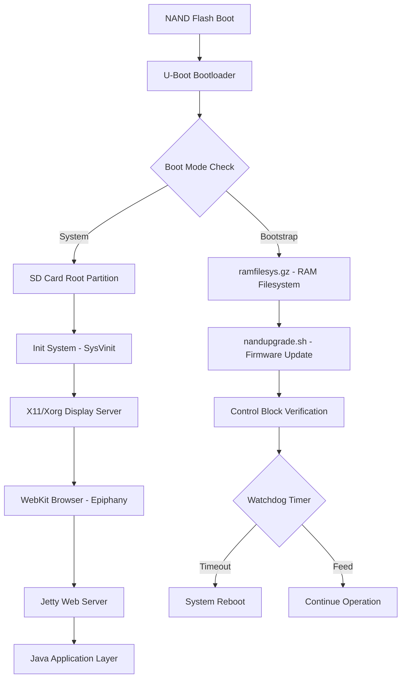
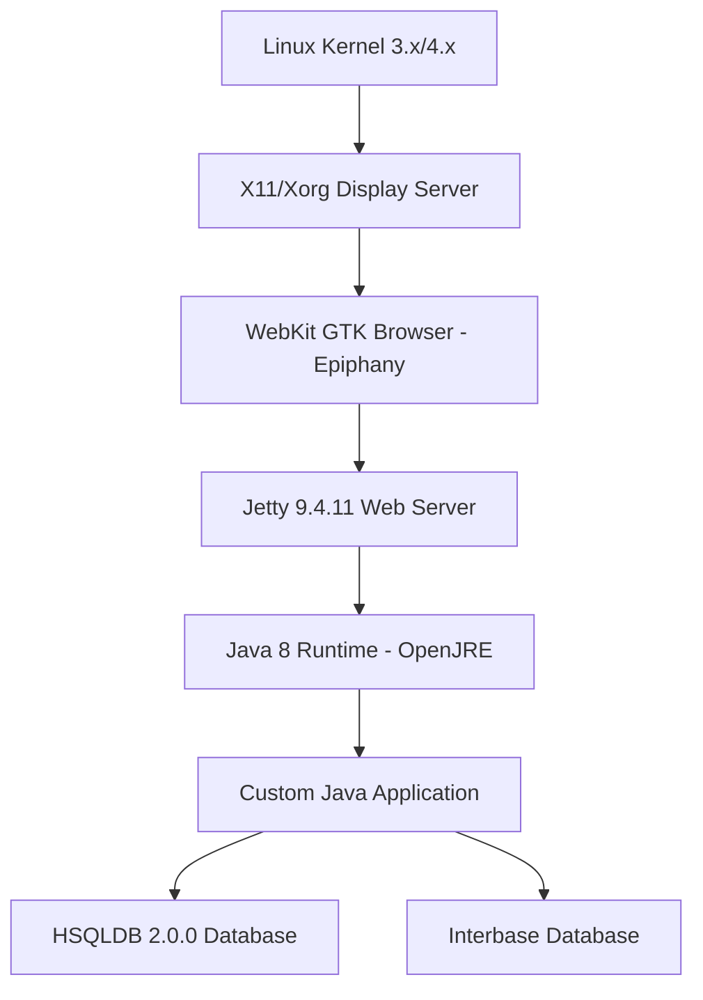

Based on my comprehensive forensic analysis of the Steelcase RoomWizard firmware partitions, I can now provide you with detailed findings and recommendations. This is a complex embedded Linux system with multiple protection mechanisms.

## **COMPREHENSIVE FORENSIC ANALYSIS**

### **System Architecture Overview**



### **1. BOOT SEQUENCE & PARTITION STRUCTURE**

**Partition Layout (SD Card):**
- **Partition 0 (p1)**: FAT32 Boot Partition (64MB) - `/var/volatile/boot`
  - Contains: `mlo`, `u-boot-sd.bin`, `uImage-bootstrap`, `ramfilesys.gz`, `uImage-system`, `ctrlblock.bin`
- **Partition 1 (p2)**: Data Partition (256MB) - `/home/root/data`
- **Partition 2 (p3)**: Log Partition (250MB) - `/home/root/log`
- **Partition 3 (p5)**: Backup Partition (1500MB) - `/home/root/backup`
- **Partition 4 (p6)**: Root Filesystem (1024MB) - `/` (ext3)

**NAND Flash:**
- MTD0: Boot redirect with OOB data
- Contains bootloader and bootstrap kernel

**Boot Flow:**
1. **MLO (X-Loader)** → **U-Boot** → **Kernel Selection**
2. **Control Block** (`ctrlblock.bin`) determines boot mode:
   - `boot_from=bootstrap` → Loads `uImage-bootstrap` + `ramfilesys.gz` (upgrade mode)
   - `boot_from=system` → Loads `uImage-system` from SD root partition (normal mode)
3. **Tracker Value** (0-2):
   - 0 = Normal operation
   - 1 = Post-upgrade verification
   - 2+ = **FAILURE MODE** - triggers fail.sh

### **2. PROTECTION MECHANISMS IDENTIFIED**

#### **A. Hardware Watchdog Timer**
**Location:** [`/etc/watchdog.conf`](partitions/FAT32%20Volume%202/ramfilesys.gz-extracted/etc/watchdog.conf:22-23)
```bash
watchdog-device = /dev/watchdog
watchdog-timeout = 60
interval = 500  # Deliberately set high to disable auto-feeding in RAMFS
```

**Critical Finding:** The watchdog is configured with a 60-second timeout but a 500-second interval in RAM filesystem mode, effectively disabling automatic feeding during upgrades. The system MUST manually feed the watchdog or it will reset.

**Watchdog Control:**
- Device: `/dev/watchdog`
- Daemon: `/usr/sbin/watchdog`
- Started in: [`/etc/rc5.d/S50watchdog`](partitions/108a1490-8feb-4d0c-b3db-995dc5fc066c/etc/init.d/watchdog)

#### **B. MD5 Integrity Verification**
**Multiple Checksum Layers:**

1. **Upgrade Package Level** ([`wsupgrade.sh`](partitions/26a7a226-6472-47fa-a205-a5fc2d22e149/logs/upgrade_logs/pre_ramfs.log:13-14)):
   ```bash
   md5sum -c upgrade.cpio.gz.md5
   ```

2. **Individual Image Files** ([`nandupgrade.sh:413-427`](partitions/FAT32%20Volume%202/ramfilesys.gz-extracted/opt/sbin/nandupgrade.sh:413-427)):
   ```bash
   # Checks ALL .md5 files for:
   # - nand_boot_redirect_oob.bin.md5
   # - sd_boot_archive.tar.gz.md5
   # - sd_data_part.img.md5
   # - sd_log_part.img.md5
   # - sd_rootfs_part.img.md5
   # - uImage-system-original.md5
   ```

3. **Post-Write Verification** ([`nandupgrade.sh:626-675`](partitions/FAT32%20Volume%202/ramfilesys.gz-extracted/opt/sbin/nandupgrade.sh:626-675)):
   - After `dd` operations, reads back data and compares MD5
   - **Retries up to 3 times** if mismatch detected
   - **Exits with error code 6** if all retries fail

#### **C. Control Block State Machine**
**Binary:** [`/opt/sbin/ctrlblk`](partitions/FAT32%20Volume%202/ramfilesys.gz-extracted/opt/sbin/ctrlblk) (binary executable)

**State Parameters:**
- `boot_from`: `bootstrap` | `system`
- `upgrade_type`: `factory` | `field`
- `boot_tracker`: 0-2 (failure counter)
- `fwversion`: Firmware version string

**Critical Logic** ([`bootstrap:49-54`](partitions/FAT32%20Volume%202/ramfilesys.gz-extracted/etc/init.d/bootstrap:49-54)):
```bash
if [ $TRACKER -ge 2 ]; then
    echo "Detected failure mode on boot"
    start_fail_script  # Triggers recovery/factory reset
    exit 1
fi
```

#### **D. Signed/Verified Boot Chain**
**Evidence Found:**
- NAND boot redirect written to **4 redundant locations** with OOB data ([`nandupgrade.sh:452-506`](partitions/FAT32%20Volume%202/ramfilesys.gz-extracted/opt/sbin/nandupgrade.sh:452-506))
- Each write is **verified by reading back** and comparing with `cmp`
- No cryptographic signatures detected, but **binary comparison** enforced

### **3. HARDWARE CONTROL INTERFACES**

#### **LED Control (Multi-Color Indicator)**
**GPIO/LED Subsystem:**
```bash
# Red LED
/sys/class/leds/red_led/brightness     # 0-100

# Green LED  
/sys/class/leds/green_led/brightness   # 0-100

# Backlight
/sys/class/leds/backlight/brightness   # 0-100
```

**Control Scripts:**
- [`/opt/sbin/backlight/setbacklight.sh`](partitions/108a1490-8feb-4d0c-b3db-995dc5fc066c/opt/sbin/backlight/setbacklight.sh)
- [`/opt/sbin/brightness.sh`](partitions/108a1490-8feb-4d0c-b3db-995dc5fc066c/opt/sbin/brightness.sh)
- [`/opt/sbin/conc_leds.sh`](partitions/108a1490-8feb-4d0c-b3db-995dc5fc066c/opt/sbin/conc_leds.sh)

#### **Touchscreen Input**
**Device Nodes:**
```bash
/dev/input/touchscreen0    # Primary touchscreen device
/dev/input/event*          # Input event devices
```

**Calibration:**
- Tool: `xinput_calibrator`
- Config: `/etc/pointercal.xinput`
- Auto-calibration: [`/usr/bin/xinput_calibrator_once.sh`](partitions/108a1490-8feb-4d0c-b3db-995dc5fc066c/usr/bin/xinput_calibrator_once.sh)

**Input Stack:**
- **Kernel Driver** → **evdev** → **libinput** → **X11/Xorg** → **WebKit Browser**

#### **Display/Framebuffer**
```bash
/dev/fb0                   # Framebuffer device
DISPLAY=:0                 # X11 display
```

**X11 Configuration** ([`/etc/init.d/x11`](partitions/108a1490-8feb-4d0c-b3db-995dc5fc066c/etc/init.d/x11:31)):
```bash
exec Xorg -br -nolisten tcp -nocursor -pn -dpms vt8 :0
```

### **4. APPLICATION FRAMEWORK**

**Software Stack:**


**Key Components:**
- **Browser:** WebKit-based (Epiphany/GNOME Web)
  - Binary: `/usr/bin/browser` (likely symlink to epiphany)
  - Home page: `http://localhost/frontpanel/pages/index.html`
  
- **Web Server:** Jetty 9.4.11
  - Location: `/opt/jetty-9-4-11/`
  - Serves JSP/Servlet application
  
- **Java Runtime:** OpenJRE 8
  - Location: `/opt/openjre-8/`
  
- **Databases:**
  - HSQLDB: `/home/root/data/rwdb/` (room booking data)
  - Interbase: `/opt/interbase/data/websign.gdb` (legacy)

### **5. WHY YOUR MODIFICATIONS FAILED**

Based on the analysis, your modifications likely failed due to:

1. **MD5 Checksum Mismatch**
   - ANY modification to partition images triggers MD5 verification failure
   - System detects tampering and refuses to boot

2. **Watchdog Timer Reset**
   - If boot process takes >60 seconds, watchdog triggers reset
   - Custom code may have delayed boot sequence

3. **Control Block State Corruption**
   - Modifying files may have corrupted the control block
   - Tracker incremented to failure mode (≥2)

4. **Missing Dependency Chain**
   - Modified files may have broken library dependencies
   - Java application fails to start → watchdog not fed → reset

### **6. SAFE MODIFICATION STRATEGY**

#### **Step 1: Bypass MD5 Verification**

**Option A: Regenerate All MD5 Files**
```bash
# After modifying any partition image:
cd /path/to/modified/images
for file in *.img *.gz *.bin; do
    md5sum "$file" > "${file}.md5"
done
```

**Option B: Patch nandupgrade.sh**
Modify [`nandupgrade.sh:413-435`](partitions/FAT32%20Volume%202/ramfilesys.gz-extracted/opt/sbin/nandupgrade.sh:413-435) to skip MD5 checks:
```bash
# Comment out or replace with:
MD5SUM_CHECK_STATUS=0
# Skip the while loop
```

#### **Step 2: Maintain Watchdog Feeding**

**Critical:** Any custom code MUST feed the watchdog:
```bash
# Feed watchdog every 30 seconds
while true; do
    echo 1 > /dev/watchdog
    sleep 30
done &
```

Or use the watchdog daemon:
```bash
/usr/sbin/watchdog -c /etc/watchdog.conf
```

#### **Step 3: Inject Custom Runtime**

**For Python:**
```bash
# 1. Add Python to rootfs partition
mkdir -p /opt/python3
# Copy Python 3.x ARM binaries

# 2. Create startup script in /etc/init.d/
cat > /etc/init.d/custom_app << 'EOF'
#!/bin/sh
export PYTHONPATH=/opt/python3/lib/python3.x
/opt/python3/bin/python3 /opt/custom/app.py &
EOF

# 3. Create symlink in rc5.d
ln -s /etc/init.d/custom_app /etc/rc5.d/S99custom_app
```

**For Java:**
```bash
# Java 8 already present at /opt/openjre-8/
# Add custom JAR to Jetty webapps or create standalone service
```

#### **Step 4: Hardware Control Code Examples**

**Python LED Control:**
```python
#!/usr/bin/env python3
import time

class LEDController:
    def __init__(self):
        self.red_led = "/sys/class/leds/red_led/brightness"
        self.green_led = "/sys/class/leds/green_led/brightness"
        self.backlight = "/sys/class/leds/backlight/brightness"
    
    def set_led(self, led_path, brightness):
        """Set LED brightness (0-100)"""
        try:
            with open(led_path, 'w') as f:
                f.write(str(max(0, min(100, brightness))))
        except IOError as e:
            print(f"Error setting LED: {e}")
    
    def set_red(self, brightness):
        self.set_led(self.red_led, brightness)
    
    def set_green(self, brightness):
        self.set_led(self.green_led, brightness)
    
    def set_backlight(self, brightness):
        self.set_led(self.backlight, brightness)
    
    def pulse_green(self, duration=2.0):
        """Pulse green LED"""
        steps = 20
        for i in range(steps):
            brightness = int(100 * (i / steps))
            self.set_green(brightness)
            time.sleep(duration / (2 * steps))
        for i in range(steps, 0, -1):
            brightness = int(100 * (i / steps))
            self.set_green(brightness)
            time.sleep(duration / (2 * steps))

# Usage
if __name__ == "__main__":
    leds = LEDController()
    leds.set_green(50)
    leds.pulse_green()
```

**Python Touchscreen Input:**
```python
#!/usr/bin/env python3
import struct
import os

class TouchscreenReader:
    # Input event structure: time(8), time_usec(8), type(2), code(2), value(4)
    EVENT_FORMAT = 'llHHi'
    EVENT_SIZE = struct.calcsize(EVENT_FORMAT)
    
    # Event types
    EV_ABS = 0x03
    EV_KEY = 0x01
    
    # Absolute axes
    ABS_X = 0x00
    ABS_Y = 0x01
    ABS_PRESSURE = 0x18
    
    # Button
    BTN_TOUCH = 0x14a
    
    def __init__(self, device='/dev/input/touchscreen0'):
        self.device = device
        self.fd = None
    
    def open(self):
        try:
            self.fd = os.open(self.device, os.O_RDONLY)
        except OSError as e:
            print(f"Error opening {self.device}: {e}")
            return False
        return True
    
    def read_event(self):
        """Read one input event"""
        if not self.fd:
            return None
        
        try:
            data = os.read(self.fd, self.EVENT_SIZE)
            if len(data) < self.EVENT_SIZE:
                return None
            
            tv_sec, tv_usec, type, code, value = struct.unpack(
                self.EVENT_FORMAT, data)
            
            return {
                'time': tv_sec + tv_usec / 1000000.0,
                'type': type,
                'code': code,
                'value': value
            }
        except OSError:
            return None
    
    def read_touch(self):
        """Read touch coordinates"""
        x, y, pressure = None, None, None
        touching = False
        
        while True:
            event = self.read_event()
            if not event:
                break
            
            if event['type'] == self.EV_ABS:
                if event['code'] == self.ABS_X:
                    x = event['value']
                elif event['code'] == self.ABS_Y:
                    y = event['value']
                elif event['code'] == self.ABS_PRESSURE:
                    pressure = event['value']
            
            elif event['type'] == self.EV_KEY:
                if event['code'] == self.BTN_TOUCH:
                    touching = event['value'] == 1
                    if touching and x is not None and y is not None:
                        return (x, y, pressure)
        
        return None
    
    def close(self):
        if self.fd:
            os.close(self.fd)
            self.fd = None

# Usage
if __name__ == "__main__":
    touch = TouchscreenReader()
    if touch.open():
        print("Waiting for touch events...")
        try:
            while True:
                coords = touch.read_touch()
                if coords:
                    x, y, pressure = coords
                    print(f"Touch at ({x}, {y}) pressure={pressure}")
        except KeyboardInterrupt:
            pass
        finally:
            touch.close()
```

**Java LED Control:**
```java
import java.io.FileWriter;
import java.io.IOException;

public class LEDController {
    private static final String RED_LED = "/sys/class/leds/red_led/brightness";
    private static final String GREEN_LED = "/sys/class/leds/green_led/brightness";
    private static final String BACKLIGHT = "/sys/class/leds/backlight/brightness";
    
    public void setLED(String ledPath, int brightness) {
        brightness = Math.max(0, Math.min(100, brightness));
        try (FileWriter writer = new FileWriter(ledPath)) {
            writer.write(String.valueOf(brightness));
        } catch (IOException e) {
            System.err.println("Error setting LED: " + e.getMessage());
        }
    }
    
    public void setRed(int brightness) {
        setLED(RED_LED, brightness);
    }
    
    public void setGreen(int brightness) {
        setLED(GREEN_LED, brightness);
    }
    
    public void setBacklight(int brightness) {
        setLED(BACKLIGHT, brightness);
    }
    
    public void pulseGreen(int durationMs) throws InterruptedException {
        int steps = 20;
        int stepDelay = durationMs / (2 * steps);
        
        // Fade in
        for (int i = 0; i <= steps; i++) {
            setGreen((i * 100) / steps);
            Thread.sleep(stepDelay);
        }
        
        // Fade out
        for (int i = steps; i >= 0; i--) {
            setGreen((i * 100) / steps);
            Thread.sleep(stepDelay);
        }
    }
    
    public static void main(String[] args) {
        LEDController leds = new LEDController();
        try {
            leds.setGreen(50);
            leds.pulseGreen(2000);
        } catch (InterruptedException e) {
            Thread.currentThread().interrupt();
        }
    }
}
```

#### **Step 5: Repack Modified Filesystem**

```bash
# 1. Modify rootfs
mkdir -p /tmp/rootfs_mount
mount -o loop sd_rootfs_part.img /tmp/rootfs_mount

# Add your custom files
cp -r /path/to/custom/* /tmp/rootfs_mount/opt/custom/

# Unmount
umount /tmp/rootfs_mount

# 2. Regenerate MD5
md5sum sd_rootfs_part.img > sd_rootfs_part.img.md5

# 3. Repack boot archive if modified
cd boot_files/
tar czf sd_boot_archive.tar.gz *
md5sum sd_boot_archive.tar.gz > sd_boot_archive.tar.gz.md5

# 4. Update upgrade.conf with new firmware version
# Increment version to trigger upgrade
```

#### **Step 6: Preserve Critical Services**

**DO NOT DISABLE:**
- `/etc/init.d/watchdog` - System will reset
- `/etc/init.d/webserver` - Application layer depends on it
- `/etc/init.d/x11` - Display system required
- `/etc/init.d/browser` - Main UI

**Safe to Augment:**
- Add scripts to `/etc/rc5.d/S99*` (runs after all services)
- Modify `/etc/rc.local` if it exists
- Add to `/etc/init.d/` with proper symlinks

### **7. DEBUGGING & ROLLBACK**

**Serial Console Access:**
- UART on `ttyO1` (115200 baud)
- Enabled in [`/etc/inittab:31`](partitions/FAT32%20Volume%202/ramfilesys.gz-extracted/etc/inittab:31):
  ```
  O1:12345:respawn:/bin/start_getty 115200 ttyO1 vt102
  ```

**Log Locations:**
- `/var/log/` - System logs
- `/home/root/log/` - Application logs
- `/var/log/browser.out` - Browser stdout
- `/var/log/browser.err` - Browser stderr

**Rollback Procedure:**
1. If tracker ≥ 2, system enters failure mode
2. [`fail.sh`](partitions/FAT32%20Volume%202/ramfilesys.gz-extracted/opt/sbin/fail.sh) is executed
3. Can trigger factory reset or recovery mode
4. Backup partition contains previous working firmware

### **8. CRITICAL WARNINGS**

⚠️ **DO NOT:**
- Modify `ctrlblock.bin` directly without understanding its binary format
- Skip MD5 regeneration after ANY file modification
- Disable watchdog without alternative feeding mechanism
- Modify bootloader (`mlo`, `u-boot-sd.bin`) without JTAG recovery option
- Change partition sizes without updating `upgrade.conf`

⚠️ **ALWAYS:**
- Keep backup of original SD card image
- Test modifications in QEMU/emulator first if possible
- Maintain serial console access for debugging
- Feed watchdog in any long-running custom code
- Regenerate ALL MD5 checksums after modifications

This device has sophisticated protection mechanisms, but they are primarily integrity-based rather than cryptographically signed. The key to successful modification is maintaining the expected file structure, regenerating checksums, and ensuring the watchdog is properly fed during boot.