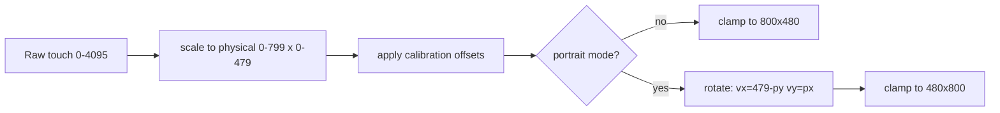
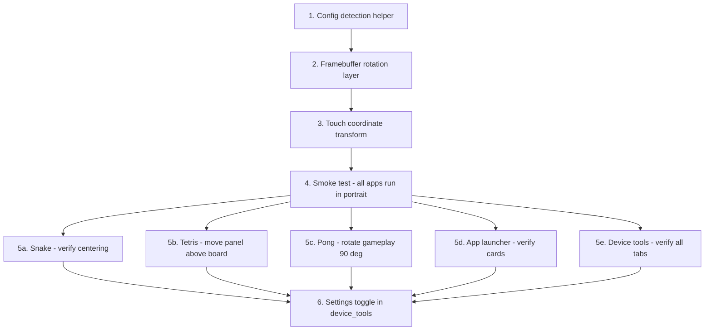

# Portrait Mode — Phase 3 Design Document

## Overview

The RoomWizard has an 800×480 landscape framebuffer (`/dev/fb0`). Portrait mode presents a **480×800 virtual screen** to application code, with a software rotation layer in the common libraries making the transform transparent. Phases 1–2 already replaced all hardcoded 800/480 values with dynamic `fb->width`/`fb->height` throughout the codebase, so the virtual dimensions flow automatically to all layout calculations.

**Goal:** Any app compiled against the common libraries works in portrait orientation with zero app-side changes for basic rendering. Per-game layout optimisations are a separate, incremental step.

---

## 1. Config Detection

Portrait mode is activated by the **presence** of a flag file — no config key required.

| Item | Detail |
|------|--------|
| Flag file | `/opt/games/portrait.mode` |
| Helper | `bool fb_is_portrait_mode(void)` in [`framebuffer.c`](common/framebuffer.c) |
| Logic | `return access("/opt/games/portrait.mode", F_OK) == 0;` |
| Config file | `rw_config.conf` does **not** need a new key |

The flag file approach keeps activation simple — `touch /opt/games/portrait.mode` enables it, `rm` disables it. The device_tools Settings tab will eventually provide a toggle that creates/removes this file.

---

## 2. Framebuffer Rotation Layer

All changes in [`common/framebuffer.h`](common/framebuffer.h) and [`common/framebuffer.c`](common/framebuffer.c).

### 2.1 Struct Changes

Add three fields to the `Framebuffer` struct:

```c
typedef struct {
    // ... existing fields ...
    bool portrait_mode;       // true if rotation is active
    uint32_t phys_width;      // physical fb width  (always 800)
    uint32_t phys_height;     // physical fb height (always 480)
    size_t back_buffer_size;  // may differ from screen_size in portrait
} Framebuffer;
```

### 2.2 `fb_is_portrait_mode()` Helper

```c
#include <unistd.h>

bool fb_is_portrait_mode(void) {
    return access("/opt/games/portrait.mode", F_OK) == 0;
}
```

Declared in [`framebuffer.h`](common/framebuffer.h), defined in [`framebuffer.c`](common/framebuffer.c).

### 2.3 `fb_init()` Changes

After querying `vinfo.xres` / `vinfo.yres` from the kernel, detect portrait mode and adjust dimensions:

```
┌─────────────────────────────────────────────────────┐
│  ioctl → vinfo.xres = 800, vinfo.yres = 480        │
│                                                     │
│  fb->phys_width  = 800                              │
│  fb->phys_height = 480                              │
│                                                     │
│  if portrait_mode:                                  │
│    fb->width  = phys_height = 480   (virtual)       │
│    fb->height = phys_width  = 800   (virtual)       │
│  else:                                              │
│    fb->width  = phys_width  = 800                   │
│    fb->height = phys_height = 480                   │
│                                                     │
│  screen_base_width  = fb->width                     │
│  screen_base_height = fb->height                    │
│                                                     │
│  screen_size      = line_length * phys_height       │
│                     (for mmap — always physical)     │
│  back_buffer_size = width * height * bytes_per_pixel│
│                     (virtual dimensions)             │
│                                                     │
│  mmap  → front buffer at screen_size (physical)     │
│  malloc → back buffer at back_buffer_size (virtual)  │
└─────────────────────────────────────────────────────┘
```

Key points:
- `screen_size` stays at physical size — the mmap must match the kernel framebuffer
- `back_buffer_size` uses virtual dimensions — apps draw into a 480×800 buffer
- `screen_base_width` / `screen_base_height` are set to virtual dimensions so all `SCREEN_SAFE_*` macros auto-adapt
- The front buffer (mmap'd) remains 800×480; the back buffer (malloc'd) becomes 480×800

### 2.4 `fb_swap()` — Rotated Copy

In landscape mode, `fb_swap()` is a straight `memcpy`. In portrait mode, it performs a **90° CCW rotation** during the copy.

**Coordinate mapping** — virtual (vx, vy) → physical (px, py):

```
px = vy
py = (virtual_width - 1) - vx = 479 - vx
```

This is a 90° counter-clockwise rotation: the device is physically rotated clockwise (landscape left edge becomes portrait top).

```c
void fb_swap(Framebuffer *fb) {
    if (!fb->double_buffering || !fb->back_buffer) return;

    if (!fb->portrait_mode) {
        memcpy(fb->buffer, fb->back_buffer, fb->screen_size);
        return;
    }

    // Portrait: rotated copy from virtual back_buffer → physical front_buffer
    uint32_t vw = fb->width;       // 480 (virtual width)
    uint32_t vh = fb->height;      // 800 (virtual height)
    uint32_t pw = fb->phys_width;  // 800 (physical width)

    for (uint32_t vy = 0; vy < vh; vy++) {
        uint32_t src_row = vy * vw;
        uint32_t px_base = vy;               // px = vy
        for (uint32_t vx = 0; vx < vw; vx++) {
            uint32_t py = (vw - 1) - vx;     // 479 - vx
            fb->buffer[py * pw + px_base] = fb->back_buffer[src_row + vx];
        }
    }
}
```

> **Iteration order:** The outer loop walks `vy` (rows of the back buffer), the inner loop walks `vx` (columns). This gives **sequential reads** of the back buffer (cache-friendly). Physical writes scatter across rows, but this is the better trade-off — reads dominate cache performance on this hardware.

### 2.5 Drawing Primitives — No Changes Needed

All drawing functions ([`fb_draw_pixel()`](common/framebuffer.c:236), [`fb_fill_rect()`](common/framebuffer.c:257), [`fb_draw_text()`](common/framebuffer.c:358), etc.) operate on `fb->width` / `fb->height` and write to `fb->back_buffer`. Since these are set to virtual dimensions (480×800), **no changes are required** — apps draw into the virtual coordinate space and the rotation happens transparently in `fb_swap()`.

### 2.6 `fb_clear()` — No Changes Needed

[`fb_clear()`](common/framebuffer.c:218) iterates `fb->width * fb->height` pixels in the back buffer. In portrait mode this is 480×800 = 384,000 pixels — correct for the virtual back buffer size.

### 2.7 `fb_close()` — Minor Adjustment

The `free(fb->back_buffer)` call is fine (free doesn't need size). The `munmap` call uses `fb->screen_size` which remains at physical size — correct.

### 2.8 Buffer Size Summary

| Buffer | Landscape | Portrait |
|--------|-----------|----------|
| Front buffer (mmap) | 800×480 = 384,000 px | 800×480 = 384,000 px (unchanged) |
| Back buffer (malloc) | 800×480 = 384,000 px | 480×800 = 384,000 px |
| `screen_size` | `line_length × 480` | `line_length × 480` (unchanged) |
| `back_buffer_size` | `800 × 480 × bpp` | `480 × 800 × bpp` |

> Note: pixel counts are identical (384K) but the stride differs. `back_buffer_size` is needed to correctly allocate and address the back buffer with `fb->width` as stride.

---

## 3. Touch Coordinate Transform

All changes in [`common/touch_input.h`](common/touch_input.h) and [`common/touch_input.c`](common/touch_input.c).

### 3.1 Struct Change

Add a portrait flag to `TouchInput`:

```c
typedef struct {
    // ... existing fields ...
    bool portrait_mode;  // true if coordinates need rotation
} TouchInput;
```

### 3.2 `touch_init()` Changes

After existing initialization, detect portrait mode:

```c
touch->portrait_mode = fb_is_portrait_mode();
if (touch->portrait_mode) {
    // screen_width/screen_height already set from screen_base_width/height
    // which fb_init() set to virtual dimensions (480, 800)
    printf("Touch: portrait mode enabled, virtual screen %dx%d\n",
           touch->screen_width, touch->screen_height);
}
```

### 3.3 Coordinate Rotation in `scale_coordinates()`

The existing [`scale_coordinates()`](common/touch_input.c:14) maps raw touch → physical screen coords (0–799, 0–479). After this mapping, apply rotation:

```c
static void scale_coordinates(TouchInput *touch, int *x, int *y) {
    // ... existing scaling + calibration code ...
    // At this point: *x is in [0, 799], *y is in [0, 479] (physical)

    if (touch->portrait_mode) {
        int phys_x = *x;
        int phys_y = *y;
        // Rotate: physical → virtual
        // virtual_x = phys_height - 1 - phys_y = 479 - phys_y
        // virtual_y = phys_x
        *x = 479 - phys_y;
        *y = phys_x;
    }

    // Clamp to screen bounds (now virtual dimensions if portrait)
    if (*x < 0) *x = 0;
    if (*x >= touch->screen_width) *x = touch->screen_width - 1;
    if (*y < 0) *y = 0;
    if (*y >= touch->screen_height) *y = touch->screen_height - 1;
}
```

### 3.4 Important: Scaling Must Use Physical Dimensions

The initial linear scaling in `scale_coordinates()` maps raw touch values to **physical** screen coordinates. When portrait mode is active, this initial scaling must still use the physical dimensions (800, 480) — not the virtual dimensions. The approach:

- Store `phys_screen_width = 800` and `phys_screen_height = 480` in TouchInput (or use the framebuffer's `phys_width`/`phys_height`)
- Use physical dimensions for the raw→screen linear mapping
- Apply the rotation transform after
- Use virtual dimensions only for the final clamp

### 3.5 Coordinate Transform Diagram



---

## 4. Game Layout Adaptations

Each app sees `fb->width = 480` and `fb->height = 800` in portrait mode. The following analysis covers what works automatically and what needs layout changes.

### 4.1 Snake — Minimal Changes

The snake grid is square (`GRID_SIZE × GRID_SIZE`). Cell size is computed as `min(usable_width, usable_height) / GRID_SIZE`.

| Dimension | Landscape | Portrait |
|-----------|-----------|----------|
| Screen | 800×480 | 480×800 |
| Limiting axis | Height (480) | Width (480) |
| Cell size (20×20 grid) | 24 | 24 |
| Grid pixel size | 480×480 | 480×480 |
| Centering | Horizontal space left/right | Vertical space above/below |

The grid ends up the same size — it just shifts from being horizontally centered to vertically centered. Direction detection (quadrant-based from center) already works regardless of aspect ratio.

**Action:** Verify centering looks good. Confirm the score/header area above the grid doesn't overlap when the grid is vertically centered. Likely zero code changes.

### 4.2 Tetris — Layout Changes Needed

The Tetris board is 10 wide × 20 tall. The current landscape layout places the board on the left and a side panel (NEXT piece, score, level) on the right.

| Dimension | Landscape | Portrait |
|-----------|-----------|----------|
| Screen | 800×480 | 480×800 |
| Cell size | `(480-80) / 20 = 20` | `(800-100) / 20 = 35` |
| Board width | 200px | 350px |
| Remaining for panel | 600px | 130px |

In portrait, 130px for the side panel is very tight. Two options:

**Option A — Compact side panel** (recommended): Detect portrait mode and shrink the side panel. The NEXT piece preview at scale 1 needs ~4 cells × cell_size = 140px which exceeds 130px. So the panel must use a smaller scale for the preview.

**Option B — Move info above/below board**: Place score and NEXT piece in a header area above the board, using the generous vertical space.

**Recommended approach:** Option B — place a compact info bar above the board showing score, level, and a small NEXT piece preview. The board uses the full 480px width. This plays to portrait's strengths.

### 4.3 Pong — Major Layout Change

Current Pong has vertical paddles on left and right edges, ball bouncing between them. In portrait (480×800), the play area is very tall and narrow, making horizontal gameplay awkward.

**Required redesign:** Rotate gameplay 90° in portrait mode.

| Aspect | Landscape | Portrait |
|--------|-----------|----------|
| Paddle orientation | Vertical, left/right edges | Horizontal, top/bottom edges |
| Ball bounce | Left/right walls | Top/bottom → paddle hits; left/right → walls |
| Player paddle | Left side, moves vertically | Bottom, moves horizontally |
| AI paddle | Right side, moves vertically | Top, moves horizontally |
| Touch control | Tap vertical position | Tap horizontal position |

Implementation approach:
- Add a `bool portrait` flag checked once at startup
- In portrait mode, swap paddle width/height constants
- Ball collision logic: reflect off left/right walls instead of top/bottom; score when ball passes top or bottom edge
- AI tracks ball X position instead of Y
- Touch input maps horizontal position to paddle X instead of vertical position to paddle Y
- The Paddle struct already uses `float y` for position — in portrait mode this conceptually becomes the X position, or add a `float x` field

### 4.4 App Launcher / Game Selector — Verify and Adjust

The [`game_selector.c`](game_selector/game_selector.c) uses dynamic dimensions (`fb.width`, `fb.height`). Currently implements horizontal scrolling with cards.

In portrait (480×800):
- Cards that were side-by-side in landscape will need to be narrower or stacked vertically
- The horizontal scrolling paradigm still works but cards will be taller than wide
- Title area and navigation dots should auto-adapt via `SCREEN_SAFE_*` macros

**Action:** Test current layout. If cards look too cramped at 480px width, consider switching to vertical scrolling or reducing card count per view.

### 4.5 Device Tools — Verify

[`device_tools.c`](device_tools/device_tools.c) uses a tab-based UI with dynamic layout (all hardcoded dimensions were replaced in Phase 2). Sub-pages:

| Tab | Portrait concern |
|-----|------------------|
| Settings | Sliders and buttons — should auto-fit at 480px width |
| Diagnostics | Text pages — may need smaller font scale or word wrap |
| Tests | 5×2 grid → may need 3×4 or 2×5 arrangement at 480px width |
| Calibration | Crosshair targets — coordinates need portrait-aware placement |

**Action:** Verify all sub-pages render correctly. The test grid layout may need a portrait-specific arrangement. Calibration crosshairs must account for the rotated coordinate system.

---

## 5. Implementation Order



| Step | Scope | Files |
|------|-------|-------|
| 1. Config detection | Add `fb_is_portrait_mode()` | [`framebuffer.h`](common/framebuffer.h), [`framebuffer.c`](common/framebuffer.c) |
| 2. Framebuffer rotation | Struct fields, `fb_init()` changes, rotated `fb_swap()` | [`framebuffer.h`](common/framebuffer.h), [`framebuffer.c`](common/framebuffer.c) |
| 3. Touch transform | Struct field, rotation in `scale_coordinates()` | [`touch_input.h`](common/touch_input.h), [`touch_input.c`](common/touch_input.c) |
| 4. Smoke test | Deploy and verify all apps launch, render, and accept touch | No code changes — testing only |
| 5a. Snake verify | Check grid centering in 480×800 | [`snake.c`](snake/snake.c) |
| 5b. Tetris adjust | Portrait layout with info bar above board | [`tetris.c`](tetris/tetris.c) |
| 5c. Pong redesign | Horizontal paddles at top/bottom | [`pong.c`](pong/pong.c) |
| 5d. App launcher verify | Check card layout at 480px width | [`game_selector.c`](game_selector/game_selector.c) |
| 5e. Device tools verify | Check all tabs render at 480×800 | [`device_tools.c`](device_tools/device_tools.c) |
| 6. Settings toggle | Add portrait mode on/off to Settings tab | [`device_tools.c`](device_tools/device_tools.c) |

**Steps 1–3** are the core — they make all apps instantly work in portrait, even if layouts aren't optimal. Steps 5a–5e are independent and can be done in any order.

---

## 6. Performance Notes

### 6.1 The Rotated `fb_swap()` Cost

The rotation in `fb_swap()` is the primary performance concern.

| Metric | Value |
|--------|-------|
| Pixels per frame | 384,000 (480 × 800) |
| Bytes per frame | ~1.5 MB (at 4 bytes/pixel) |
| Target frame rate | 60 FPS |
| CPU | 300 MHz ARM (OMAP3) |

### 6.2 Optimisation Strategy

**Row-wise iteration of back_buffer** (as shown in the `fb_swap()` pseudocode above):
- Outer loop: `vy` from 0 to 799 — sequential read through back_buffer rows
- Inner loop: `vx` from 0 to 479 — sequential reads within each row
- Writes scatter across physical rows, but reads are cache-friendly

**Incremental offset computation:**
- `px_base = vy` is constant per outer iteration
- `py = 479 - vx` decrements per inner iteration — can be a simple counter

**What NOT to do:**
- Pre-rotating coordinates in drawing primitives and using `memcpy` in `fb_swap()` — this would require changing every drawing function, defeating the transparent rotation design
- Iterating column-by-column in the back_buffer — cache-hostile reads

### 6.3 Estimated Viability

On a 300 MHz ARM, a tight inner loop doing one read + one indexed write per pixel should achieve ~100M simple operations/second. At 384K pixels/frame, that's ~260 frames/second throughput for the rotation loop alone. Even with cache misses on writes and pipeline stalls, 60 FPS should be comfortably achievable.

If profiling reveals issues, further optimisations:
- Process 4 pixels at a time using 64-bit loads (if aligned)
- Use DMA if the OMAP3 DSS supports rotated scanout (hardware rotation) — but this is a stretch goal and unlikely to be needed

---

## 7. Edge Cases and Testing

### 7.1 Calibration in Portrait Mode

The touch calibration (4-corner crosshair) runs in [`device_tools.c`](device_tools/device_tools.c). The crosshair positions must be drawn in **virtual** coordinates (which the rotation layer handles), but the calibration offsets are applied in **physical** space (before rotation). This means:

- Calibration should ideally be performed in landscape mode
- If calibration must work in portrait mode, the crosshair target positions need to account for the inverse transform when saving offsets
- Simplest approach: disable portrait rotation during calibration, or document that calibration should be done before enabling portrait mode

### 7.2 PPM Splash Screens

Games load `.ppm` splash images (e.g., [`snake.ppm`](snake/snake.ppm), [`tetris.ppm`](tetris/tetris.ppm)). These are 800×480 landscape images. In portrait mode:
- Option A: Create separate 480×800 portrait versions
- Option B: Skip the splash / show a text-only welcome screen in portrait
- Option C: Rotate the PPM image at load time (adds complexity)

**Recommended:** Option A for polished feel, with Option B as fallback. The PPM loader in [`ppm.c`](common/ppm.c) can check `fb_is_portrait_mode()` and load `*_portrait.ppm` if it exists.

### 7.3 Screen Safe Area Margins

The bezel margins stored in `/etc/touch_calibration.conf` are in physical pixel offsets. In portrait mode, the margins need to be rotated:
- Physical left margin → portrait bottom margin
- Physical right margin → portrait top margin
- Physical top margin → portrait left margin
- Physical bottom margin → portrait right margin

This rotation should happen in `fb_load_safe_area()` when portrait mode is detected.

### 7.4 ScummVM / VNC Client

The [`vnc_client`](../vnc_client/) and [`scummvm-roomwizard`](../scummvm-roomwizard/) projects have their own framebuffer code and are **out of scope** for this phase. They would need separate portrait mode integration if desired.
