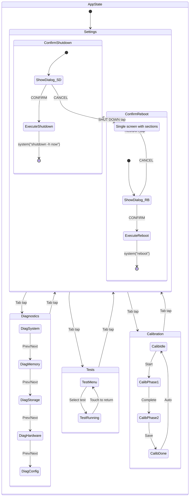

# Device Tools — Unified Hardware App

## 1. Overview

`device_tools` consolidates four standalone RoomWizard hardware utilities into a single tab-based GUI application:

| Tab | Source App | Purpose |
|-----|-----------|---------|
| **Settings** | `hardware_config` | Audio, LED, backlight configuration + shutdown/reboot |
| **Diagnostics** | `hardware_diag` | Read-only system/memory/storage/hardware/config info |
| **Tests** | `hardware_test_gui` | Interactive LED, display, audio, and touch tests |
| **Calibration** | `unified_calibrate` | Touch calibration + bezel margin adjustment |

### Platform Constraints
- ARM Cortex-A8 @ 300 MHz, 800×480 resistive touchscreen
- Linux framebuffer `/dev/fb0` at 32bpp, double-buffered
- Touch via `/dev/input/event0`, calibration at `/etc/touch_calibration.conf`
- Config at `/opt/games/rw_config.conf`
- 5×7 bitmap font — scale 2 = 10×14px per char, scale 3 = 15×21px per char

---

## 2. App Structure

### 2.1 File Organization

Single source file: `native_apps/device_tools/device_tools.c`

Rationale: All existing apps are single `.c` files. The unified app will be roughly 1500–2000 lines — large but manageable as a single translation unit, consistent with the project convention. Helper functions are organized into clearly-delimited sections using the existing `/* ═══ SECTION ═══ */` comment style.

```
native_apps/
  device_tools/
    device_tools.c    # Main source
    DESIGN.md         # This document
```

### 2.2 Source File Structure

```c
/* ═══ Includes & Constants ═══ */
/* ═══ Color Palette ═══ */
/* ═══ Layout Constants ═══ */
/* ═══ State Machine ═══ */
/* ═══ Tab Bar ═══ */
/* ═══ Settings Tab ═══ */
/* ═══ Diagnostics Tab ═══ */
/* ═══ Tests Tab ═══ */
/* ═══ Calibration Tab ═══ */
/* ═══ Confirmation Dialog ═══ */
/* ═══ Main Loop ═══ */
```

### 2.3 State Machine

The app uses a two-level state machine: **active tab** + **sub-state per tab**, plus a **global modal overlay** for confirmation dialogs.



#### Confirmation State Machine

The confirmation dialog is a **global modal** tracked by the `confirm_action` field in `AppState`. It operates independently from the tab system:

```
CONFIRM_NONE ──┬── SHUT DOWN button ──→ CONFIRM_SHUTDOWN ──┬── CANCEL ──→ CONFIRM_NONE
               │                                            └── CONFIRM ──→ execute_system_action()
               └── REBOOT button ────→ CONFIRM_REBOOT ─────┬── CANCEL ──→ CONFIRM_NONE
                                                            └── CONFIRM ──→ execute_system_action()
```

When `confirm_action != CONFIRM_NONE`, the dialog acts as a modal barrier: all tab switching, settings changes, and other input is blocked.

### 2.4 Global State Structure

```c
typedef enum {
    TAB_SETTINGS,
    TAB_DIAGNOSTICS,
    TAB_TESTS,
    TAB_CALIBRATION,
    TAB_COUNT          /* = 4 */
} ActiveTab;

typedef enum {
    DIAG_SYSTEM,
    DIAG_MEMORY,
    DIAG_STORAGE,
    DIAG_HARDWARE,
    DIAG_CONFIG,
    DIAG_PAGE_COUNT    /* = 5 */
} DiagPage;

typedef enum {
    TEST_MENU_VIEW,    /* Grid menu showing all tests */
    TEST_RUNNING       /* A test is actively executing */
} TestSubState;

typedef enum {
    CALIB_IDLE,        /* Shows Start Calibration button */
    CALIB_PHASE1,      /* 4-corner touch calibration */
    CALIB_PHASE2,      /* Bezel margin adjustment */
    CALIB_DONE         /* Success/failure message, auto-return */
} CalibSubState;

typedef enum {
    CONFIRM_NONE,      /* No dialog active — normal operation */
    CONFIRM_SHUTDOWN,  /* "SHUT DOWN DEVICE?" dialog displayed */
    CONFIRM_REBOOT     /* "REBOOT DEVICE?" dialog displayed */
} ConfirmAction;

typedef struct {
    /* Navigation */
    ActiveTab    active_tab;

    /* Settings state */
    bool         audio_enabled;
    bool         led_enabled;
    int          led_brightness;       /* 0–100 */
    int          backlight_brightness;  /* 20–100 */
    char         status_msg[64];
    uint32_t     status_time_ms;

    /* Diagnostics state */
    DiagPage     diag_page;
    bool         diag_needs_refresh;

    /* Tests state */
    TestSubState test_sub;
    int          test_selected;        /* -1 = none, 0–9 = test index */

    /* Calibration state */
    CalibSubState calib_sub;
    int          calib_corner;         /* 0–3 during phase 1 */
    int          calib_offsets_x[4];
    int          calib_offsets_y[4];
    int          bezel_top, bezel_bottom, bezel_left, bezel_right;

    /* Confirmation dialog state */
    ConfirmAction confirm_action;      /* CONFIRM_NONE when no dialog */
} AppState;
```

---

## 3. Screen Layout — Pixel Specifications

### 3.1 Master Layout

```
+--[ 800 × 480 ]------------------------------------------------------+
|  [SAFE AREA TOP margin — variable, set by calibration]               |
|  +---------------------------------------------------------------+   |
|  | TAB BAR  (y: SAFE_TOP .. SAFE_TOP+44)                         |   |
|  | [SETTINGS] [DIAGNOSTICS] [TESTS] [CALIBRATION]       [X EXIT] |   |
|  +---------------------------------------------------------------+   |
|  | CONTENT AREA  (y: SAFE_TOP+46 .. SAFE_BOTTOM)                 |   |
|  |                                                                |   |
|  |   Tab-specific content rendered here                          |   |
|  |   Available height: SAFE_HEIGHT - 46                          |   |
|  |                                                                |   |
|  +---------------------------------------------------------------+   |
|  [SAFE AREA BOTTOM margin]                                           |
+----------------------------------------------------------------------+
```

### 3.2 Tab Bar Dimensions

| Element | Value |
|---------|-------|
| Tab bar Y start | `SCREEN_SAFE_TOP` |
| Tab bar height | 44 px |
| Tab bar background | `RGB(30, 30, 45)` |
| Tab button height | 40 px (2px top padding, 2px bottom padding) |
| Tab button min width | 150 px |
| Tab spacing | 4 px between tabs |
| Tab text scale | 2 (10×14px chars) |
| Active tab indicator | 3px bottom border in `COLOR_CYAN` |
| Exit button | 55×40 px, right-aligned in tab bar |
| Content area Y start | `SCREEN_SAFE_TOP + 46` (tab bar + 2px divider) |
| Content area height | `SCREEN_SAFE_HEIGHT - 46` |

### 3.3 Tab Button Layout

With default safe area (margins = 0), `SCREEN_SAFE_WIDTH = 800`:

```
| 10px | [SETTINGS 150px] 4px [DIAGNOSTICS 150px] 4px [TESTS 150px] 4px [CALIBRATION 150px] | ... | [X 55px] 10px |
```

Starting X = `SCREEN_SAFE_LEFT + 10`

| Tab | X start | Width | Touch area |
|-----|---------|-------|-----------|
| Settings | `SAFE_LEFT + 10` | 150 | Full button 150×40 |
| Diagnostics | `SAFE_LEFT + 164` | 150 | Full button 150×40 |
| Tests | `SAFE_LEFT + 318` | 150 | Full button 150×40 |
| Calibration | `SAFE_LEFT + 472` | 150 | Full button 150×40 |
| Exit | `SAFE_RIGHT - 65` | 55 | Full button 55×40 |

All tab buttons use `Button` from [`common.h`](native_apps/common/common.h) with `button_init_full()` and `button_draw()`.

### 3.4 Content Area Constants

```c
#define TAB_BAR_H         44
#define TAB_DIVIDER_H     2
#define CONTENT_Y         (SCREEN_SAFE_TOP + TAB_BAR_H + TAB_DIVIDER_H)
#define CONTENT_H         (SCREEN_SAFE_HEIGHT - TAB_BAR_H - TAB_DIVIDER_H)
#define CONTENT_LEFT      (SCREEN_SAFE_LEFT + 10)
#define CONTENT_RIGHT     (SCREEN_SAFE_RIGHT - 10)
#define CONTENT_WIDTH     (CONTENT_RIGHT - CONTENT_LEFT)
```

---

## 4. Settings Tab

### 4.1 Layout

Based on the current [`hardware_config.c`](native_apps/hardware_config/hardware_config.c) layout, shifted down to fit below the tab bar, with an additional SYSTEM section at the bottom. All Y positions are relative to `CONTENT_Y`.

```
+-- Content Area ------------------------------------------------+
|  AUDIO ──────────────────────────────────────────────────       |
|  [ON/OFF toggle]                               [TEST btn]      |
|                                                                 |
|  LEDS ───────────────────────────────────────────────────       |
|  [ON/OFF toggle]                               [TEST btn]      |
|  LED BRIGHTNESS    [-] ████████████░░░░ 70%  [+]               |
|                                                                 |
|  DISPLAY ────────────────────────────────────────────────       |
|  BACKLIGHT         [-] ████████████████ 100% [+]               |
|                                                                 |
|  [    SAVE    ]              [  RESET DEFAULTS  ]              |
|                    SAVED!                                       |
|                                                                 |
|  SYSTEM ─────────────────────────────────────────────────       |
|  [  SHUT DOWN  ]              [  REBOOT  ]                     |
+-----------------------------------------------------------------+
```

### 4.2 Y Positions (relative to CONTENT_Y)

| Element | Offset from CONTENT_Y |
|---------|-----------------------|
| AUDIO section header | +5 |
| Audio toggle + test button | +30 |
| LEDS section header | +75 |
| LED toggle + test button | +100 |
| LED brightness bar row | +140 |
| DISPLAY section header | +185 |
| Backlight bar row | +210 |
| SAVE / RESET buttons | +275 |
| Status message | +340 |
| SYSTEM section header | +365 |
| SHUT DOWN / REBOOT buttons | +390 |

### 4.3 Controls

| Control | Widget Type | Dimensions |
|---------|-------------|------------|
| Audio toggle | `ToggleSwitch` via [`toggle_init()`](native_apps/common/common.h:279) | 60×28 |
| LED toggle | `ToggleSwitch` | 60×28 |
| Test Audio button | `Button` | 90×34 |
| Test LED button | `Button` | 90×34 |
| LED brightness -/+ | `Button` | 45×30 each |
| Backlight -/+ | `Button` | 45×30 each |
| Brightness bars | Custom draw | 300×20 |
| SAVE button | `Button` | 160×50 |
| RESET DEFAULTS button | `Button` | 220×50 |
| SHUT DOWN button | `Button` (static) | 160×45, `BTN_COLOR_DANGER` (red) |
| REBOOT button | `Button` (static) | 160×45, `BTN_COLOR_WARNING` (orange) |

### 4.4 Behavior

- **Audio toggle**: Sets `audio_enabled` in app state. Uses [`toggle_check_press()`](native_apps/common/common.h:287).
- **LED toggle**: Sets `led_enabled` in app state.
- **LED brightness ±10**: Calls `do_led_test()` with new brightness for immediate feedback (direct sysfs write, bypasses config-gated API).
- **Backlight ±10**: Calls `apply_backlight()` for live preview (direct sysfs write).
- **SAVE**: Writes all 4 settings to config via [`config_set_bool()`](native_apps/common/config.h:59) / [`config_set_int()`](native_apps/common/config.h:55) + [`config_save()`](native_apps/common/config.h:41). Shows status "SAVED!" for 2 seconds.
- **RESET DEFAULTS**: Calls [`config_clear()`](native_apps/common/config.h:65), resets all values to defaults, applies backlight live. Shows "DEFAULTS RESTORED" for 2 seconds.
- **Test Audio**: Directly opens `/dev/dsp` and plays 880 Hz + 1320 Hz test beeps (bypasses config).
- **Test LED**: Directly writes sysfs brightness, 500ms on then off (bypasses config).
- **SHUT DOWN**: Sets `confirm_action = CONFIRM_SHUTDOWN`, triggering the modal confirmation dialog (see [Section 8](#8-confirmation-dialog)). Does **not** execute the shutdown directly.
- **REBOOT**: Sets `confirm_action = CONFIRM_REBOOT`, triggering the modal confirmation dialog (see [Section 8](#8-confirmation-dialog)). Does **not** execute the reboot directly.

---

## 5. Diagnostics Tab

### 5.1 Layout

Five sub-pages with prev/next navigation buttons at the bottom of the content area. Data is read-only and refreshed each time the page is drawn.

```
+-- Content Area ------------------------------------------------+
|  SYSTEM INFO                                     PAGE 1/5      |
|                                                                 |
|  KERNEL:        Linux version 5.4.x                            |
|  UPTIME:        2d 5h 32m 10s                                  |
|  CPU:           AM3517                                          |
|  CLOCK:         298.26 BogoMIPS                                |
|  LOAD AVG:      0.12 0.08 0.05                                 |
|  ───────────────────────────────────────────                   |
|  HOSTNAME:      roomwizard-01                                  |
|                                                                 |
|  [  < PREV  ]                              [  NEXT >  ]       |
+-----------------------------------------------------------------+
```

### 5.2 Sub-Pages

| Page | ID | Content | Source |
|------|----|---------|--------|
| 1 | `DIAG_SYSTEM` | Kernel, uptime, CPU, BogoMIPS, load avg, hostname | `/proc/version`, `/proc/uptime`, `/proc/cpuinfo`, `/proc/loadavg`, `/etc/hostname` |
| 2 | `DIAG_MEMORY` | RAM total/used/free/available/buf+cache, swap, usage bars | `/proc/meminfo` |
| 3 | `DIAG_STORAGE` | 4 mount points with statvfs usage bars | `statvfs()` on `/`, `/home/root/data`, `/home/root/log`, `/home/root/backup` |
| 4 | `DIAG_HARDWARE` | LED brightness readback, backlight readback, framebuffer info | sysfs reads, `Framebuffer` struct fields |
| 5 | `DIAG_CONFIG` | Config file path, all keys with defaults, calibration status | [`Config`](native_apps/common/config.h:25) via `config_load()`, `/etc/touch_calibration.conf` existence check |

### 5.3 Navigation Controls

| Control | Position | Size | Action |
|---------|----------|------|--------|
| PREV button | Bottom-left of content area | 120×45 | `diag_page = (diag_page - 1 + DIAG_PAGE_COUNT) % DIAG_PAGE_COUNT` |
| NEXT button | Bottom-right of content area | 120×45 | `diag_page = (diag_page + 1) % DIAG_PAGE_COUNT` |
| Page indicator | Top-right of content area | Text "PAGE n/5" | Read-only display |

The PREV button is hidden (not drawn) on page 1. The NEXT button shows "DONE" on page 5 and wraps to page 1. This is an improvement over the original [`hardware_diag.c`](native_apps/hardware_diag/hardware_diag.c) which used "tap anywhere to advance".

### 5.4 Data Refresh

Each page re-reads its data sources on every draw call (same pattern as existing `hardware_diag.c`). At ~30fps this is acceptable since these are just `/proc` and sysfs reads. The `diag_needs_refresh` flag is set on page change; once drawn, the flag is cleared and the page is only redrawn at a slower interval (every 1 second) to show live-updating values like load average.

---

## 6. Tests Tab

### 6.1 Test Menu Layout

The test menu is a 5×2 grid of buttons, matching the existing [`hardware_test_gui.c`](native_apps/hardware_test/hardware_test_gui.c) layout. Uses [`UILayout`](native_apps/common/ui_layout.h:49) with `ui_layout_init_grid()`.

```
+-- Content Area ------------------------------------------------+
|                     HARDWARE TESTS                              |
|                                                                 |
|  [RED LED]   [GREEN LED]  [BOTH LEDS]  [BACKLIGHT]  [PULSE]   |
|                                                                 |
|  [BLINK]     [COLORS]     [TOUCH ZONE] [DISPLAY]    [AUDIO]   |
|                                                                 |
+-----------------------------------------------------------------+
```

### 6.2 Grid Configuration

```c
ui_layout_init_grid(&test_layout,
    CONTENT_WIDTH, CONTENT_H,
    5,          /* columns */
    140, 70,    /* item_width, item_height */
    8, 16,      /* spacing_x, spacing_y */
    10, 60,     /* margin_left, margin_top  -- top margin for title */
    10, 20      /* margin_right, margin_bottom */
);
```

Each button is 140×70 px — well above the 60×40 minimum touch target for resistive screens.

### 6.3 Test List

| Index | Name | Test ID | Behavior |
|-------|------|---------|----------|
| 0 | RED LED | `TEST_LED_RED` | Brightness ramp 0→100→0 on red LED |
| 1 | GREEN LED | `TEST_LED_GREEN` | Brightness ramp 0→100→0 on green LED |
| 2 | BOTH LEDS | `TEST_LED_BOTH` | Both ramp + alternate red/green |
| 3 | BACKLIGHT | `TEST_BACKLIGHT` | Dim 100→20→100 cycle |
| 4 | PULSE | `TEST_PULSE` | Green LED 3s pulse via [`hw_pulse_led()`](native_apps/common/hardware.h:114) |
| 5 | BLINK | `TEST_BLINK` | Red LED 10× blink via [`hw_blink_led()`](native_apps/common/hardware.h:127) |
| 6 | COLORS | `TEST_COLORS` | R/O/Y/G cycle via [`hw_set_leds()`](native_apps/common/hardware.h:77) |
| 7 | TOUCH ZONE | `TEST_TOUCH_ZONE` | 8×6 grid tap diagnostic |
| 8 | DISPLAY | `TEST_DISPLAY` | 6-page display test sequence |
| 9 | AUDIO | `TEST_AUDIO_DIAG` | 200–3000 Hz frequency sweep |

### 6.4 Test Execution Flow

When a test is selected:

1. `test_sub` transitions to `TEST_RUNNING`
2. Tab bar is **hidden** — the test takes over the full screen (800×480)
3. The test function runs its own draw/input loop (same as existing `hardware_test_gui.c` functions)
4. "TOUCH TO RETURN" prompt at bottom of test screens
5. When test completes or user taps to exit: `test_sub = TEST_MENU_VIEW`, tab bar reappears

Full-screen takeover is necessary because:
- Display test needs all 800×480 pixels for color bars, gradients, safe area boundary
- Touch zone test needs the full screen for the 8×6 grid
- LED test progress bars look best full-screen

### 6.5 Test Screen Template

Standard test screens use `draw_test_screen()` from existing code:

```
+--[ 800 × 480 — full screen ]------------------------------------+
|                                                                   |
|                    RED LED TEST                                   |
|                                                                   |
|                BRIGHTNESS: 45%                                    |
|                                                                   |
|          [████████████████████░░░░░░░░░░░░░]  45%                |
|                                                                   |
|                                                                   |
|               TOUCH TO RETURN                                    |
+-------------------------------------------------------------------+
```

---

## 7. Calibration Tab

### 7.1 Idle State Layout

When no calibration is in progress, shows current calibration status and a start button.

```
+-- Content Area ------------------------------------------------+
|                                                                 |
|                  TOUCH CALIBRATION                              |
|                                                                 |
|  STATUS:  Calibrated / Not Calibrated                          |
|  FILE:    /etc/touch_calibration.conf                          |
|  MARGINS: T:35  B:35  L:35  R:35                              |
|                                                                 |
|            [ START CALIBRATION ]                                |
|                                                                 |
|  Note: Calibration requires touching screen                    |
|  corners. The process takes about 30 seconds.                  |
+-----------------------------------------------------------------+
```

### 7.2 Phase 1: Touch Calibration (Full-Screen)

Tab bar is **hidden** during calibration phases — the calibration process needs precise corner positions.

```
+--[ 800 × 480 — full screen ]------------------------------------+
|  +                                                               |
|  |                                                               |
|  TAP CROSSHAIR 1/4                                              |
|                                                                   |
|                                                                   |
|                                                                   |
|                                                                   |
+-------------------------------------------------------------------+
```

4-corner calibration at positions:
- Top-Left: `(40, 40)`
- Top-Right: `(760, 40)`
- Bottom-Left: `(40, 440)`
- Bottom-Right: `(760, 440)`

After each tap:
- Show green crosshair at target, red crosshair at actual touch point
- 1 second visual feedback delay
- Advance to next corner

### 7.3 Phase 2: Bezel Margin Adjustment (Full-Screen)

Identical to existing [`configure_bezel()`](native_apps/tests/unified_calibrate.c:152) — checkerboard overlay on margins, +/- touch zones for each edge, center EXIT button.

### 7.4 Completion

After Phase 2:
1. Save calibration via [`touch_save_calibration()`](native_apps/common/touch_input.h:77) to `/etc/touch_calibration.conf`
2. Display "CALIBRATION SAVED!" message for 2 seconds
3. Reload safe area margins via [`fb_load_safe_area()`](native_apps/common/framebuffer.h:44)
4. Return to `CALIB_IDLE` state with updated status
5. Tab bar reappears

### 7.5 Error Handling

If save fails (permission denied):
- Display "SAVE FAILED — RUN AS ROOT" in red for 3 seconds
- Return to `CALIB_IDLE` state
- Calibration data is lost (user must re-run)

---

## 8. Confirmation Dialog

The confirmation dialog is a **modal overlay** using the common [`ModalDialog`](../common/common.h) component from `common.c`. It is used for destructive system actions (shutdown and reboot) that require explicit user confirmation before execution.

> **Refactoring note:** The confirmation dialog was originally a bespoke implementation with app-local `draw_confirm_dialog()` and `handle_confirm_input()` functions plus `confirm_yes_btn`/`confirm_no_btn` static buttons. These were replaced by two `ModalDialog` instances (`shutdown_dialog` and `reboot_dialog`) that delegate rendering and input to the common `modal_dialog_draw()` and `modal_dialog_update()` APIs.

### 8.1 When It Appears

The dialog is triggered from the Settings tab's SYSTEM section:
- Tapping **SHUT DOWN** sets `confirm_action = CONFIRM_SHUTDOWN` and calls `modal_dialog_show(&shutdown_dialog)`
- Tapping **REBOOT** sets `confirm_action = CONFIRM_REBOOT` and calls `modal_dialog_show(&reboot_dialog)`

While `confirm_action != CONFIRM_NONE`, the active dialog blocks **all other input** — tab switching, settings changes, and any other touch interaction outside the dialog buttons are ignored.

### 8.2 Visual Layout

The dialog renders as a semi-transparent overlay on top of the existing screen content (identical appearance to the previous bespoke implementation):

```
+--[ 800 × 480 — full screen ]------------------------------------+
|                                                                   |
|  ░░░░░░░░░░░░░░░░░░░░░░░░░░░░░░░░░░░░░░░░░░░░░░░░░░░░░░░░░░░  |
|  ░░░░░░░░░░░░░░░░░░░░░░░░░░░░░░░░░░░░░░░░░░░░░░░░░░░░░░░░░░░  |
|  ░░░░░░░░░░  +──────────────────────────────+  ░░░░░░░░░░░░░░░  |
|  ░░░░░░░░░░  │                              │  ░░░░░░░░░░░░░░░  |
|  ░░░░░░░░░░  │    SHUT DOWN DEVICE?         │  ░░░░░░░░░░░░░░░  |
|  ░░░░░░░░░░  │                              │  ░░░░░░░░░░░░░░░  |
|  ░░░░░░░░░░  │    The device will shut      │  ░░░░░░░░░░░░░░░  |
|  ░░░░░░░░░░  │    down completely.          │  ░░░░░░░░░░░░░░░  |
|  ░░░░░░░░░░  │                              │  ░░░░░░░░░░░░░░░  |
|  ░░░░░░░░░░  │  [ SHUT DOWN ]  [ CANCEL ]   │  ░░░░░░░░░░░░░░░  |
|  ░░░░░░░░░░  │                              │  ░░░░░░░░░░░░░░░  |
|  ░░░░░░░░░░  +──────────────────────────────+  ░░░░░░░░░░░░░░░  |
|  ░░░░░░░░░░░░░░░░░░░░░░░░░░░░░░░░░░░░░░░░░░░░░░░░░░░░░░░░░░░  |
|  ░░░░░░░░░░░░░░░░░░░░░░░░░░░░░░░░░░░░░░░░░░░░░░░░░░░░░░░░░░░  |
+-------------------------------------------------------------------+
```

### 8.3 Overlay Specifications

These values are the `ModalDialog` defaults from [`common.h`](../common/common.h):

| Element | Value |
|---------|-------|
| Overlay | Full-screen `fb_fill_rect_alpha()` with alpha 180, dark tint |
| Dialog box | 420×220 px, centered on screen |
| Dialog background | Dark background (`COLOR_BG` or similar) |
| Dialog border | 2px white border (`COLOR_WHITE`) |
| Title text | Scale 3 (15×21px chars), `COLOR_YELLOW` |
| Description text | Scale 2 (10×14px chars), `COLOR_LABEL` |
| Confirm button | 140×45 px, action-colored (red for shutdown, orange for reboot) |
| Cancel button | 140×45 px, gray (`RGB(80, 80, 80)`) |

### 8.4 Dialog Content by Action

| Action | ModalDialog instance | Title | Description | Confirm Button |
|--------|---------------------|-------|-------------|----------------|
| `CONFIRM_SHUTDOWN` | `shutdown_dialog` | "SHUT DOWN DEVICE?" | "The device will shut down completely." | Red "SHUT DOWN" |
| `CONFIRM_REBOOT` | `reboot_dialog` | "REBOOT DEVICE?" | "The device will reboot." | Orange "REBOOT" |

### 8.5 Rendering Integration

The confirmation dialog is rendered **after** all tab content but **before** `fb_swap()` in the main loop using the common `modal_dialog_draw()` function. This ensures:
1. The underlying Settings tab content is drawn first (visible through the semi-transparent overlay)
2. The dialog overlay and box are composited on top
3. The final composited frame is presented to the display

```c
/* In main loop draw section */
if (state.confirm_action == CONFIRM_SHUTDOWN)
    modal_dialog_draw(&shutdown_dialog, &fb);
else if (state.confirm_action == CONFIRM_REBOOT)
    modal_dialog_draw(&reboot_dialog, &fb);
```

### 8.6 Input Handling

When the dialog is active (`confirm_action != CONFIRM_NONE`), the main loop routes input to `modal_dialog_update()` which returns a `ModalDialogAction`:

```c
/* In main loop input section */
ModalDialog *active = (state.confirm_action == CONFIRM_SHUTDOWN) ? &shutdown_dialog : &reboot_dialog;
ModalDialogAction result = modal_dialog_update(active, tx, ty, touching, now);
if (result == MODAL_ACTION_CONFIRM)
    execute_system_action(&fb, state.confirm_action);
else if (result == MODAL_ACTION_CANCEL)
    state.confirm_action = CONFIRM_NONE;
```

All other touch events are ignored while the dialog is active — the `continue` guard skips tab bar and tab-specific input.

### 8.7 Action Execution

When the user confirms, `execute_system_action()` performs the following sequence:

1. **Hardware cleanup**: Turns off LEDs via `hw_leds_off()`
2. **Status message**: Displays "Shutting down..." or "Rebooting..." on screen
3. **Filesystem sync**: Calls `sync()` to flush pending writes
4. **System command**: Executes `system("shutdown -h now")` or `system("reboot")`

```c
static void execute_system_action(Framebuffer *fb, ConfirmAction action);
```

This function is app-specific — it is **not** part of the `ModalDialog` component. The function does not return in normal operation — the OS shuts down or reboots the device.

### 8.8 Static Instances

Two `ModalDialog` instances and the `ConfirmAction` enum track dialog state:

| Instance / Type | Purpose | Notes |
|-----------------|---------|-------|
| `shutdown_dialog` (`ModalDialog`) | Shutdown confirmation dialog | Initialized with red confirm button via `modal_dialog_init()` |
| `reboot_dialog` (`ModalDialog`) | Reboot confirmation dialog | Initialized with orange confirm button via `modal_dialog_init()` |
| `confirm_action` (`ConfirmAction` enum in `AppState`) | Tracks which action is pending | `CONFIRM_NONE` / `CONFIRM_SHUTDOWN` / `CONFIRM_REBOOT` |
| `shutdown_btn` (`Button`) | "SHUT DOWN" in Settings SYSTEM section | 160×45, `BTN_COLOR_DANGER` (red) |
| `reboot_btn` (`Button`) | "REBOOT" in Settings SYSTEM section | 160×45, `BTN_COLOR_WARNING` (orange) |

> **Removed:** The previous `confirm_yes_btn` and `confirm_no_btn` static buttons, `draw_confirm_dialog()`, and `handle_confirm_input()` functions were replaced by the common `ModalDialog` API.

---

## 9. Main Loop Architecture

### 9.1 Loop Structure

```c
while (running) {
    uint32_t now = get_time_ms();

    /* ── 1. Clear status messages after timeout ── */
    if (state.status_msg[0] && now - state.status_time_ms > 2000)
        state.status_msg[0] = '\0';

    /* ── 2. Check if in full-screen mode ── */
    bool fullscreen = (state.active_tab == TAB_TESTS && state.test_sub == TEST_RUNNING)
                   || (state.active_tab == TAB_CALIBRATION && state.calib_sub != CALIB_IDLE);

    if (fullscreen) {
        /* Delegate to test/calibration function — has its own draw+input loop */
        run_current_fullscreen_mode(&fb, &touch, &state);
        continue;
    }

    /* ── 3. Draw ── */
    fb_clear(&fb, COLOR_BG);
    draw_tab_bar(&fb, &state);

    switch (state.active_tab) {
        case TAB_SETTINGS:     draw_settings(&fb, &state);     break;
        case TAB_DIAGNOSTICS:  draw_diagnostics(&fb, &state);  break;
        case TAB_TESTS:        draw_test_menu(&fb, &state);    break;
        case TAB_CALIBRATION:  draw_calibration(&fb, &state);  break;
    }

    /* ── 3a. Draw confirmation dialog overlay (if active) ── */
    if (state.confirm_action == CONFIRM_SHUTDOWN)
        modal_dialog_draw(&shutdown_dialog, &fb);
    else if (state.confirm_action == CONFIRM_REBOOT)
        modal_dialog_draw(&reboot_dialog, &fb);

    fb_swap(&fb);

    /* ── 4. Input ── */
    touch_poll(&touch);
    TouchState ts = touch_get_state(&touch);
    int tx = ts.x, ty = ts.y;
    bool touching = ts.pressed || ts.held;

    /* ── 4a. If confirmation dialog is active, route ALL input to it ── */
    if (state.confirm_action != CONFIRM_NONE) {
        ModalDialog *active = (state.confirm_action == CONFIRM_SHUTDOWN)
                              ? &shutdown_dialog : &reboot_dialog;
        ModalDialogAction result = modal_dialog_update(active, tx, ty, touching, now);
        if (result == MODAL_ACTION_CONFIRM)
            execute_system_action(&fb, state.confirm_action);
        else if (result == MODAL_ACTION_CANCEL)
            state.confirm_action = CONFIRM_NONE;
        usleep(16000);
        continue;   /* Skip tab bar and tab-specific input */
    }

    /* Tab bar input */
    handle_tab_bar_input(&state, tx, ty, touching, now);

    /* Tab-specific input */
    switch (state.active_tab) {
        case TAB_SETTINGS:     handle_settings_input(&state, tx, ty, touching, now); break;
        case TAB_DIAGNOSTICS:  handle_diag_input(&state, tx, ty, touching, now);     break;
        case TAB_TESTS:        handle_test_menu_input(&state, tx, ty, touching, now); break;
        case TAB_CALIBRATION:  handle_calib_input(&state, tx, ty, touching, now);    break;
    }

    usleep(16000);  /* ~60fps */
}
```

**Key change from the base loop**: Steps 3a and 4a are new. The confirmation dialog overlay renders after all tab content (step 3a), and when active it intercepts all input via a `continue` guard (step 4a) that prevents any tab bar or tab-specific input handling.

### 9.2 Full-Screen Mode Handling

Tests and calibration phases take over the entire screen. They run their own sub-loops:

```c
static void run_current_fullscreen_mode(Framebuffer *fb, TouchInput *touch, AppState *state) {
    if (state->active_tab == TAB_TESTS) {
        /* Run selected test — each test function has its own loop */
        run_test(fb, touch, state->test_selected);
        /* When test returns, go back to menu */
        state->test_sub = TEST_MENU_VIEW;
        hw_leds_off();
    } else if (state->active_tab == TAB_CALIBRATION) {
        switch (state->calib_sub) {
            case CALIB_PHASE1: run_calib_phase1(fb, touch, state); break;
            case CALIB_PHASE2: run_calib_phase2(fb, touch, state); break;
            case CALIB_DONE:   run_calib_done(fb, touch, state);   break;
            default: break;
        }
    }
}
```

### 9.3 Lifecycle

```c
int main(void) {
    /* 1. Singleton lock */
    int lock_fd = acquire_instance_lock("device_tools");
    if (lock_fd < 0) return 1;

    /* 2. Signal handlers */
    signal(SIGINT, signal_handler);
    signal(SIGTERM, signal_handler);

    /* 3. Hardware init */
    hw_init();
    hw_set_backlight(100);

    /* 4. Framebuffer init */
    Framebuffer fb;
    if (fb_init(&fb, "/dev/fb0") < 0) return 1;

    /* 5. Touch init */
    TouchInput touch;
    if (touch_init(&touch, "/dev/input/event0") < 0) { fb_close(&fb); return 1; }

    /* 6. Config load */
    Config cfg;
    config_init(&cfg);
    config_load(&cfg);

    /* 7. Initialize app state from config */
    AppState state = { ... };

    /* 8. Create UI elements (buttons, toggles, layouts) */
    create_ui_elements(&state);

    /* 9. Main loop */
    while (running) { ... }

    /* 10. Cleanup */
    hw_leds_off();
    hw_reload_config();
    hw_set_backlight(100);
    fb_clear(&fb, COLOR_BLACK);
    fb_swap(&fb);
    touch_close(&touch);
    fb_close(&fb);
    return 0;
}
```

---

## 10. Color Scheme

A unified dark theme consistent across all tabs:

### 10.1 Base Colors

| Name | Value | Usage |
|------|-------|-------|
| `COLOR_BG` | `RGB(20, 20, 30)` | App background |
| `COLOR_TAB_BG` | `RGB(30, 30, 45)` | Tab bar background |
| `COLOR_TAB_ACTIVE` | `RGB(50, 50, 70)` | Active tab button background |
| `COLOR_TAB_INACTIVE` | `RGB(35, 35, 50)` | Inactive tab button background |
| `COLOR_TAB_INDICATOR` | `COLOR_CYAN` | Active tab bottom border |
| `COLOR_SECTION_LINE` | `RGB(60, 60, 80)` | Section dividers |
| `COLOR_LABEL` | `RGB(180, 180, 180)` | Labels and secondary text |
| `COLOR_HEADER_TEXT` | `COLOR_CYAN` | Section headers |
| `COLOR_DATA` | `COLOR_WHITE` | Primary data values |

### 10.2 Widget Colors

| Name | Value | Usage |
|------|-------|-------|
| `COLOR_BAR_BG` | `RGB(40, 40, 40)` | Brightness/usage bar background |
| `COLOR_BAR_FILL` | `RGB(0, 180, 60)` | Brightness bar filled portion |
| `COLOR_BAR_WARN` | `COLOR_YELLOW` | Usage bar >70% |
| `COLOR_BAR_CRIT` | `COLOR_RED` | Usage bar >90% |

### 10.3 Button Colors

Reuse existing definitions from [`common.h`](native_apps/common/common.h:202):

| Purpose | Color Constant |
|---------|---------------|
| Save / Primary action | `BTN_COLOR_PRIMARY` — `RGB(0, 150, 0)` |
| Reset / Danger action | `BTN_COLOR_DANGER` — `RGB(200, 0, 0)` |
| Shut Down button | `BTN_COLOR_DANGER` — `RGB(200, 0, 0)` |
| Reboot button | `BTN_COLOR_WARNING` — `RGB(200, 150, 0)` |
| Confirm dialog cancel | `RGB(80, 80, 80)` |
| Test buttons | `BTN_COLOR_INFO` — `RGB(0, 150, 200)` |
| +/- adjustment buttons | `RGB(80, 80, 80)` |
| Exit button | `BTN_EXIT_COLOR` — `RGB(200, 0, 0)` |
| Highlight on press | `BTN_COLOR_HIGHLIGHT` — `RGB(255, 255, 100)` |
| Confirm dialog title | `COLOR_YELLOW` |

---

## 11. Build Integration

### 11.1 Makefile Additions

Add to the existing [`Makefile`](native_apps/Makefile):

```makefile
# Additional common sources needed by device_tools
COMMON_AUDIO_SRC = $(COMMON_DIR)/audio.c
COMMON_CONFIG_SRC = $(COMMON_DIR)/config.c
COMMON_UILAYOUT_SRC = $(COMMON_DIR)/ui_layout.c

COMMON_AUDIO_OBJ = $(BUILD_DIR)/audio.o
COMMON_CONFIG_OBJ = $(BUILD_DIR)/config.o
COMMON_UILAYOUT_OBJ = $(BUILD_DIR)/ui_layout.o

# Object file rules
$(BUILD_DIR)/audio.o: $(COMMON_DIR)/audio.c $(COMMON_DIR)/audio.h
	$(CC) $(CFLAGS) -c $< -o $@

$(BUILD_DIR)/config.o: $(COMMON_DIR)/config.c $(COMMON_DIR)/config.h
	$(CC) $(CFLAGS) -c $< -o $@

$(BUILD_DIR)/ui_layout.o: $(COMMON_DIR)/ui_layout.c $(COMMON_DIR)/ui_layout.h
	$(CC) $(CFLAGS) -c $< -o $@

# Device Tools — all common libs
DEVICE_TOOLS_DEPS = $(COMMON_OBJ) $(COMMON_AUDIO_OBJ) $(COMMON_CONFIG_OBJ) $(COMMON_UILAYOUT_OBJ)

$(BUILD_DIR)/device_tools: device_tools/device_tools.c $(DEVICE_TOOLS_DEPS)
	$(CC) $(CFLAGS) -I. $^ -o $@ $(LDFLAGS)
	@echo "Built: device_tools"
```

### 11.2 Build Targets

Add `device_tools` to the `UTILS` variable:

```makefile
UTILS = $(BUILD_DIR)/game_selector $(BUILD_DIR)/app_launcher $(BUILD_DIR)/watchdog_feeder $(BUILD_DIR)/device_tools
```

### 11.3 Install Target

Add to the install target:

```makefile
cp $(BUILD_DIR)/device_tools /opt/games/
```

### 11.4 App Manifest

Create `/opt/roomwizard/apps/device_tools.app`:

```
name=Device Tools
exec=/opt/games/device_tools
args=none
```

---

## 12. Tab Switching Behavior

### 12.1 Rules

1. **Settings → any tab**: Always allowed. Unsaved changes are preserved in `AppState` (not lost until app exits). No confirmation dialog needed — the user can switch back.
2. **Diagnostics → any tab**: Always allowed. No state to lose.
3. **Tests menu → any tab**: Always allowed.
4. **Tests running → any tab**: **Blocked** — tab bar is hidden during test execution. User must touch to return to menu first.
5. **Calibration idle → any tab**: Always allowed.
6. **Calibration in progress → any tab**: **Blocked** — tab bar is hidden during calibration. User must complete or the calibration is abandoned.
7. **Confirmation dialog active → any tab**: **Blocked** — all input is routed exclusively to the dialog. User must confirm or cancel the action before interacting with any other UI element.

### 12.2 Tab Switch Animation

None. Instant switch — keeps complexity low and performance high on the 300 MHz CPU.

---

## 13. Interaction Summary

### 13.1 Touch Target Sizes

All interactive elements meet the 60×40 minimum for resistive touchscreens:

| Element | Size | Notes |
|---------|------|-------|
| Tab buttons | 150×40 | Generous horizontal target |
| Exit button | 55×40 | Minimal but adequate |
| Toggle switches | 60×28 track + label area | Touch area extends to label |
| +/- buttons | 45×30 | Slightly under min width — extend touch area to 60px with padding |
| Test grid buttons | 140×70 | Very generous |
| SAVE button | 160×50 | Large |
| RESET button | 220×50 | Large |
| SHUT DOWN button | 160×45 | Large, red danger color |
| REBOOT button | 160×45 | Large, orange warning color |
| Confirm dialog buttons | 140×45 | Comfortable, high-contrast colors |
| PREV/NEXT nav buttons | 120×45 | Comfortable |
| Calibration +/- zones | 80×80 | Very large |

### 13.2 Debounce

All buttons use the standard 200ms debounce from [`BTN_DEBOUNCE_MS`](native_apps/common/common.h:226). Toggle switches also use 200ms debounce. This prevents accidental double-taps on the resistive touchscreen.

---

## 14. Migration Notes

### 14.1 Code Reuse Strategy

| Source App | Reuse Approach |
|-----------|---------------|
| [`hardware_config.c`](native_apps/hardware_config/hardware_config.c) | Copy `do_audio_test()`, `do_led_test()`, `apply_backlight()`, `draw_section_header()`, `draw_brightness_bar()`. Adapt UI element creation to use `CONTENT_Y` offset. |
| [`hardware_diag.c`](native_apps/hardware_diag/hardware_diag.c) | Copy all data-collection helpers (`read_file_line()`, `read_sysfs_int()`, `read_meminfo()`, `read_disk_usage()`, `read_cpuinfo()`, `read_loadavg()`, `format_bytes()`). Copy all `draw_page_*()` functions. Replace `draw_page_header()` with tab-aware version. Replace `draw_page_indicator()` with PREV/NEXT buttons. |
| [`hardware_test_gui.c`](native_apps/hardware_test/hardware_test_gui.c) | Copy all `test_*()` functions verbatim — they are self-contained with their own loops. Copy `draw_test_screen()` helper. Copy grid layout setup. |
| [`unified_calibrate.c`](native_apps/tests/unified_calibrate.c) | Copy `calibrate_touch()` and `configure_bezel()` functions. Replace `draw_crosshair()`, `draw_rect()`, `draw_rect_outline()` with framebuffer library calls (`fb_draw_line()`, `fb_fill_rect()`, `fb_draw_rect()`). |

### 14.2 Breaking Changes from Original Apps

1. **hardware_diag**: Navigation changes from "tap anywhere to advance" to explicit PREV/NEXT buttons. This is more intuitive in a tabbed interface.
2. **unified_calibrate**: No longer a standalone flow — integrated into a tab with an explicit "Start Calibration" button instead of launching directly into Phase 1.
3. **hardware_config**: Loses the standalone exit button (replaced by tab bar X button). The hardware_config exit button previously called `hw_reload_config()` — this now happens in the unified app's cleanup. Gains new SYSTEM section with shutdown/reboot functionality not present in the original app.
4. **hardware_test_gui**: Test functions are unchanged, but the grid menu appearance is adapted to the content area dimensions instead of full-screen.

### 14.3 Deprecation

Once `device_tools` is validated, the four original apps can be removed from the build:
- `native_apps/hardware_config/hardware_config.c`
- `native_apps/hardware_diag/hardware_diag.c`
- `native_apps/hardware_test/hardware_test_gui.c`
- `native_apps/tests/unified_calibrate.c`

Their Makefile targets should be retained temporarily with a comment marking them as deprecated.
