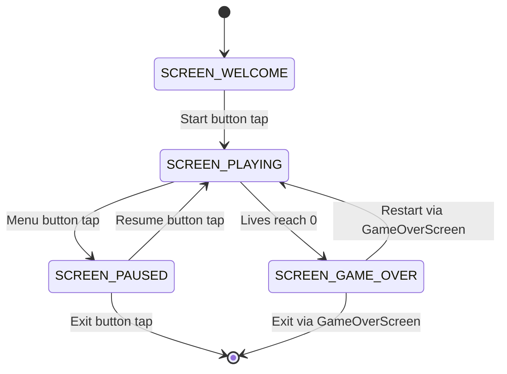
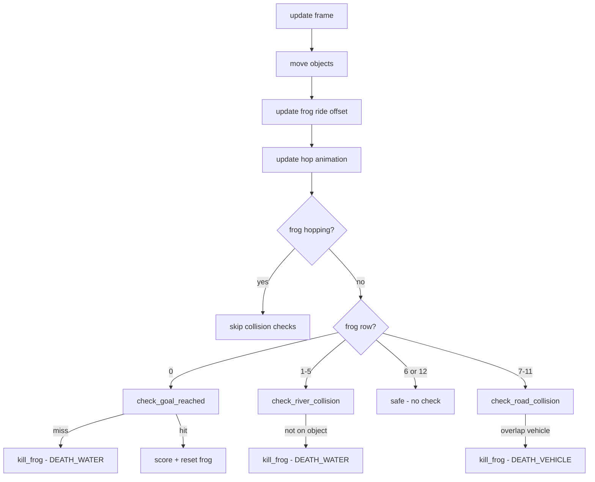

# Frogger — Design Document

## 1. Overview

A Frogger-style arcade game for the RoomWizard hardware platform. The player guides a frog from the bottom of the screen, across roads with traffic and rivers with floating logs, to reach goal slots at the top. All sprites are drawn procedurally using framebuffer primitives — no image/texture loading.

### Platform Constraints

| Constraint | Detail |
|------------|--------|
| Screen | 800x480 landscape framebuffer, ~720x420 safe area |
| Portrait | 480x800 virtual — use `fb.width`/`fb.height`, never hardcode |
| Touch | Resistive single-touch, no keyboard |
| CPU | ARM Cortex-A8 @ 300 MHz |
| Audio | OSS `/dev/dsp` via [`audio.h`](../common/audio.h) convenience functions |
| LEDs | Red + Green via [`hardware.h`](../common/hardware.h) |
| Drawing | Rectangles, circles, lines, text — no textures |

### File Organization

```
native_apps/
  frogger/
    frogger.c     # Single source file (project convention)
    frogger.ppm   # 80x48 icon for game selector
    DESIGN.md     # This document
```

---

## 2. State Machine

Follows the standard game screen pattern from [`common.h`](../common/common.h).

```c
typedef enum {
    SCREEN_WELCOME,
    SCREEN_PLAYING,
    SCREEN_PAUSED,
    SCREEN_GAME_OVER
} GameScreen;
```



---

## 3. Grid System

### 3.1 Lane Layout

The play field is a fixed 13-row grid. Top to bottom:

| Row | Type | Content |
|-----|------|---------|
| 0 | **Goal zone** | 5 lily-pad goal slots on water background |
| 1 | River | Logs moving right — long, 4 cells |
| 2 | River | Turtles moving left — groups of 3 |
| 3 | River | Logs moving right — medium, 3 cells |
| 4 | River | Turtles moving left — groups of 2 |
| 5 | River | Logs moving right — short, 2 cells |
| 6 | **Median** | Safe grass strip |
| 7 | Road | Race car moving left — fast, 1 cell |
| 8 | Road | Sedan moving right — medium, 1 cell |
| 9 | Road | Truck moving left — slow, 2 cells |
| 10 | Road | Sedan moving right — medium, 1 cell |
| 11 | Road | Truck moving left — slow, 2 cells |
| 12 | **Start zone** | Safe grass strip — frog spawn point |

```
Row 0:  [~~*~~*~~*~~*~~*~~]  Goal slots
Row 1:  [~~~~=====>~~~~~=====>~~~]  Logs right
Row 2:  [~~~<ooo~~~~~~<ooo~~~~~~]   Turtles left
Row 3:  [~~~~~===>~~~~~~===>~~~~]   Logs right
Row 4:  [~~<oo~~~~~~~~<oo~~~~~~~]   Turtles left
Row 5:  [~~~~~~~==>~~~~~~~~==>~~]   Logs right
Row 6:  [########################]  Median - grass
Row 7:  [---<F---------<F-------]   Race car left - fast
Row 8:  [----S>---------S>------]   Sedan right
Row 9:  [--<TT--------<TT------]   Truck left
Row 10: [------S>--------S>-----]   Sedan right
Row 11: [---<TT---------<TT----]   Truck left
Row 12: [########################]  Start zone - grass
```

### 3.2 Dynamic Grid Dimensions

All dimensions are computed at runtime from `fb.width` and `fb.height`:

```c
#define NUM_ROWS     13
#define HUD_HEIGHT   70
#define NUM_GOALS    5

// Computed at init:
int available_height = fb.height - HUD_HEIGHT;
int cell_size = available_height / NUM_ROWS;
int num_cols = fb.width / cell_size;
int grid_width = num_cols * cell_size;
int grid_height = NUM_ROWS * cell_size;
int grid_offset_x = (fb.width - grid_width) / 2;
int grid_offset_y = HUD_HEIGHT;
```

### 3.3 Dimension Examples

| Orientation | `fb` size | `cell_size` | `num_cols` | Grid pixels |
|-------------|-----------|-------------|------------|-------------|
| Landscape | 800x480 | 31 | 25 | 775x403 |
| Portrait | 480x800 | 56 | 8 | 448x728 |

### 3.4 Goal Slot Placement

Goal slots are evenly distributed across the top row:

```c
int goal_spacing = num_cols / (NUM_GOALS + 1);
int goal_cols[NUM_GOALS];  // column indices
for (int i = 0; i < NUM_GOALS; i++) {
    goal_cols[i] = goal_spacing * (i + 1);
}
```

| Orientation | `num_cols` | Goal columns |
|-------------|------------|--------------|
| Landscape 25 cols | 25 | 4, 8, 12, 16, 20 |
| Portrait 8 cols | 8 | Use even-spread formula below |

For portrait with few columns, use a formula that spreads goals more evenly:

```c
for (int i = 0; i < NUM_GOALS; i++) {
    goal_cols[i] = (i * num_cols + num_cols / 2) / NUM_GOALS;
}
```

---

## 4. Data Structures

### 4.1 Core Structures

```c
#define MAX_OBJECTS_PER_LANE 6
#define MAX_LANES 12  // Rows 1-5 (river) + 7-11 (road)

typedef enum {
    LANE_ROAD,
    LANE_RIVER
} LaneType;

typedef enum {
    OBJ_CAR,       // 1 cell wide, road
    OBJ_TRUCK,     // 2 cells wide, road
    OBJ_RACE_CAR,  // 1 cell wide, road, faster
    OBJ_LOG_SHORT, // 2 cells wide, river
    OBJ_LOG_MED,   // 3 cells wide, river
    OBJ_LOG_LONG,  // 4 cells wide, river
    OBJ_TURTLE_2,  // 2 cells wide, river, group of 2
    OBJ_TURTLE_3   // 3 cells wide, river, group of 3
} ObjectType;

typedef struct {
    ObjectType type;
    float x;         // Pixel position (sub-pixel for smooth movement)
    int width_cells;  // Width in cells
    uint32_t color;   // Primary body color
} LaneObject;

typedef struct {
    int row;                    // Grid row (0-12)
    LaneType type;              // Road or river
    int direction;              // -1 = left, +1 = right
    float speed;                // Pixels per frame
    LaneObject objects[MAX_OBJECTS_PER_LANE];
    int object_count;
} Lane;

typedef struct {
    int col;          // Grid column
    int row;          // Grid row (0-12)
    float ride_offset; // Horizontal offset when riding a log/turtle (pixels)
    int target_col;    // Target column for hop animation
    int target_row;    // Target row for hop animation
    float hop_progress; // 0.0 = at current cell, 1.0 = arrived at target
    bool hopping;       // Currently in a hop animation
    bool alive;
    int facing;         // 0=up, 1=down, 2=left, 3=right (for sprite direction)
} Frog;

typedef struct {
    int score;
    int lives;
    int level;
    bool goals_reached[NUM_GOALS]; // Which goal slots are filled
    int goals_filled;              // Count of filled goals
    float timer;                   // Seconds remaining (30s per attempt)
    int highest_row;               // Furthest row reached this life (for scoring)
} GameState;

typedef struct {
    Lane lanes[MAX_LANES];
    int lane_count;
    Frog frog;
    GameState state;
} FroggerGame;
```

### 4.2 Global Variables

Following the project convention (see [`snake.c`](../snake/snake.c)):

```c
Framebuffer fb;
TouchInput touch;
Audio audio;
FroggerGame game;
bool running = true;
GameScreen current_screen = SCREEN_WELCOME;
HighScoreTable hs_table;
static GameOverScreen gos;

// UI Buttons
Button menu_button;
Button exit_button;
Button start_button;
Button resume_button;
Button exit_pause_button;

// Grid dimensions (computed once in init)
int cell_size;
int num_cols;
int grid_offset_x;
int grid_offset_y;
int goal_cols[NUM_GOALS];
```

---

## 5. Sprite Rendering

All sprites are rendered using only [`framebuffer.h`](../common/framebuffer.h) primitives: [`fb_fill_rect()`](../common/framebuffer.h:82), [`fb_draw_rect()`](../common/framebuffer.h:79), [`fb_fill_circle()`](../common/framebuffer.h:88), [`fb_draw_circle()`](../common/framebuffer.h:85), [`fb_draw_line()`](../common/framebuffer.h:100), [`fb_draw_thick_line()`](../common/framebuffer.h:114), and [`fb_fill_rounded_rect()`](../common/framebuffer.h:94).

All coordinates below are relative to the top-left of the cell. `cs` = `cell_size`. Insets use `p` = `cs / 8` as the base padding unit.

### 5.1 Color Palette

```c
// Environment
#define COLOR_GRASS_DARK    RGB(34, 120, 34)
#define COLOR_GRASS_LIGHT   RGB(50, 160, 50)
#define COLOR_WATER_DARK    RGB(20, 50, 140)
#define COLOR_WATER_LIGHT   RGB(40, 80, 180)
#define COLOR_WATER_WAVE    RGB(60, 110, 200)
#define COLOR_ROAD_DARK     RGB(50, 50, 55)
#define COLOR_ROAD_LIGHT    RGB(70, 70, 75)
#define COLOR_ROAD_LINE     RGB(200, 200, 60)
#define COLOR_MEDIAN_DARK   RGB(100, 80, 40)

// Frog
#define COLOR_FROG_BODY     RGB(30, 180, 30)
#define COLOR_FROG_DARK     RGB(20, 120, 20)
#define COLOR_FROG_BELLY    RGB(150, 220, 100)
#define COLOR_FROG_EYE_W    RGB(255, 255, 255)
#define COLOR_FROG_EYE_B    RGB(0, 0, 0)

// Vehicles
#define COLOR_CAR_RED       RGB(200, 40, 40)
#define COLOR_CAR_BLUE      RGB(40, 80, 200)
#define COLOR_CAR_YELLOW    RGB(220, 200, 40)
#define COLOR_CAR_WHITE     RGB(220, 220, 220)
#define COLOR_TRUCK_PURPLE  RGB(120, 40, 160)
#define COLOR_TRUCK_ORANGE  RGB(220, 120, 30)
#define COLOR_RACE_CAR      RGB(255, 60, 60)
#define COLOR_WHEEL         RGB(30, 30, 30)
#define COLOR_WINDOW        RGB(150, 200, 240)

// River objects
#define COLOR_LOG_DARK      RGB(100, 60, 20)
#define COLOR_LOG_LIGHT     RGB(140, 90, 40)
#define COLOR_LOG_BARK      RGB(80, 45, 15)
#define COLOR_TURTLE_SHELL  RGB(50, 100, 50)
#define COLOR_TURTLE_DARK   RGB(30, 70, 30)
#define COLOR_TURTLE_HEAD   RGB(80, 140, 80)

// Goal
#define COLOR_LILYPAD       RGB(30, 140, 50)
#define COLOR_LILYPAD_LIGHT RGB(60, 180, 80)
#define COLOR_GOAL_FROG     RGB(80, 200, 80)
```

### 5.2 Frog Sprite

The frog faces upward by default. The sprite is drawn within a single cell.

```
  cs = cell_size, p = cs/8

  +---------- cs ----------+
  |    p                    |  p top padding
  |     [EYE]   [EYE]      |  Eyes: 2 circles at top
  |       [  HEAD  ]        |  Head: filled circle
  |    [    BODY     ]      |  Body: rounded rect
  |    [    BODY     ]      |
  |  [LEG]  BODY  [LEG]    |  Front legs: small rects
  |    [    BODY     ]      |
  |  [LEG]        [LEG]    |  Back legs: small rects
  |    p                    |  p bottom padding
  +-------------------------+
```

```c
void draw_frog(int screen_x, int screen_y) {
    int cs = cell_size;
    int p = cs / 8;
    int cx = screen_x + cs / 2;  // Center X
    int cy = screen_y + cs / 2;  // Center Y
    int body_w = cs - p * 3;
    int body_h = cs - p * 3;
    int body_x = screen_x + (cs - body_w) / 2;
    int body_y = screen_y + (cs - body_h) / 2 + p / 2;

    // Body: rounded rectangle
    fb_fill_rounded_rect(&fb, body_x, body_y, body_w, body_h,
                         p, COLOR_FROG_BODY);

    // Belly highlight: smaller rect in center
    fb_fill_rect(&fb, body_x + p, body_y + body_h / 3,
                 body_w - p * 2, body_h / 3, COLOR_FROG_BELLY);

    // Legs: 4 small rectangles at corners
    int leg_w = p * 2;
    int leg_h = p;
    // Top-left leg
    fb_fill_rect(&fb, body_x - leg_w / 2, body_y + p,
                 leg_w, leg_h, COLOR_FROG_DARK);
    // Top-right leg
    fb_fill_rect(&fb, body_x + body_w - leg_w / 2, body_y + p,
                 leg_w, leg_h, COLOR_FROG_DARK);
    // Bottom-left leg
    fb_fill_rect(&fb, body_x - leg_w / 2, body_y + body_h - p * 2,
                 leg_w, leg_h, COLOR_FROG_DARK);
    // Bottom-right leg
    fb_fill_rect(&fb, body_x + body_w - leg_w / 2, body_y + body_h - p * 2,
                 leg_w, leg_h, COLOR_FROG_DARK);

    // Eyes: two white circles with black pupils
    int eye_r = cs > 40 ? 3 : 2;
    int pupil_r = eye_r > 2 ? 2 : 1;
    int eye_y = body_y + p;
    int eye_lx = cx - body_w / 4;
    int eye_rx = cx + body_w / 4;
    fb_fill_circle(&fb, eye_lx, eye_y, eye_r, COLOR_FROG_EYE_W);
    fb_fill_circle(&fb, eye_rx, eye_y, eye_r, COLOR_FROG_EYE_W);
    fb_fill_circle(&fb, eye_lx, eye_y, pupil_r, COLOR_FROG_EYE_B);
    fb_fill_circle(&fb, eye_rx, eye_y, pupil_r, COLOR_FROG_EYE_B);
}
```

### 5.3 Car Sprite (1 cell)

```
  +---------- cs ----------+
  |    p                    |
  |    [====ROOF====]       |  Roof: rounded rect, darker
  |    [  WINDOW  ]         |  Window: small rect, light blue
  |    [====BODY====]       |  Body: rounded rect, car color
  |    [====BODY====]       |
  |   (o)        (o)        |  Wheels: 2 filled circles
  |    p                    |
  +-------------------------+
```

```c
void draw_car(int sx, int sy, uint32_t color) {
    int cs = cell_size;
    int p = cs / 8;
    int bx = sx + p;
    int by = sy + p * 2;
    int bw = cs - p * 2;
    int bh = cs - p * 4;

    // Body
    fb_fill_rounded_rect(&fb, bx, by, bw, bh, p / 2, color);

    // Roof (top portion, slightly inset)
    fb_fill_rect(&fb, bx + p, by + p, bw - p * 2, bh / 3,
                 RGB(((color >> 16) & 0xFF) * 3 / 4,
                     ((color >> 8) & 0xFF) * 3 / 4,
                     (color & 0xFF) * 3 / 4));

    // Window
    fb_fill_rect(&fb, bx + p * 2, by + p + 1, bw - p * 4, bh / 4,
                 COLOR_WINDOW);

    // Wheels
    int wheel_r = p > 2 ? p : 2;
    fb_fill_circle(&fb, bx + p * 2, by + bh, wheel_r, COLOR_WHEEL);
    fb_fill_circle(&fb, bx + bw - p * 2, by + bh, wheel_r, COLOR_WHEEL);
}
```

### 5.4 Truck Sprite (2 cells)

```
  +------------- 2 * cs ---------------+
  |   p                                 |
  |   [CABIN][======CARGO======]        |  Cabin: small rect; Cargo: large rect
  |   [  W  ][======CARGO======]        |  Window in cabin
  |   [CABIN][======CARGO======]        |
  |  (o)  (o)              (o)  (o)     |  4 wheels
  |   p                                 |
  +-------------------------------------+
```

```c
void draw_truck(int sx, int sy, uint32_t color) {
    int cs = cell_size;
    int p = cs / 8;
    int tw = cs * 2 - p * 2;  // Total truck width
    int th = cs - p * 4;
    int tx = sx + p;
    int ty = sy + p * 2;

    // Cargo area (larger portion)
    int cargo_w = tw * 2 / 3;
    int cargo_x = tx + tw - cargo_w;
    fb_fill_rounded_rect(&fb, cargo_x, ty, cargo_w, th, p / 2, color);

    // Darker cargo detail lines
    uint32_t dark = RGB(((color >> 16) & 0xFF) * 2 / 3,
                        ((color >> 8) & 0xFF) * 2 / 3,
                        (color & 0xFF) * 2 / 3);
    for (int i = 1; i < 3; i++) {
        int lx = cargo_x + (cargo_w * i) / 3;
        fb_draw_line(&fb, lx, ty + 2, lx, ty + th - 2, dark);
    }

    // Cabin (smaller left portion)
    int cab_w = tw - cargo_w;
    fb_fill_rounded_rect(&fb, tx, ty, cab_w + 2, th, p / 2,
                         RGB(((color >> 16) & 0xFF) * 3 / 4,
                             ((color >> 8) & 0xFF) * 3 / 4,
                             (color & 0xFF) * 3 / 4));

    // Window on cabin
    fb_fill_rect(&fb, tx + p, ty + p, cab_w - p * 2, th / 2, COLOR_WINDOW);

    // Wheels (4)
    int wr = p > 2 ? p : 2;
    fb_fill_circle(&fb, tx + p * 2, ty + th, wr, COLOR_WHEEL);
    fb_fill_circle(&fb, tx + cab_w, ty + th, wr, COLOR_WHEEL);
    fb_fill_circle(&fb, cargo_x + cargo_w / 3, ty + th, wr, COLOR_WHEEL);
    fb_fill_circle(&fb, cargo_x + cargo_w * 2 / 3, ty + th, wr, COLOR_WHEEL);
}
```

### 5.5 Race Car Sprite (1 cell)

Similar to car but lower profile, brighter color, with a stripe.

```c
void draw_race_car(int sx, int sy, uint32_t color) {
    int cs = cell_size;
    int p = cs / 8;
    int bx = sx + p;
    int by = sy + cs / 3;  // Lower profile
    int bw = cs - p * 2;
    int bh = cs / 2;

    // Low body
    fb_fill_rounded_rect(&fb, bx, by, bw, bh, p, color);

    // Racing stripe (white line down center)
    fb_draw_thick_line(&fb, bx + bw / 2, by + 2,
                       bx + bw / 2, by + bh - 2, 2, COLOR_WHITE);

    // Wheels
    int wr = p > 2 ? p : 2;
    fb_fill_circle(&fb, bx + p, by + bh, wr, COLOR_WHEEL);
    fb_fill_circle(&fb, bx + bw - p, by + bh, wr, COLOR_WHEEL);
}
```

### 5.6 Log Sprite (variable width: 2-4 cells)

```c
void draw_log(int sx, int sy, int width_cells) {
    int cs = cell_size;
    int p = cs / 8;
    int lw = width_cells * cs;
    int lh = cs - p * 3;
    int lx = sx;
    int ly = sy + p + p / 2;

    // Main log body
    fb_fill_rounded_rect(&fb, lx, ly, lw, lh, lh / 2, COLOR_LOG_LIGHT);

    // Bark texture: horizontal lines
    for (int i = 1; i <= 3; i++) {
        int line_y = ly + (lh * i) / 4;
        fb_draw_line(&fb, lx + p * 2, line_y, lx + lw - p * 2, line_y,
                     COLOR_LOG_BARK);
    }

    // End caps (darker circles at each end)
    int cap_r = lh / 2 - 1;
    fb_fill_circle(&fb, lx + cap_r + 1, ly + lh / 2, cap_r, COLOR_LOG_DARK);
    fb_fill_circle(&fb, lx + lw - cap_r - 1, ly + lh / 2, cap_r, COLOR_LOG_DARK);

    // Ring detail on end caps
    fb_draw_circle(&fb, lx + cap_r + 1, ly + lh / 2,
                   cap_r / 2, COLOR_LOG_BARK);
    fb_draw_circle(&fb, lx + lw - cap_r - 1, ly + lh / 2,
                   cap_r / 2, COLOR_LOG_BARK);
}
```

### 5.7 Turtle Sprite (group of 2 or 3, each 1 cell)

Each turtle in the group is drawn as a circular shell with a head.

```c
void draw_turtle_group(int sx, int sy, int count) {
    int cs = cell_size;
    int p = cs / 8;

    for (int i = 0; i < count; i++) {
        int tx = sx + i * cs;
        int cx = tx + cs / 2;
        int cy = sy + cs / 2;
        int shell_r = cs / 2 - p * 2;

        // Shell (dark green circle)
        fb_fill_circle(&fb, cx, cy, shell_r, COLOR_TURTLE_SHELL);

        // Shell pattern (cross lines)
        fb_draw_line(&fb, cx - shell_r / 2, cy,
                     cx + shell_r / 2, cy, COLOR_TURTLE_DARK);
        fb_draw_line(&fb, cx, cy - shell_r / 2,
                     cx, cy + shell_r / 2, COLOR_TURTLE_DARK);

        // Shell highlight (small lighter circle)
        fb_fill_circle(&fb, cx - 1, cy - 1,
                       shell_r / 3, COLOR_TURTLE_HEAD);

        // Head (small circle poking out the top-right)
        fb_fill_circle(&fb, cx + shell_r - 1, cy - shell_r / 2,
                       p + 1, COLOR_TURTLE_HEAD);
    }
}
```

### 5.8 Lane Backgrounds

#### Water (river lanes)

```c
void draw_water_lane(int row) {
    int y = grid_offset_y + row * cell_size;
    int w = grid_width;
    int x = grid_offset_x;

    // Base water
    fb_fill_rect(&fb, x, y, w, cell_size, COLOR_WATER_DARK);

    // Animated wave pattern: horizontal wavy lines
    // Phase offset based on current_frame for animation
    int wave_y1 = y + cell_size / 3;
    int wave_y2 = y + cell_size * 2 / 3;
    for (int wx = 0; wx < w; wx += cell_size / 2) {
        int offset = (current_frame / 4 + wx / 8) % 6;
        fb_fill_rect(&fb, x + wx, wave_y1 + offset - 3,
                     cell_size / 4, 2, COLOR_WATER_WAVE);
        fb_fill_rect(&fb, x + wx + cell_size / 4, wave_y2 - offset + 3,
                     cell_size / 4, 2, COLOR_WATER_LIGHT);
    }
}
```

#### Road (road lanes)

```c
void draw_road_lane(int row) {
    int y = grid_offset_y + row * cell_size;
    int w = grid_width;
    int x = grid_offset_x;

    // Asphalt
    fb_fill_rect(&fb, x, y, w, cell_size, COLOR_ROAD_DARK);

    // Dashed center line (yellow)
    int dash_y = y + cell_size / 2 - 1;
    for (int dx = 0; dx < w; dx += cell_size) {
        fb_fill_rect(&fb, x + dx + 2, dash_y,
                     cell_size / 2 - 2, 2, COLOR_ROAD_LINE);
    }
}
```

#### Grass (safe zones -- rows 6 and 12)

```c
void draw_grass_lane(int row) {
    int y = grid_offset_y + row * cell_size;
    int w = grid_width;
    int x = grid_offset_x;

    // Base grass
    fb_fill_rect(&fb, x, y, w, cell_size, COLOR_GRASS_DARK);

    // Texture: scattered darker dots
    srand(row * 1000);  // Deterministic pattern per row
    for (int i = 0; i < w / 8; i++) {
        int dx = rand() % w;
        int dy = rand() % cell_size;
        fb_fill_rect(&fb, x + dx, y + dy, 2, 2, COLOR_GRASS_LIGHT);
    }
}
```

#### Goal Zone (row 0)

```c
void draw_goal_zone() {
    int y = grid_offset_y;
    int x = grid_offset_x;
    int w = grid_width;

    // Water background
    fb_fill_rect(&fb, x, y, w, cell_size, COLOR_WATER_DARK);

    // Draw lily pad at each goal slot
    for (int i = 0; i < NUM_GOALS; i++) {
        int pad_x = grid_offset_x + goal_cols[i] * cell_size + cell_size / 2;
        int pad_y = y + cell_size / 2;
        int pad_r = cell_size / 2 - 2;

        if (game.state.goals_reached[i]) {
            // Filled goal: show a small frog
            fb_fill_circle(&fb, pad_x, pad_y, pad_r, COLOR_LILYPAD);
            // Mini frog on the pad
            fb_fill_circle(&fb, pad_x, pad_y, pad_r / 2, COLOR_GOAL_FROG);
            fb_fill_circle(&fb, pad_x - pad_r / 4, pad_y - pad_r / 3,
                           2, COLOR_FROG_EYE_W);
            fb_fill_circle(&fb, pad_x + pad_r / 4, pad_y - pad_r / 3,
                           2, COLOR_FROG_EYE_W);
        } else {
            // Empty goal: lily pad
            fb_fill_circle(&fb, pad_x, pad_y, pad_r, COLOR_LILYPAD);
            // Lily pad notch (V-shaped cut at top)
            fb_draw_line(&fb, pad_x, pad_y,
                         pad_x - pad_r / 2, pad_y - pad_r, COLOR_WATER_DARK);
            fb_draw_line(&fb, pad_x, pad_y,
                         pad_x + pad_r / 2, pad_y - pad_r, COLOR_WATER_DARK);
            // Highlight
            fb_fill_circle(&fb, pad_x + 1, pad_y + 1,
                           pad_r / 3, COLOR_LILYPAD_LIGHT);
        }
    }
}
```

### 5.9 Death Animation Sprite

When the frog dies, draw a brief "splat" animation:

```c
void draw_death_splash(int screen_x, int screen_y, int frame) {
    int cs = cell_size;
    int cx = screen_x + cs / 2;
    int cy = screen_y + cs / 2;

    // Expanding red circles (3 frames)
    int r = cs / 4 + frame * cs / 8;
    fb_fill_circle(&fb, cx, cy, r, COLOR_RED);
    // Small "X" marks at center
    fb_draw_line(&fb, cx - r / 2, cy - r / 2,
                 cx + r / 2, cy + r / 2, COLOR_WHITE);
    fb_draw_line(&fb, cx + r / 2, cy - r / 2,
                 cx - r / 2, cy + r / 2, COLOR_WHITE);
}
```

---

## 6. Touch Controls

### 6.1 Input Method

Direction is determined by comparing the touch position to the frog's screen position -- identical to the pattern used in [`snake.c`](../snake/snake.c:377).

```c
void handle_direction_input(int touch_x, int touch_y) {
    if (game.frog.hopping) return;  // Ignore input during hop animation

    // Calculate frog's screen center
    int frog_sx = grid_offset_x + game.frog.col * cell_size + cell_size / 2
                  + (int)game.frog.ride_offset;
    int frog_sy = grid_offset_y + game.frog.row * cell_size + cell_size / 2;

    int dx = touch_x - frog_sx;
    int dy = touch_y - frog_sy;

    // Require minimum distance (1/2 cell) to avoid accidental taps
    int min_dist = cell_size / 2;
    if (abs(dx) < min_dist && abs(dy) < min_dist) return;

    if (abs(dx) > abs(dy)) {
        // Horizontal hop
        if (dx > 0) hop_frog(0, +1);  // Right
        else        hop_frog(0, -1);  // Left
    } else {
        // Vertical hop
        if (dy < 0) hop_frog(-1, 0);  // Up (toward goals)
        else        hop_frog(+1, 0);  // Down
    }
}
```

### 6.2 Hop Mechanic

Each tap triggers exactly one hop. The frog moves one cell in the determined direction. A short hop animation (8 frames, ~130ms at 60 FPS) smoothly interpolates the position.

```c
void hop_frog(int drow, int dcol) {
    int new_row = game.frog.row + drow;
    int new_col = game.frog.col + dcol;

    // Bounds check
    if (new_col < 0 || new_col >= num_cols) return;
    if (new_row < 0 || new_row > 12) return;

    game.frog.target_row = new_row;
    game.frog.target_col = new_col;
    game.frog.hop_progress = 0.0f;
    game.frog.hopping = true;
    game.frog.facing = /* set based on drow, dcol */;
    game.frog.ride_offset = 0;  // Reset ride offset when hopping

    // Score for forward progress
    if (drow < 0 && new_row < game.state.highest_row) {
        game.state.score += 10;
        game.state.highest_row = new_row;
    }

    audio_beep(&audio);  // Hop sound
}

#define HOP_DURATION 8  // frames

void update_hop() {
    if (!game.frog.hopping) return;

    game.frog.hop_progress += 1.0f / HOP_DURATION;
    if (game.frog.hop_progress >= 1.0f) {
        game.frog.row = game.frog.target_row;
        game.frog.col = game.frog.target_col;
        game.frog.hop_progress = 0;
        game.frog.hopping = false;
    }
}
```

### 6.3 Frog Position During Hop (for rendering)

```c
float t = game.frog.hop_progress;
int from_x = grid_offset_x + game.frog.col * cell_size;
int from_y = grid_offset_y + game.frog.row * cell_size;
int to_x = grid_offset_x + game.frog.target_col * cell_size;
int to_y = grid_offset_y + game.frog.target_row * cell_size;

// Smooth interpolation with slight arc
int draw_x = from_x + (int)((to_x - from_x) * t);
int draw_y = from_y + (int)((to_y - from_y) * t);
// Arc: lift the frog slightly during mid-hop
int arc_offset = (int)(sinf(t * 3.14159f) * cell_size / 3);
draw_y -= arc_offset;
```

### 6.4 Button Touch Handling

Menu, exit, and overlay buttons follow the standard pattern. The touch area for direction input excludes the HUD region:

```c
void handle_input() {
    touch_poll(&touch);
    TouchState state = touch_get_state(&touch);
    uint32_t now = get_time_ms();

    if (current_screen == SCREEN_PLAYING && state.pressed) {
        // Check exit button
        if (button_is_touched(&exit_button, state.x, state.y) &&
            button_check_press(&exit_button, true, now)) {
            fb_fade_out(&fb);
            running = false;
            return;
        }
        // Check menu button
        if (button_is_touched(&menu_button, state.x, state.y) &&
            button_check_press(&menu_button, true, now)) {
            current_screen = SCREEN_PAUSED;
            return;
        }
        // Direction input (only in play area)
        if (state.y >= grid_offset_y) {
            handle_direction_input(state.x, state.y);
        }
    }
    // ... welcome, pause, gameover handling (same pattern as snake.c) ...
}
```

---

## 7. Object Movement and Spawning

### 7.1 Lane Configuration

Each lane is configured at level start with direction, speed, object type, and spacing:

```c
typedef struct {
    int row;
    LaneType type;
    ObjectType obj_type;
    int direction;       // -1 left, +1 right
    float base_speed;    // Pixels/frame at level 1
    int obj_width_cells;
    int spacing_cells;   // Gap between objects
    uint32_t color;      // Object color for this lane
} LaneConfig;

static const LaneConfig lane_configs[] = {
    // River lanes (rows 1-5) -- direction alternates
    { 1, LANE_RIVER, OBJ_LOG_LONG,  +1, 0.8f, 4, 6, COLOR_LOG_LIGHT  },
    { 2, LANE_RIVER, OBJ_TURTLE_3,  -1, 0.6f, 3, 5, COLOR_TURTLE_SHELL },
    { 3, LANE_RIVER, OBJ_LOG_MED,   +1, 1.0f, 3, 5, COLOR_LOG_LIGHT  },
    { 4, LANE_RIVER, OBJ_TURTLE_2,  -1, 0.7f, 2, 6, COLOR_TURTLE_SHELL },
    { 5, LANE_RIVER, OBJ_LOG_SHORT, +1, 0.9f, 2, 4, COLOR_LOG_LIGHT  },
    // Road lanes (rows 7-11) -- direction alternates
    { 7,  LANE_ROAD, OBJ_RACE_CAR, -1, 2.0f, 1, 8, COLOR_RACE_CAR    },
    { 8,  LANE_ROAD, OBJ_CAR,      +1, 1.2f, 1, 6, COLOR_CAR_BLUE    },
    { 9,  LANE_ROAD, OBJ_TRUCK,    -1, 0.8f, 2, 7, COLOR_TRUCK_PURPLE },
    { 10, LANE_ROAD, OBJ_CAR,      +1, 1.4f, 1, 5, COLOR_CAR_YELLOW  },
    { 11, LANE_ROAD, OBJ_TRUCK,    -1, 0.9f, 2, 6, COLOR_TRUCK_ORANGE },
};
#define NUM_LANE_CONFIGS 10
```

### 7.2 Spawning Objects

At level init, populate each lane with evenly spaced objects that fill the width:

```c
void spawn_lane_objects(Lane *lane, const LaneConfig *cfg) {
    int total_width = grid_width;
    int obj_px = cfg->obj_width_cells * cell_size;
    int gap_px = cfg->spacing_cells * cell_size;
    int stride = obj_px + gap_px;

    lane->object_count = 0;
    for (float x = 0; x < total_width + stride; x += stride) {
        if (lane->object_count >= MAX_OBJECTS_PER_LANE) break;
        LaneObject *obj = &lane->objects[lane->object_count++];
        obj->type = cfg->obj_type;
        obj->x = x;
        obj->width_cells = cfg->obj_width_cells;
        obj->color = cfg->color;
    }
}
```

### 7.3 Movement Update

Objects move continuously in pixel space and wrap around:

```c
void update_lanes() {
    float speed_mult = 1.0f + (game.state.level - 1) * 0.15f;
    if (speed_mult > 2.5f) speed_mult = 2.5f;

    for (int i = 0; i < NUM_LANE_CONFIGS; i++) {
        Lane *lane = &game.lanes[i];
        float speed = lane_configs[i].base_speed * speed_mult * lane->direction;

        for (int j = 0; j < lane->object_count; j++) {
            LaneObject *obj = &lane->objects[j];
            obj->x += speed;

            int obj_w = obj->width_cells * cell_size;

            // Wrap around
            if (lane->direction > 0 && obj->x > grid_width) {
                obj->x -= grid_width + obj_w;
            } else if (lane->direction < 0 && obj->x + obj_w < 0) {
                obj->x += grid_width + obj_w;
            }
        }
    }
}
```

### 7.4 Frog Riding on River Objects

When the frog is on a river lane and standing on a log/turtle, the frog drifts with the object:

```c
void update_frog_ride() {
    if (game.frog.hopping) return;
    if (game.frog.row < 1 || game.frog.row > 5) return;  // Not on river

    Lane *lane = get_lane_for_row(game.frog.row);
    if (!lane) return;

    // Apply lane movement to frog
    float speed_mult = 1.0f + (game.state.level - 1) * 0.15f;
    if (speed_mult > 2.5f) speed_mult = 2.5f;
    float speed = lane_configs[lane_index_for_row(game.frog.row)].base_speed
                  * speed_mult * lane->direction;
    game.frog.ride_offset += speed;

    // If ride_offset exceeds a cell, snap to next column
    if (game.frog.ride_offset >= cell_size) {
        game.frog.col++;
        game.frog.ride_offset -= cell_size;
    } else if (game.frog.ride_offset <= -cell_size) {
        game.frog.col--;
        game.frog.ride_offset += cell_size;
    }

    // Check if frog drifted off screen
    if (game.frog.col < 0 || game.frog.col >= num_cols) {
        kill_frog(DEATH_OFFSCREEN);
    }
}
```

---

## 8. Collision Detection

### 8.1 Approach

Collision is checked every frame after object movement, using axis-aligned bounding box (AABB) overlap between the frog and all objects in the frog's current lane.

```c
typedef struct {
    float x;
    float y;
    float w;
    float h;
} AABB;

bool aabb_overlap(AABB *a, AABB *b) {
    return a->x < b->x + b->w && a->x + a->w > b->x &&
           a->y < b->y + b->h && a->y + a->h > b->y;
}
```

### 8.2 Frog AABB

```c
AABB frog_box() {
    int p = cell_size / 8;  // Slight inset for forgiving collision
    AABB box;
    box.x = game.frog.col * cell_size + game.frog.ride_offset + p;
    box.y = game.frog.row * cell_size + p;  // Relative to grid
    box.w = cell_size - p * 2;
    box.h = cell_size - p * 2;
    return box;
}
```

### 8.3 Road Collision (rows 7-11)

If the frog's AABB overlaps any vehicle, the frog dies.

```c
void check_road_collision() {
    if (game.frog.row < 7 || game.frog.row > 11) return;
    if (game.frog.hopping) return;

    AABB fbox = frog_box();
    Lane *lane = get_lane_for_row(game.frog.row);

    for (int i = 0; i < lane->object_count; i++) {
        AABB obj_box;
        obj_box.x = lane->objects[i].x;
        obj_box.y = (game.frog.row - lane->row) * cell_size;
        obj_box.w = lane->objects[i].width_cells * cell_size;
        obj_box.h = cell_size;

        if (aabb_overlap(&fbox, &obj_box)) {
            kill_frog(DEATH_VEHICLE);
            return;
        }
    }
}
```

### 8.4 River Collision (rows 1-5)

If the frog is on a river lane, it MUST be standing on a log or turtle. If not on any floating object, it falls in water and dies.

```c
void check_river_collision() {
    if (game.frog.row < 1 || game.frog.row > 5) return;
    if (game.frog.hopping) return;

    AABB fbox = frog_box();
    Lane *lane = get_lane_for_row(game.frog.row);
    bool on_object = false;

    for (int i = 0; i < lane->object_count; i++) {
        AABB obj_box;
        obj_box.x = lane->objects[i].x;
        obj_box.y = 0;
        obj_box.w = lane->objects[i].width_cells * cell_size;
        obj_box.h = cell_size;

        // Check horizontal overlap (same row guaranteed)
        if (fbox.x < obj_box.x + obj_box.w && fbox.x + fbox.w > obj_box.x) {
            on_object = true;
            break;
        }
    }

    if (!on_object) {
        kill_frog(DEATH_WATER);
    }
}
```

### 8.5 Goal Detection (row 0)

When the frog reaches row 0, check if it landed on a goal slot:

```c
void check_goal_reached() {
    if (game.frog.row != 0) return;

    for (int i = 0; i < NUM_GOALS; i++) {
        if (game.frog.col == goal_cols[i] && !game.state.goals_reached[i]) {
            // Goal reached!
            game.state.goals_reached[i] = true;
            game.state.goals_filled++;
            game.state.score += 50;

            // Time bonus: remaining seconds * 10
            game.state.score += (int)game.state.timer * 10;

            audio_success(&audio);
            start_led_effect(1);  // Green LED flash

            if (game.state.goals_filled >= NUM_GOALS) {
                advance_level();
            } else {
                reset_frog_position();
            }
            return;
        }
    }

    // Landed on row 0 but NOT on a goal slot: water death
    kill_frog(DEATH_WATER);
}
```

### 8.6 Collision Flow



---

## 9. Scoring and Progression

### 9.1 Scoring Table

| Event | Points |
|-------|--------|
| Forward hop (new highest row) | +10 |
| Reach a goal slot | +50 |
| Time bonus per remaining second | +10 |
| All 5 goals filled (level complete) | +500 bonus |

### 9.2 Timer

- 30 seconds per life attempt
- Displayed as a horizontal bar at the top of the screen, shrinking from right to left
- Bar changes color: green at full, yellow under 10s, red under 5s
- When timer reaches 0, the frog dies

```c
#define TIMER_MAX 30.0f

void update_timer(float dt) {
    game.state.timer -= dt;
    if (game.state.timer <= 0) {
        game.state.timer = 0;
        kill_frog(DEATH_TIMEOUT);
    }
}
```

### 9.3 Lives

- Start with 3 lives
- Lose 1 on any death
- Displayed as small frog icons in the HUD
- When lives reach 0, transition to SCREEN_GAME_OVER

### 9.4 Death Types

```c
typedef enum {
    DEATH_VEHICLE,   // Hit by car/truck
    DEATH_WATER,     // Fell in water (river or missed goal)
    DEATH_TIMEOUT,   // Timer ran out
    DEATH_OFFSCREEN  // Drifted off screen on a log/turtle
} DeathType;
```

### 9.5 Level Progression

When all 5 goals are filled:

```c
void advance_level() {
    game.state.level++;
    game.state.score += 500;  // Level completion bonus

    // Reset goals
    for (int i = 0; i < NUM_GOALS; i++) {
        game.state.goals_reached[i] = false;
    }
    game.state.goals_filled = 0;

    // Re-initialize lanes with increased difficulty
    init_lanes();

    // Reset frog
    reset_frog_position();

    // Level transition effect
    start_led_effect(3);  // Green/yellow LED celebration
    audio_success(&audio);
}
```

### 9.6 Difficulty Scaling

| Level | Speed multiplier | Effect |
|-------|-----------------|--------|
| 1 | 1.00x | Base speeds |
| 2 | 1.15x | Slightly faster |
| 3 | 1.30x | Noticeable increase |
| 4 | 1.45x | Challenging |
| 5 | 1.60x | Fast |
| 6+ | +0.15x per level | Capped at 2.5x at level 11 |

The speed multiplier is capped at 2.5x to prevent the game from becoming impossible:

```c
float speed_mult = 1.0f + (game.state.level - 1) * 0.15f;
if (speed_mult > 2.5f) speed_mult = 2.5f;
```

---

## 10. Death and Respawn

### 10.1 Kill Frog

```c
void kill_frog(DeathType cause) {
    game.frog.alive = false;
    game.state.lives--;

    // LED + audio feedback
    start_led_effect(2);  // Red pulse
    audio_fail(&audio);

    // Start death animation (12 frames, ~200ms)
    death_anim_frame = 0;
    death_anim_active = true;
    death_cause = cause;

    if (game.state.lives <= 0) {
        // Game over after death animation completes
        game_over_pending = true;
    }
}
```

### 10.2 Death Animation

The death animation plays for 12 frames before respawning or showing game over:

```c
int death_anim_frame = 0;
bool death_anim_active = false;
bool game_over_pending = false;

void update_death_animation() {
    if (!death_anim_active) return;

    death_anim_frame++;
    if (death_anim_frame >= 12) {
        death_anim_active = false;
        hw_leds_off();

        if (game_over_pending) {
            current_screen = SCREEN_GAME_OVER;
            gameover_init(&gos, &fb, game.state.score, NULL, NULL,
                         &hs_table, &touch);
        } else {
            reset_frog_position();
        }
    }
}
```

### 10.3 Frog Reset

```c
void reset_frog_position() {
    game.frog.row = 12;  // Start zone
    game.frog.col = num_cols / 2;  // Center column
    game.frog.ride_offset = 0;
    game.frog.hopping = false;
    game.frog.alive = true;
    game.frog.facing = 0;  // Up
    game.state.timer = TIMER_MAX;
    game.state.highest_row = 12;
}
```

---

## 11. HUD Layout

The HUD occupies the top 70 pixels of the screen.

```
+-------[ fb.width ]---------------------------------------+
| [=] FROGGER    SCORE: 1250   LVL: 3   F F F      [X]   |
| [==================-----------] TIMER                     |
+-----------------------------------------------------------+
```

### 11.1 HUD Elements

| Element | Position | Content |
|---------|----------|---------|
| Menu button | Top-left, 10,10 | Hamburger icon, 70x50 |
| Exit button | Top-right, fb.width-80,10 | X icon, 70x50 |
| Title | Center-left of top row | FROGGER text, scale 2 |
| Score | Center of top row | SCORE: %d, scale 2 |
| Level | Right of score | LVL: %d, scale 2 |
| Lives | Right of level | Small frog icons x remaining lives |
| Timer bar | Full width, below top row, y=50 | Horizontal bar, height 12px |

### 11.2 Timer Bar Rendering

```c
void draw_timer_bar() {
    int bar_x = grid_offset_x;
    int bar_y = HUD_HEIGHT - 18;
    int bar_w = grid_width;
    int bar_h = 12;

    // Background
    fb_fill_rect(&fb, bar_x, bar_y, bar_w, bar_h, RGB(40, 40, 40));

    // Fill based on remaining time
    float ratio = game.state.timer / TIMER_MAX;
    int fill_w = (int)(bar_w * ratio);

    // Color based on time remaining
    uint32_t bar_color;
    if (game.state.timer > 10.0f) {
        bar_color = COLOR_GREEN;
    } else if (game.state.timer > 5.0f) {
        bar_color = COLOR_YELLOW;
    } else {
        bar_color = COLOR_RED;
    }

    fb_fill_rect(&fb, bar_x, bar_y, fill_w, bar_h, bar_color);

    // Border
    fb_draw_rect(&fb, bar_x, bar_y, bar_w, bar_h, COLOR_WHITE);
}
```

### 11.3 Life Icons

Each remaining life is drawn as a tiny frog icon (12x12 pixels):

```c
void draw_life_icons(int x, int y) {
    for (int i = 0; i < game.state.lives; i++) {
        int ix = x + i * 18;
        // Tiny frog: green circle with eyes
        fb_fill_circle(&fb, ix + 6, y + 6, 5, COLOR_FROG_BODY);
        fb_fill_circle(&fb, ix + 3, y + 3, 1, COLOR_FROG_EYE_W);
        fb_fill_circle(&fb, ix + 9, y + 3, 1, COLOR_FROG_EYE_W);
    }
}
```

---

## 12. Audio and LED Effects

### 12.1 Audio Events

All audio uses the convenience functions from [`audio.h`](../common/audio.h):

| Event | Function | Description |
|-------|----------|-------------|
| Frog hop | [`audio_beep()`](../common/audio.h:89) | Short 880 Hz blip, ~80ms |
| Reach goal | [`audio_success()`](../common/audio.h:96) | C5-E5-G5 arpeggio, ~440ms |
| Death | [`audio_fail()`](../common/audio.h:98) | G4-E4-C4 descending, ~600ms |
| Level complete | [`audio_success()`](../common/audio.h:96) | Same arpeggio, plays when 5th goal reached |
| Timer warning under 5s | [`audio_tone()`](../common/audio.h:82) | Quick 440 Hz beep every second |

### 12.2 LED Effects

Non-blocking LED effects using the pattern from [`snake.c`](../snake/snake.c:112):

```c
typedef struct {
    bool active;
    int type;           // 0=none, 1=goal, 2=death, 3=level_complete
    uint32_t start_time;
} LEDEffect;

LEDEffect led_effect;

void start_led_effect(int type) {
    led_effect.active = true;
    led_effect.type = type;
    led_effect.start_time = get_time_ms();
}

void update_led_effects() {
    if (!led_effect.active) return;
    uint32_t elapsed = get_time_ms() - led_effect.start_time;

    switch (led_effect.type) {
        case 1:  // Goal reached: green flash 200ms
            if (elapsed < 200) {
                hw_set_leds(HW_LED_COLOR_GREEN);
            } else {
                hw_leds_off();
                led_effect.active = false;
            }
            break;

        case 2:  // Death: red pulse 3x200ms
            {
                int pulse = elapsed / 200;
                int phase = elapsed % 200;
                if (pulse < 3) {
                    hw_set_red_led(phase < 100 ? 100 : 0);
                } else {
                    hw_leds_off();
                    led_effect.active = false;
                }
            }
            break;

        case 3:  // Level complete: green/yellow alternation 600ms
            {
                int phase = (elapsed / 150) % 2;
                if (elapsed < 600) {
                    if (phase == 0) hw_set_leds(HW_LED_COLOR_GREEN);
                    else hw_set_leds(HW_LED_COLOR_YELLOW);
                } else {
                    hw_leds_off();
                    led_effect.active = false;
                }
            }
            break;
    }
}
```

---

## 13. Main Loop

### 13.1 Initialization

```c
int main(int argc, char *argv[]) {
    const char *fb_device = "/dev/fb0";
    const char *touch_device = "/dev/input/touchscreen0";
    if (argc > 1) fb_device = argv[1];
    if (argc > 2) touch_device = argv[2];

    // Singleton guard
    int lock_fd = acquire_instance_lock("frogger");
    if (lock_fd < 0) {
        fprintf(stderr, "frogger: another instance is already running\n");
        return 1;
    }

    signal(SIGINT, signal_handler);
    signal(SIGTERM, signal_handler);

    hw_init();
    hw_set_backlight(100);
    hw_leds_off();
    audio_init(&audio);

    if (fb_init(&fb, fb_device) < 0) return 1;
    if (touch_init(&touch, touch_device) < 0) { fb_close(&fb); return 1; }
    touch_set_screen_size(&touch, fb.width, fb.height);

    srand(time(NULL));

    hs_init(&hs_table, "frogger");
    hs_load(&hs_table);

    init_game();  // Compute grid, init levels, place objects
    init_buttons();
    game.screen = SCREEN_WELCOME;

    // Main loop
    while (running) {
        touch_poll(&touch);
        TouchState ts = touch_get_state(&touch);
        int frame_delay = 33333;  // ~30 FPS

        switch (game.screen) {
            case SCREEN_WELCOME:
                handle_welcome_input(&ts);
                draw_welcome_screen();
                break;
            case SCREEN_PLAYING:
                handle_playing_input(&ts);
                update_game();
                draw_game();
                frame_delay = 33333;
                break;
            case SCREEN_PAUSED:
                handle_paused_input(&ts);
                draw_paused_screen();
                frame_delay = 100000;
                break;
            case SCREEN_GAME_OVER:
                handle_game_over_input(&ts);
                draw_game_over_screen();
                frame_delay = 100000;
                break;
        }

        fb_swap(&fb);
        usleep(frame_delay);
    }

    // Cleanup
    hw_leds_off();
    hw_set_backlight(0);
    audio_close(&audio);
    touch_close(&touch);
    fb_close(&fb);
    release_instance_lock(lock_fd);
    return 0;
}
```

### 13.2 Draw Game

The `draw_game()` function composes the full playing screen each frame:

```c
void draw_game(void) {
    // 1. Clear entire screen
    fb_fill_rect(&fb, 0, 0, fb.width, fb.height, COLOR_BLACK);

    // 2. Draw HUD bar at top
    draw_hud();

    // 3. Draw playing field (lanes, objects, frog)
    draw_playing_field();

    // 4. Draw touch controls overlay
    draw_controls();

    // 5. Draw any active animations (death, level-up)
    draw_animations();
}
```

### 13.3 Draw Playing Field

The playing field rendering follows a strict back-to-front order:

```c
void draw_playing_field(void) {
    int field_y = HUD_HEIGHT;
    int field_h = fb.height - HUD_HEIGHT - CONTROLS_HEIGHT;

    // 1. Draw lane backgrounds (bottom to top)
    for (int i = 0; i < game.num_lanes; i++) {
        Lane *lane = &game.lanes[i];
        int ly = field_y + (game.num_lanes - 1 - i) * game.cell_h;

        switch (lane->type) {
            case LANE_SAFE:
                fb_fill_rect(&fb, 0, ly, fb.width, game.cell_h, COLOR_SAFE_ZONE);
                // Draw grass tufts
                for (int x = 10; x < fb.width; x += 40) {
                    fb_fill_rect(&fb, x, ly + game.cell_h - 4, 3, 4, RGB(0, 180, 0));
                }
                break;
            case LANE_ROAD:
                fb_fill_rect(&fb, 0, ly, fb.width, game.cell_h, COLOR_ROAD);
                // Lane markings (dashed center line)
                for (int x = 0; x < fb.width; x += 30) {
                    fb_fill_rect(&fb, x, ly + game.cell_h / 2 - 1, 15, 2, COLOR_LANE_MARKING);
                }
                break;
            case LANE_RIVER:
                fb_fill_rect(&fb, 0, ly, fb.width, game.cell_h, COLOR_RIVER);
                // Water ripple effect
                int ripple_offset = (game.state.frame_count * 2) % 20;
                for (int x = ripple_offset; x < fb.width; x += 20) {
                    fb_draw_line(&fb, x, ly + game.cell_h/2,
                                 x + 8, ly + game.cell_h/2 - 2,
                                 RGB(100, 150, 255));
                }
                break;
        }
    }

    // 2. Draw objects on each lane (vehicles, logs, turtles)
    for (int i = 0; i < game.num_lanes; i++) {
        Lane *lane = &game.lanes[i];
        int ly = field_y + (game.num_lanes - 1 - i) * game.cell_h;

        for (int j = 0; j < lane->num_objects; j++) {
            LaneObject *obj = &lane->objects[j];
            int ox = (int)obj->x;
            int oy = ly;

            // Only draw if on screen
            if (ox + obj->width < 0 || ox > fb.width) continue;

            switch (obj->type) {
                case OBJ_CAR:     draw_car(ox, oy, obj->width, game.cell_h, obj->color); break;
                case OBJ_TRUCK:   draw_truck(ox, oy, obj->width, game.cell_h, obj->color); break;
                case OBJ_LOG:     draw_log(ox, oy, obj->width, game.cell_h); break;
                case OBJ_TURTLE:  draw_turtle_group(ox, oy, obj->width, game.cell_h, obj->submerge_timer); break;
            }
        }
    }

    // 3. Draw home slots at the top
    draw_home_slots();

    // 4. Draw frog (on top of everything)
    if (!game.state.dying) {
        draw_frog(game.frog.draw_x, game.frog.draw_y,
                  game.cell_w, game.cell_h, game.frog.dir);
    }
}
```

---

## 14. Portrait Mode Considerations

The game must work correctly in portrait mode (480x800) using the rotation layer.

### 14.1 Adaptation Table

| Aspect | Landscape 800x480 | Portrait 480x800 |
|--------|-------------------|-------------------|
| Grid columns | ~16 cells | ~10 cells |
| Grid rows | ~9 lanes | ~15 lanes |
| Cell size | ~48x48 | ~46x46 |
| HUD height | 48px | 40px |
| Controls height | 120px | 140px |
| Vehicle widths | 2-4 cells | 2-3 cells |
| Log widths | 3-6 cells | 2-4 cells |
| Lane scroll range | 800px | 480px |
| Font scale | 1.0x | 0.8x |

### 14.2 Dynamic Layout Rules

All layout calculations MUST use `fb.width` and `fb.height`, never hardcoded 800/480:

```c
// CORRECT - adapts to orientation
game.cell_w = fb.width / game.grid_cols;
game.cell_h = (fb.height - HUD_HEIGHT - CONTROLS_HEIGHT) / game.num_lanes;

// WRONG - hardcoded dimensions
game.cell_w = 800 / 16;  // Never do this
```

### 14.3 Portrait-Specific Adjustments

In portrait mode (tall, narrow screen):
- **More lanes visible** - take advantage of vertical space for more gameplay rows
- **Shorter scroll distance** - vehicles cross the screen faster due to narrower width
- **Speed adjustment** - reduce base speeds by ~60% ratio (`speed *= (float)fb.width / 800.0f`) to maintain similar crossing times
- **Touch controls** - may need slightly larger buttons since the screen is narrower
- **HUD** - condense text; use abbreviations (LV, SC, HI) if width < 600

```c
void compute_grid(void) {
    int field_height = fb.height - HUD_HEIGHT - CONTROLS_HEIGHT;

    // Scale grid to screen dimensions
    if (fb.width < fb.height) {
        // Portrait: fewer columns, more rows
        game.grid_cols = 10;
        game.num_lanes = field_height / 46;  // Target ~46px per lane
    } else {
        // Landscape: more columns, fewer rows
        game.grid_cols = 16;
        game.num_lanes = field_height / 48;  // Target ~48px per lane
    }

    // Clamp lane count to level design limits
    if (game.num_lanes < MIN_LANES) game.num_lanes = MIN_LANES;
    if (game.num_lanes > MAX_LANES) game.num_lanes = MAX_LANES;

    game.cell_w = fb.width / game.grid_cols;
    game.cell_h = field_height / game.num_lanes;

    // Speed normalization factor
    game.speed_scale = (float)fb.width / 800.0f;
}
```

### 14.4 Clipping

Objects that scroll off-screen must be clipped. Since `fb_fill_rect` likely clips internally, but verify:

```c
// Safe drawing with manual clipping
void draw_clipped_rect(int x, int y, int w, int h, uint32_t color) {
    int x1 = x < 0 ? 0 : x;
    int y1 = y < 0 ? 0 : y;
    int x2 = (x + w) > fb.width ? fb.width : (x + w);
    int y2 = (y + h) > fb.height ? fb.height : (y + h);
    if (x2 > x1 && y2 > y1) {
        fb_fill_rect(&fb, x1, y1, x2 - x1, y2 - y1, color);
    }
}
```

---

## 15. Build Integration

### 15.1 Makefile Addition

Add to `native_apps/Makefile`:

```makefile
# Frogger
FROGGER_SRC = frogger/frogger.c
FROGGER_OBJ = $(FROGGER_SRC:.c=.o)
FROGGER_BIN = frogger/frogger

$(FROGGER_BIN): $(FROGGER_OBJ) $(COMMON_OBJ) $(COMMON_AUDIO_OBJ)
	$(CC) $(CFLAGS) -o $@ $^ $(LDFLAGS) -lm

TARGETS += $(FROGGER_BIN)
CLEAN_TARGETS += $(FROGGER_OBJ) $(FROGGER_BIN)
```

### 15.2 Dependencies

- **Required common objects**: `framebuffer.o`, `touch_input.o`, `common.o`, `hardware.o`, `highscore.o`, `audio.o`
- **Math library**: `-lm` for floating-point lane speeds and smooth interpolation
- **Standard headers**: `<stdio.h>`, `<stdlib.h>`, `<string.h>`, `<unistd.h>`, `<signal.h>`, `<time.h>`, `<math.h>`

### 15.3 Compile Flags

```makefile
CFLAGS = -Wall -Wextra -O2 -march=armv7-a -mtune=cortex-a8
LDFLAGS = -lm
```

### 15.4 File Structure

```
native_apps/frogger/
├── DESIGN.md        # This document
├── frogger.c        # Single-file implementation
└── frogger.ppm      # 64x64 PPM icon for game selector
```

### 15.5 Icon Generation

Create a 64x64 PPM icon showing a simplified frog face:

```python
#!/usr/bin/env python3
# gen_icon.py - Generate frogger.ppm icon
import struct

W, H = 64, 64
pixels = [(20, 20, 20)] * (W * H)  # Dark background

def set_pixel(x, y, r, g, b):
    if 0 <= x < W and 0 <= y < H:
        pixels[y * W + x] = (r, g, b)

def fill_rect(x, y, w, h, r, g, b):
    for dy in range(h):
        for dx in range(w):
            set_pixel(x + dx, y + dy, r, g, b)

def fill_circle(cx, cy, radius, r, g, b):
    for dy in range(-radius, radius + 1):
        for dx in range(-radius, radius + 1):
            if dx*dx + dy*dy <= radius*radius:
                set_pixel(cx + dx, cy + dy, r, g, b)

# Body (green rounded rectangle)
fill_rect(16, 20, 32, 28, 34, 139, 34)
# Head bump
fill_rect(20, 16, 24, 8, 34, 139, 34)
# Eyes (white circles with black pupils)
fill_circle(24, 18, 5, 255, 255, 255)
fill_circle(40, 18, 5, 255, 255, 255)
fill_circle(24, 18, 2, 0, 0, 0)
fill_circle(40, 18, 2, 0, 0, 0)
# Mouth
fill_rect(26, 34, 12, 2, 0, 100, 0)
# Legs
fill_rect(12, 38, 6, 4, 34, 139, 34)
fill_rect(46, 38, 6, 4, 34, 139, 34)
fill_rect(14, 26, 4, 4, 34, 139, 34)
fill_rect(46, 26, 4, 4, 34, 139, 34)

with open("frogger.ppm", "wb") as f:
    f.write(f"P6\n{W} {H}\n255\n".encode())
    for r, g, b in pixels:
        f.write(bytes([r, g, b]))

print("Generated frogger.ppm")
```

---

## 16. Function Index

Complete list of functions to implement, grouped by category:

### Core Game Functions

| Function | Description |
|----------|-------------|
| `main()` | Entry point, init subsystems, main loop |
| `init_game()` | Reset game state for new game |
| `compute_grid()` | Calculate cell sizes based on screen dimensions |
| `init_lanes()` | Create lane layout for current level |
| `init_buttons()` | Set up all Button structs |

### Input Handling

| Function | Description |
|----------|-------------|
| `handle_welcome_input()` | Process touch on welcome screen |
| `handle_playing_input()` | Process D-pad touches and pause button |
| `handle_paused_input()` | Process resume/quit touches |
| `handle_game_over_input()` | Delegate to GameOverScreen |

### Game Logic

| Function | Description |
|----------|-------------|
| `update_game()` | Master update: move objects, frog, check collisions |
| `move_lane_objects()` | Advance all objects in all lanes by their speed |
| `wrap_objects()` | Wrap/respawn objects that go off-screen |
| `update_frog_position()` | Apply river drift, smooth interpolation |
| `check_collisions()` | Test frog vs vehicles, water, home slots |
| `check_road_collision()` | Frog hit by vehicle? |
| `check_river_collision()` | Frog on log/turtle or in water? |
| `check_home_slot()` | Frog reached a home slot? |
| `frog_die()` | Trigger death sequence, decrement lives |
| `advance_level()` | Increment level, regenerate lanes, increase speed |
| `calculate_score()` | Award points for forward progress, completion, time |

### Drawing - Screens

| Function | Description |
|----------|-------------|
| `draw_welcome_screen()` | Title, animated frog, start button, high score |
| `draw_game()` | Compose HUD + field + controls + animations |
| `draw_playing_field()` | Render lanes, objects, frog in back-to-front order |
| `draw_paused_screen()` | Semi-transparent overlay with resume/quit |
| `draw_game_over_screen()` | Delegate to GameOverScreen system |
| `draw_hud()` | Score, level, lives, time bar |
| `draw_controls()` | D-pad and pause button |
| `draw_animations()` | Death splash, level-up banner |

### Drawing - Sprites

| Function | Description |
|----------|-------------|
| `draw_frog()` | Procedural frog with direction indicator |
| `draw_car()` | Small vehicle with windshield and wheels |
| `draw_truck()` | Long vehicle with cargo area |
| `draw_log()` | Brown rectangle with bark texture lines |
| `draw_turtle_group()` | Group of turtles, handles submerge state |
| `draw_home_slot()` | Goal alcove, filled or empty indicator |
| `draw_clipped_rect()` | Safe rect drawing with screen-edge clipping |

### Utility

| Function | Description |
|----------|-------------|
| `signal_handler()` | Set `running = 0` for clean shutdown |
| `get_time_ms()` | Current time in milliseconds via `clock_gettime` |
| `lerp()` | Linear interpolation for smooth frog movement |
| `rand_range()` | Random integer in [min, max] range |
| `rand_color()` | Random vehicle color from predefined palette |
| `speed_for_level()` | Base speed * level multiplier |
| `time_for_level()` | Time limit decreasing with level |

---

## 17. Summary of Key Design Decisions

1. **Single-file C implementation** - follows project convention (snake.c, tetris.c, etc.)
2. **Procedural sprites only** - no texture files; all graphics via `fb_fill_rect`, `fb_fill_circle`, `fb_draw_line`, etc.
3. **Fixed grid** - simplifies collision detection and movement to grid-cell granularity
4. **Smooth interpolation** - frog visually glides between grid cells for polish
5. **Lane-based object pooling** - fixed arrays per lane, no dynamic allocation
6. **Portrait mode adaptive** - grid dimensions and speeds scale to `fb.width`/`fb.height`
7. **Standard screen flow** - WELCOME → PLAYING → PAUSED/GAME_OVER matches all other games
8. **Touch D-pad** - large touch targets for resistive touchscreen usability
9. **Time pressure** - countdown timer adds urgency per classic Frogger design
10. **Progressive difficulty** - more lanes, faster speeds, diving turtles at higher levels
