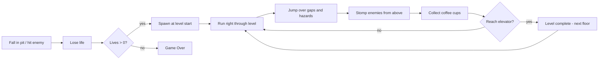
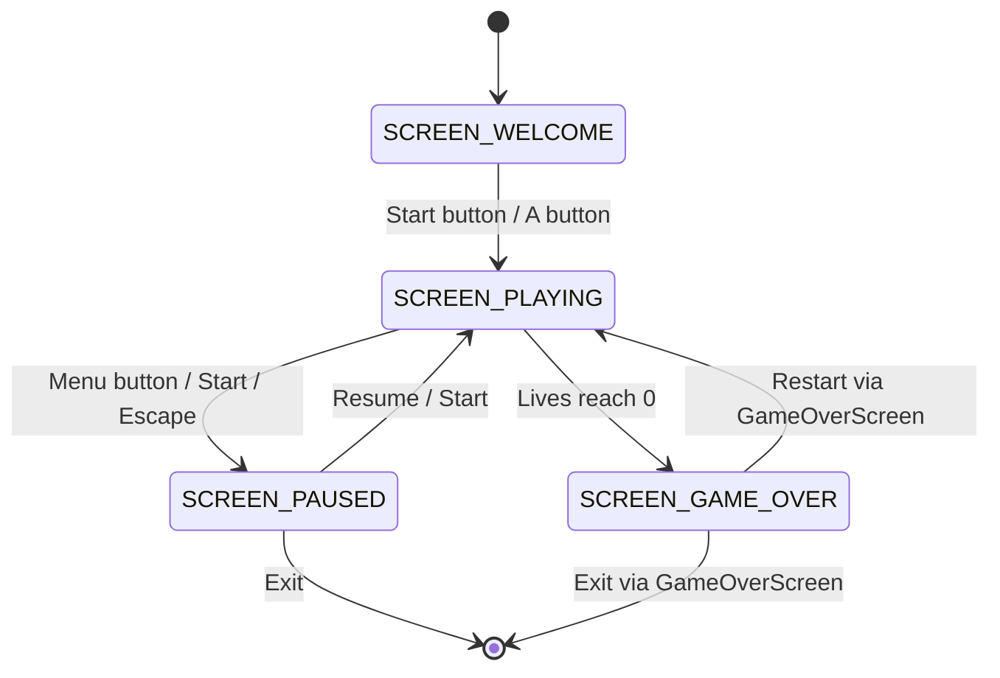
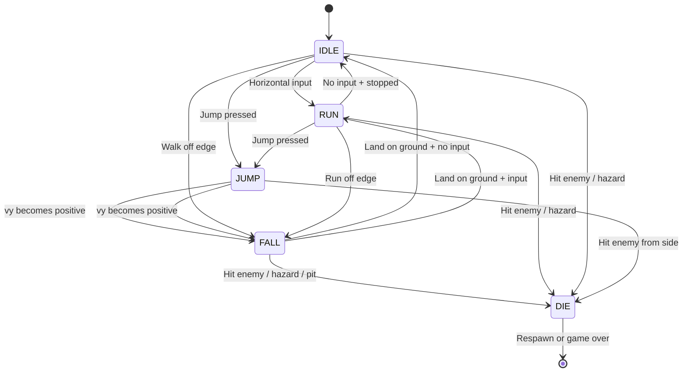

# Office Runner — Platformer Design Document

## 1. Game Concept

### 1.1 Name: **Office Runner**

A Mario-style side-scrolling platformer themed around the RoomWizard's office setting. The player controls a harried office worker rushing through floors of a corporate building, jumping over obstacles, stomping rogue printers, collecting coffee cups for points, and racing to the elevator at each level's end.

### 1.2 Core Gameplay Loop



### 1.3 Win/Lose Conditions

| Condition | Trigger |
|-----------|---------|
| **Level complete** | Player reaches the elevator door at the right end of the level |
| **Lose life** | Fall into a pit, touch an enemy from the side/below, or touch a hazard tile |
| **Game over** | All 3 lives lost |

### 1.4 Scoring System

| Event | Points |
|-------|--------|
| Collect coffee cup | +100 |
| Stomp enemy | +200 |
| Reach elevator (level complete) | +500 |
| Time bonus (seconds remaining × 10) | +10/sec |
| Consecutive stomps without landing | +200, +400, +800 (doubling) |

### 1.5 Thematic Elements

- **Player:** Office worker in a tie (simple sprite)
- **Enemies:** Rogue printers (walkers), paper airplanes (flyers — stretch goal)
- **Collectibles:** Coffee cups (coins equivalent)
- **Tiles:** Desk surfaces (platforms), filing cabinets (solid blocks), carpet (ground)
- **Hazard:** Spilled coffee (damage tiles), open elevator shafts (pits)
- **Goal:** Elevator door with a green "UP" arrow

---

## 2. Technical Architecture

### 2.1 Language and Linkage

The platformer uses **C++** for the game logic (classes for entities, cleaner state management) while linking against the existing C common libraries via `extern "C"`.

```cpp
// platformer.cpp
extern "C" {
#include "../common/framebuffer.h"
#include "../common/touch_input.h"
#include "../common/common.h"
#include "../common/hardware.h"
#include "../common/highscore.h"
#include "../common/audio.h"
#include "../common/ppm.h"
#include "../common/gamepad.h"   // NEW — reusable gamepad module
}
```

### 2.2 File Organization

```
native_apps/
  platformer/
    DESIGN.md              # This document
    platformer.cpp         # Main entry point, game loop, screen management
    player.h / player.cpp  # Player entity: physics, states, animation
    entity.h / entity.cpp  # Enemy and collectible entities
    tilemap.h / tilemap.cpp# Tile map loading, camera, tile collision
    sprite.h / sprite.cpp  # Sprite sheet management, animation sequencing
    level_data.h           # Const level arrays (hardcoded map data)
    input.h / input.cpp    # Unified input abstraction (gamepad+keyboard+touch)
    platformer.ppm         # 80×48 icon for game selector
    sprites.ppm            # Sprite sheet (all game graphics)
    gen_icon.py            # Icon generator script
  common/
    gamepad.h              # NEW — reusable gamepad input module
    gamepad.c              # NEW — evdev scanning, polling, state tracking
```

### 2.3 Build System Integration

Additions to [`Makefile`](../Makefile):

```makefile
# C++ compiler (same cross-compilation target)
CXX = g++
CXXFLAGS = -O2 -Wall -Wextra -march=armv7-a -mtune=cortex-a8 -mfpu=neon -mfloat-abi=hard -std=c++11

# Directories
PLATFORMER_DIR = platformer

# New common module
COMMON_GAMEPAD_OBJ = $(BUILD_DIR)/gamepad.o

# Platformer sources
PLATFORMER_CPP_SRC = $(PLATFORMER_DIR)/platformer.cpp \
                     $(PLATFORMER_DIR)/player.cpp \
                     $(PLATFORMER_DIR)/entity.cpp \
                     $(PLATFORMER_DIR)/tilemap.cpp \
                     $(PLATFORMER_DIR)/sprite.cpp \
                     $(PLATFORMER_DIR)/input.cpp
PLATFORMER_CPP_OBJ = $(PLATFORMER_CPP_SRC:$(PLATFORMER_DIR)/%.cpp=$(BUILD_DIR)/platformer_%.o)

# Common gamepad module (C)
$(BUILD_DIR)/gamepad.o: $(COMMON_DIR)/gamepad.c $(COMMON_DIR)/gamepad.h
	$(CC) $(CFLAGS) -c $< -o $@

# Platformer C++ objects
$(BUILD_DIR)/platformer_%.o: $(PLATFORMER_DIR)/%.cpp
	$(CXX) $(CXXFLAGS) -c $< -o $@

# Platformer binary — C++ objects linked with C common objects
$(BUILD_DIR)/platformer: $(PLATFORMER_CPP_OBJ) $(COMMON_OBJ) $(COMMON_AUDIO_OBJ) $(COMMON_GAMEPAD_OBJ)
	$(CXX) $(CXXFLAGS) $^ -o $@ $(LDFLAGS)
	@echo "Built: platformer"
```

### 2.4 Main Game Loop Structure

Target: **30 FPS** on 300 MHz ARM. The platformer is more rendering-intensive than Frogger (sprite blits, scrolling tilemap), so 30 FPS provides a comfortable per-frame budget of ~33ms.

```cpp
// platformer.cpp — main loop skeleton
int main(int argc, char *argv[]) {
    // ... init (same pattern as frogger.c main()) ...

    const uint32_t FRAME_TIME_US = 33333; // ~30 FPS

    while (running) {
        uint32_t frame_start = get_time_ms();

        input_poll(&input);         // Unified: touch + gamepad + keyboard
        handle_screen_input();      // Screen-specific input routing

        if (current_screen == SCREEN_PLAYING) {
            update_game(dt);        // Physics, entities, camera
        }

        draw_all();                 // Render current screen
        fb_swap(&fb);

        // Frame timing
        uint32_t frame_elapsed_us = (get_time_ms() - frame_start) * 1000;
        if (frame_elapsed_us < FRAME_TIME_US) {
            usleep(FRAME_TIME_US - frame_elapsed_us);
        }
    }
    // ... cleanup ...
}
```

### 2.5 State Machine

Follows the standard pattern from [`common.h`](../common/common.h) used by all games:

```cpp
enum GameScreen {
    SCREEN_WELCOME,
    SCREEN_PLAYING,
    SCREEN_PAUSED,
    SCREEN_GAME_OVER
};
```



---

## 3. Input System Design

### 3.1 Reusable `common/gamepad.h` API

This module extracts the evdev scanning and polling pattern from [`usb_test.c`](../usb_test/usb_test.c) into a reusable library. It supports multiple device types simultaneously.

```c
/* common/gamepad.h — Reusable USB input device manager */
#ifndef GAMEPAD_H
#define GAMEPAD_H

#include <stdint.h>
#include <stdbool.h>

#ifdef __cplusplus
extern "C" {
#endif

/* ── Device types ───────────────────────────────────────────────── */
#define GP_DEV_NONE      0
#define GP_DEV_KEYBOARD  1
#define GP_DEV_GAMEPAD   2

#define GP_MAX_DEVICES   4

/* ── Button IDs (abstract, device-independent) ──────────────────── */
typedef enum {
    GP_BTN_A,           /* Jump (South / Space) */
    GP_BTN_B,           /* Run  (East / Shift) */
    GP_BTN_X,           /* Unused (West) */
    GP_BTN_Y,           /* Unused (North) */
    GP_BTN_START,       /* Pause (Start / Escape / Enter) */
    GP_BTN_SELECT,      /* Unused (Select / Back) */
    GP_BTN_DPAD_UP,
    GP_BTN_DPAD_DOWN,
    GP_BTN_DPAD_LEFT,
    GP_BTN_DPAD_RIGHT,
    GP_BTN_COUNT
} GamepadButton;

/* ── Button state (edge-detected) ───────────────────────────────── */
typedef struct {
    bool held;          /* Currently held down */
    bool pressed;       /* Just pressed this frame (rising edge) */
    bool released;      /* Just released this frame (falling edge) */
} ButtonState;

/* ── Analog stick state ─────────────────────────────────────────── */
typedef struct {
    int x;              /* -1000 to +1000, 0 = center */
    int y;              /* -1000 to +1000, 0 = center */
} StickState;

/* ── Combined input state ───────────────────────────────────────── */
typedef struct {
    ButtonState buttons[GP_BTN_COUNT];
    StickState  left_stick;
    StickState  right_stick;
    int         left_trigger;   /* 0 to 1000 */
    int         right_trigger;  /* 0 to 1000 */
} GamepadState;

/* ── Device tracking ────────────────────────────────────────────── */
typedef struct {
    int  fd;            /* evdev file descriptor (-1 = not open) */
    int  dev_type;      /* GP_DEV_KEYBOARD, GP_DEV_GAMEPAD, etc. */
    char name[128];
    /* Axis calibration (gamepad only) */
    int  axis_min[64];
    int  axis_max[64];
} GamepadDevice;

/* ── Manager state ──────────────────────────────────────────────── */
typedef struct {
    GamepadDevice devices[GP_MAX_DEVICES];
    int           device_count;
    GamepadState  state;
    GamepadState  prev_state;   /* For edge detection */
    bool          available;    /* true if any device found */
} GamepadManager;

/* ── API ────────────────────────────────────────────────────────── */

/**
 * Scan /dev/input/event* for keyboards and gamepads.
 * Opens devices in non-blocking mode. Safe to call multiple times
 * (closes previous devices first). Skips the built-in touchscreen.
 * Returns the number of devices found.
 */
int  gp_init(GamepadManager *gp);

/**
 * Close all open device file descriptors.
 */
void gp_close(GamepadManager *gp);

/**
 * Re-scan for devices (hot-plug support). Call periodically or
 * on a user-triggered rescan.
 */
int  gp_rescan(GamepadManager *gp);

/**
 * Poll all open devices for new events. Updates gp->state.
 * Must be called once per frame BEFORE reading button states.
 * Internally computes pressed/released edges by comparing with prev_state.
 */
void gp_poll(GamepadManager *gp);

/**
 * Convenience: check if a button was just pressed this frame.
 */
static inline bool gp_pressed(const GamepadManager *gp, GamepadButton btn) {
    return gp->state.buttons[btn].pressed;
}

/**
 * Convenience: check if a button is currently held.
 */
static inline bool gp_held(const GamepadManager *gp, GamepadButton btn) {
    return gp->state.buttons[btn].held;
}

/**
 * Convenience: check if a button was just released this frame.
 */
static inline bool gp_released(const GamepadManager *gp, GamepadButton btn) {
    return gp->state.buttons[btn].released;
}

#ifdef __cplusplus
}
#endif

#endif /* GAMEPAD_H */
```

### 3.2 `common/gamepad.c` Implementation Notes

The implementation follows the device scanning pattern from [`usb_test.c`](../usb_test/usb_test.c:172):

```c
/* common/gamepad.c — key implementation details */

/* classify() — reuse EVIOCGBIT pattern from usb_test.c */
static int classify_device(int fd) {
    /* Same bit-testing logic as usb_test.c classify():
       - Check EV_KEY + EV_ABS + BTN_SOUTH → GP_DEV_GAMEPAD
       - Check EV_KEY + 20+ letter keys → GP_DEV_KEYBOARD
       - Skip touchscreens (name contains "panjit"/"Panjit") */
}

/* gp_init() — scan /dev/input/event0..15 */
int gp_init(GamepadManager *gp) {
    memset(gp, 0, sizeof(*gp));
    for (int i = 0; i < GP_MAX_DEVICES; i++)
        gp->devices[i].fd = -1;
    /* Scan event devices, open non-blocking, classify, load axis ranges */
    /* For gamepads: use EVIOCGABS to get axis min/max */
    return gp->device_count;
}

/* gp_poll() — read all pending events from all devices */
void gp_poll(GamepadManager *gp) {
    /* Save current state as prev_state for edge detection */
    gp->prev_state = gp->state;

    /* Clear pressed/released flags */
    for (int i = 0; i < GP_BTN_COUNT; i++) {
        gp->state.buttons[i].pressed = false;
        gp->state.buttons[i].released = false;
    }

    /* Read events from each device */
    for (int d = 0; d < gp->device_count; d++) {
        struct input_event ev;
        while (read(gp->devices[d].fd, &ev, sizeof(ev)) == sizeof(ev)) {
            if (gp->devices[d].dev_type == GP_DEV_GAMEPAD)
                process_gamepad_event(gp, &gp->devices[d], &ev);
            else if (gp->devices[d].dev_type == GP_DEV_KEYBOARD)
                process_keyboard_event(gp, &ev);
        }
    }

    /* Compute pressed/released edges */
    for (int i = 0; i < GP_BTN_COUNT; i++) {
        gp->state.buttons[i].pressed =
            gp->state.buttons[i].held && !gp->prev_state.buttons[i].held;
        gp->state.buttons[i].released =
            !gp->state.buttons[i].held && gp->prev_state.buttons[i].held;
    }
}
```

**Keyboard mapping** (in `process_keyboard_event`):

| Key | Maps to |
|-----|---------|
| `KEY_UP`, `KEY_W` | `GP_BTN_DPAD_UP` |
| `KEY_DOWN`, `KEY_S` | `GP_BTN_DPAD_DOWN` |
| `KEY_LEFT`, `KEY_A` | `GP_BTN_DPAD_LEFT` |
| `KEY_RIGHT`, `KEY_D` | `GP_BTN_DPAD_RIGHT` |
| `KEY_SPACE`, `KEY_Z` | `GP_BTN_A` (jump) |
| `KEY_LEFTSHIFT`, `KEY_X` | `GP_BTN_B` (run) |
| `KEY_ESC`, `KEY_ENTER` | `GP_BTN_START` (pause) |

**Gamepad mapping** (in `process_gamepad_event`):

| Input | Maps to |
|-------|---------|
| `ABS_HAT0X < 0` | `GP_BTN_DPAD_LEFT` |
| `ABS_HAT0X > 0` | `GP_BTN_DPAD_RIGHT` |
| `ABS_HAT0Y < 0` | `GP_BTN_DPAD_UP` |
| `ABS_HAT0Y > 0` | `GP_BTN_DPAD_DOWN` |
| `ABS_X` (left stick) | `left_stick.x` (also D-pad if abs > 500) |
| `ABS_Y` (left stick) | `left_stick.y` (also D-pad if abs > 500) |
| `BTN_SOUTH` / `BTN_A` | `GP_BTN_A` (jump) |
| `BTN_EAST` / `BTN_B` | `GP_BTN_B` (run) |
| `BTN_START` | `GP_BTN_START` (pause) |

### 3.3 Unified Input Abstraction — `input.h`

The platformer-specific input layer merges gamepad, keyboard, and touch into one query interface:

```cpp
// input.h — Platformer-specific input combining all sources
#pragma once

extern "C" {
#include "../common/gamepad.h"
#include "../common/touch_input.h"
}

struct InputState {
    // Digital directions
    bool left;
    bool right;
    bool up;
    bool down;

    // Actions
    bool jump_pressed;      // Rising edge — trigger jump
    bool jump_held;         // Held — variable jump height
    bool run_held;          // Held — run speed
    bool pause_pressed;     // Rising edge — toggle pause

    // Analog (for future use)
    float move_x;           // -1.0 to +1.0
};

class InputManager {
public:
    void init(TouchInput *touch);
    void poll();                    // Call once per frame
    const InputState& state() const { return m_state; }

private:
    void poll_touch();
    void merge_gamepad();

    TouchInput      *m_touch;
    GamepadManager   m_gamepad;
    InputState       m_state;

    // Touch virtual button regions (computed from fb dimensions)
    struct { int x, y, w, h; } m_touch_left;
    struct { int x, y, w, h; } m_touch_right;
    struct { int x, y, w, h; } m_touch_jump;
    struct { int x, y, w, h; } m_touch_run;  // Optional — hold jump area
};
```

### 3.4 Touch Fallback Layout

For touch-only play, virtual buttons are overlaid on the bottom of the screen:

```
+--[ fb.width ]-------------------------------+
|                                              |
|          Game viewport                       |
|                                              |
|                                              |
+----------------------------------------------+
|  [<]  [>]               [RUN]  [JUMP]       |  Touch control bar (80px)
+----------------------------------------------+
```

**Touch regions** (computed from [`fb.width`](../common/framebuffer.h:13) / [`fb.height`](../common/framebuffer.h:14)):

```cpp
void InputManager::init(TouchInput *touch) {
    m_touch = touch;
    gp_init(&m_gamepad);

    int bh = 80;  // Control bar height
    int y  = fb.height - bh;
    int bw = fb.width / 6;

    m_touch_left  = { 0,              y, bw,     bh };
    m_touch_right = { bw,             y, bw,     bh };
    m_touch_jump  = { fb.width - bw,  y, bw,     bh };
    m_touch_run   = { fb.width - 2*bw, y, bw,    bh };
}
```

When a gamepad or keyboard is detected (`m_gamepad.available`), the touch control bar is hidden to maximize viewport height.

---

## 4. Sprite System

### 4.1 Sprite Blit API — Additions to `framebuffer.c`

Two new functions added to [`framebuffer.h`](../common/framebuffer.h) / [`framebuffer.c`](../common/framebuffer.c):

```c
/* framebuffer.h additions */

/**
 * Color key for transparency (magenta).
 * Pixels matching this color in the source are not drawn.
 */
#define FB_COLOR_KEY  RGB(255, 0, 255)

/**
 * Blit a rectangular region from an ARGB pixel array onto the framebuffer.
 * Pixels matching color_key are skipped (transparent).
 *
 * @param fb         Framebuffer target
 * @param src        Source pixel array (from ppm_load())
 * @param src_w      Total width of source image (stride)
 * @param sx, sy     Top-left corner in source to copy from
 * @param sw, sh     Width and height of region to copy
 * @param dx, dy     Destination position on framebuffer
 * @param color_key  Transparent color (use FB_COLOR_KEY for magenta)
 */
void fb_blit_sprite(Framebuffer *fb, const uint32_t *src, int src_w,
                    int sx, int sy, int sw, int sh,
                    int dx, int dy, uint32_t color_key);

/**
 * Same as fb_blit_sprite() but mirrors the sprite horizontally.
 * Used for left-facing versions of right-facing sprites.
 */
void fb_blit_sprite_flipped(Framebuffer *fb, const uint32_t *src, int src_w,
                            int sx, int sy, int sw, int sh,
                            int dx, int dy, uint32_t color_key);
```

**Implementation** (optimized for ARM):

```c
/* framebuffer.c additions */

void fb_blit_sprite(Framebuffer *fb, const uint32_t *src, int src_w,
                    int sx, int sy, int sw, int sh,
                    int dx, int dy, uint32_t color_key) {
    /* Apply draw offset */
    dx += fb->draw_offset_x;
    dy += fb->draw_offset_y;

    /* Clip to framebuffer bounds */
    int x0 = dx < 0 ? -dx : 0;
    int y0 = dy < 0 ? -dy : 0;
    int x1 = (dx + sw > (int)fb->width) ? (int)fb->width - dx : sw;
    int y1 = (dy + sh > (int)fb->height) ? (int)fb->height - dy : sh;

    uint32_t ck = color_key & 0x00FFFFFF;  /* Ignore alpha byte */

    for (int row = y0; row < y1; row++) {
        const uint32_t *srow = &src[(sy + row) * src_w + sx + x0];
        uint32_t       *drow = &fb->back_buffer[(dy + row) * fb->width + dx + x0];
        int count = x1 - x0;

        for (int i = 0; i < count; i++) {
            uint32_t pixel = srow[i];
            if ((pixel & 0x00FFFFFF) != ck) {
                drow[i] = pixel;
            }
        }
    }
}

void fb_blit_sprite_flipped(Framebuffer *fb, const uint32_t *src, int src_w,
                            int sx, int sy, int sw, int sh,
                            int dx, int dy, uint32_t color_key) {
    dx += fb->draw_offset_x;
    dy += fb->draw_offset_y;

    int x0 = dx < 0 ? -dx : 0;
    int y0 = dy < 0 ? -dy : 0;
    int x1 = (dx + sw > (int)fb->width) ? (int)fb->width - dx : sw;
    int y1 = (dy + sh > (int)fb->height) ? (int)fb->height - dy : sh;

    uint32_t ck = color_key & 0x00FFFFFF;

    for (int row = y0; row < y1; row++) {
        const uint32_t *srow = &src[(sy + row) * src_w + sx];
        uint32_t       *drow = &fb->back_buffer[(dy + row) * fb->width + dx];

        for (int col = x0; col < x1; col++) {
            uint32_t pixel = srow[sw - 1 - col];  /* Read from right to left */
            if ((pixel & 0x00FFFFFF) != ck) {
                drow[col] = pixel;
            }
        }
    }
}
```

### 4.2 PPM Sprite Sheet Format

All game graphics live in a single PPM file (`sprites.ppm`), loaded once at startup via [`ppm_load()`](../common/ppm.h:19). The sheet uses a **16×16 pixel tile grid** with magenta (`RGB(255, 0, 255)`) as the transparency color key.

**Tile size: 16×16 pixels.** Rationale:
- At 800×480 landscape, 16px tiles give 50×30 tiles visible — plenty for level detail
- At 300 MHz, blitting 16×16 tiles (256 pixels each) is very fast
- Fits the retro aesthetic well
- Sprites can be 1×1 tile (16×16), 1×2 (16×32), or 2×1 (32×16) for larger entities

### 4.3 Sprite Sheet Layout

The sprite sheet is organized in a grid. Each cell is 16×16 pixels. The sheet is **256×256 pixels** (16×16 grid of tiles).

```
Column: 0    1    2    3    4    5    6    7    8    9   10   11   12   13   14   15
Row 0: [EMPTY][GND1][GND2][GND3][DSK1][DSK2][DSK3][CAB1][CAB2][HAZD][ELEV][ELEA][BG_1][BG_2][BG_3][BG_4]
Row 1: [PI_R1][PI_R2][PI_R3][PI_R4][PI_J1][PI_J2][PI_J3][PI_J4][PI_F1][PI_F2][PI_D1][PI_D2][PI_D3][PI_I1][PI_I2][PI_I3]
Row 2: [EN_W1][EN_W2][EN_W3][EN_W4][EN_D1][EN_D2][CUP1][CUP2][CUP3][CUP4][STAR][PWUP][    ][    ][    ][    ]
Row 3: [PLAT1][PLAT2][PLAT3][WALL_L][WALL_M][WALL_R][CEIL1][CEIL2][    ][    ][    ][    ][    ][    ][    ][    ]
Row 4-15: [Reserved for additional sprites, animations, and level decorations]
```

**Legend — Tile IDs:**

| Range | Content | Grid position |
|-------|---------|---------------|
| 0 | Empty / air | Row 0, Col 0 |
| 1–3 | Ground tiles (carpet variations) | Row 0, Col 1–3 |
| 4–6 | Desk surface tiles (platform, left/mid/right) | Row 0, Col 4–6 |
| 7–8 | Filing cabinet (solid block, top/bottom) | Row 0, Col 7–8 |
| 9 | Hazard tile (spilled coffee) | Row 0, Col 9 |
| 10–11 | Elevator door (goal, 2 frames for animation) | Row 0, Col 10–11 |
| 12–15 | Background wall tiles | Row 0, Col 12–15 |
| 16–19 | Player: run right frames 1–4 | Row 1, Col 0–3 |
| 20–23 | Player: jump frames 1–4 | Row 1, Col 4–7 |
| 24–25 | Player: fall frames 1–2 | Row 1, Col 8–9 |
| 26–28 | Player: die frames 1–3 | Row 1, Col 10–12 |
| 29–31 | Player: idle frames 1–3 | Row 1, Col 13–15 |
| 32–35 | Enemy: walker frames 1–4 | Row 2, Col 0–3 |
| 36–37 | Enemy: squished frames 1–2 | Row 2, Col 4–5 |
| 38–41 | Coffee cup: sparkle animation 1–4 | Row 2, Col 6–9 |
| 42 | Star (bonus item) | Row 2, Col 10 |
| 43 | Power-up (speed boost) | Row 2, Col 11 |
| 48–50 | One-way platform (left/mid/right) | Row 3, Col 0–2 |
| 51–53 | Wall tiles (left edge/middle/right edge) | Row 3, Col 3–5 |

### 4.4 Sprite Management — `sprite.h`

```cpp
// sprite.h
#pragma once
#include <cstdint>

extern "C" {
#include "../common/framebuffer.h"
#include "../common/ppm.h"
}

#define TILE_SIZE     16
#define SHEET_COLS    16   /* Tiles per row in sprite sheet */
#define SHEET_ROWS    16
#define SPRITE_TRANSPARENT  RGB(255, 0, 255)

/* Animation sequence definition */
struct AnimFrame {
    uint8_t tile_id;    /* Index into sprite sheet */
    uint8_t duration;   /* Duration in frames (at 30 FPS) */
};

struct Animation {
    const AnimFrame *frames;
    int              frame_count;
    bool             looping;
};

class SpriteSheet {
public:
    bool load(const char *ppm_path);
    void unload();

    /* Draw a single tile at screen position (dx, dy) */
    void draw_tile(Framebuffer *fb, int tile_id, int dx, int dy) const;

    /* Draw a tile flipped horizontally */
    void draw_tile_flipped(Framebuffer *fb, int tile_id, int dx, int dy) const;

    /* Get tile source rectangle from tile_id */
    void tile_rect(int tile_id, int *sx, int *sy) const {
        *sx = (tile_id % SHEET_COLS) * TILE_SIZE;
        *sy = (tile_id / SHEET_COLS) * TILE_SIZE;
    }

private:
    uint32_t *m_pixels = nullptr;
    int       m_width  = 0;
    int       m_height = 0;
};

/* Animation player — tracks current frame and timing */
class AnimPlayer {
public:
    void set(const Animation *anim);
    void update();              /* Advance frame counter */
    int  current_tile() const;  /* Get current tile_id */
    bool finished() const;      /* True if non-looping anim completed */

private:
    const Animation *m_anim = nullptr;
    int   m_frame_index = 0;
    int   m_frame_timer = 0;
    bool  m_finished = false;
};
```

**Implementation of `draw_tile()`:**

```cpp
void SpriteSheet::draw_tile(Framebuffer *fb, int tile_id, int dx, int dy) const {
    int sx, sy;
    tile_rect(tile_id, &sx, &sy);
    fb_blit_sprite(fb, m_pixels, m_width, sx, sy,
                   TILE_SIZE, TILE_SIZE, dx, dy, SPRITE_TRANSPARENT);
}
```

### 4.5 Predefined Animations

```cpp
// sprite.cpp — animation data

static const AnimFrame anim_player_idle_frames[] = {
    {29, 20}, {30, 20}, {31, 20}, {30, 20}   // Breathing cycle, ~2.7s
};
static const Animation ANIM_PLAYER_IDLE = {
    anim_player_idle_frames, 4, true
};

static const AnimFrame anim_player_run_frames[] = {
    {16, 4}, {17, 4}, {18, 4}, {19, 4}       // Run cycle, ~0.5s
};
static const Animation ANIM_PLAYER_RUN = {
    anim_player_run_frames, 4, true
};

static const AnimFrame anim_player_jump_frames[] = {
    {20, 3}, {21, 6}, {22, 6}, {23, 3}       // Jump arc
};
static const Animation ANIM_PLAYER_JUMP = {
    anim_player_jump_frames, 4, false
};

static const AnimFrame anim_player_fall_frames[] = {
    {24, 8}, {25, 8}                          // Falling
};
static const Animation ANIM_PLAYER_FALL = {
    anim_player_fall_frames, 2, true
};

static const AnimFrame anim_player_die_frames[] = {
    {26, 8}, {27, 8}, {28, 16}               // Death + fade
};
static const Animation ANIM_PLAYER_DIE = {
    anim_player_die_frames, 3, false
};

static const AnimFrame anim_enemy_walk_frames[] = {
    {32, 6}, {33, 6}, {34, 6}, {35, 6}       // Walker patrol
};
static const Animation ANIM_ENEMY_WALK = {
    anim_enemy_walk_frames, 4, true
};

static const AnimFrame anim_coin_frames[] = {
    {38, 8}, {39, 8}, {40, 8}, {41, 8}       // Sparkle rotation
};
static const Animation ANIM_COIN = {
    anim_coin_frames, 4, true
};
```

---

## 5. Tile Map System

### 5.1 Tile Map Format

Levels are defined as constant 2D arrays of `uint8_t` tile IDs. Each tile is 16×16 pixels on screen.

```cpp
// tilemap.h
#pragma once
#include <cstdint>

#define MAP_MAX_WIDTH    256   /* Max tiles wide (256 × 16 = 4096 px) */
#define MAP_MAX_HEIGHT   30    /* Max tiles tall (30 × 16 = 480 px) */

/* Tile property flags */
#define TILE_SOLID       0x01  /* Blocks movement from all sides */
#define TILE_PLATFORM    0x02  /* Solid only from above (pass-through from below) */
#define TILE_HAZARD      0x04  /* Kills player on contact */
#define TILE_COIN        0x08  /* Collectible (removed on collect) */
#define TILE_GOAL        0x10  /* Level completion trigger */

/* Tile type properties — indexed by tile_id */
extern const uint8_t TILE_FLAGS[64];

struct TileMap {
    const uint8_t *data;        /* Pointer to const level data array */
    int            width;       /* Width in tiles */
    int            height;      /* Height in tiles */
    bool           coins_collected[MAP_MAX_WIDTH * MAP_MAX_HEIGHT / 8]; /* Bitfield */
};
```

### 5.2 Tile Property Table

```cpp
// tilemap.cpp
const uint8_t TILE_FLAGS[64] = {
    /* 0: empty */       0,
    /* 1-3: ground */    TILE_SOLID, TILE_SOLID, TILE_SOLID,
    /* 4-6: desk */      TILE_PLATFORM, TILE_PLATFORM, TILE_PLATFORM,
    /* 7-8: cabinet */   TILE_SOLID, TILE_SOLID,
    /* 9: hazard */      TILE_HAZARD,
    /* 10-11: elevator */TILE_GOAL, TILE_GOAL,
    /* 12-15: bg wall */ 0, 0, 0, 0,
    /* 16-31: player */  0,0,0,0,0,0,0,0,0,0,0,0,0,0,0,0,
    /* 32-37: enemy */   0,0,0,0,0,0,
    /* 38-41: coin */    TILE_COIN, TILE_COIN, TILE_COIN, TILE_COIN,
    /* 42: star */       TILE_COIN,
    /* 43: powerup */    TILE_COIN,
    /* 44-47: unused */  0,0,0,0,
    /* 48-50: platform */TILE_PLATFORM, TILE_PLATFORM, TILE_PLATFORM,
    /* 51-53: wall */    TILE_SOLID, TILE_SOLID, TILE_SOLID,
    /* 54-63: unused */  0,0,0,0,0,0,0,0,0,0,
};
```

### 5.3 Level Dimensions and Viewport

**Viewport calculations at 800×480:**

| Metric | Value |
|--------|-------|
| Tile size | 16×16 px |
| HUD height | 32 px (compact for platformer) |
| Touch bar | 0 px (hidden with gamepad) or 80 px (touch-only) |
| Viewport width | 800 px = 50 tiles visible |
| Viewport height | 448 px = 28 tiles visible (with HUD) |
| Level width | ~200 tiles (3200 px, ~4 screens) |
| Level height | 28 tiles (fits viewport vertically — no vertical scrolling for simplicity) |

**Portrait mode at 480×800:**

| Metric | Value |
|--------|-------|
| Viewport width | 480 px = 30 tiles visible |
| Viewport height | 768 px = 48 tiles visible (with HUD) |
| Level height | 28 tiles (same levels, more vertical visibility) |

### 5.4 Camera / Viewport System

The camera follows the player horizontally with a dead zone to prevent jittery scrolling:

```cpp
// tilemap.h — Camera
struct Camera {
    float x;            /* Camera left edge in world pixels (float for smooth) */
    float y;            /* Camera top edge in world pixels */
    int   viewport_w;   /* Viewport width in pixels (fb.width) */
    int   viewport_h;   /* Viewport height in pixels (fb.height - HUD - touch bar) */
};

// tilemap.cpp — Camera update
void camera_follow_player(Camera *cam, float player_x, float player_y,
                          int map_width_px, int map_height_px) {
    /* Horizontal: keep player in center third of screen */
    float target_x = player_x - cam->viewport_w / 3.0f;

    /* Smooth approach (lerp toward target) */
    cam->x += (target_x - cam->x) * 0.1f;

    /* Clamp to level bounds */
    if (cam->x < 0) cam->x = 0;
    float max_x = map_width_px - cam->viewport_w;
    if (max_x < 0) max_x = 0;
    if (cam->x > max_x) cam->x = max_x;

    /* Vertical: fixed at bottom of level (no vertical scrolling) */
    cam->y = map_height_px - cam->viewport_h;
    if (cam->y < 0) cam->y = 0;
}
```

### 5.5 Tile Map Rendering

Only visible tiles are rendered — the inner loop iterates over tiles within the camera viewport:

```cpp
void tilemap_draw(const TileMap *map, const Camera *cam,
                  const SpriteSheet *sheet, Framebuffer *fb, int hud_height) {
    int start_col = (int)cam->x / TILE_SIZE;
    int start_row = (int)cam->y / TILE_SIZE;
    int end_col   = start_col + cam->viewport_w / TILE_SIZE + 2; /* +2 for partial tiles */
    int end_row   = start_row + cam->viewport_h / TILE_SIZE + 2;

    if (end_col > map->width)  end_col = map->width;
    if (end_row > map->height) end_row = map->height;

    int offset_x = -(int)cam->x % TILE_SIZE;
    int offset_y = -(int)cam->y % TILE_SIZE + hud_height;

    for (int row = start_row; row < end_row; row++) {
        for (int col = start_col; col < end_col; col++) {
            uint8_t tile_id = map->data[row * map->width + col];
            if (tile_id == 0) continue;  /* Skip empty tiles */

            /* Skip collected coins */
            if ((TILE_FLAGS[tile_id] & TILE_COIN) && tilemap_coin_collected(map, col, row))
                continue;

            int dx = (col - start_col) * TILE_SIZE + offset_x;
            int dy = (row - start_row) * TILE_SIZE + offset_y;

            sheet->draw_tile(fb, tile_id, dx, dy);
        }
    }
}
```

**Performance at 800×480:** Drawing up to 52×30 = 1,560 tiles per frame. At 256 pixels per tile blit with a branch per pixel (color key check), that's ~400K pixel operations. At 300 MHz this is very achievable within the 33ms frame budget.

### 5.6 Background Rendering

Instead of parallax scrolling (expensive), use a simple gradient sky with a solid-color wall:

```cpp
void draw_background(Framebuffer *fb, const Camera *cam, int hud_height) {
    /* Top portion: gradient sky (office window view) */
    int sky_h = fb->height / 3;
    fb_fill_rect_gradient(fb, 0, hud_height, fb->width, sky_h,
                          RGB(100, 140, 200),    /* Light blue top */
                          RGB(180, 200, 230));   /* Pale bottom */

    /* Bottom portion: office wall */
    fb_fill_rect(fb, 0, hud_height + sky_h, fb->width,
                 fb->height - hud_height - sky_h,
                 RGB(220, 210, 190));            /* Beige wall */

    /* Simple parallax: shift a few decorative lines at half camera speed */
    int px = -((int)(cam->x * 0.3f)) % 200;
    for (int x = px; x < (int)fb->width; x += 200) {
        /* Window frame on wall */
        fb_draw_rect(fb, x + 20, hud_height + sky_h + 10, 60, 40,
                     RGB(160, 150, 130));
    }
}
```

---

## 6. Physics and Collision

### 6.1 Physics Constants

```cpp
// player.h — Physics constants
namespace Physics {
    /* All values in pixels per frame at 30 FPS */
    constexpr float GRAVITY          = 0.5f;    /* Acceleration per frame */
    constexpr float MAX_FALL_SPEED   = 8.0f;    /* Terminal velocity */
    constexpr float JUMP_VELOCITY    = -7.5f;   /* Initial upward velocity */
    constexpr float JUMP_CUT_MULT   = 0.4f;    /* Velocity multiplier on early jump release */

    constexpr float WALK_SPEED       = 2.0f;    /* Max horizontal walk speed */
    constexpr float RUN_SPEED        = 3.5f;    /* Max horizontal run speed */
    constexpr float ACCEL_GROUND     = 0.5f;    /* Horizontal acceleration on ground */
    constexpr float ACCEL_AIR        = 0.3f;    /* Horizontal acceleration in air */
    constexpr float FRICTION_GROUND  = 0.4f;    /* Deceleration on ground when no input */
    constexpr float FRICTION_AIR     = 0.1f;    /* Air drag when no input */

    constexpr int   COYOTE_FRAMES    = 4;       /* Frames after leaving edge where jump still works */
    constexpr int   JUMP_BUFFER_FRAMES = 5;     /* Frames before landing where jump input is buffered */
}
```

### 6.2 Player Physics State

```cpp
// player.h
struct Player {
    /* Position (world coordinates, sub-pixel) */
    float x, y;

    /* Velocity */
    float vx, vy;

    /* Collision box (relative to x,y — smaller than 16×16 sprite for forgiveness) */
    static constexpr int HITBOX_X = 3;    /* Left inset */
    static constexpr int HITBOX_Y = 1;    /* Top inset */
    static constexpr int HITBOX_W = 10;   /* Width (16 - 3 - 3) */
    static constexpr int HITBOX_H = 15;   /* Height (16 - 1) */

    /* State */
    enum State { IDLE, RUN, JUMP, FALL, DIE } state;
    bool on_ground;
    bool facing_right;
    int  coyote_timer;      /* Frames since leaving ground */
    int  jump_buffer_timer; /* Frames since jump was pressed */
    int  lives;
    int  score;
    int  level;

    /* Animation */
    AnimPlayer anim;
};
```

### 6.3 AABB Tile Collision — Separate X and Y Resolution

This is the critical physics routine. Collision is resolved by moving one axis at a time, testing against the tile map, and resolving penetration:

```cpp
// player.cpp — Collision resolution

struct AABB {
    float x, y, w, h;
};

AABB player_hitbox(const Player &p) {
    return { p.x + Player::HITBOX_X, p.y + Player::HITBOX_Y,
             (float)Player::HITBOX_W, (float)Player::HITBOX_H };
}

bool tile_is_solid(const TileMap *map, int col, int row) {
    if (col < 0 || col >= map->width || row < 0 || row >= map->height)
        return false;  /* Out of bounds = empty (allow falling off) */
    uint8_t id = map->data[row * map->width + col];
    return (TILE_FLAGS[id] & TILE_SOLID) != 0;
}

bool tile_is_platform(const TileMap *map, int col, int row) {
    if (col < 0 || col >= map->width || row < 0 || row >= map->height)
        return false;
    uint8_t id = map->data[row * map->width + col];
    return (TILE_FLAGS[id] & TILE_PLATFORM) != 0;
}

void player_move_x(Player *p, const TileMap *map) {
    p->x += p->vx;
    AABB box = player_hitbox(*p);

    /* Check tiles overlapping the hitbox */
    int left   = (int)box.x / TILE_SIZE;
    int right  = (int)(box.x + box.w - 0.01f) / TILE_SIZE;
    int top    = (int)box.y / TILE_SIZE;
    int bottom = (int)(box.y + box.h - 0.01f) / TILE_SIZE;

    for (int row = top; row <= bottom; row++) {
        for (int col = left; col <= right; col++) {
            if (!tile_is_solid(map, col, row)) continue;

            /* Resolve X penetration */
            if (p->vx > 0) {
                /* Moving right: push player left of tile */
                p->x = col * TILE_SIZE - Player::HITBOX_X - Player::HITBOX_W;
                p->vx = 0;
            } else if (p->vx < 0) {
                /* Moving left: push player right of tile */
                p->x = (col + 1) * TILE_SIZE - Player::HITBOX_X;
                p->vx = 0;
            }
        }
    }
}

void player_move_y(Player *p, const TileMap *map) {
    p->y += p->vy;
    AABB box = player_hitbox(*p);

    int left   = (int)box.x / TILE_SIZE;
    int right  = (int)(box.x + box.w - 0.01f) / TILE_SIZE;
    int top    = (int)box.y / TILE_SIZE;
    int bottom = (int)(box.y + box.h - 0.01f) / TILE_SIZE;

    p->on_ground = false;

    for (int row = top; row <= bottom; row++) {
        for (int col = left; col <= right; col++) {
            bool solid = tile_is_solid(map, col, row);
            bool plat  = tile_is_platform(map, col, row);

            /* One-way platforms: only block when falling onto them from above */
            if (plat && !solid) {
                if (p->vy <= 0) continue;  /* Moving up — pass through */
                /* Check if player was above this tile last frame */
                float prev_bottom = (p->y - p->vy) + Player::HITBOX_Y + Player::HITBOX_H;
                if (prev_bottom > row * TILE_SIZE + 1) continue; /* Was already inside — pass through */
            }

            if (!solid && !plat) continue;

            if (p->vy > 0) {
                /* Falling: land on top of tile */
                p->y = row * TILE_SIZE - Player::HITBOX_Y - Player::HITBOX_H;
                p->vy = 0;
                p->on_ground = true;
            } else if (p->vy < 0 && solid) {
                /* Rising: hit ceiling (only on solid, not platforms) */
                p->y = (row + 1) * TILE_SIZE - Player::HITBOX_Y;
                p->vy = 0;
            }
        }
    }
}
```

### 6.4 Coyote Time and Jump Buffering

```cpp
void player_update(Player *p, const InputState &input, const TileMap *map) {
    /* ── Coyote time ─────────────────────────────────────── */
    if (p->on_ground) {
        p->coyote_timer = Physics::COYOTE_FRAMES;
    } else {
        if (p->coyote_timer > 0) p->coyote_timer--;
    }

    /* ── Jump buffer ─────────────────────────────────────── */
    if (input.jump_pressed) {
        p->jump_buffer_timer = Physics::JUMP_BUFFER_FRAMES;
    } else {
        if (p->jump_buffer_timer > 0) p->jump_buffer_timer--;
    }

    /* ── Jump initiation ─────────────────────────────────── */
    bool can_jump = (p->on_ground || p->coyote_timer > 0);
    if (can_jump && p->jump_buffer_timer > 0) {
        p->vy = Physics::JUMP_VELOCITY;
        p->on_ground = false;
        p->coyote_timer = 0;
        p->jump_buffer_timer = 0;
        audio_beep(&audio);  /* Jump sound */
    }

    /* ── Variable jump height (release early = lower jump) ── */
    if (!input.jump_held && p->vy < 0) {
        p->vy *= Physics::JUMP_CUT_MULT;
    }

    /* ── Horizontal movement ─────────────────────────────── */
    float max_speed = input.run_held ? Physics::RUN_SPEED : Physics::WALK_SPEED;
    float accel = p->on_ground ? Physics::ACCEL_GROUND : Physics::ACCEL_AIR;
    float friction = p->on_ground ? Physics::FRICTION_GROUND : Physics::FRICTION_AIR;

    if (input.left) {
        p->vx -= accel;
        if (p->vx < -max_speed) p->vx = -max_speed;
        p->facing_right = false;
    } else if (input.right) {
        p->vx += accel;
        if (p->vx > max_speed) p->vx = max_speed;
        p->facing_right = true;
    } else {
        /* Apply friction */
        if (p->vx > 0) {
            p->vx -= friction;
            if (p->vx < 0) p->vx = 0;
        } else if (p->vx < 0) {
            p->vx += friction;
            if (p->vx > 0) p->vx = 0;
        }
    }

    /* ── Gravity ─────────────────────────────────────────── */
    p->vy += Physics::GRAVITY;
    if (p->vy > Physics::MAX_FALL_SPEED) p->vy = Physics::MAX_FALL_SPEED;

    /* ── Move and collide (X then Y separately) ──────────── */
    player_move_x(p, map);
    player_move_y(p, map);

    /* ── State machine for animation ─────────────────────── */
    State new_state;
    if (!p->on_ground && p->vy < 0)      new_state = JUMP;
    else if (!p->on_ground && p->vy > 0)  new_state = FALL;
    else if (fabsf(p->vx) > 0.5f)         new_state = RUN;
    else                                   new_state = IDLE;

    if (new_state != p->state) {
        p->state = new_state;
        /* Set animation based on new state */
        switch (p->state) {
            case IDLE: p->anim.set(&ANIM_PLAYER_IDLE); break;
            case RUN:  p->anim.set(&ANIM_PLAYER_RUN);  break;
            case JUMP: p->anim.set(&ANIM_PLAYER_JUMP); break;
            case FALL: p->anim.set(&ANIM_PLAYER_FALL); break;
            case DIE:  p->anim.set(&ANIM_PLAYER_DIE);  break;
        }
    }
    p->anim.update();

    /* ── Pit detection (fell below map) ──────────────────── */
    if (p->y > map->height * TILE_SIZE + TILE_SIZE) {
        player_die(p);
    }

    /* ── Hazard tile check ───────────────────────────────── */
    check_hazard_tiles(p, map);
}
```

### 6.5 Corner Correction

When the player is jumping and barely clips a tile corner, nudge them past it to make the game feel more generous:

```cpp
/* Called when a vertical collision occurs while moving up */
void try_corner_correction(Player *p, const TileMap *map) {
    AABB box = player_hitbox(*p);
    int tile_col_left  = (int)box.x / TILE_SIZE;
    int tile_col_right = (int)(box.x + box.w) / TILE_SIZE;
    int tile_row       = (int)box.y / TILE_SIZE;

    /* If hitting a ceiling tile, check if we can nudge left or right by up to 4px */
    for (int nudge = 1; nudge <= 4; nudge++) {
        /* Try nudging right */
        if (!tile_is_solid(map, tile_col_right + 1, tile_row) &&
            !tile_is_solid(map, tile_col_right + 1, tile_row + 1)) {
            p->x += nudge;
            return;
        }
        /* Try nudging left */
        if (!tile_is_solid(map, tile_col_left - 1, tile_row) &&
            !tile_is_solid(map, tile_col_left - 1, tile_row + 1)) {
            p->x -= nudge;
            return;
        }
    }
}
```

---

## 7. Entity System

### 7.1 Entity Structure

```cpp
// entity.h
#pragma once
#include "sprite.h"

enum EntityType {
    ENT_NONE,
    ENT_ENEMY_WALKER,
    ENT_COIN,
    ENT_POWERUP,
    ENT_PARTICLE,   /* Visual effect, no collision */
};

struct Entity {
    EntityType type;
    float x, y;
    float vx, vy;
    int   w, h;              /* Hitbox size */
    bool  active;
    bool  facing_right;

    /* Animation */
    AnimPlayer anim;

    /* Entity-specific data */
    union {
        struct {  /* Walker enemy */
            float patrol_left;   /* Left bound (world X) */
            float patrol_right;  /* Right bound (world X) */
        } walker;
        struct {  /* Particle */
            int lifetime;         /* Frames remaining */
        } particle;
    };
};

#define MAX_ENTITIES  64

struct EntityManager {
    Entity entities[MAX_ENTITIES];
    int    count;
};
```

### 7.2 Player States and Transitions



### 7.3 Enemy: Walker

Patrols back and forth between bounds. Dies when stomped from above.

```cpp
void entity_update_walker(Entity *e, const TileMap *map) {
    /* Move horizontally */
    e->x += e->vx;

    /* Reverse at patrol bounds or at ledge edges */
    if (e->x <= e->walker.patrol_left || e->x >= e->walker.patrol_right) {
        e->vx = -e->vx;
        e->facing_right = (e->vx > 0);
    }

    /* Check for ledge ahead (don't walk off platforms) */
    int check_col = (int)(e->x + (e->vx > 0 ? e->w : -1)) / TILE_SIZE;
    int feet_row  = (int)(e->y + e->h) / TILE_SIZE;
    if (!tile_is_solid(map, check_col, feet_row) &&
        !tile_is_platform(map, check_col, feet_row)) {
        e->vx = -e->vx;
        e->facing_right = (e->vx > 0);
    }

    e->anim.update();
}
```

### 7.4 Stomp Detection

```cpp
bool check_enemy_stomp(Player *p, Entity *e) {
    AABB pbox = player_hitbox(*p);
    AABB ebox = { e->x, e->y, (float)e->w, (float)e->h };

    /* AABB overlap check */
    if (pbox.x >= ebox.x + ebox.w || pbox.x + pbox.w <= ebox.x) return false;
    if (pbox.y >= ebox.y + ebox.h || pbox.y + pbox.h <= ebox.y) return false;

    /* Determine if stomping: player falling AND player feet above enemy center */
    if (p->vy > 0 && pbox.y + pbox.h < ebox.y + ebox.h * 0.5f) {
        /* Stomp! Kill enemy, bounce player */
        e->type = ENT_NONE;
        e->active = false;
        p->vy = Physics::JUMP_VELOCITY * 0.6f;  /* Bounce up */
        p->score += 200;
        audio_blip(&audio);
        return true;
    }

    /* Side/bottom hit: player dies */
    return false;  /* Caller handles player death */
}
```

### 7.5 Collectible Interaction

```cpp
void check_coin_collect(Player *p, Entity *e) {
    AABB pbox = player_hitbox(*p);
    AABB ebox = { e->x + 2, e->y + 2, (float)e->w - 4, (float)e->h - 4 };

    if (pbox.x < ebox.x + ebox.w && pbox.x + pbox.w > ebox.x &&
        pbox.y < ebox.y + ebox.h && pbox.y + pbox.h > ebox.y) {
        e->active = false;
        p->score += 100;
        audio_blip(&audio);

        /* Spawn sparkle particle */
        spawn_particle(e->x, e->y, ENT_PARTICLE, 10);
    }
}
```

### 7.6 Entity Update Loop

```cpp
// entity.cpp
void entity_manager_update(EntityManager *em, Player *p, const TileMap *map) {
    for (int i = 0; i < em->count; i++) {
        Entity *e = &em->entities[i];
        if (!e->active) continue;

        switch (e->type) {
        case ENT_ENEMY_WALKER:
            entity_update_walker(e, map);
            /* Check player collision */
            if (!check_enemy_stomp(p, e)) {
                /* Side/bottom hit — kill player */
                AABB pbox = player_hitbox(*p);
                AABB ebox = { e->x, e->y, (float)e->w, (float)e->h };
                if (pbox.x < ebox.x + ebox.w && pbox.x + pbox.w > ebox.x &&
                    pbox.y < ebox.y + ebox.h && pbox.y + pbox.h > ebox.y) {
                    player_die(p);
                }
            }
            break;

        case ENT_COIN:
            check_coin_collect(p, e);
            e->anim.update();
            break;

        case ENT_PARTICLE:
            e->particle.lifetime--;
            e->y -= 0.5f;  /* Float upward */
            if (e->particle.lifetime <= 0) e->active = false;
            break;

        default:
            break;
        }
    }
}

void entity_manager_draw(const EntityManager *em, const Camera *cam,
                         const SpriteSheet *sheet, Framebuffer *fb, int hud_h) {
    for (int i = 0; i < em->count; i++) {
        const Entity *e = &em->entities[i];
        if (!e->active) continue;

        int dx = (int)(e->x - cam->x);
        int dy = (int)(e->y - cam->y) + hud_h;

        /* Cull off-screen entities */
        if (dx + e->w < 0 || dx > cam->viewport_w) continue;
        if (dy + e->h < 0 || dy > cam->viewport_h + hud_h) continue;

        int tile = e->anim.current_tile();
        if (e->facing_right) {
            sheet->draw_tile(fb, tile, dx, dy);
        } else {
            sheet->draw_tile_flipped(fb, tile, dx, dy);
        }
    }
}
```

### 7.7 Entity Spawning from Level Data

Entities are defined in the level data as special tile IDs that are converted to Entity instances at level load:

```cpp
/* Tile IDs 128+ are entity spawn markers (not rendered as tiles) */
#define ENTITY_TILE_BASE  128
#define TILE_SPAWN_PLAYER    128
#define TILE_SPAWN_WALKER    129
#define TILE_SPAWN_COIN      130
#define TILE_SPAWN_POWERUP   131

void level_spawn_entities(const TileMap *map, EntityManager *em, Player *p) {
    em->count = 0;
    for (int row = 0; row < map->height; row++) {
        for (int col = 0; col < map->width; col++) {
            uint8_t tile = map->data[row * map->width + col];
            if (tile < ENTITY_TILE_BASE) continue;

            float wx = col * TILE_SIZE;
            float wy = row * TILE_SIZE;

            switch (tile) {
            case TILE_SPAWN_PLAYER:
                p->x = wx;
                p->y = wy;
                break;
            case TILE_SPAWN_WALKER:
                if (em->count < MAX_ENTITIES) {
                    Entity *e = &em->entities[em->count++];
                    *e = {};
                    e->type = ENT_ENEMY_WALKER;
                    e->x = wx; e->y = wy;
                    e->w = 16; e->h = 16;
                    e->vx = 0.8f;
                    e->active = true;
                    e->facing_right = true;
                    e->walker.patrol_left = wx - 64;
                    e->walker.patrol_right = wx + 64;
                    e->anim.set(&ANIM_ENEMY_WALK);
                }
                break;
            case TILE_SPAWN_COIN:
                if (em->count < MAX_ENTITIES) {
                    Entity *e = &em->entities[em->count++];
                    *e = {};
                    e->type = ENT_COIN;
                    e->x = wx; e->y = wy;
                    e->w = 16; e->h = 16;
                    e->active = true;
                    e->anim.set(&ANIM_COIN);
                }
                break;
            }
        }
    }
}
```

---

## 8. Level Design

### 8.1 Level Storage Format

Levels are hardcoded as `const uint8_t` arrays in [`level_data.h`](level_data.h). This avoids file I/O complexity and keeps level data in flash/ROM. Each level is a flat array of tile IDs, row-major order.

```cpp
// level_data.h
#pragma once
#include <cstdint>

/* Level 1: "The First Floor"
 * 200 tiles wide × 28 tiles tall
 * Features: flat ground, simple gaps, few enemies, coin trails
 */
static const int LEVEL1_W = 200;
static const int LEVEL1_H = 28;
static const uint8_t LEVEL1_DATA[LEVEL1_W * LEVEL1_H] = {
    /* Row 0 (top — sky/ceiling): all 0 (empty) */
    /* ... */
    /* Rows 1-20: background wall tiles (12-15), platforms, coins */
    /* ... */
    /* Rows 21-24: main gameplay area with ground, gaps, enemies */
    /* ... */
    /* Row 25: ground level — tiles 1-3 with gaps (tile 0) */
    /* Row 26-27: below ground — solid for visual base */
    /* ... */
};

/* Level 2: "The Copy Room"
 * More vertical platforming, moving between desk levels
 */
static const int LEVEL2_W = 250;
static const int LEVEL2_H = 28;
static const uint8_t LEVEL2_DATA[LEVEL2_W * LEVEL2_H] = { /* ... */ };

/* Level 3: "The Executive Suite"
 * Harder enemies, more hazards, tighter jumps
 */
static const int LEVEL3_W = 300;
static const int LEVEL3_H = 28;
static const uint8_t LEVEL3_DATA[LEVEL3_W * LEVEL3_H] = { /* ... */ };

/* Level table */
struct LevelDef {
    const uint8_t *data;
    int width, height;
    const char *name;
    int time_limit;         /* Seconds */
};

static const LevelDef LEVELS[] = {
    { LEVEL1_DATA, LEVEL1_W, LEVEL1_H, "THE FIRST FLOOR",  120 },
    { LEVEL2_DATA, LEVEL2_W, LEVEL2_H, "THE COPY ROOM",    150 },
    { LEVEL3_DATA, LEVEL3_W, LEVEL3_H, "EXECUTIVE SUITE",  180 },
};
static const int NUM_LEVELS = sizeof(LEVELS) / sizeof(LEVELS[0]);
```

### 8.2 Suggested Level 1 Layout — "The First Floor"

```
Width: 200 tiles (3200 px), Height: 28 tiles (448 px)
Ground at row 25. Player spawns at column 3.

Key:  . = empty (air)      # = ground (solid)     = = desk (platform)
      C = coin              E = enemy walker       P = player spawn
      X = hazard            D = elevator (goal)    [ ] = cabinet (solid)

Columns: 0         10        20        30        40        50        60
Row 20:  ..........................................................
Row 21:  .....C..C..C.....C..C..C.........C..C..C.................
Row 22:  ...........=====.............====........====..............
Row 23:  .......E.................E..................E...==........
Row 24:  .....================............======.........[][]......
Row 25:  ###P############..####.###..####E#########...#########..##
Row 26:  ################..####.###..################.#########..##
Row 27:  ################..####.###..################.#########..##

...continuing rightward with increasing difficulty...

Column: 180       190       200
Row 24:  ....C.C.C.C..........
Row 25:  ###########D#########
Row 26:  #####################
Row 27:  #####################
```

### 8.3 Level Completion Trigger

The elevator tile (ID 10-11) at the right side of each level. When the player overlaps the elevator tile:

```cpp
void check_level_complete(Player *p, const TileMap *map) {
    AABB pbox = player_hitbox(*p);
    int left   = (int)pbox.x / TILE_SIZE;
    int right  = (int)(pbox.x + pbox.w) / TILE_SIZE;
    int top    = (int)pbox.y / TILE_SIZE;
    int bottom = (int)(pbox.y + pbox.h) / TILE_SIZE;

    for (int row = top; row <= bottom; row++) {
        for (int col = left; col <= right; col++) {
            if (col < 0 || col >= map->width || row < 0 || row >= map->height)
                continue;
            uint8_t tile = map->data[row * map->width + col];
            if (TILE_FLAGS[tile] & TILE_GOAL) {
                /* Level complete! */
                p->score += 500;
                p->level++;
                audio_success(&audio);
                start_led_effect(3);  /* Green/yellow celebration */
                if (p->level >= NUM_LEVELS) {
                    /* All levels beaten — victory! */
                    trigger_victory();
                } else {
                    load_level(p->level);
                }
                return;
            }
        }
    }
}
```

### 8.4 Progressive Difficulty

| Level | Width | Enemies | Gaps | Platforms | Time |
|-------|-------|---------|------|-----------|------|
| 1 — The First Floor | 200 tiles | 5 walkers | 3 small | Mostly ground | 120s |
| 2 — The Copy Room | 250 tiles | 10 walkers | 5 mixed | Multi-level desks | 150s |
| 3 — Executive Suite | 300 tiles | 15 walkers | 8 large | Vertical maze | 180s |

---

## 9. HUD and UI

### 9.1 HUD Layout

The HUD is a compact 32px bar at the top of the screen (smaller than Frogger's 70px since we need viewport height for platforming):

```
+--[ fb.width ]--------------------------------------------+
| [=] SCORE:1250  LV:1 THE FIRST FLOOR  ♥♥♥  TIME:95  [X] |
+-----------------------------------------------------------+
|                                                           |
|              Game viewport (scrolling level)              |
|                                                           |
+-----------------------------------------------------------+
| [<] [>]                           [RUN] [JUMP]           |  Touch bar (when active)
+-----------------------------------------------------------+
```

### 9.2 HUD Drawing

```cpp
#define HUD_HEIGHT 32

void draw_hud(Framebuffer *fb, const Player *p) {
    /* Dark background bar */
    fb_fill_rect(fb, 0, 0, fb->width, HUD_HEIGHT, RGB(20, 20, 35));

    /* Menu and Exit buttons (same pattern as frogger) */
    draw_menu_button(fb, &menu_button);
    draw_exit_button(fb, &exit_button);

    /* Score */
    char buf[48];
    snprintf(buf, sizeof(buf), "SCORE:%d", p->score);
    fb_draw_text(fb, 80, 8, buf, COLOR_WHITE, 2);

    /* Level name */
    int name_x = fb->width / 2 - 60;
    snprintf(buf, sizeof(buf), "LV:%d", p->level + 1);
    fb_draw_text(fb, name_x, 8, buf, COLOR_CYAN, 2);

    /* Lives (heart icons or simple rectangles) */
    int lives_x = fb->width - 200;
    for (int i = 0; i < p->lives && i < 5; i++) {
        fb_fill_rect(fb, lives_x + i * 14, 10, 10, 10, COLOR_RED);
    }

    /* Timer */
    int time_x = fb->width - 120;
    snprintf(buf, sizeof(buf), "T:%d", (int)game_timer);
    uint32_t tcolor = game_timer > 30 ? COLOR_WHITE :
                      game_timer > 10 ? COLOR_YELLOW : COLOR_RED;
    fb_draw_text(fb, time_x, 8, buf, tcolor, 2);
}
```

### 9.3 Integration with Existing Screen Templates

The game uses the standard [`common.h`](../common/common.h) screen infrastructure:

| Screen | Implementation |
|--------|---------------|
| Welcome | [`screen_draw_welcome()`](../common/common.h:161) with "OFFICE RUNNER" title and instructions |
| Pause | [`ModalDialog`](../common/common.h:354) with RESUME and EXIT buttons |
| Game Over | [`GameOverScreen`](../common/common.h:308) with high score entry via [`hs_enter_name()`](../common/highscore.h:58) |

```cpp
/* Welcome screen */
screen_draw_welcome(&fb, "OFFICE RUNNER",
    "D-PAD/ARROWS = MOVE\n"
    "A/SPACE = JUMP\n"
    "B/SHIFT = RUN\n"
    "REACH THE ELEVATOR!",
    &start_button);

/* Pause dialog */
modal_dialog_init(&pause_dialog, "PAUSED", NULL, 2);
modal_dialog_set_button(&pause_dialog, 0, "RESUME", BTN_COLOR_PRIMARY, COLOR_WHITE);
modal_dialog_set_button(&pause_dialog, 1, "EXIT", BTN_COLOR_DANGER, COLOR_WHITE);

/* Game over */
gameover_init(&gos, &fb, player.score, NULL, NULL, &hs_table, &touch);
```

### 9.4 Touch Control Bar Drawing

When no gamepad/keyboard is detected, the touch control bar is drawn at the bottom:

```cpp
#define TOUCH_BAR_HEIGHT 80

void draw_touch_controls(Framebuffer *fb, const InputManager *input) {
    if (input->gamepad_available()) return;  /* Hide when gamepad present */

    int y = fb->height - TOUCH_BAR_HEIGHT;

    /* Semi-transparent background */
    fb_fill_rect_alpha(fb, 0, y, fb->width, TOUCH_BAR_HEIGHT,
                       RGB(0, 0, 0), 128);

    /* Left arrow */
    int bw = fb->width / 6;
    fb_fill_rounded_rect(fb, 10, y + 10, bw - 20, 60, 8, RGB(60, 60, 80));
    fb_draw_text(fb, 10 + bw/2 - 8, y + 30, "<", COLOR_WHITE, 3);

    /* Right arrow */
    fb_fill_rounded_rect(fb, bw + 10, y + 10, bw - 20, 60, 8, RGB(60, 60, 80));
    fb_draw_text(fb, bw + 10 + bw/2 - 8, y + 30, ">", COLOR_WHITE, 3);

    /* Jump button */
    int jx = fb->width - bw;
    fb_fill_rounded_rect(fb, jx + 10, y + 10, bw - 20, 60, 8, RGB(0, 120, 0));
    fb_draw_text(fb, jx + 15, y + 25, "JUMP", COLOR_WHITE, 2);

    /* Run button */
    int rx = fb->width - 2 * bw;
    fb_fill_rounded_rect(fb, rx + 10, y + 10, bw - 20, 60, 8, RGB(0, 80, 160));
    fb_draw_text(fb, rx + 20, y + 25, "RUN", COLOR_WHITE, 2);
}
```

---

## 10. Audio Integration

### 10.1 Sound Effect Mapping

All audio uses the existing [`audio.h`](../common/audio.h) API — no new audio infrastructure needed.

| Game Event | Function | Description |
|------------|----------|-------------|
| Jump | [`audio_beep()`](../common/audio.h:89) | Short 880 Hz blip (~80ms) |
| Land on ground | *(none — silent)* | Too frequent for sound |
| Collect coin | [`audio_blip()`](../common/audio.h:92) | Short 1320 Hz blip (~60ms) |
| Stomp enemy | [`audio_tone(&audio, 660, 50)`](../common/audio.h:82) | Mid-pitch thwack |
| Player death | [`audio_fail()`](../common/audio.h:98) | G4→E4→C4 descending (~600ms) |
| Level complete | [`audio_success()`](../common/audio.h:96) | C5→E5→G5 arpeggio (~440ms) |
| Timer warning (< 10s) | [`audio_tone(&audio, 440, 30)`](../common/audio.h:82) | Quick beep every 2 seconds |
| Game over | [`audio_fail()`](../common/audio.h:98) | Same as death |

### 10.2 Background Music

Background music is **not feasible** with the current OSS tone generator, which is blocking and single-voice. The game relies on sound effects only, which is consistent with all other RoomWizard games.

### 10.3 Audio Timing Consideration

[`audio_beep()`](../common/audio.h:89) blocks for ~80ms. At 30 FPS, a frame is 33ms, so a beep could cost 2–3 frames. Mitigation:
- Use the shortest possible tones for frequent events (jump, coin)
- Accept brief frame drops on death/success (infrequent events)
- Consider [`audio_interrupt()`](../common/audio.h:72) before rapid successive sounds

---

## 11. Performance Considerations

### 11.1 Per-Frame CPU Budget at 300 MHz

| Task | Estimated Cost | Notes |
|------|---------------|-------|
| Input polling | <0.5ms | Non-blocking reads |
| Physics + collision | <1ms | ~10 AABB checks + tile lookups |
| Entity updates | <1ms | MAX_ENTITIES=64, simple AI |
| Background draw | ~2ms | Gradient + simple rect |
| Tile map draw | ~8ms | ~1,560 tiles × 256px sprite blit |
| Entity draw | ~2ms | ~20 visible entities × sprite blit |
| Player draw | ~0.5ms | 1 sprite blit |
| HUD draw | ~1ms | Text + rects |
| `fb_swap()` | ~4ms | memcpy 1.5MB (portrait: rotated copy ~8ms) |
| **Total** | **~20ms** | **Well within 33ms budget** |

### 11.2 Optimization Strategies

**Tile map rendering — only visible tiles:**
As shown in section 5.5, the renderer skips all tiles outside the camera viewport. At 800×480 with 16px tiles, only ~52×30 = 1,560 tiles are processed (vs 200×28 = 5,600 total in a level).

**Sprite blit inner loop:**
The [`fb_blit_sprite()`](../common/framebuffer.h) inner loop is a tight pixel copy with one branch (color key check). On ARM Cortex-A8, this should achieve ~50M pixels/second. At 1,560 visible tiles × 256 pixels = 400K pixels, that's ~8ms — well within budget.

**Entity culling:**
Entities are culled by camera bounds before drawing (section 7.6). Only entities within the viewport are drawn or have collision checks performed.

**Skip empty tiles:**
Tile ID 0 (empty/air) is skipped entirely — no blit call issued.

**Full redraw vs dirty rectangles:**
Full redraw every frame. Dirty rectangle tracking adds code complexity and is unnecessary within the 33ms budget. The scrolling camera means most pixels change every frame anyway.

### 11.3 Memory Budget

| Resource | Size | Notes |
|----------|------|-------|
| Sprite sheet (256×256 ARGB) | 256 KB | Loaded once via [`ppm_load()`](../common/ppm.h:19) |
| Framebuffer back buffer | 1.5 MB | Managed by [`fb_init()`](../common/framebuffer.h:58) |
| Level data (200×28 bytes) | 5.6 KB | `const` in flash, per level |
| Entity array (64 entities) | ~5 KB | Stack/static allocation |
| Coin collected bitfield | ~700 bytes | Per level |
| **Total game-specific RAM** | **~270 KB** | Excluding framebuffer |

The OMAP3 has at least 128 MB RAM. The game's footprint is negligible.

---

## 12. Portrait Mode

### 12.1 Adaptation Strategy

Portrait mode (480×800) is handled transparently by the framebuffer rotation layer (see [`PORTRAIT_MODE_DESIGN.md`](../PORTRAIT_MODE_DESIGN.md)). The game uses `fb.width` and `fb.height` for all layout calculations.

### 12.2 Viewport Comparison

| Metric | Landscape 800×480 | Portrait 480×800 |
|--------|-------------------|-------------------|
| Viewport width | 800 px (50 tiles) | 480 px (30 tiles) |
| Viewport height | 448 px (28 tiles) | 736 px (46 tiles) |
| Horizontal visibility | ~50 tiles ahead | ~30 tiles ahead |
| Vertical visibility | Fits 28-tile level height | Extra vertical headroom |
| HUD height | 32 px | 32 px |
| Touch bar height | 80 px (when active) | 80 px (when active) |

### 12.3 Portrait-Specific Adjustments

**Camera and level fit:**
In portrait mode, the viewport is narrower (30 tiles vs 50), so less of the level is visible horizontally. This is acceptable — the camera smoothly follows the player, and 30 tiles (480px) provides plenty of forward visibility.

**Vertical advantage:**
Portrait mode shows 46 tiles vertically vs 28. This gives players much more vertical visibility, making it easier to see platforms above and pits below. Levels designed for 28 tiles tall will fit entirely without vertical scrolling.

**Touch controls:**
The touch control buttons are the same absolute size but occupy a smaller fraction of the wider vertical space. The viewport above the touch bar is 656px tall — still very playable.

**Speed scaling:**
No horizontal speed adjustment is needed (unlike Frogger). The player moves at the same pixel-per-frame speed in both orientations. Camera follow ensures the player stays comfortably on screen.

**HUD adaptation:**
With `fb.width = 480`, the HUD condenses slightly. Level names use abbreviations if `fb.width < 600`:

```cpp
if (fb.width < 600) {
    snprintf(buf, sizeof(buf), "SC:%d", p->score);
} else {
    snprintf(buf, sizeof(buf), "SCORE: %d", p->score);
}
```

---

## 13. Implementation Phases

### Phase 1: Foundation

| Task | Files | Description |
|------|-------|-------------|
| Create gamepad module | [`common/gamepad.h`](../common/gamepad.h), [`common/gamepad.c`](../common/gamepad.c) | Extract evdev scanning from [`usb_test.c`](../usb_test/usb_test.c), add edge detection |
| Add sprite blit to framebuffer | [`common/framebuffer.h`](../common/framebuffer.h), [`common/framebuffer.c`](../common/framebuffer.c) | `fb_blit_sprite()`, `fb_blit_sprite_flipped()` with color key |
| Create sprite sheet | [`platformer/sprites.ppm`](sprites.ppm) | 256×256 PPM with all tiles and sprites |
| Build system | [`Makefile`](../Makefile) | Add C++ compilation rules, gamepad.o, platformer target |
| Player movement | [`platformer/player.cpp`](player.cpp) | Physics, gravity, horizontal movement, no collision yet |
| Basic game loop | [`platformer/platformer.cpp`](platformer.cpp) | Screen state machine, init, main loop, HUD |
| Unified input | [`platformer/input.cpp`](input.cpp) | Gamepad + keyboard + touch → InputState |

**Milestone:** Player character runs and jumps on a flat surface with gamepad/keyboard input. Sprite sheet renders correctly.

### Phase 2: Tile Map + Camera

| Task | Files | Description |
|------|-------|-------------|
| Tile map system | [`platformer/tilemap.cpp`](tilemap.cpp) | Tile rendering, property lookup, coin tracking |
| AABB tile collision | [`platformer/player.cpp`](player.cpp) | Separate X/Y resolution, one-way platforms |
| Camera system | [`platformer/tilemap.cpp`](tilemap.cpp) | Smooth follow with dead zone, level bounds clamping |
| Level 1 data | [`platformer/level_data.h`](level_data.h) | First playable level — 200×28 tiles |
| Level loading | [`platformer/platformer.cpp`](platformer.cpp) | Parse entity spawn markers, init camera |
| Background rendering | [`platformer/platformer.cpp`](platformer.cpp) | Gradient sky + office wall |

**Milestone:** Player runs through a scrolling level with solid ground, gaps, platforms, and working collision. Camera follows smoothly.

### Phase 3: Enemies + Collectibles

| Task | Files | Description |
|------|-------|-------------|
| Entity system | [`platformer/entity.cpp`](entity.cpp) | Entity manager, update/draw loop |
| Walker enemy | [`platformer/entity.cpp`](entity.cpp) | Patrol AI, ledge detection, stomp death |
| Stomp detection | [`platformer/entity.cpp`](entity.cpp) | Player velocity check, bounce on stomp |
| Coin collection | [`platformer/entity.cpp`](entity.cpp) | AABB overlap, score increment, sparkle particle |
| Player death | [`platformer/player.cpp`](player.cpp) | Die state, respawn, life tracking |
| Pit detection | [`platformer/player.cpp`](player.cpp) | Fall below map = death |
| Level completion | [`platformer/platformer.cpp`](platformer.cpp) | Elevator tile trigger, level transition |

**Milestone:** Full gameplay loop — run, jump, stomp enemies, collect coins, reach elevator, advance to next level. Dying and game over work correctly.

### Phase 4: Polish

| Task | Files | Description |
|------|-------|-------------|
| Animation system | [`platformer/sprite.cpp`](sprite.cpp) | Frame sequences with timing for all entities |
| Coyote time + jump buffer | [`platformer/player.cpp`](player.cpp) | Forgiving jump mechanics |
| Corner correction | [`platformer/player.cpp`](player.cpp) | Nudge past tile corners when jumping |
| Audio integration | [`platformer/platformer.cpp`](platformer.cpp) | Jump, coin, stomp, death, level-complete sounds |
| LED effects | [`platformer/platformer.cpp`](platformer.cpp) | Reuse LED effect pattern from [`frogger.c`](../frogger/frogger.c:278) |
| High scores | [`platformer/platformer.cpp`](platformer.cpp) | [`hs_init()`](../common/highscore.h:32) + [`GameOverScreen`](../common/common.h:308) integration |
| Touch controls | [`platformer/input.cpp`](input.cpp) | Virtual D-pad + jump button rendering and hit testing |
| Level 2 + 3 | [`platformer/level_data.h`](level_data.h) | Additional levels with progressive difficulty |
| Game icon | [`platformer/platformer.ppm`](platformer.ppm) | 80×48 PPM for game selector |
| Portrait mode testing | All files | Verify at 480×800, adjust HUD text if needed |

**Milestone:** Fully polished game — animations, audio, high scores, 3 levels, touch fallback, portrait mode support. Ready for deployment.

---

## 14. Summary of Key Design Decisions

1. **C++ with extern C linkage** — enables classes for entities and sprite management while reusing all C common libraries unchanged
2. **16×16 pixel tiles** — optimal for 300 MHz ARM: small enough for fast blitting, large enough for visual clarity at 800×480
3. **PPM sprite sheet with color key** — extends the existing [`ppm.c`](../common/ppm.c) loader; magenta transparency avoids needing alpha channel support
4. **Separate X/Y collision resolution** — standard platformer technique preventing corner sticking and ensuring correct one-way platform behavior
5. **Hardcoded level arrays** — avoids file I/O, fits in flash, simple to edit; consistent with the embedded game pattern
6. **Horizontal scrolling only** — 28-tile level height fits the viewport without vertical scrolling, simplifying camera logic
7. **30 FPS target** — conservative for 300 MHz with sprite blitting; provides 33ms per frame, comfortably achievable per the budget analysis
8. **Reusable gamepad module** — extracted to `common/gamepad.h` for use by all future games, not just the platformer
9. **Unified input abstraction** — gamepad, keyboard, and touch all map to the same InputState, with touch controls auto-hiding when a gamepad is present
10. **Office theme** — ties the game to the RoomWizard context while providing a fun twist on classic platformer elements
11. **Coyote time + jump buffering** — essential feel-good mechanics that make the game playable on a resistive touchscreen where input timing is imprecise
12. **Full redraw per frame** — simpler than dirty rectangle tracking, well within the CPU budget, and necessary for a scrolling game where most pixels change each frame
