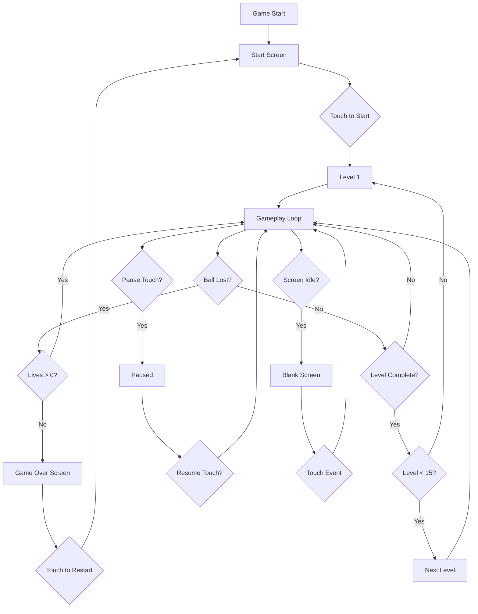
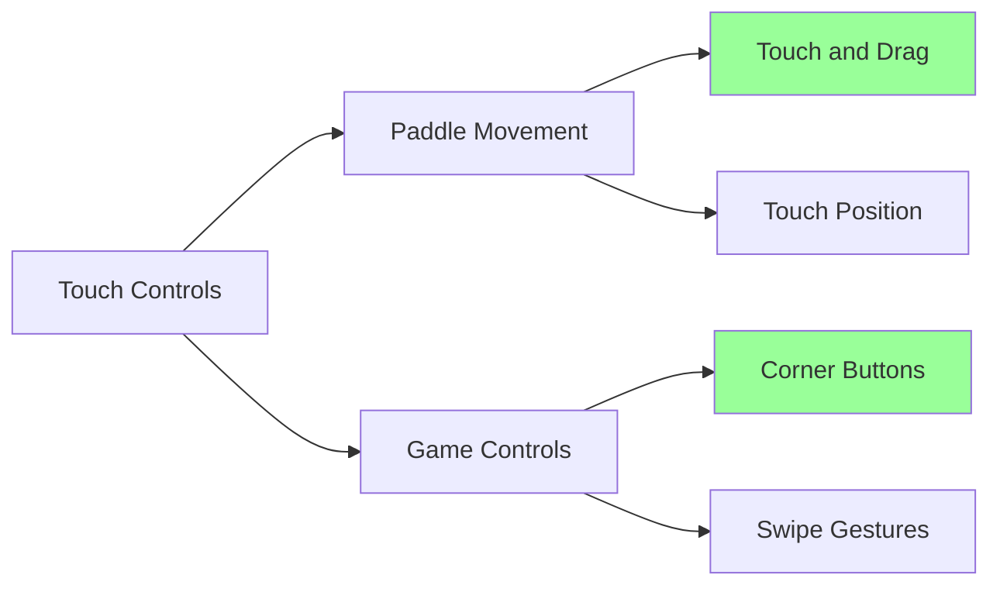
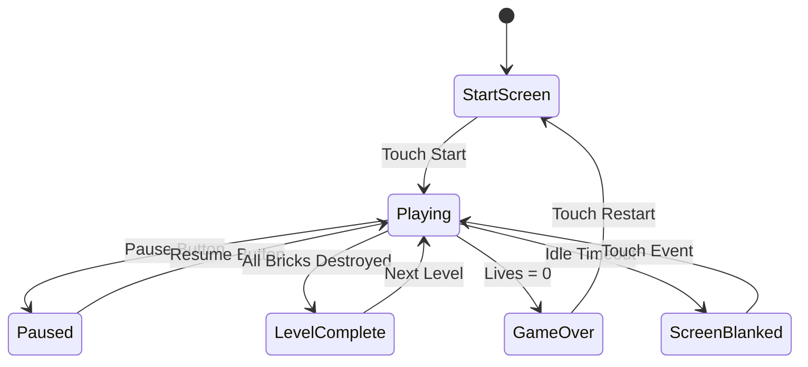

# RoomWizard Brick Breaker Game - Technical Plan

## Project Overview

Create a comprehensive brick breaker game optimized for the RoomWizard's embedded hardware (800MHz ARM CPU, touchscreen-only input) that replaces the original room booking interface.

## Hardware Constraints & Considerations

### Target Hardware
- **CPU**: 800MHz ARM processor
- **Display**: Touchscreen (likely 800x480 or 1024x600 resolution)
- **Input**: Touchscreen only (no physical buttons)
- **Browser**: WebKit-based (Epiphany)
- **Memory**: Limited (embedded device)

### Performance Requirements
- Maintain 60fps gameplay on 800MHz CPU
- Minimize memory allocations during gameplay
- Efficient collision detection
- Optimized rendering pipeline

## Game Architecture



## Touch Control Scheme Design

### Recommended Approach: Hybrid Control System



**Primary Control: Touch and Drag for Paddle**
- Touch anywhere on lower 2/3 of screen
- Paddle follows horizontal touch position
- Smooth interpolation for natural movement
- Dead zone at edges to prevent paddle from going off-screen

**Secondary Controls: Corner Buttons**
- Top-left: Pause/Resume (visible icon)
- Top-right: Restart (visible icon)
- Bottom corners: Reserved for paddle control
- Buttons fade after 3 seconds of inactivity, reappear on touch

**Alternative: Swipe Gestures**
- Swipe down from top: Pause
- Swipe up from bottom: Launch ball
- Two-finger tap: Restart (prevents accidental restarts)

### Recommended Implementation
Use **Touch and Drag + Corner Buttons** because:
1. Most intuitive for touchscreen
2. No learning curve required
3. Visual feedback with button icons
4. Prevents accidental actions
5. Works well on embedded hardware

## Game Features Specification

### Core Gameplay
1. **Lives System**: 5 lives per game
2. **Level Progression**: 15 levels that loop
3. **High Score**: Persistent across sessions (localStorage)
4. **Brick Types**: Multiple hit points, different colors
5. **Power-ups**: 
   - Paddle size increase/decrease
   - Multi-ball
   - Slow ball
   - Extra life
   - Laser paddle

### Screen States



### UI Elements

**Start Screen:**
- Game title
- High score display
- Instructions (touch controls)
- "Touch to Start" button
- Version/credits

**Gameplay HUD:**
- Score (top center)
- Lives remaining (top left, heart icons)
- Current level (top right)
- Pause button (top left corner, fades)
- Restart button (top right corner, fades)

**Pause Screen:**
- "PAUSED" text
- Current score
- Resume button
- Restart button
- Quit to menu button

**Game Over Screen:**
- Final score
- High score (with "NEW HIGH SCORE!" if beaten)
- Level reached
- Touch to restart

**Level Complete Screen:**
- "LEVEL COMPLETE!"
- Bonus points
- Next level preview
- Auto-advance after 2 seconds

## Performance Optimizations

### Rendering Optimizations
1. **Single Canvas**: One canvas element for entire game
2. **Dirty Rectangle**: Only redraw changed areas (optional, test performance)
3. **Object Pooling**: Reuse ball/power-up objects
4. **Sprite Batching**: Draw similar objects in batches
5. **RequestAnimationFrame**: Proper frame timing
6. **Fixed Time Step**: Consistent physics regardless of frame rate

### Memory Optimizations
1. **Pre-allocate Arrays**: Fixed-size arrays for bricks, balls, power-ups
2. **Avoid Garbage**: Minimize object creation during gameplay
3. **Efficient Collision**: Spatial partitioning for brick collision
4. **Texture Atlas**: Single image for all sprites (if using images)

### CPU Optimizations
1. **Simplified Physics**: Basic AABB collision detection
2. **Reduced Particle Effects**: Minimal visual effects
3. **Throttled Updates**: Update non-critical elements less frequently
4. **Early Exit**: Skip invisible/destroyed brick checks

### Code Structure
```javascript
// Efficient game loop structure
const gameLoop = {
    lastTime: 0,
    accumulator: 0,
    fixedDelta: 16.67, // 60fps
    
    update(currentTime) {
        const deltaTime = currentTime - this.lastTime;
        this.lastTime = currentTime;
        this.accumulator += deltaTime;
        
        // Fixed time step physics
        while (this.accumulator >= this.fixedDelta) {
            updatePhysics(this.fixedDelta);
            this.accumulator -= this.fixedDelta;
        }
        
        // Variable time step rendering
        render();
        requestAnimationFrame((t) => this.update(t));
    }
};
```

## Screen Blanking Implementation

### Idle Detection
```javascript
const screenBlanking = {
    idleTimeout: 300000, // 5 minutes (configurable)
    lastActivity: Date.now(),
    blanked: false,
    
    resetTimer() {
        this.lastActivity = Date.now();
        if (this.blanked) {
            this.unblank();
        }
    },
    
    check() {
        if (!this.blanked && 
            Date.now() - this.lastActivity > this.idleTimeout) {
            this.blank();
        }
    },
    
    blank() {
        this.blanked = true;
        canvas.style.display = 'none';
        // Show black screen or screensaver
    },
    
    unblank() {
        this.blanked = false;
        canvas.style.display = 'block';
    }
};
```

### Activity Tracking
- Touch events
- Ball movement
- Brick destruction
- Power-up collection
- Any user interaction

## Level Design

### Progression System
```javascript
const levelConfig = [
    // Level 1: Easy introduction
    {
        rows: 3,
        cols: 8,
        brickHealth: [1, 1, 1],
        ballSpeed: 3,
        powerUpChance: 0.1
    },
    // Level 2-5: Gradual difficulty increase
    {
        rows: 4,
        cols: 9,
        brickHealth: [1, 1, 2, 1],
        ballSpeed: 3.5,
        powerUpChance: 0.15
    },
    // Level 6-10: Medium difficulty
    {
        rows: 5,
        cols: 10,
        brickHealth: [2, 2, 3, 2, 1],
        ballSpeed: 4,
        powerUpChance: 0.2
    },
    // Level 11-15: Hard
    {
        rows: 6,
        cols: 10,
        brickHealth: [3, 3, 2, 2, 2, 1],
        ballSpeed: 4.5,
        powerUpChance: 0.25
    }
];
```

### Brick Patterns
- Rows of bricks with gaps
- Pyramid formations
- Checkerboard patterns
- Moving bricks (advanced levels)
- Indestructible bricks (obstacles)

## Data Persistence

### LocalStorage Schema
```javascript
const gameData = {
    highScore: 0,
    highScoreLevel: 1,
    totalGamesPlayed: 0,
    totalBricksDestroyed: 0,
    settings: {
        soundEnabled: true,
        screenBlankTimeout: 300000,
        difficulty: 'normal'
    },
    stats: {
        longestStreak: 0,
        powerUpsCollected: 0,
        perfectLevels: 0
    }
};

// Save/Load functions
function saveGame() {
    localStorage.setItem('brickBreakerData', JSON.stringify(gameData));
}

function loadGame() {
    const saved = localStorage.getItem('brickBreakerData');
    return saved ? JSON.parse(saved) : gameData;
}
```

## Power-Up System

### Power-Up Types
1. **Expand Paddle** (Green): Paddle width +50% for 10 seconds
2. **Shrink Paddle** (Red): Paddle width -30% for 10 seconds (negative)
3. **Multi-Ball** (Blue): Spawn 2 additional balls
4. **Slow Ball** (Yellow): Ball speed -40% for 15 seconds
5. **Extra Life** (Pink): +1 life (rare, 5% chance)
6. **Laser Paddle** (Orange): Shoot lasers to destroy bricks for 10 seconds
7. **Sticky Paddle** (Purple): Ball sticks to paddle, tap to release

### Power-Up Mechanics
```javascript
class PowerUp {
    constructor(x, y, type) {
        this.x = x;
        this.y = y;
        this.type = type;
        this.speed = 2;
        this.size = 20;
        this.active = true;
    }
    
    update() {
        this.y += this.speed;
        if (this.y > canvas.height) {
            this.active = false;
        }
    }
    
    checkCollision(paddle) {
        return this.active &&
               this.x > paddle.x &&
               this.x < paddle.x + paddle.width &&
               this.y + this.size > paddle.y;
    }
}
```

## Visual Design

### Color Scheme
- **Background**: Dark blue/black (#0a0e27)
- **Paddle**: Bright cyan (#00ffff)
- **Ball**: White (#ffffff)
- **Bricks**:
  - 1 hit: Green (#00ff00)
  - 2 hits: Yellow (#ffff00)
  - 3 hits: Orange (#ff8800)
  - 4 hits: Red (#ff0000)
  - Indestructible: Gray (#808080)
- **UI Text**: White with shadow
- **Power-ups**: Color-coded by type

### Visual Effects
- Brick destruction particles (minimal, 3-5 particles)
- Paddle glow on ball hit
- Screen shake on life lost (subtle)
- Score popup on brick destruction
- Power-up collection flash
- Level complete celebration (brief)

### Responsive Layout
```javascript
// Adapt to screen size
function setupCanvas() {
    canvas.width = window.innerWidth;
    canvas.height = window.innerHeight;
    
    // Scale game elements proportionally
    const scale = Math.min(
        canvas.width / 800,
        canvas.height / 600
    );
    
    paddle.width = 100 * scale;
    paddle.height = 20 * scale;
    ball.radius = 8 * scale;
    brick.width = (canvas.width - 100) / 10;
    brick.height = 25 * scale;
}
```

## Sound Effects (Optional)

### Audio Events
- Paddle hit (low beep)
- Brick destruction (higher beep, varies by brick type)
- Power-up collection (chime)
- Life lost (descending tone)
- Level complete (victory jingle)
- Game over (sad tone)

### Implementation
```javascript
// Web Audio API for low-latency sounds
const audioContext = new (window.AudioContext || window.webkitAudioContext)();

function playSound(frequency, duration) {
    const oscillator = audioContext.createOscillator();
    const gainNode = audioContext.createGain();
    
    oscillator.connect(gainNode);
    gainNode.connect(audioContext.destination);
    
    oscillator.frequency.value = frequency;
    oscillator.type = 'square';
    
    gainNode.gain.setValueAtTime(0.3, audioContext.currentTime);
    gainNode.gain.exponentialRampToValueAtTime(
        0.01, audioContext.currentTime + duration
    );
    
    oscillator.start(audioContext.currentTime);
    oscillator.stop(audioContext.currentTime + duration);
}
```

## File Structure

### Single HTML File Organization
```html
<!DOCTYPE html>
<html lang="en">
<head>
    <meta charset="UTF-8">
    <meta name="viewport" content="width=device-width, initial-scale=1.0">
    <title>Brick Breaker</title>
    <style>
        /* All CSS inline */
        * { margin: 0; padding: 0; overflow: hidden; }
        body { background: #000; touch-action: none; }
        canvas { display: block; }
        /* ... more styles ... */
    </style>
</head>
<body>
    <canvas id="gameCanvas"></canvas>
    <script>
        // Game constants
        // Game state
        // Game objects (Ball, Paddle, Brick, PowerUp classes)
        // Collision detection
        // Rendering functions
        // Input handling
        // Game loop
        // Initialization
    </script>
</body>
</html>
```

## Testing Checklist

### Functionality Tests
- [ ] Game starts correctly
- [ ] Paddle follows touch input smoothly
- [ ] Ball bounces correctly off paddle, walls, bricks
- [ ] Bricks destroyed with correct hit points
- [ ] Lives decrease when ball is lost
- [ ] Level progression works (1-15, then loops)
- [ ] High score saves and loads
- [ ] Power-ups spawn and work correctly
- [ ] Pause/resume functions properly
- [ ] Restart works at any time
- [ ] Screen blanking activates and deactivates
- [ ] Game over screen displays correctly
- [ ] Touch controls work in all game states

### Performance Tests
- [ ] Maintains 60fps during normal gameplay
- [ ] No lag with multiple balls active
- [ ] Smooth animation on 800MHz CPU
- [ ] No memory leaks during extended play
- [ ] Quick load time (<2 seconds)
- [ ] Responsive touch input (<50ms latency)

### Edge Cases
- [ ] Multiple balls don't cause issues
- [ ] Power-up stacking works correctly
- [ ] Screen rotation handled (if applicable)
- [ ] Browser refresh preserves high score
- [ ] Rapid touch inputs don't break game
- [ ] All 15 levels completable
- [ ] Loop back to level 1 works

## Implementation Priority

### Phase 1: Core Gameplay (MVP)
1. Canvas setup and rendering
2. Paddle with touch control
3. Ball physics and movement
4. Basic brick grid (single hit)
5. Collision detection
6. Lives system
7. Score tracking
8. Game over condition

### Phase 2: Level System
1. Multiple brick types (hit points)
2. 15 level configurations
3. Level progression
4. Level complete screen
5. Difficulty scaling

### Phase 3: Polish & Features
1. High score persistence
2. Start screen
3. Pause functionality
4. Restart button
5. UI/HUD elements
6. Visual effects

### Phase 4: Advanced Features
1. Power-up system
2. Screen blanking
3. Sound effects (optional)
4. Statistics tracking
5. Additional visual polish

## Deployment

### File Replacement
```bash
# Replace both files to prevent template regeneration
copy brick-breaker.html "partitions\108a1490-8feb-4d0c-b3db-995dc5fc066c\opt\jetty-9-4-11\webapps\frontpanel\pages\index.html"
copy brick-breaker.html "partitions\108a1490-8feb-4d0c-b3db-995dc5fc066c\opt\jetty-9-4-11\webapps\frontpanel\pages\index.html.template"
```

### Verification
1. File sizes match
2. Both files are identical
3. HTML validates
4. No syntax errors in JavaScript
5. localStorage permissions work

## Success Criteria

✅ Game runs smoothly on 800MHz hardware
✅ Touch controls are intuitive and responsive
✅ All 15 levels are playable and progressively challenging
✅ High scores persist across reboots
✅ Screen blanking prevents burn-in
✅ Game is engaging and fun to play
✅ No crashes or freezes during extended play
✅ Professional appearance and polish

---

**Next Step**: Proceed to Code mode to implement the brick breaker game following this architectural plan.