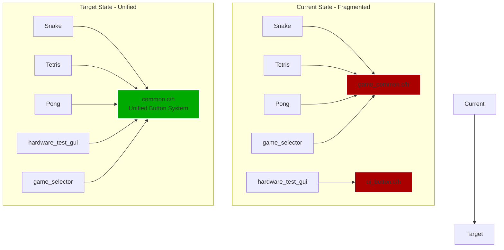

# Library Consolidation Plan - RoomWizard UI System

## Executive Summary

Consolidate two competing button/UI systems ([`game_common.c/h`](../native_games/common/game_common.h) and [`ui_button.c/h`](../native_games/common/ui_button.h)) into a single, unified [`common.c/h`](../native_games/common/common.h) library that combines the best features from both implementations.

## Architecture Overview



## Feature Comparison Matrix

| Feature | game_common | ui_button | Unified common |
|---------|-------------|-----------|----------------|
| Text storage | Pointer | Buffer | Buffer 128 chars |
| Text centering | Manual 6px | Auto 8px | Auto 8px |
| Text truncation | ❌ | ❌ | ✅ with ... |
| Max width | ❌ | ❌ | ✅ configurable |
| Auto-sizing | ❌ | ❌ | ✅ |
| Icon support | Separate funcs | Callback | Callback + helpers |
| Visual states | 2 states | 3 states | 3 states |
| Debouncing | ✅ 200ms | ✅ 200ms | ✅ configurable |
| Border config | Fixed | ✅ | ✅ |
| Screen templates | ✅ | ❌ | ✅ |
| Uppercase auto | ✅ | ✅ | ✅ |

## Current State Analysis

### System 1: game_common.c/h
**Used by:** Snake, Tetris, Pong (3 games)

**Button Structure:**
```c
typedef struct {
    int x, y, width, height;
    const char *text;  // Pointer (no copy)
    uint32_t bg_color, text_color, highlight_color;
    ButtonState state;
} Button;
```

**Features:**
- ✅ Separate icon drawing functions (`draw_menu_button()`, `draw_exit_button()`)
- ✅ Screen templates (`draw_welcome_screen()`, `draw_game_over_screen()`, `draw_pause_screen()`)
- ✅ Simple API
- ❌ Manual text centering (6px per char assumption - INCORRECT)
- ❌ No text truncation
- ❌ No max-width support
- ❌ Text pointer (not copied)

### System 2: ui_button.c/h
**Used by:** hardware_test_gui (1 utility)

**Button Structure:**
```c
typedef struct {
    int x, y, width, height;
    char text[64];  // Buffer (copied)
    uint32_t bg_color, text_color, highlight_color, border_color;
    int text_scale, border_width;
    ButtonVisualState visual_state;
    bool was_pressed;
    uint32_t last_press_time_ms, debounce_ms;
    void (*draw_icon)(Framebuffer*, int, int, int, uint32_t);
} UIButton;
```

**Features:**
- ✅ Automatic text centering via `ui_draw_text_centered()`
- ✅ Correct text measurement (8px per char * scale)
- ✅ Automatic uppercase conversion
- ✅ Icon callback support
- ✅ Visual states (normal, highlighted, pressed)
- ✅ Text buffer (copied)
- ✅ Configurable border
- ❌ No text truncation
- ❌ No max-width support
- ❌ No screen templates

## Unified API Design

### Core Button Structure
```c
typedef struct {
    // Position and size
    int x, y, width, height;
    
    // Text (with truncation support)
    char text[128];  // Larger buffer
    int max_text_width;  // 0 = no limit, >0 = truncate with "..."
    
    // Colors
    uint32_t bg_color;
    uint32_t text_color;
    uint32_t highlight_color;
    uint32_t border_color;
    
    // Styling
    int text_scale;
    int border_width;
    
    // State management
    ButtonVisualState visual_state;
    bool was_pressed;
    uint32_t last_press_time_ms;
    uint32_t debounce_ms;
    
    // Optional icon
    void (*draw_icon)(Framebuffer *fb, int x, int y, int size, uint32_t color);
} Button;
```

### Key Functions

**Button Management:**
```c
// Initialize button with all parameters
void button_init(Button *btn, int x, int y, int width, int height,
                 const char *text, uint32_t bg_color, uint32_t text_color,
                 uint32_t highlight_color, int text_scale);

// Initialize with defaults (common use case)
void button_init_simple(Button *btn, int x, int y, int width, int height,
                        const char *text);

// Set text with automatic truncation if max_width exceeded
void button_set_text(Button *btn, const char *text);

// Set max text width (0 = no limit)
void button_set_max_text_width(Button *btn, int max_width);

// Set colors
void button_set_colors(Button *btn, uint32_t bg, uint32_t text, uint32_t highlight);

// Set border
void button_set_border(Button *btn, uint32_t color, int width);

// Set debounce time
void button_set_debounce(Button *btn, uint32_t ms);

// Set custom icon drawer
void button_set_icon(Button *btn, void (*draw_icon)(Framebuffer*, int, int, int, uint32_t));
```

**Touch Handling:**
```c
// Check if touch is within button bounds
bool button_is_touched(Button *btn, int touch_x, int touch_y);

// Update button state with touch (returns true if pressed)
bool button_update(Button *btn, int touch_x, int touch_y, bool is_touching, uint32_t current_time_ms);

// Legacy API for compatibility
bool button_check_press(Button *btn, bool currently_pressed, uint32_t current_time_ms);
```

**Rendering:**
```c
// Draw button with current state
void button_draw(Framebuffer *fb, Button *btn);

// Draw button with icon (hamburger menu)
void button_draw_menu(Framebuffer *fb, Button *btn);

// Draw button with icon (X exit)
void button_draw_exit(Framebuffer *fb, Button *btn);
```

**Text Utilities:**
```c
// Measure text width (8 pixels per character * scale)
int text_measure_width(const char *text, int scale);

// Measure text height (8 pixels * scale)
int text_measure_height(int scale);

// Draw centered text
void text_draw_centered(Framebuffer *fb, int center_x, int center_y,
                       const char *text, uint32_t color, int scale);

// Truncate text to fit width with ellipsis
void text_truncate(char *dest, const char *src, int max_width, int scale);
```

**Screen Templates:**
```c
// Draw welcome screen with title and start button
void screen_draw_welcome(Framebuffer *fb, const char *game_title,
                        const char *instructions, Button *start_btn);

// Draw game over screen with score and restart button
void screen_draw_game_over(Framebuffer *fb, const char *message, int score,
                          Button *restart_btn);

// Draw pause screen with resume button
void screen_draw_pause(Framebuffer *fb, Button *resume_btn, Button *exit_btn);
```

**Time Utilities:**
```c
// Get current time in milliseconds
uint32_t get_time_ms(void);
```

### Text Truncation Algorithm

```c
void text_truncate(char *dest, const char *src, int max_width, int scale) {
    // Convert to uppercase first
    char upper[256];
    to_uppercase(upper, src, sizeof(upper));
    
    int full_width = text_measure_width(upper, scale);
    
    if (max_width <= 0 || full_width <= max_width) {
        // No truncation needed
        strcpy(dest, upper);
        return;
    }
    
    // Need to truncate with "..."
    int ellipsis_width = text_measure_width("...", scale);
    int available_width = max_width - ellipsis_width;
    
    if (available_width <= 0) {
        strcpy(dest, "...");
        return;
    }
    
    // Calculate how many characters fit
    int char_width = 8 * scale;
    int max_chars = available_width / char_width;
    
    if (max_chars <= 0) {
        strcpy(dest, "...");
        return;
    }
    
    // Copy characters and add ellipsis
    strncpy(dest, upper, max_chars);
    dest[max_chars] = '\0';
    strcat(dest, "...");
}
```

### Button Auto-Sizing

```c
// Calculate minimum width needed for text
int button_calc_min_width(const char *text, int scale, int padding) {
    int text_width = text_measure_width(text, scale);
    return text_width + (padding * 2);
}

// Auto-size button to fit text
void button_auto_size(Button *btn, int padding) {
    btn->width = button_calc_min_width(btn->text, btn->text_scale, padding);
}
```

## Migration Strategy

### Phase 1: Create Unified Library
1. Create [`native_games/common/common.c`](../native_games/common/common.c)
2. Create [`native_games/common/common.h`](../native_games/common/common.h)
3. Implement all functions from unified API
4. Add text truncation support
5. Add button auto-sizing support
6. Include all screen template functions
7. Include icon drawing functions

### Phase 2: Migrate Programs (One at a Time)
**Order:** Start with simplest, end with most complex

1. **hardware_test_gui** (simplest - only uses buttons)
   - Replace `#include "ui_button.h"` with `#include "common.h"`
   - Replace `UIButton` with `Button`
   - Replace `ui_button_*` calls with `button_*` calls
   - Test on device

2. **Snake** (medium complexity)
   - Replace `#include "game_common.h"` with `#include "common.h"`
   - Update button initialization calls
   - Update screen drawing calls
   - Test on device

3. **Tetris** (medium complexity)
   - Same as Snake
   - Test on device

4. **Pong** (medium complexity)
   - Same as Snake
   - Test on device

5. **game_selector** (most complex - custom UI)
   - Analyze current implementation
   - Migrate to use `Button` struct
   - May need custom rendering
   - Test on device

### Phase 3: Cleanup
1. Remove [`native_games/common/game_common.c`](../native_games/common/game_common.c)
2. Remove [`native_games/common/game_common.h`](../native_games/common/game_common.h)
3. Remove [`native_games/common/ui_button.c`](../native_games/common/ui_button.c)
4. Remove [`native_games/common/ui_button.h`](../native_games/common/ui_button.h)
5. Update [`native_games/Makefile`](../native_games/Makefile)
6. Update [`native_games/compile_for_roomwizard.sh`](../native_games/compile_for_roomwizard.sh)
7. Compile all programs
8. Deploy to device
9. Test all programs

## Color Palette

Consolidate color definitions:

```c
// Common colors
#define COLOR_BLACK         RGB(0, 0, 0)
#define COLOR_WHITE         RGB(255, 255, 255)
#define COLOR_RED           RGB(255, 0, 0)
#define COLOR_GREEN         RGB(0, 255, 0)
#define COLOR_BLUE          RGB(0, 0, 255)
#define COLOR_CYAN          RGB(0, 255, 255)
#define COLOR_MAGENTA       RGB(255, 0, 255)
#define COLOR_YELLOW        RGB(255, 255, 0)

// Button colors
#define BTN_COLOR_PRIMARY       RGB(0, 150, 0)      // Green
#define BTN_COLOR_SECONDARY     RGB(100, 100, 100)  // Gray
#define BTN_COLOR_DANGER        RGB(200, 0, 0)      // Red
#define BTN_COLOR_WARNING       RGB(255, 165, 0)    // Orange
#define BTN_COLOR_INFO          RGB(0, 150, 200)    // Cyan
#define BTN_COLOR_HIGHLIGHT     RGB(255, 255, 100)  // Yellow

// Legacy aliases for compatibility
#define BTN_MENU_COLOR          BTN_COLOR_WARNING
#define BTN_EXIT_COLOR          BTN_COLOR_DANGER
#define BTN_START_COLOR         BTN_COLOR_PRIMARY
#define BTN_RESTART_COLOR       BTN_COLOR_PRIMARY
#define BTN_RESUME_COLOR        BTN_COLOR_PRIMARY
#define BTN_HIGHLIGHT_COLOR     BTN_COLOR_HIGHLIGHT
```

## Testing Strategy

### Unit Testing (Manual)
For each migrated program:
1. Compile successfully
2. Run on device
3. Test button touch detection
4. Test button visual feedback
5. Test text centering
6. Test text truncation (if applicable)
7. Test icon rendering (menu/exit buttons)
8. Test screen transitions

### Integration Testing
1. Test game selector → game flow
2. Test all games in sequence
3. Test hardware_test_gui
4. Test touch accuracy across all programs
5. Verify no memory leaks
6. Verify no visual glitches

## Benefits

1. **Single Source of Truth** - One button implementation
2. **Consistent API** - Same functions across all programs
3. **Better Text Handling** - Correct measurements, truncation support
4. **Easier Maintenance** - Fix bugs once, benefits all programs
5. **Cleaner Code** - Remove duplication
6. **Better Documentation** - One library to document
7. **Future-Proof** - Easy to add features (rounded corners, shadows, etc.)

## Risks & Mitigation

| Risk | Mitigation |
|------|------------|
| Breaking existing games | Migrate one at a time, test thoroughly |
| Text measurement changes | Verify all text fits in buttons |
| Performance regression | Profile before/after |
| Compilation errors | Update Makefiles carefully |
| Device testing delays | Use SSH key auth for fast deployment |

## Success Criteria

- [ ] All programs compile without errors
- [ ] All programs run on device
- [ ] All buttons respond correctly to touch
- [ ] All text is centered and readable
- [ ] Text truncation works correctly
- [ ] No visual glitches or flickering
- [ ] No memory leaks
- [ ] Code is cleaner and more maintainable
- [ ] Documentation is updated

## Timeline

**No time estimates provided per user request.**

Phases will be completed sequentially:
1. Library creation
2. Program migration (one at a time)
3. Cleanup and testing
4. Documentation update
