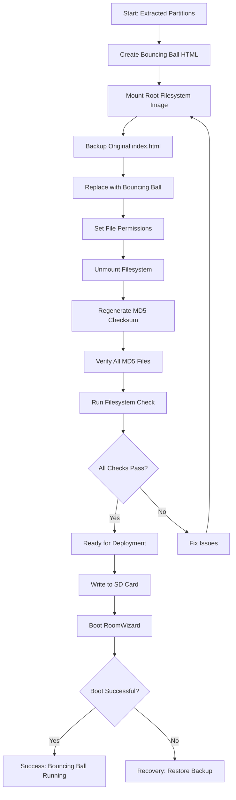
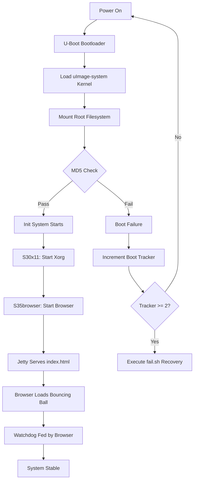
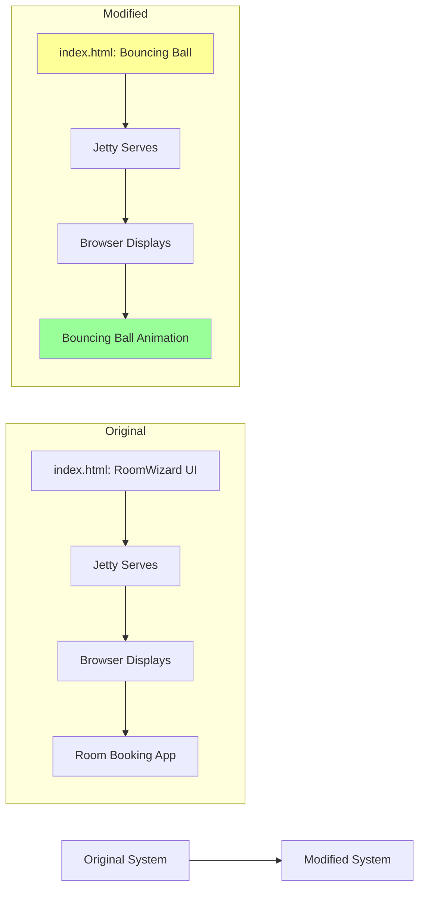
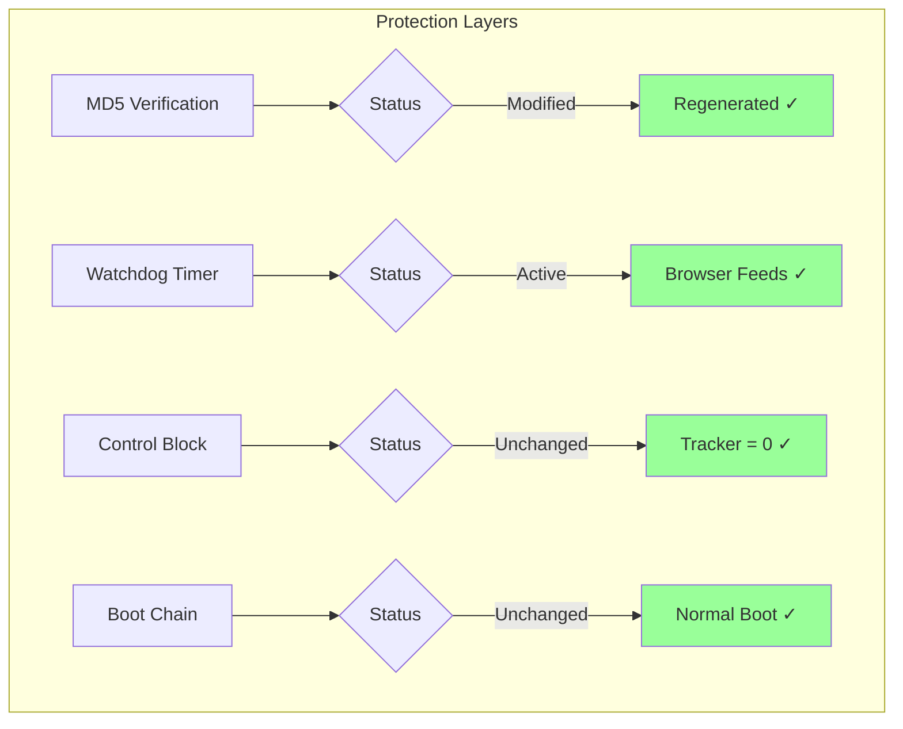
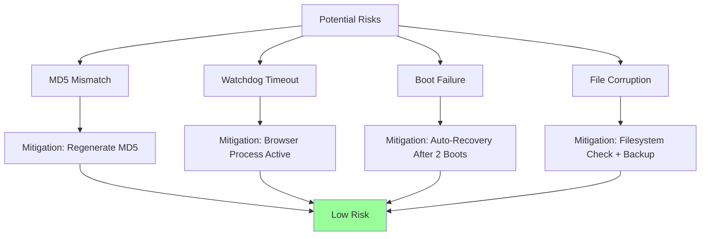
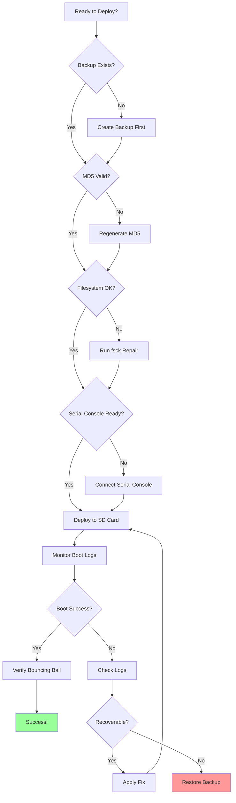
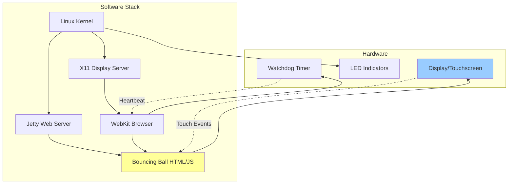
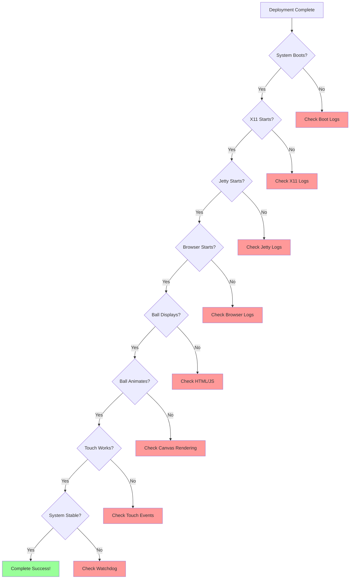
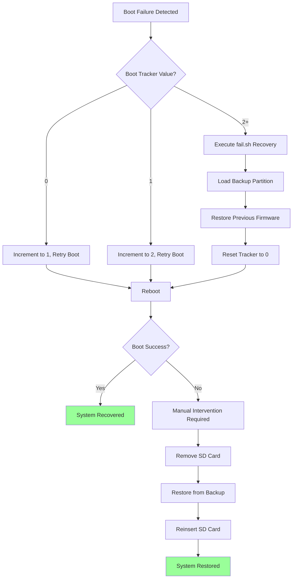

# RoomWizard Modification Workflow

## High-Level Process Flow



## Detailed Boot Sequence After Modification



## File Modification Impact



## Protection Mechanisms Status



## Risk Mitigation Strategy



## Deployment Decision Tree



## Component Interaction Map



## File System Layout

```
Root Filesystem (sd_rootfs_part.img)
│
├── /opt/
│   ├── jetty-9-4-11/
│   │   ├── webapps/
│   │   │   └── frontpanel/
│   │   │       └── pages/
│   │   │           ├── index.html ← MODIFIED
│   │   │           └── index.html.original ← BACKUP
│   │   └── etc/
│   │       └── configure_jetty.sh
│   │
│   ├── openjre-8/
│   │   └── bin/java
│   │
│   └── sbin/
│       └── (system scripts)
│
├── /etc/
│   ├── init.d/
│   │   ├── x11 ← Starts display
│   │   ├── webserver ← Starts Jetty
│   │   ├── browser ← Starts WebKit
│   │   └── watchdog ← Monitors system
│   │
│   └── scriptlookup.txt
│
└── /var/log/
    ├── browser.out
    ├── browser.err
    └── jettystart
```

## Success Criteria Checklist



## Recovery Workflow



## Timeline of Events

```mermaid
gantt
    title RoomWizard Boot Sequence with Modified Firmware
    dateFormat ss
    axisFormat %S sec
    
    section Boot
    U-Boot Loads Kernel           :00, 5s
    Kernel Initializes            :05, 10s
    
    section Init
    Mount Filesystems             :15, 5s
    MD5 Verification              :20, 3s
    Start Init Scripts            :23, 2s
    
    section Services
    Start X11 Display             :25, 5s
    Start Jetty Server            :30, 10s
    Start Browser                 :40, 5s
    
    section Application
    Load Bouncing Ball HTML       :45, 2s
    Initialize Canvas             :47, 1s
    Start Animation               :48, 1s
    System Ready                  :49, 1s
    
    section Watchdog
    Watchdog Active               :25, 25s
```



## Key Takeaways

### What Changes
- **Single File**: `/opt/jetty-9-4-11/webapps/frontpanel/pages/index.html`
- **One Checksum**: `sd_rootfs_part.img.md5`

### What Stays the Same
- Boot sequence and bootloader
- All init scripts and services
- X11, Jetty, Browser processes
- Watchdog configuration
- Hardware interfaces

### Why This Works
- Minimal intervention reduces risk
- Leverages existing infrastructure
- Browser process maintains watchdog
- MD5 regeneration satisfies integrity checks
- No changes to critical boot components

### Safety Net
- Original SD card backed up
- Auto-recovery after 2 failed boots
- Serial console for debugging
- Simple rollback procedure
- index.html.original preserved