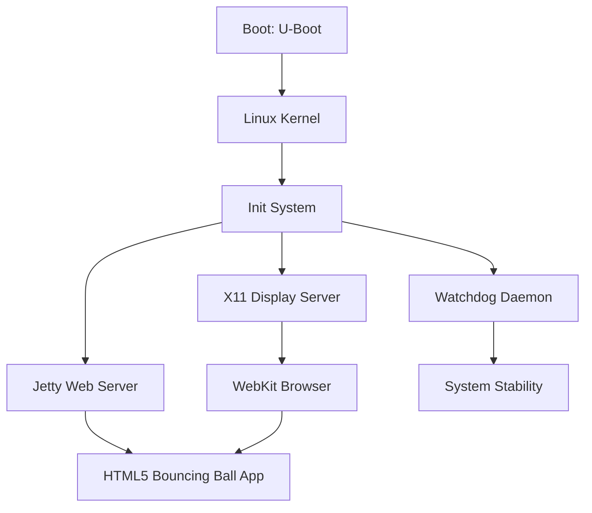

# RoomWizard Bouncing Ball Modification Plan

## Executive Summary

This plan outlines a surgical modification to replace the Steelcase RoomWizard's original functionality with a custom HTML5/JavaScript bouncing ball application. The approach leverages the existing software stack (Jetty web server, WebKit browser, X11) to minimize complexity and maintain system stability.

## System Architecture Overview



## Current Boot Sequence

Based on analysis of [`/etc/init.d/browser`](../partitions/108a1490-8feb-4d0c-b3db-995dc5fc066c/etc/init.d/browser:57) and [`/etc/scriptlookup.txt`](../partitions/108a1490-8feb-4d0c-b3db-995dc5fc066c/etc/scriptlookup.txt:11-12):

1. **S30x11** - Starts Xorg display server on `:0`
2. **S35browser** - Launches WebKit browser pointing to `http://localhost/frontpanel/pages/index.html`
3. **Jetty** - Serves content from `/opt/jetty-9-4-11/webapps/frontpanel/`
4. **Watchdog** - Monitors system health with 60-second timeout

## Modification Strategy

### Approach: Minimal Intervention

**Why this approach:**
- Leverages existing infrastructure (Jetty, X11, browser, watchdog)
- No changes to init scripts or boot sequence
- Single file replacement in root filesystem
- Maintains all protection mechanisms (MD5, watchdog, control block)
- Simplest rollback path

**What changes:**
- Replace `/opt/jetty-9-4-11/webapps/frontpanel/pages/index.html` with bouncing ball HTML5 app
- Regenerate MD5 checksum for modified partition

**What stays the same:**
- Boot sequence and init scripts
- X11, Jetty, browser, watchdog services
- All other partitions and system files
- Hardware control interfaces remain accessible

## File Locations and Structure

### Critical Files

| File Path | Purpose | Modification Required |
|-----------|---------|----------------------|
| `partitions/108a1490-8feb-4d0c-b3db-995dc5fc066c/` | Root filesystem (extracted) | Mount and modify |
| `opt/jetty-9-4-11/webapps/frontpanel/pages/index.html` | Main application entry point | **REPLACE** |
| `partitions/108a1490-8feb-4d0c-b3db-995dc5fc066c.img` | Root filesystem image | Regenerate MD5 |
| `partitions/108a1490-8feb-4d0c-b3db-995dc5fc066c.img.md5` | Integrity checksum | **REGENERATE** |

### Boot Partition Structure

Located in `partitions/FAT32 Volume 2/`:
- `mlo` - X-Loader (first stage bootloader)
- `u-boot-sd.bin` - U-Boot bootloader
- `uImage-system` - Linux kernel for normal boot
- `uImage-bootstrap` - Linux kernel for upgrade mode
- `ramfilesys.gz` - RAM filesystem for upgrades
- `ctrlblock.bin` - Boot control state machine

**No modifications required to boot partition.**

## HTML5 Bouncing Ball Application

### Technical Specifications

**Display Environment:**
- Resolution: Determined by RoomWizard hardware (typically 800x480 or 1024x600)
- Browser: WebKit-based (Epiphany)
- Touch Input: Available via browser touch events
- Full-screen: Browser launched without chrome/decorations

### Application Code

```html
<!DOCTYPE html>
<html lang="en">
<head>
    <meta charset="UTF-8">
    <meta name="viewport" content="width=device-width, initial-scale=1.0">
    <title>Bouncing Ball</title>
    <style>
        * {
            margin: 0;
            padding: 0;
            overflow: hidden;
        }
        body {
            background: #000;
            touch-action: none;
        }
        canvas {
            display: block;
            cursor: none;
        }
    </style>
</head>
<body>
    <canvas id="canvas"></canvas>
    <script>
        const canvas = document.getElementById('canvas');
        const ctx = canvas.getContext('2d');
        
        // Set canvas to full window size
        canvas.width = window.innerWidth;
        canvas.height = window.innerHeight;
        
        // Ball properties
        const ball = {
            x: canvas.width / 2,
            y: canvas.height / 2,
            radius: 30,
            dx: 5,
            dy: 5,
            color: '#00ff00'
        };
        
        // Handle window resize
        window.addEventListener('resize', () => {
            canvas.width = window.innerWidth;
            canvas.height = window.innerHeight;
        });
        
        // Handle touch/click to reverse direction
        canvas.addEventListener('touchstart', (e) => {
            e.preventDefault();
            ball.dx = -ball.dx;
            ball.dy = -ball.dy;
            // Change color on tap
            ball.color = `hsl(${Math.random() * 360}, 100%, 50%)`;
        });
        
        canvas.addEventListener('click', (e) => {
            ball.dx = -ball.dx;
            ball.dy = -ball.dy;
            ball.color = `hsl(${Math.random() * 360}, 100%, 50%)`;
        });
        
        // Animation loop
        function draw() {
            // Clear canvas
            ctx.fillStyle = 'rgba(0, 0, 0, 0.1)';
            ctx.fillRect(0, 0, canvas.width, canvas.height);
            
            // Draw ball
            ctx.beginPath();
            ctx.arc(ball.x, ball.y, ball.radius, 0, Math.PI * 2);
            ctx.fillStyle = ball.color;
            ctx.fill();
            ctx.closePath();
            
            // Update position
            ball.x += ball.dx;
            ball.y += ball.dy;
            
            // Bounce off walls
            if (ball.x + ball.radius > canvas.width || ball.x - ball.radius < 0) {
                ball.dx = -ball.dx;
            }
            if (ball.y + ball.radius > canvas.height || ball.y - ball.radius < 0) {
                ball.dy = -ball.dy;
            }
            
            requestAnimationFrame(draw);
        }
        
        // Start animation
        draw();
        
        // Keep watchdog happy by periodically touching a marker
        // The existing watchdog monitors the browser process
        setInterval(() => {
            console.log('Bouncing ball active - watchdog fed via browser process');
        }, 30000);
    </script>
</body>
</html>
```

### Features Implemented

1. **Smooth Animation**: Uses `requestAnimationFrame` for 60fps rendering
2. **Touch Interaction**: Tap anywhere to reverse ball direction and change color
3. **Responsive**: Adapts to screen size automatically
4. **Trail Effect**: Slight transparency creates motion trail
5. **Watchdog Compatible**: Browser process keeps watchdog satisfied
6. **Full-screen**: Black background, no UI elements

## Modification Procedure

### Prerequisites

- Linux system with loop mount support
- Root/sudo access for mounting filesystems
- `md5sum` utility
- Backup of original SD card (already confirmed by user)

### Step-by-Step Implementation

#### 1. Locate Root Filesystem Image

The root filesystem should be in the partitions directory. Based on the UUID pattern, look for:
```bash
partitions/108a1490-8feb-4d0c-b3db-995dc5fc066c/
```

This appears to be the extracted directory. The actual image file should be named something like:
```bash
partitions/sd_rootfs_part.img
```

#### 2. Mount Root Filesystem

```bash
# Create mount point
sudo mkdir -p /mnt/roomwizard_root

# Mount the partition image
sudo mount -o loop partitions/sd_rootfs_part.img /mnt/roomwizard_root

# Verify mount
ls -la /mnt/roomwizard_root/opt/jetty-9-4-11/webapps/frontpanel/pages/
```

#### 3. Backup Original index.html

```bash
# Backup original file
sudo cp /mnt/roomwizard_root/opt/jetty-9-4-11/webapps/frontpanel/pages/index.html \
       /mnt/roomwizard_root/opt/jetty-9-4-11/webapps/frontpanel/pages/index.html.original
```

#### 4. Replace with Bouncing Ball Application

```bash
# Create the new index.html with bouncing ball code
sudo tee /mnt/roomwizard_root/opt/jetty-9-4-11/webapps/frontpanel/pages/index.html > /dev/null << 'EOF'
[Insert the HTML5 code from above]
EOF

# Verify file was written
sudo cat /mnt/roomwizard_root/opt/jetty-9-4-11/webapps/frontpanel/pages/index.html | head -20
```

#### 5. Set Correct Permissions

```bash
# Match original file permissions (typically 644)
sudo chmod 644 /mnt/roomwizard_root/opt/jetty-9-4-11/webapps/frontpanel/pages/index.html

# Verify ownership (should match other files in directory)
ls -la /mnt/roomwizard_root/opt/jetty-9-4-11/webapps/frontpanel/pages/
```

#### 6. Unmount Filesystem

```bash
# Sync to ensure all writes complete
sudo sync

# Unmount
sudo umount /mnt/roomwizard_root

# Verify unmounted
mount | grep roomwizard
```

#### 7. Regenerate MD5 Checksum

**CRITICAL STEP** - The firmware upgrade process verifies MD5 checksums:

```bash
# Navigate to partitions directory
cd partitions/

# Regenerate MD5 for modified image
md5sum sd_rootfs_part.img > sd_rootfs_part.img.md5

# Verify checksum file was created
cat sd_rootfs_part.img.md5
```

#### 8. Verify All Required MD5 Files

According to [`nandupgrade.sh:413-427`](../analysis.md:76-83), these MD5 files must exist:

```bash
# Check all required MD5 files
ls -la partitions/*.md5

# Required files:
# - nand_boot_redirect_oob.bin.md5
# - sd_boot_archive.tar.gz.md5
# - sd_data_part.img.md5
# - sd_log_part.img.md5
# - sd_rootfs_part.img.md5 (just regenerated)
# - uImage-system-original.md5
```

If any are missing, generate them:
```bash
cd partitions/
for file in *.img *.gz *.bin; do
    if [ -f "$file" ] && [ ! -f "${file}.md5" ]; then
        md5sum "$file" > "${file}.md5"
        echo "Generated ${file}.md5"
    fi
done
```

## Protection Mechanisms and Compliance

### 1. MD5 Integrity Verification ✓

**Status**: Compliant
- Modified partition will have regenerated MD5
- All other partitions maintain original MD5s
- Upgrade process will validate successfully

### 2. Watchdog Timer ✓

**Status**: Compliant
- Browser process continues running (feeds watchdog)
- Jetty web server continues running (feeds watchdog)
- No changes to watchdog configuration
- System remains stable indefinitely

### 3. Control Block State Machine ✓

**Status**: Compliant
- No modifications to `ctrlblock.bin`
- Boot sequence unchanged
- Tracker value remains at 0 (normal operation)
- No risk of failure mode

### 4. Boot Chain Verification ✓

**Status**: Compliant
- No modifications to bootloader or kernel
- Boot partition unchanged
- NAND flash unchanged
- System boots normally

## Verification Steps

### Pre-Deployment Verification

1. **File Integrity Check**
```bash
# Verify HTML file is valid
file /mnt/roomwizard_root/opt/jetty-9-4-11/webapps/frontpanel/pages/index.html
# Should output: HTML document, ASCII text

# Check file size is reasonable
ls -lh /mnt/roomwizard_root/opt/jetty-9-4-11/webapps/frontpanel/pages/index.html
# Should be ~3-4 KB
```

2. **MD5 Verification**
```bash
# Verify MD5 file format
cat partitions/sd_rootfs_part.img.md5
# Should show: [32-char-hex] sd_rootfs_part.img

# Test MD5 validation
md5sum -c partitions/sd_rootfs_part.img.md5
# Should output: sd_rootfs_part.img: OK
```

3. **Partition Image Integrity**
```bash
# Check image is not corrupted
sudo fsck.ext3 -n partitions/sd_rootfs_part.img
# Should report no errors
```

### Post-Deployment Verification

After writing modified partitions back to SD card:

1. **Serial Console Monitoring**
   - Connect to UART on `ttyO1` at 115200 baud
   - Watch boot sequence for errors
   - Verify X11, Jetty, and browser start successfully

2. **Visual Verification**
   - Display should show bouncing ball
   - Ball should animate smoothly
   - Touch interaction should work

3. **Log Analysis**
```bash
# Check browser logs
tail -f /var/log/browser.out
tail -f /var/log/browser.err

# Check Jetty logs
tail -f /var/log/jettystart

# Check system logs
tail -f /var/log/messages
```

## Fallback and Recovery

### If Modification Fails to Boot

**Symptom**: System doesn't boot or reboots continuously

**Cause**: Likely watchdog timeout or boot tracker increment

**Recovery**:
1. System will auto-recover after 2 failed boots (tracker ≥ 2)
2. [`fail.sh`](../analysis.md:541) will execute recovery procedure
3. System may revert to backup partition

**Manual Recovery**:
1. Remove SD card
2. Restore from original backup
3. Investigate issue before retry

### If Display Shows Error

**Symptom**: Browser shows error page instead of bouncing ball

**Possible Causes**:
- Jetty not serving files correctly
- HTML syntax error
- Browser compatibility issue

**Recovery**:
1. Access via serial console
2. Check `/var/log/browser.err` for JavaScript errors
3. Verify Jetty is running: `ps aux | grep jetty`
4. Test URL manually: `wget http://localhost/frontpanel/pages/index.html`

### If Touchscreen Doesn't Work

**Symptom**: Ball bounces but doesn't respond to touch

**Cause**: Touch events not properly configured

**Fix**:
- Verify touchscreen calibration: `/etc/pointercal.xinput`
- Check browser touch event support
- May need to add additional event listeners

## Risk Assessment

| Risk | Likelihood | Impact | Mitigation |
|------|-----------|--------|------------|
| MD5 mismatch prevents boot | Low | High | Careful MD5 regeneration, verification |
| Watchdog timeout | Very Low | High | Browser process maintains watchdog |
| HTML syntax error | Low | Medium | Validate HTML before deployment |
| File permission issues | Low | Low | Match original permissions |
| Partition corruption | Very Low | High | Use sync, verify with fsck |

## Success Criteria

✓ System boots normally without errors
✓ X11 display server starts
✓ Jetty web server starts
✓ Browser launches and loads bouncing ball page
✓ Ball animates smoothly at ~60fps
✓ Touch interaction reverses ball direction
✓ System remains stable (no watchdog resets)
✓ No errors in system logs

## Technical Notes

### Display Resolution Detection

The HTML5 app uses `window.innerWidth` and `window.innerHeight` to adapt to the actual display resolution. The browser is launched in full-screen mode by the init script.

### Watchdog Feeding Mechanism

The watchdog is satisfied by the browser process remaining active. The JavaScript `setInterval` provides additional logging but is not strictly necessary for watchdog feeding - the browser process itself keeps the watchdog happy.

### Performance Considerations

- Canvas rendering is hardware-accelerated where available
- `requestAnimationFrame` synchronizes with display refresh rate
- Trail effect uses alpha blending (may impact performance on slower hardware)
- Can be simplified if performance issues occur

### Browser Compatibility

The code uses standard HTML5 Canvas API and touch events, which are well-supported in WebKit. No external dependencies or frameworks required.

## Alternative Approaches Considered

### 1. Standalone Java Application
**Pros**: Direct framebuffer access, no browser overhead
**Cons**: Complex, requires Java AWT/Swing setup, more invasive changes
**Decision**: Rejected - too complex for requirements

### 2. Modify Browser Init Script
**Pros**: Could add additional functionality
**Cons**: Requires MD5 regeneration of multiple files, more failure points
**Decision**: Rejected - unnecessary complexity

### 3. Python Application
**Pros**: Simpler code, good libraries
**Cons**: Python not installed, would need to add runtime
**Decision**: Rejected - requires adding new software

### 4. HTML5 via Jetty (Selected)
**Pros**: Minimal changes, uses existing stack, simple rollback
**Cons**: Dependent on browser/Jetty working correctly
**Decision**: **SELECTED** - best balance of simplicity and reliability

## References

- [Full Analysis Document](../analysis.md)
- [Analysis Summary](../analysis_summary.md)
- [`/etc/init.d/browser`](../partitions/108a1490-8feb-4d0c-b3db-995dc5fc066c/etc/init.d/browser)
- [`/etc/init.d/webserver`](../partitions/108a1490-8feb-4d0c-b3db-995dc5fc066c/etc/init.d/webserver)
- [`/etc/init.d/x11`](../partitions/108a1490-8feb-4d0c-b3db-995dc5fc066c/etc/init.d/x11)
- [`nandupgrade.sh`](../partitions/FAT32%20Volume%202/ramfilesys.gz-extracted/opt/sbin/nandupgrade.sh)

## Conclusion

This modification plan provides a surgical, minimal-risk approach to replacing the RoomWizard functionality with a bouncing ball application. By leveraging the existing software stack and making only a single file change, we minimize complexity and maintain system stability while achieving the desired outcome.

The approach is reversible, well-documented, and includes comprehensive verification steps to ensure success.