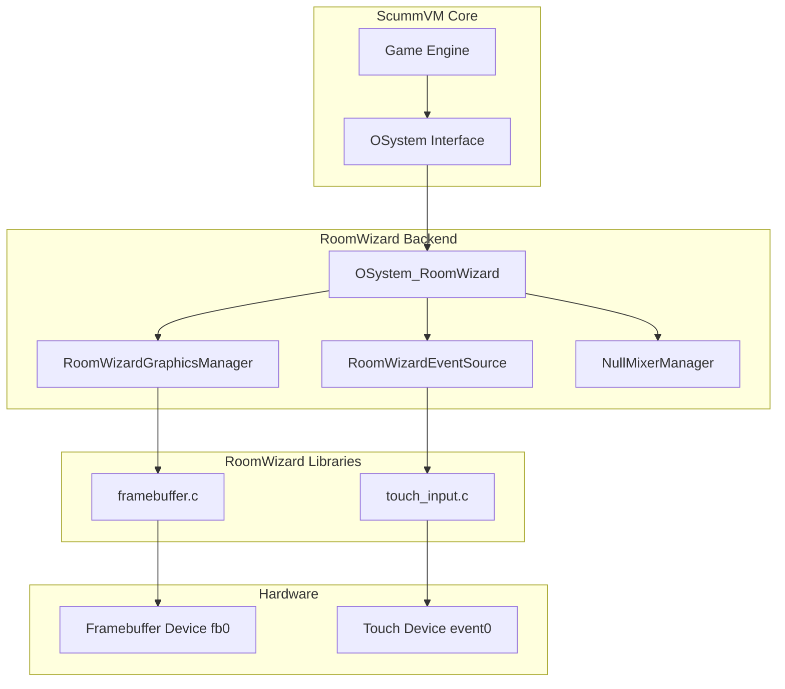
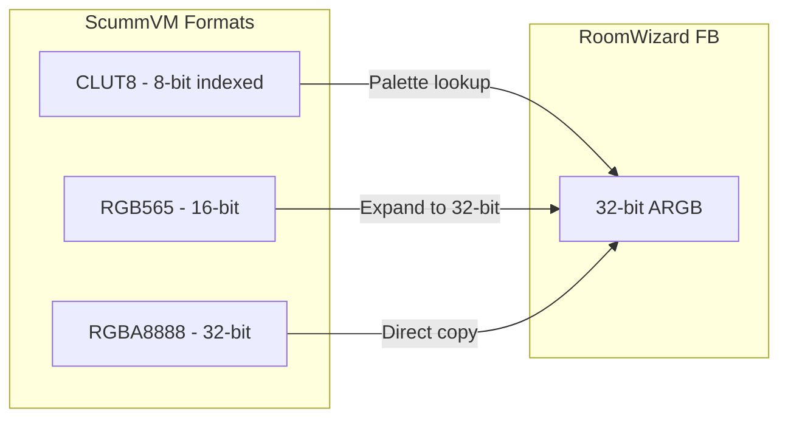
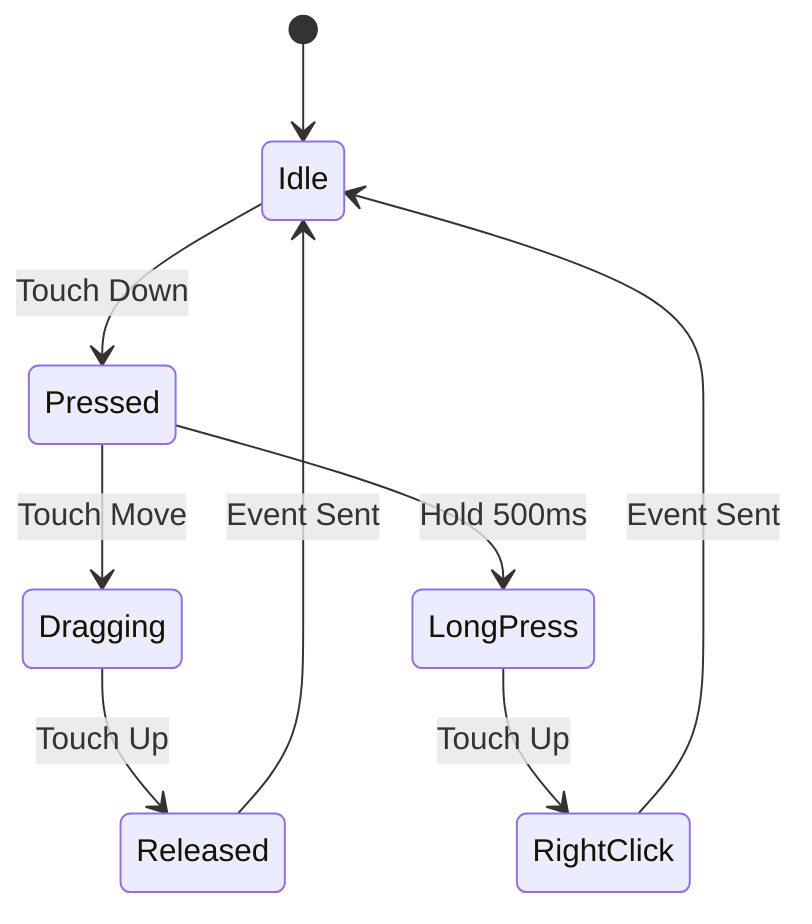

# ScummVM RoomWizard Backend - Design & Implementation Plan

## Overview

This document describes the design and implementation plan for a custom ScummVM backend for the RoomWizard device. The backend will use the existing RoomWizard framebuffer and touch input libraries to provide graphics and input functionality.

## Current State

### What Works
- ScummVM compiles successfully for ARM (13 MB binary)
- SCUMM engines v0-v8 + HE enabled
- Ubuntu 20.04 WSL with GLIBC 2.31 (matches device)
- Test C++ programs run on device

### What Doesn't Work
- Null backend crashes on device during initialization
- No SDL library available on device
- Other embedded backends not implemented in configure script

### Solution
Create a custom `roomwizard` backend that:
1. Uses existing [`native_games/common/framebuffer.c`](../native_games/common/framebuffer.c) for graphics
2. Uses existing [`native_games/common/touch_input.c`](../native_games/common/touch_input.c) for input
3. Implements the ScummVM backend API

## Architecture



## Component Design

### 1. RoomWizardGraphicsManager

Implements `GraphicsManager` interface using the RoomWizard framebuffer.

**Key Methods to Implement:**

| Method | Description | Implementation |
|--------|-------------|----------------|
| `initSize()` | Initialize screen dimensions | Call `fb_init()`, allocate game surface |
| `copyRectToScreen()` | Copy game graphics to screen | Convert palette/format, blit to framebuffer |
| `updateScreen()` | Present frame to display | Call `fb_swap()` for double buffering |
| `lockScreen()` | Get direct screen access | Return pointer to back buffer |
| `unlockScreen()` | Release screen access | Mark dirty for next update |
| `setPalette()` | Set 256-color palette | Store palette for CLUT8 conversion |
| `showMouse()` | Show/hide cursor | Software cursor rendering |
| `setMouseCursor()` | Set cursor image | Store cursor bitmap |
| `warpMouse()` | Move cursor position | Update cursor coordinates |

**Pixel Format Handling:**



**Screen Scaling:**

- RoomWizard: 800x480 (720x420 safe area)
- SCUMM games: 320x200, 320x240, 640x480
- Strategy: Center with letterboxing or 2x scale for 320x200

### 2. RoomWizardEventSource

Implements `EventSource` interface using RoomWizard touch input.

**Important: Single-Touch Device**

The RoomWizard has a **resistive single-touch screen** (Panjit panjit_ts). This means:
- Only one touch point is tracked at a time
- No multi-touch gestures (pinch, rotate, etc.)
- Binary pressure detection (pressed/not pressed)
- 12-bit resolution (0-4095 raw coordinates)

This is **ideal for point-and-click adventure games** which only require:
- Single cursor position
- Left-click (touch)
- Optional right-click (long press)

**Event Mapping:**

| Touch Event | ScummVM Event | Description |
|-------------|---------------|-------------|
| Touch press | `EVENT_LBUTTONDOWN` + `EVENT_MOUSEMOVE` | Finger touches screen |
| Touch release | `EVENT_LBUTTONUP` | Finger lifts from screen |
| Touch drag | `EVENT_MOUSEMOVE` | Finger moves while touching |
| Long press (>500ms) | `EVENT_RBUTTONDOWN` | Optional: for right-click actions |

**Single-Touch State Machine:**



**Coordinate Transformation:**

```
screen_x = (touch_x - game_offset_x) * game_width / display_width
screen_y = (touch_y - game_offset_y) * game_height / display_height
```

**Touch Calibration:**

The touch input library handles coordinate scaling from raw touch values (0-4095) to screen coordinates (0-800, 0-480). The backend must then transform these to game coordinates based on scaling/centering.

### 3. OSystem_RoomWizard

Main backend class that ties everything together.

**Inheritance:**
```cpp
class OSystem_RoomWizard : public ModularMixerBackend, 
                           public ModularGraphicsBackend, 
                           public Common::EventSource
```

**Key Components:**
- `RoomWizardGraphicsManager` - Graphics subsystem
- `NullMixerManager` - Audio (disabled for now)
- `DefaultTimerManager` - Timer handling
- `DefaultEventManager` - Event dispatch
- `DefaultSaveFileManager` - Save game handling
- `POSIXFilesystemFactory` - File system access

## File Structure

```
scummvm/backends/platform/roomwizard/
├── roomwizard.cpp           # Main backend implementation
├── roomwizard.h             # Backend header
├── roomwizard-graphics.cpp  # Graphics manager implementation
├── roomwizard-graphics.h    # Graphics manager header
├── roomwizard-events.cpp    # Event source implementation
├── roomwizard-events.h      # Event source header
├── module.mk                # Build configuration
└── README.md                # Backend documentation

native_games/common/
├── framebuffer.c            # Existing - will be linked
├── framebuffer.h            # Existing - will be included
├── touch_input.c            # Existing - will be linked
└── touch_input.h            # Existing - will be included
```

## Build Configuration

### Configure Script Changes

Add to `configure`:
```bash
# RoomWizard backend
if test "$_backend" = "roomwizard"; then
    _backend="roomwizard"
    _posix=yes
    _savegame_timestamp=yes
    add_line_to_config_mk "BACKEND := roomwizard"
    add_line_to_config_mk "MODULES += backends/platform/roomwizard"
fi
```

### Module.mk

```makefile
MODULE := backends/platform/roomwizard

MODULE_OBJS := \
    roomwizard.o \
    roomwizard-graphics.o \
    roomwizard-events.o \
    ../../../native_games/common/framebuffer.o \
    ../../../native_games/common/touch_input.o

MODULE_DIRS += \
    backends/platform/roomwizard/

INCLUDES += -I$(srcdir)/../native_games/common

include $(srcdir)/rules.mk
```

## Implementation Tasks

### Phase 1: Basic Backend Structure
1. Create `backends/platform/roomwizard/` directory
2. Copy null backend as template
3. Rename classes to RoomWizard variants
4. Update module.mk for new backend
5. Add roomwizard backend to configure script
6. Verify build compiles (even if non-functional)

### Phase 2: Graphics Implementation
1. Create RoomWizardGraphicsManager class
2. Implement `initSize()` with framebuffer initialization
3. Implement `copyRectToScreen()` with format conversion
4. Implement `updateScreen()` with buffer swap
5. Implement palette handling for CLUT8 games
6. Add screen scaling/centering logic
7. Test with simple color fill

### Phase 3: Input Implementation
1. Create RoomWizardEventSource class
2. Implement `pollEvent()` with touch polling
3. Map touch events to mouse events
4. Implement coordinate transformation
5. Add cursor position tracking
6. Test touch input responsiveness

### Phase 4: Cursor Rendering
1. Implement software cursor rendering
2. Store cursor bitmap and palette
3. Composite cursor over game graphics
4. Handle cursor visibility toggle
5. Test cursor movement and appearance

### Phase 5: Integration & Testing
1. Test with Monkey Island demo
2. Verify game graphics display correctly
3. Verify touch input works for gameplay
4. Test save/load functionality
5. Profile performance and optimize
6. Document any limitations

## Technical Considerations

### Memory Management
- Game surface: Up to 640x480x4 = 1.2 MB
- Framebuffer: 800x480x4 = 1.5 MB (double buffered = 3 MB)
- Cursor: 64x64x4 = 16 KB
- Palette: 256x4 = 1 KB
- **Total: ~5 MB** (device has 184 MB available)

### Performance
- Target: 30 FPS minimum
- Bottleneck: Pixel format conversion and scaling
- Optimization: Use NEON SIMD for blitting (device supports)

### Limitations
- **No audio** - Using NullMixerManager (games will be silent)
- **No keyboard input** - Touch only, no physical keyboard support
- **Single-touch only** - Resistive touchscreen supports only one touch point at a time
- **No multi-touch gestures** - No pinch-to-zoom, two-finger scroll, etc.
- **No hardware acceleration** - Software rendering only
- **Right-click via long-press** - Must hold finger for 500ms to trigger right-click
- **Limited text input** - On-screen keyboard would need separate implementation

## Testing Strategy

### Unit Tests
- Framebuffer initialization
- Pixel format conversion
- Touch coordinate mapping
- Palette application

### Integration Tests
- ScummVM launcher displays
- Game selection works
- Game graphics render
- Touch input responds
- Save/load functions

### Game Tests
- Monkey Island 1 (v5, CLUT8)
- Day of the Tentacle (v6, CLUT8)
- Sam & Max (v6, CLUT8)
- Full Throttle (v7, RGB)
- Putt-Putt (HE, RGB)

## Risk Assessment

| Risk | Impact | Mitigation |
|------|--------|------------|
| Performance too slow | High | Use NEON optimization, reduce resolution |
| Touch input lag | Medium | Optimize polling, reduce event queue |
| Memory exhaustion | Medium | Limit game resolution, disable features |
| Format conversion bugs | Medium | Test with multiple games, add fallbacks |
| Build system issues | Low | Follow existing backend patterns |

## Success Criteria

1. ScummVM launches without crashing
2. Game launcher is visible and navigable
3. At least one SCUMM game runs and is playable
4. Touch input works for point-and-click gameplay
5. Frame rate is acceptable (15+ FPS minimum)
6. Save/load game functionality works

## References

- [`scummvm/backends/platform/null/null.cpp`](../scummvm/backends/platform/null/null.cpp) - Null backend template
- [`scummvm/backends/graphics/null/null-graphics.h`](../scummvm/backends/graphics/null/null-graphics.h) - Null graphics manager
- [`native_games/common/framebuffer.h`](../native_games/common/framebuffer.h) - RoomWizard framebuffer API
- [`native_games/common/touch_input.h`](../native_games/common/touch_input.h) - RoomWizard touch input API
- [ScummVM Wiki - Porting](https://wiki.scummvm.org/index.php/Compiling_ScummVM/Porting)
