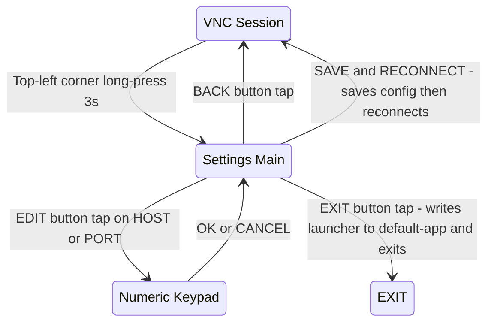
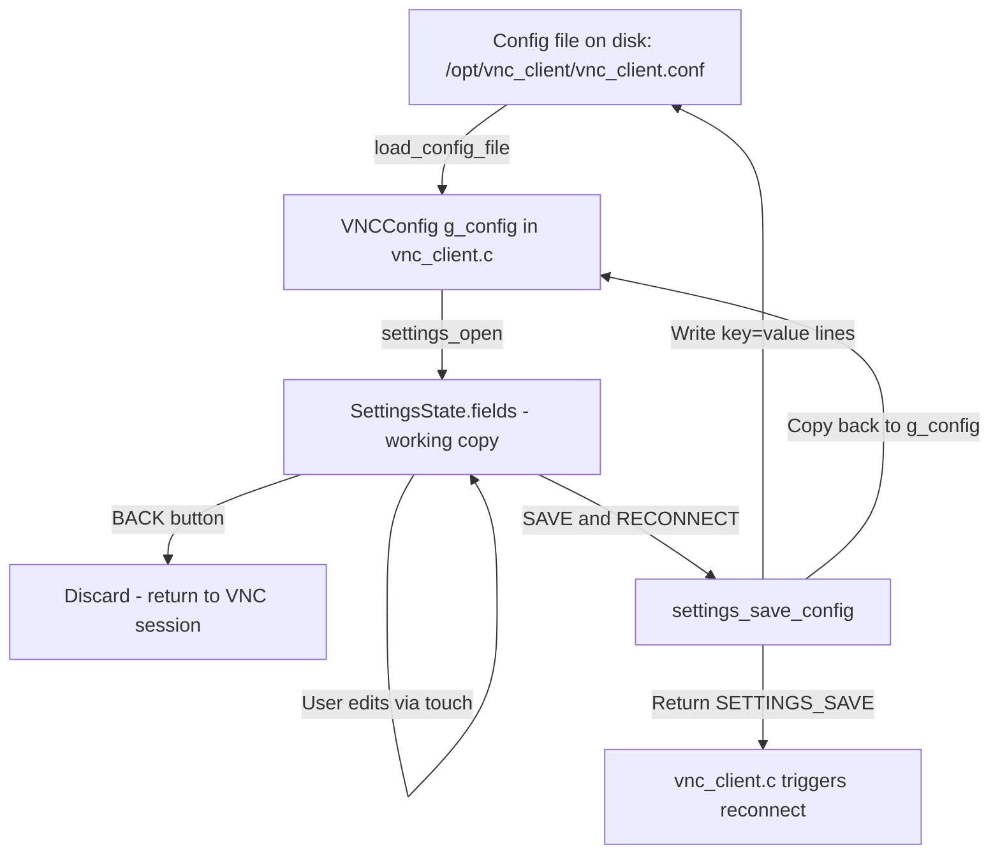

# VNC Client Settings GUI — Design Document

> **Status:** Implemented in v2.4. The keypad has been upgraded from numeric-only
> to full alphanumeric with SHIFT toggle. All settings fields (HOST, PORT, PASSWORD,
> ENCODINGS, COMPRESS, QUALITY) are now editable. A SETTINGS button was added to
> the reconnect screen.

## Overview

A touch-driven settings screen for the RoomWizard VNC client, rendered directly to the 800×480 RGB565 framebuffer using existing rendering primitives. The settings screen allows viewing and editing VNC connection parameters without SSH access.

**New files:** `vnc_settings.h`, `vnc_settings.c`
**Target size:** ~300–500 lines of C

---

## 1. Screen Layout

### Main Settings Screen (800×480)

```
┌──────────────────────────────────────────────────────────────────────────────────┐
│  Y=0   ████████████████████  TITLE BAR (dark blue, 40px)  ████████████████████  │
│        "VNC SETTINGS" centered, scale 3, white                                  │
├──────────────────────────────────────────────────────────────────────────────────┤
│  Y=50  ┌─ SETTINGS LIST ──────────────────────────────────────────────────────┐  │
│        │                                                                      │  │
│  Y=56  │  HOST         [192.168.50.56                        ] [EDIT]  ◄──48px│  │
│        │  label=s2     value field 440px, scale 2              btn 80px       │  │
│        │               ──────────────────────────────────────────────         │  │
│  Y=110 │  PORT         [5901                                 ] [EDIT]        │  │
│        │               ──────────────────────────────────────────────         │  │
│  Y=164 │  PASSWORD     [********                             ] [FILE]        │  │
│        │  (read-only)  shows asterisks                         hint btn      │  │
│        │               ──────────────────────────────────────────────         │  │
│  Y=218 │  ENCODINGS    [tight zrle copyrect hextil...]       [FILE]          │  │
│        │  (read-only)  truncated to fit                        hint btn      │  │
│        │               ──────────────────────────────────────────────         │  │
│  Y=272 │  COMPRESS     [6]  [−] [+]                                          │  │
│        │               value  decrement/increment buttons                     │  │
│        │               ──────────────────────────────────────────────         │  │
│  Y=326 │  QUALITY      [5]  [−] [+]                                          │  │
│        │               value  decrement/increment buttons                     │  │
│        └──────────────────────────────────────────────────────────────────────┘  │
├──────────────────────────────────────────────────────────────────────────────────┤
│  Y=392 ┌─ STATUS LINE ───────────────────────────────────────────────────────┐  │
│        │  "EDIT PASSWORD/ENCODINGS IN /opt/vnc_client/vnc_client.conf"       │  │
│        │  scale 1, grey, centered                                            │  │
│        └─────────────────────────────────────────────────────────────────────┘  │
│                                                                                  │
│  Y=424 ┌─ ACTION BUTTONS (48px tall) ────────────────────────────────────────┐  │
│        │  [  BACK  ]         [  EXIT  ]         [ SAVE & RECONNECT ]         │  │
│        │  x=20,w=200         x=300,w=200         x=580,w=200                 │  │
│        │  grey bg             red bg              green bg                    │  │
│        └─────────────────────────────────────────────────────────────────────┘  │
└──────────────────────────────────────────────────────────────────────────────────┘
```

### Exact Geometry Constants

| Element | X | Y | W | H | Notes |
|---------|---|---|---|---|-------|
| Title bar | 0 | 0 | 800 | 40 | `RGB565(0,0,80)` dark blue |
| Title text | centered | 8 | — | — | scale 3, white |
| Row 0: HOST | 20 | 56 | 760 | 48 | Label + value + edit btn |
| Row 1: PORT | 20 | 110 | 760 | 48 | Label + value + edit btn |
| Row 2: PASSWORD | 20 | 164 | 760 | 48 | Label + value + hint btn |
| Row 3: ENCODINGS | 20 | 218 | 760 | 48 | Label + value + hint btn |
| Row 4: COMPRESS | 20 | 272 | 760 | 48 | Label + value + ±btns |
| Row 5: QUALITY | 20 | 326 | 760 | 48 | Label + value + ±btns |
| Status line | 0 | 392 | 800 | 20 | scale 1, grey, centered |
| Btn: BACK | 20 | 424 | 200 | 48 | `RGB565(60,60,60)` |
| Btn: EXIT | 300 | 424 | 200 | 48 | `RGB565(160,0,0)` |
| Btn: SAVE | 580 | 424 | 200 | 48 | `RGB565(0,100,0)` |

### Row Layout Detail

Each settings row is 48px tall with this internal layout:

```
X=20              X=160            X=600       X=700
┌────────────────┬───────────────────────────┬─────────┐
│  LABEL         │  VALUE FIELD              │  [BTN]  │  48px
│  scale 2       │  scale 2, in dark rect    │  80×48  │
│  white         │  yellow on dark grey      │         │
└────────────────┴───────────────────────────┴─────────┘
```

- **Label column:** X=20, W=130, scale 2, white text, vertically centered at row_y + 16
- **Value field:** X=160, W=520, dark grey background `RGB565(30,30,30)`, value text in yellow at X=168, vertically centered
- **Action button:** X=700, W=80, 48px tall

---

## 2. Numeric Keypad Overlay

When editing HOST or PORT, a numeric keypad appears as a modal overlay covering the bottom half of the screen.

### Keypad Layout (800×240, anchored at Y=240)

```
Y=240  ┌──────────────────────────────────────────────────────────────────────┐
       │  INPUT FIELD: [192.168.50.56_]     cursor blink                     │
       │  X=20, Y=244, W=760, H=36, dark bg, green text, scale 2            │
Y=284  ├──────────────────────────────────────────────────────────────────────┤
       │                                                                      │
       │   [ 1 ]  [ 2 ]  [ 3 ]  [ 4 ]  [ 5 ]     ┌──────────┐              │
       │   [ 6 ]  [ 7 ]  [ 8 ]  [ 9 ]  [ 0 ]     │ BACKSPACE│              │
       │   [ . ]  [ : ]  [   CLEAR   ]             │          │              │
       │                                            └──────────┘              │
       │         [  CANCEL  ]          [   OK   ]                             │
       │                                                                      │
Y=480  └──────────────────────────────────────────────────────────────────────┘
```

### Keypad Button Geometry

All keypad buttons are 80×48 px for comfortable resistive touch targeting.

| Button | X | Y | W | H |
|--------|---|---|---|---|
| 1 | 20 | 288 | 80 | 48 |
| 2 | 110 | 288 | 80 | 48 |
| 3 | 200 | 288 | 80 | 48 |
| 4 | 290 | 288 | 80 | 48 |
| 5 | 380 | 288 | 80 | 48 |
| 6 | 20 | 342 | 80 | 48 |
| 7 | 110 | 342 | 80 | 48 |
| 8 | 200 | 342 | 80 | 48 |
| 9 | 290 | 342 | 80 | 48 |
| 0 | 380 | 342 | 80 | 48 |
| `.` | 20 | 396 | 80 | 48 |
| `:` | 110 | 396 | 80 | 48 |
| CLEAR | 200 | 396 | 170 | 48 |
| BACKSPACE | 520 | 288 | 140 | 102 | Tall button spanning 2 rows |
| CANCEL | 200 | 428 | 160 | 48 |
| OK | 440 | 428 | 160 | 48 |

> **Note:** The `:` key is included for `host:port` style entry but can be omitted if host and port remain separate fields. The `.` key is essential for IP address entry.

---

## 3. Interaction Model

### State Machine



### Touch Handling

1. **All interactions use finger-up detection** — the action fires on `touch_get_state().released`, not on press. This prevents accidental activations on resistive touch.
2. **No drag/scroll** — all 6 settings fit on one screen at 48px row height (6 × 54px = 324px content).
3. **Hit testing** reuses the existing [`draw_button()`](vnc_client/vnc_client.c:383) pattern — draw the button and test the released touch coordinates against its bounds.
4. **Keypad input** accumulates characters into a `char edit_buf[256]` buffer with a cursor position. BACKSPACE removes the last character. CLEAR empties the buffer. OK commits the buffer back to the setting. CANCEL discards changes.

### Editable vs Read-Only Fields

| Field | Editable | Method | Rationale |
|-------|----------|--------|-----------|
| HOST | ✅ | Numeric keypad | IP addresses are purely numeric + dots |
| PORT | ✅ | Numeric keypad | Ports are purely numeric |
| PASSWORD | ❌ | Show hint | Full keyboard needed; edit config file |
| ENCODINGS | ❌ | Show hint | Complex string; edit config file |
| COMPRESS | ✅ | ± buttons | Integer 1–9, simple increment/decrement |
| QUALITY | ✅ | ± buttons | Integer 1–9, simple increment/decrement |

### Compress/Quality ± Buttons

- Tapping `[+]` increments the value, capped at 9
- Tapping `[-]` decrements the value, floored at 1
- The value updates immediately in the in-memory `SettingsState`
- No keypad needed — just two 60×48 buttons flanking the value display

---

## 4. Data Flow



### Detailed Steps

1. **Open settings:** [`vnc_settings_open()`](vnc_client/vnc_settings.h) copies current values from the `VNCConfig*` pointer into a local `SettingsState` struct.

2. **Run settings loop:** [`vnc_settings_run()`](vnc_client/vnc_settings.h) enters a blocking event loop (similar to [`reconnect_ui()`](vnc_client/vnc_client.c:410)) that renders the settings screen and processes touch events. Runs at ~30fps using `usleep(33000)`.

3. **Edit a field:** User taps EDIT → keypad overlay opens with current value pre-loaded into `edit_buf`. User enters new value and taps OK → value written back to `SettingsState.fields[idx]`.

4. **Save:** [`settings_save_config()`](vnc_client/vnc_settings.c) writes all 6 settings back to the config file in the standard `key = value` format, preserving comment headers. It also copies the edited values back into the live `VNCConfig*`.

5. **Reconnect:** The caller ([`vnc_client.c`](vnc_client/vnc_client.c)) receives `SETTINGS_SAVE` return code, tears down the current VNC session, and re-enters `vnc_session()` with the updated `g_config` values.

### Config File Write Strategy

Rather than parsing and patching the existing file (which risks corruption), the save function **rewrites the entire file** with a standard header and the 6 known keys:

```c
static int settings_save_config(SettingsState *st, const char *path) {
    FILE *f = fopen(path, "w");
    if (!f) return -1;
    fprintf(f, "# VNC Client Configuration (written by settings GUI)\n");
    fprintf(f, "host = %s\n", st->fields[0].value);
    fprintf(f, "port = %s\n", st->fields[1].value);
    fprintf(f, "password = %s\n", st->fields[2].value);
    fprintf(f, "encodings = %s\n", st->fields[3].value);
    fprintf(f, "compress_level = %s\n", st->fields[4].value);
    fprintf(f, "quality_level = %s\n", st->fields[5].value);
    fclose(f);
    return 0;
}
```

---

## 5. Integration with Main Loop

### Current Exit Gesture Flow

```
vnc_input_process() → exit_touching timer → exit_requested = true
    ↓
vnc_session() main loop detects exit_requested → returns 1
    ↓
run_vnc_client() writes APP_LAUNCHER_PATH to default-app → exits
```

### New Settings Gesture Flow

The exit gesture is **repurposed** to open settings instead of immediately exiting:

```
vnc_input_process() → exit_touching timer → exit_requested = true
    ↓
vnc_session() main loop detects exit_requested
    ↓
Calls vnc_settings_run() with pointers to g_config, g_fb, g_touch
    ↓
Returns SETTINGS_BACK   → reset exit_requested, resume VNC session
Returns SETTINGS_SAVE   → break out of session loop, reconnect with new config
Returns SETTINGS_EXIT   → write launcher to default-app, exit process
```

### Changes to [`vnc_client.c`](vnc_client/vnc_client.c)

The modification is minimal — roughly 15 lines in the main loop of [`vnc_session()`](vnc_client/vnc_client.c:505):

```c
// In vnc_session() main loop, replace the current exit handling:
if (vnc_input_exit_requested(&g_input)) {
    // OLD: session_result = 1; break;
    // NEW: Open settings screen
    touch_drain_events(&g_touch);
    int settings_result = vnc_settings_run(&g_config, &g_fb, &g_touch, VNC_CONFIG_FILE);
    
    // Reset exit gesture state for re-entry
    g_input.exit_requested = false;
    g_input.exit_touching = false;
    g_input.exit_progress = 0.0f;
    touch_drain_events(&g_touch);
    
    if (settings_result == SETTINGS_EXIT) {
        session_result = 1;  // exit to launcher
        break;
    } else if (settings_result == SETTINGS_SAVE) {
        session_result = 2;  // reconnect with new settings
        break;
    }
    // SETTINGS_BACK: continue VNC session
    
    // Request full framebuffer update to redraw VNC content
    SendFramebufferUpdateRequest(g_vnc_client, 0, 0,
                                  g_vnc_client->width, g_vnc_client->height, FALSE);
}
```

In [`run_vnc_client()`](vnc_client/vnc_client.c:639), handle the new `session_result == 2`:

```c
if (result == 2) {
    // Settings saved — reconnect with new config
    attempt = 0;  // reset backoff
    continue;     // re-enter vnc_session() at top of while loop
}
```

---

## 6. File Structure

### [`vnc_settings.h`](vnc_client/vnc_settings.h)

```c
#ifndef VNC_SETTINGS_H
#define VNC_SETTINGS_H

#include <stdint.h>
#include <stdbool.h>
#include "../native_apps/common/framebuffer.h"
#include "../native_apps/common/touch_input.h"

/* Forward declaration — full definition in vnc_client.c */
typedef struct VNCConfig VNCConfig;

/* Return codes from vnc_settings_run() */
#define SETTINGS_BACK   0   /* User cancelled — resume VNC session */
#define SETTINGS_SAVE   1   /* User saved — reconnect with new config */
#define SETTINGS_EXIT   2   /* User chose exit — return to launcher */

/*
 * Open the settings GUI. Blocks until the user dismisses it.
 *
 * Parameters:
 *   config     — pointer to the live VNCConfig struct (read + write)
 *   fb         — framebuffer for rendering
 *   touch      — touch input device
 *   config_path — path to config file for saving
 *
 * Returns: SETTINGS_BACK, SETTINGS_SAVE, or SETTINGS_EXIT
 */
int vnc_settings_run(VNCConfig *config, Framebuffer *fb,
                     TouchInput *touch, const char *config_path);

#endif /* VNC_SETTINGS_H */
```

### [`vnc_settings.c`](vnc_client/vnc_settings.c) — Internal Structure

```c
#include "vnc_settings.h"
#include "vnc_renderer.h"   /* draw_text, fill_rect, clear_screen, text_width, RGB565_* */
#include "config.h"          /* SCREEN_WIDTH, SCREEN_HEIGHT */
#include <stdio.h>
#include <string.h>
#include <unistd.h>          /* usleep */

/* ── Constants ──────────────────────────────────────────────────────── */

#define SETTINGS_NUM_FIELDS   6
#define SETTINGS_ROW_HEIGHT  48
#define SETTINGS_ROW_GAP      6
#define SETTINGS_FIRST_ROW_Y 56
#define SETTINGS_LABEL_X     20
#define SETTINGS_VALUE_X    160
#define SETTINGS_VALUE_W    520
#define SETTINGS_BTN_X      700
#define SETTINGS_BTN_W       80
#define SETTINGS_MAX_VALUE  256

/* ── Settings field descriptor ──────────────────────────────────────── */

typedef enum {
    FIELD_READONLY,       /* Display only — show hint to edit config file */
    FIELD_NUMERIC_EDIT,   /* Editable via numeric keypad */
    FIELD_PLUSMINUS,       /* Editable via +/- buttons (integer 1-9) */
} FieldEditMode;

typedef struct {
    const char *label;           /* "HOST", "PORT", etc. */
    char        value[SETTINGS_MAX_VALUE]; /* Current value as string */
    FieldEditMode edit_mode;
    int         min_val;         /* For FIELD_PLUSMINUS only */
    int         max_val;
} SettingsField;

/* ── Internal state ─────────────────────────────────────────────────── */

typedef struct {
    SettingsField fields[SETTINGS_NUM_FIELDS];
    Framebuffer  *fb;
    TouchInput   *touch;
    const char   *config_path;
    
    /* Keypad state */
    bool  keypad_active;
    int   keypad_field_idx;      /* Which field is being edited */
    char  edit_buf[SETTINGS_MAX_VALUE];
    int   edit_len;
} SettingsState;

/* ── Static function declarations ───────────────────────────────────── */

static void settings_load(SettingsState *st, const VNCConfig *config);
static void settings_apply(SettingsState *st, VNCConfig *config);
static int  settings_save_config(SettingsState *st, const char *path);
static void settings_draw_main(SettingsState *st, int tx, int ty);
static void settings_draw_keypad(SettingsState *st, int tx, int ty);
static int  settings_handle_main_touch(SettingsState *st, int tx, int ty);
static int  settings_handle_keypad_touch(SettingsState *st, int tx, int ty);
```

---

## 7. API Summary

### Public API (1 function)

| Function | Signature | Description |
|----------|-----------|-------------|
| `vnc_settings_run` | `int vnc_settings_run(VNCConfig *config, Framebuffer *fb, TouchInput *touch, const char *config_path)` | Blocking settings GUI. Returns `SETTINGS_BACK`, `SETTINGS_SAVE`, or `SETTINGS_EXIT`. |

### Internal Functions

| Function | Purpose |
|----------|---------|
| `settings_load()` | Copy `VNCConfig` fields into `SettingsState.fields[]` string values |
| `settings_apply()` | Copy edited string values back into `VNCConfig` struct |
| `settings_save_config()` | Write all settings to config file at `config_path` |
| `settings_draw_main()` | Render the main settings screen — title, rows, buttons |
| `settings_draw_keypad()` | Render the numeric keypad overlay |
| `settings_handle_main_touch()` | Process touch on main screen — returns action or -1 |
| `settings_handle_keypad_touch()` | Process touch on keypad — modifies `edit_buf`, returns done/cancel/-1 |

### Main Event Loop Pseudocode

```c
int vnc_settings_run(VNCConfig *config, Framebuffer *fb,
                     TouchInput *touch, const char *config_path) {
    SettingsState st = {0};
    st.fb = fb;
    st.touch = touch;
    st.config_path = config_path;
    settings_load(&st, config);

    while (1) {
        vnc_renderer_clear_screen(fb);

        /* Get released touch coordinates */
        touch_poll(touch);
        TouchState ts = touch_get_state(touch);
        int tx = -1, ty = -1;
        if (ts.released) { tx = ts.x; ty = ts.y; }

        if (st.keypad_active) {
            settings_draw_main(&st, -1, -1);   /* Draw main dimmed */
            settings_draw_keypad(&st, tx, ty);
            int kr = settings_handle_keypad_touch(&st, tx, ty);
            if (kr == 1) {
                /* OK — commit edit_buf to field value */
                strncpy(st.fields[st.keypad_field_idx].value,
                        st.edit_buf, SETTINGS_MAX_VALUE - 1);
                st.keypad_active = false;
            } else if (kr == 0) {
                /* Cancel */
                st.keypad_active = false;
            }
        } else {
            settings_draw_main(&st, tx, ty);
            int mr = settings_handle_main_touch(&st, tx, ty);
            if (mr == SETTINGS_BACK) return SETTINGS_BACK;
            if (mr == SETTINGS_EXIT) return SETTINGS_EXIT;
            if (mr == SETTINGS_SAVE) {
                settings_apply(&st, config);
                settings_save_config(&st, config_path);
                return SETTINGS_SAVE;
            }
            /* mr == -1: no action, continue loop */
        }

        fb_swap(fb);
        usleep(33000);  /* ~30 fps */
    }
}
```

---

## 8. Makefile Integration

Add `vnc_settings.c` to the [`SRCS`](vnc_client/Makefile:20) list in the Makefile:

```makefile
SRCS = vnc_client.c \
       vnc_renderer.c \
       vnc_input.c \
       vnc_settings.c \
       $(COMMON_DIR)/framebuffer.c \
       ...
```

The `VNCConfig` typedef in [`vnc_client.c`](vnc_client/vnc_client.c:40) needs to be moved to a shared header (either [`config.h`](vnc_client/config.h) or a new `vnc_config_types.h`) so `vnc_settings.c` can access it. The cleanest approach is to move the `VNCConfig` struct definition to [`config.h`](vnc_client/config.h:1):

```c
/* In config.h — add after existing defines */
typedef struct VNCConfig {
    char host[256];
    int  port;
    char password[256];
    char encodings[256];
    int  compress_level;
    int  quality_level;
} VNCConfig;
```

---

## 9. Visual Design Notes

### Color Palette

| Element | Color | RGB565 Value |
|---------|-------|--------------|
| Background | Black | `0x0000` |
| Title bar | Dark blue | `RGB565(0,0,100)` |
| Title text | White | `RGB565_WHITE` |
| Field labels | White | `RGB565_WHITE` |
| Field values | Yellow | `RGB565_YELLOW` |
| Value field bg | Dark grey | `RGB565(30,30,30)` |
| EDIT button | Blue | `RGB565(0,60,120)` |
| FILE hint button | Dark grey | `RGB565(60,60,60)` |
| +/- buttons | Dark cyan | `RGB565(0,80,80)` |
| BACK button | Grey | `RGB565(60,60,60)` |
| EXIT button | Dark red | `RGB565(160,0,0)` |
| SAVE button | Dark green | `RGB565(0,100,0)` |
| Keypad bg | Dark grey | `RGB565(20,20,20)` |
| Keypad buttons | Medium grey | `RGB565(50,50,50)` |
| Keypad input text | Green | `RGB565_GREEN` |
| Status hint text | Grey | `RGB565_GREY` |

### Font Scales Used

| Context | Scale | Char Size | Suitable For |
|---------|-------|-----------|--------------|
| Title | 3 | 18×24 px | "VNC SETTINGS" header |
| Field labels | 2 | 12×16 px | "HOST", "PORT", etc. |
| Field values | 2 | 12×16 px | IP addresses, numbers |
| Button labels | 2 | 12×16 px | "BACK", "SAVE", "EDIT" |
| Keypad digits | 2 | 12×16 px | "0"–"9", "." |
| Status hint | 1 | 6×8 px | Config file path hint |

### Accessibility Considerations

- All interactive elements are ≥48px tall (exceeds 40px minimum for resistive touch)
- Keypad buttons are 80×48 — large enough for finger press on resistive panel
- High contrast: yellow on dark grey for values, white on dark for labels
- Action buttons use color-coded backgrounds (grey/red/green) for quick recognition
- No drag gestures required — all interactions are single taps

---

## 10. Edge Cases and Error Handling

| Scenario | Handling |
|----------|----------|
| Config file write fails (read-only FS) | Show "SAVE FAILED" in red at status line for 2 seconds, return to settings |
| Empty host field on save | Reject save — flash field value in red |
| Port out of range (0 or >65535) | Clamp to 1–65535 on OK in keypad |
| `edit_buf` overflow | Cap at 255 characters (ignore further keypad input) |
| Touch events queued from VNC session | Caller drains events before and after `vnc_settings_run()` |
| VNC server sends updates during settings | Not possible — settings runs in the same thread as `WaitForMessage()`, so VNC I/O is paused |
| Long host string truncation in display | Truncate display to fit 520px (43 chars at scale 2); full value stored internally |

---

## 11. Implementation Checklist

These are the discrete implementation steps for the code mode:

1. Move `VNCConfig` struct from [`vnc_client.c`](vnc_client/vnc_client.c:40) to [`config.h`](vnc_client/config.h)
2. Create [`vnc_settings.h`](vnc_client/vnc_settings.h) with the public API
3. Create [`vnc_settings.c`](vnc_client/vnc_settings.c) with all internal functions
4. Implement `settings_draw_main()` — render title bar, 6 setting rows, 3 action buttons
5. Implement `settings_draw_keypad()` — render keypad overlay with input field
6. Implement `settings_handle_main_touch()` — EDIT/±/action button hit testing
7. Implement `settings_handle_keypad_touch()` — digit/backspace/clear/ok/cancel hit testing
8. Implement `settings_load()` and `settings_apply()` — VNCConfig ↔ SettingsState conversion
9. Implement `settings_save_config()` — write config file
10. Modify [`vnc_session()`](vnc_client/vnc_client.c:505) exit gesture handling to call `vnc_settings_run()`
11. Modify [`run_vnc_client()`](vnc_client/vnc_client.c:639) to handle `session_result == 2` (reconnect)
12. Update [`Makefile`](vnc_client/Makefile:20) to include `vnc_settings.c`
13. Test on device: settings display, keypad input, save, reconnect, exit
